# Unit 1 — The first six  ·  پہلے چھ حرف

**Focus:** Joiners vs the non-joiner alif; alif as long ā; the three short-vowel marks zabar, zer, pesh

**On the phone, this unit is these lessons, in order:** alif ا → be ب → kāf ک → lām ل → mīm م → nūn ن → Vowel marks → Join them → Blend → Words 1 → Words 2 → Read → Unit check. Children rotate through them one at a time; the Unit check (8 of 10) unlocks the next unit.

## 1 · Hear it

| Letter | Name | Sound | Say it like… | Audio |
|---|---|---|---|---|
| ا | alif (الف) | /ɑː / ʔ / silent/ | 'a' in father when long; a silent seat for short vowels at the start of a word | `assets/audio/names/alif.mp3` · `assets/audio/words/alif.mp3` (اب ab — now) |
| ب | be (بے) | /b/ | 'b' in bat | `assets/audio/names/be.mp3` · `assets/audio/words/be.mp3` (بابا bābā — father) |
| ک | kāf (کاف) | /k/ | 'k' in kite | `assets/audio/names/kaf.mp3` · `assets/audio/words/kaf.mp3` (کام kām — work) |
| ل | lām (لام) | /l/ | 'l' in log | `assets/audio/names/lam.mp3` · `assets/audio/words/lam.mp3` (لال lāl — red) |
| م | mīm (میم) | /m/ | 'm' in mat | `assets/audio/names/mim.mp3` · `assets/audio/words/mim.mp3` (مکان makān — house) |
| ن | nūn (نون) | /n/ | 'n' in net | `assets/audio/names/nun.mp3` · `assets/audio/words/nun.mp3` (نام nām — name) |

## 2 · See it

**ا alif** — does **not** join forward (2 forms: isolated, final).

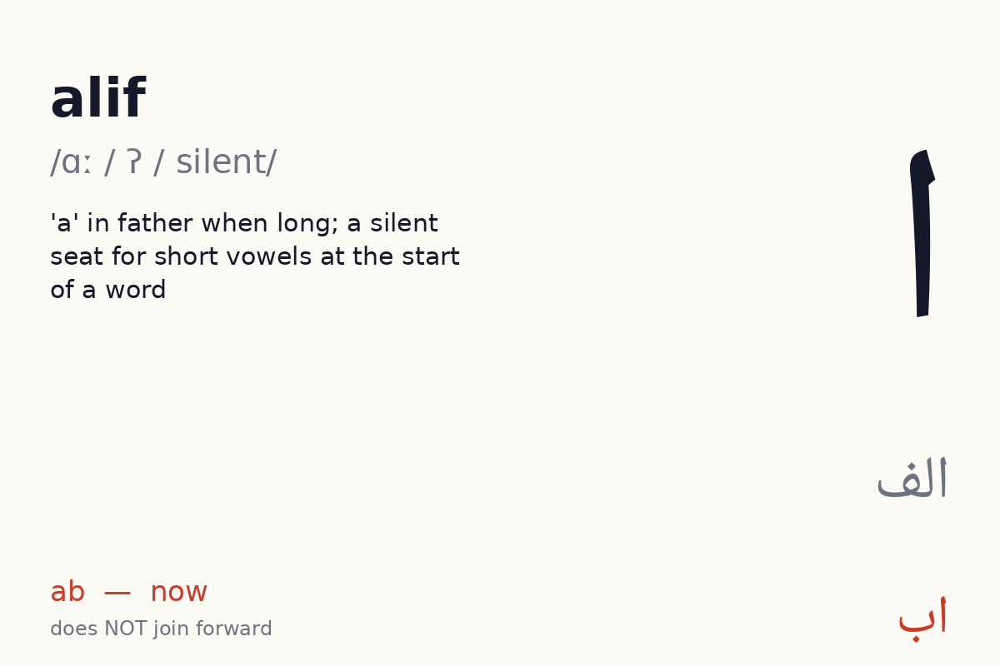
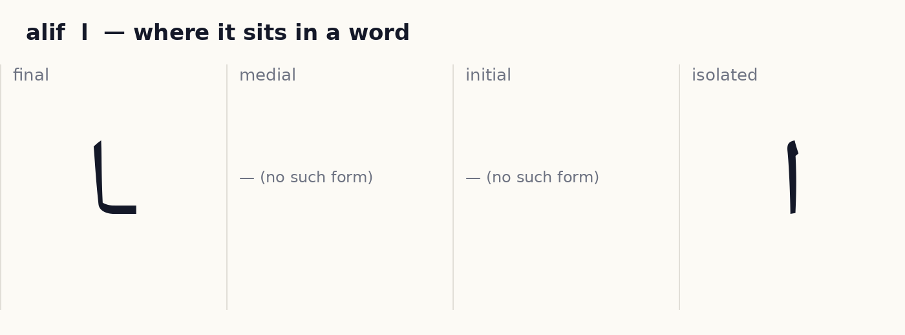

✎ *How the pen moves:* one stroke, top to bottom; when it follows a joiner it rises from the joining line. (Right to left; dots and marks last, after the whole word. These are the conventional Naskh/Nastaliq stroke orders as taught in Pakistani qaida classes; no published study was found, see research/05_open_assets.md.)

**ب be** — joins forward (4 forms).

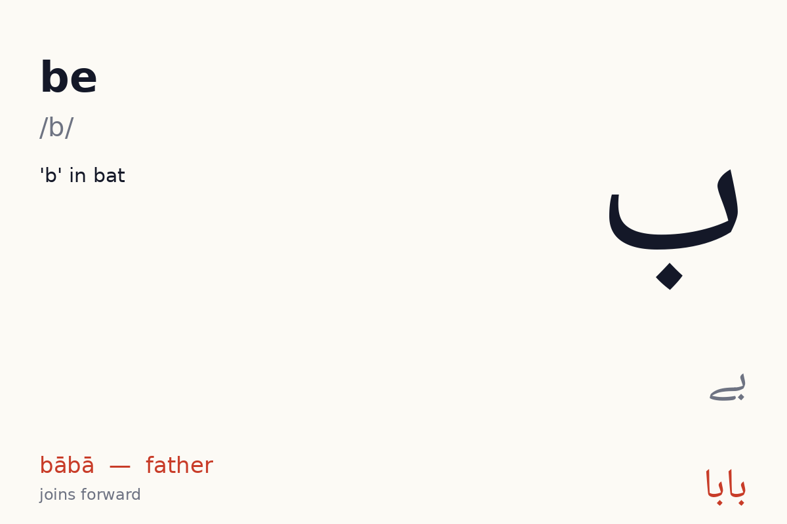
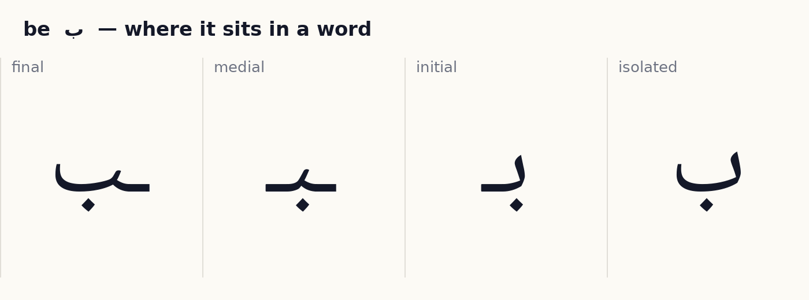

✎ *How the pen moves:* start top-right, draw the shallow bowl leftwards, hook up at the left end; dots after. (Right to left; dots and marks last, after the whole word. These are the conventional Naskh/Nastaliq stroke orders as taught in Pakistani qaida classes; no published study was found, see research/05_open_assets.md.)

**ک kāf** — joins forward (4 forms).

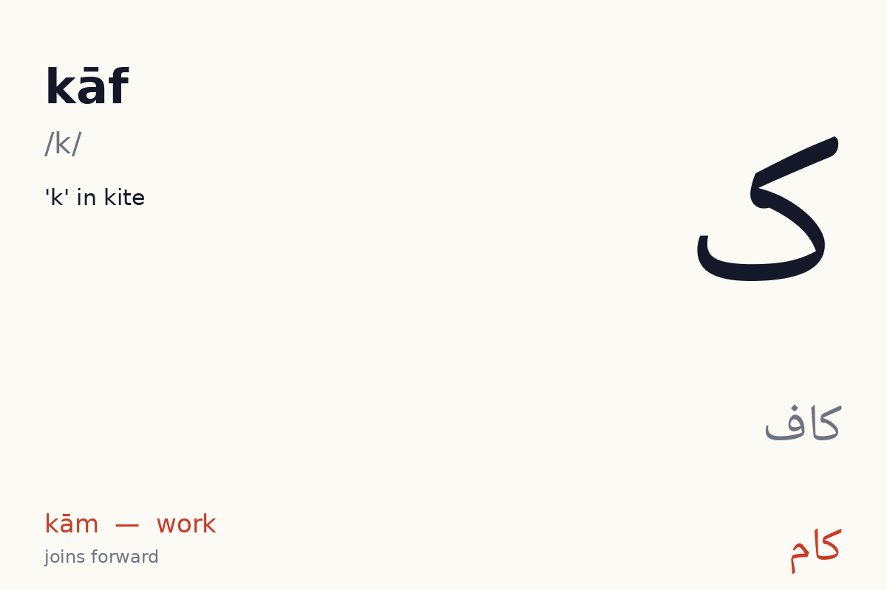
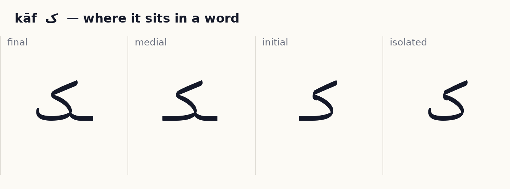

✎ *How the pen moves:* base stroke first, right to left along the line, then the sloping cap (sar-kash) added on top last; گ gets a second cap. (Right to left; dots and marks last, after the whole word. These are the conventional Naskh/Nastaliq stroke orders as taught in Pakistani qaida classes; no published study was found, see research/05_open_assets.md.)

**ل lām** — joins forward (4 forms).

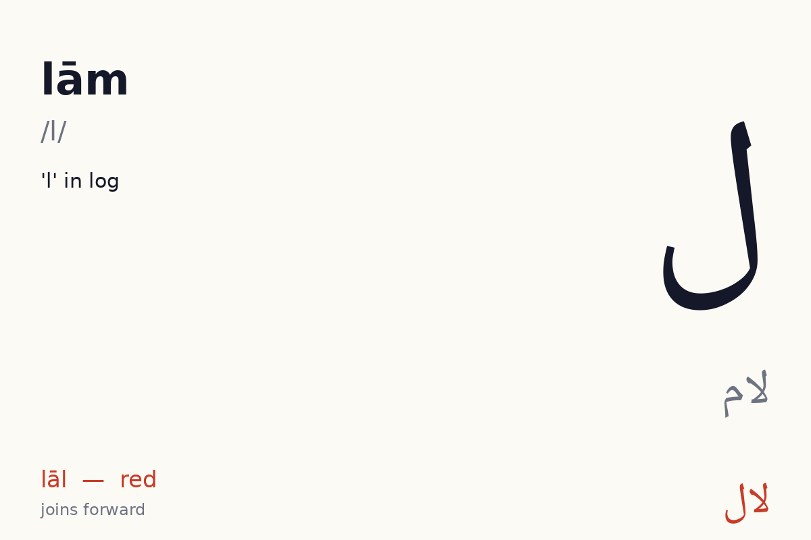
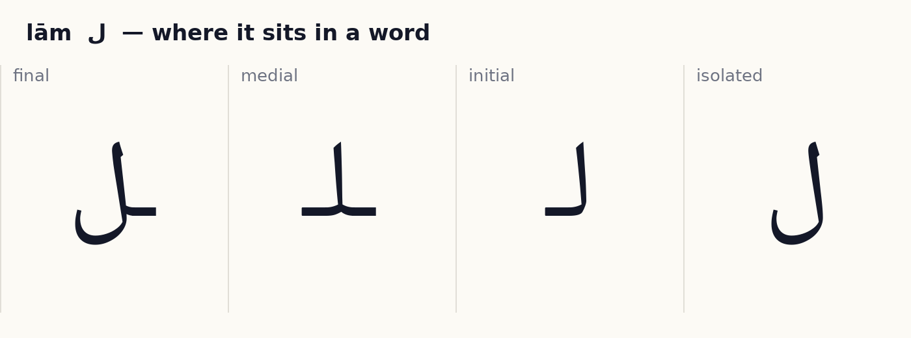

✎ *How the pen moves:* tall stroke down, then curve into the bowl leftwards. (Right to left; dots and marks last, after the whole word. These are the conventional Naskh/Nastaliq stroke orders as taught in Pakistani qaida classes; no published study was found, see research/05_open_assets.md.)

**م mīm** — joins forward (4 forms).

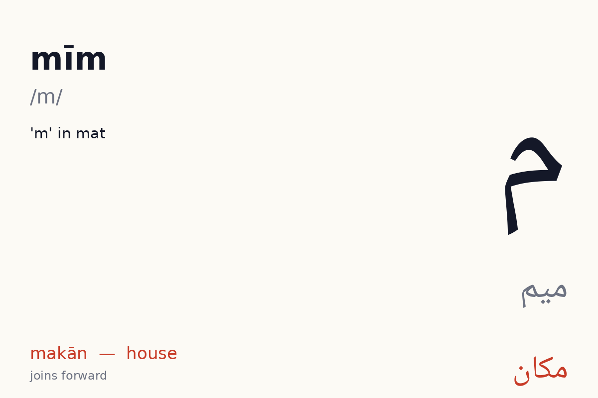
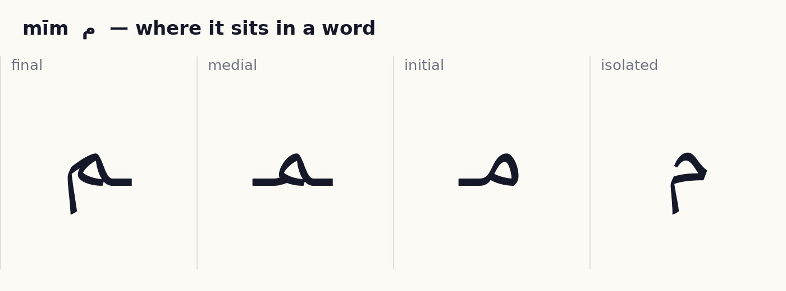

✎ *How the pen moves:* small closed loop, then the tail down-left. (Right to left; dots and marks last, after the whole word. These are the conventional Naskh/Nastaliq stroke orders as taught in Pakistani qaida classes; no published study was found, see research/05_open_assets.md.)

**ن nūn** — joins forward (4 forms).

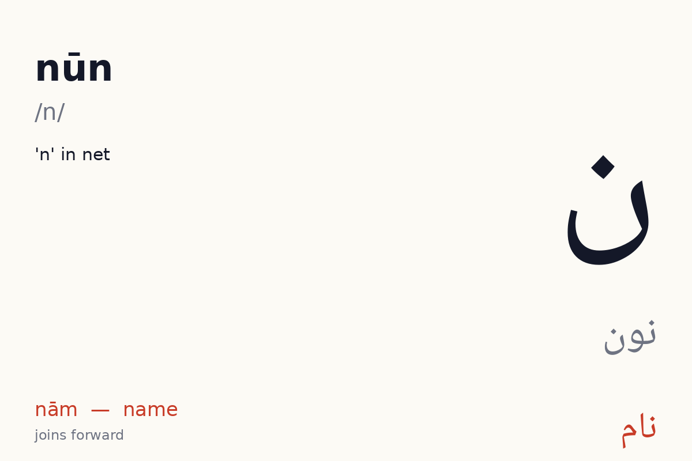
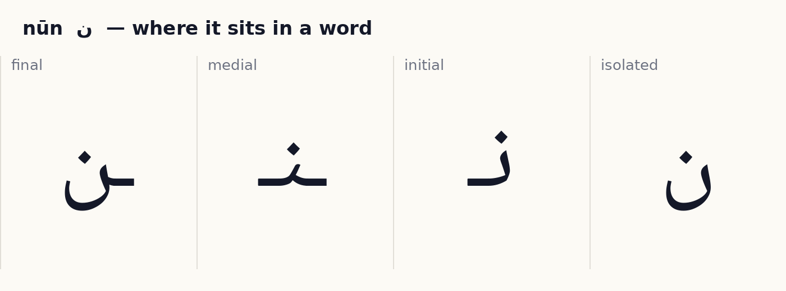

✎ *How the pen moves:* the same bowl as ب but deeper and rounder; dot after (none for ں). (Right to left; dots and marks last, after the whole word. These are the conventional Naskh/Nastaliq stroke orders as taught in Pakistani qaida classes; no published study was found, see research/05_open_assets.md.)

## 3 · Tell it apart  ·  *recognition · self-check with audio*

- ا vs ل — same body, different dots or marks. Drill: play `names/` audio for each, learner points at the right one. 10 rounds, shuffled.
- ب vs ن — same body, different dots or marks. Drill: play `names/` audio for each, learner points at the right one. 10 rounds, shuffled.

## 4 · Join it  ·  *production · self-check against the answer shown*

Build each word from letter tiles, right to left. Watch which letters change shape and which refuse to join.

- ب + ا + ب + ا  →  **بابا**  (bābā, dad)
- ا + م + ا + م  →  **اِمام**  (imām, prayer leader)
- ن + ا + م  →  **نام**  (nām, name)

## 4b · Blend  ·  *recognition · self-check with audio*

A letter plus a vowel letter makes a sound you can say. Play a syllable, learner points to it. Vowels available so far: ا.

| Syllable | Audio |
|---|---|
| با | `assets/audio/syllables/be_a.mp3` |
| کا | `assets/audio/syllables/kaf_a.mp3` |
| لا | `assets/audio/syllables/lam_a.mp3` |
| ما | `assets/audio/syllables/mim_a.mp3` |
| نا | `assets/audio/syllables/nun_a.mp3` |

## 5 · Read it  ·  *reading aloud · self-check with audio, or a helper listens*

Vowel marks are shown. Read aloud, then play the audio and compare.

| Word | Say | Means | Audio |
|---|---|---|---|
| اَب | ab | now | `assets/audio/units/u01_00.mp3` |
| بابا | bābā | dad | `assets/audio/units/u01_01.mp3` |
| اِمام | imām | prayer leader | `assets/audio/units/u01_02.mp3` |
| نام | nām | name | `assets/audio/units/u01_03.mp3` |
| کام | kām | work | `assets/audio/units/u01_04.mp3` |
| کَل | kal | tomorrow / yesterday | `assets/audio/units/u01_05.mp3` |
| لال | lāl | red | `assets/audio/units/u01_06.mp3` |
| بال | bāl | hair | `assets/audio/units/u01_07.mp3` |
| ناک | nāk | nose | `assets/audio/units/u01_08.mp3` |
| کان | kān | ear | `assets/audio/units/u01_09.mp3` |
| مان | mān | accept | `assets/audio/units/u01_10.mp3` |
| نَمَک | namak | salt | `assets/audio/units/u01_11.mp3` |
| مُلْک | mulk | country | `assets/audio/units/u01_12.mp3` |
| کَمال | kamāl | wonder | `assets/audio/units/u01_13.mp3` |
| نانا | nānā | maternal grandfather | `assets/audio/units/u01_14.mp3` |
| کالا | kālā | black | `assets/audio/units/u01_15.mp3` |
| مالا | mālā | garland | `assets/audio/units/u01_16.mp3` |
| مَکان | makān | house | `assets/audio/units/u01_17.mp3` |
| اِملا | imlā | dictation | `assets/audio/units/u01_18.mp3` |
| کَمان | kamān | bow | `assets/audio/units/u01_19.mp3` |

**Sentences**

- بابا کا کام  —  *bābā kā kām*  —  dad's work  · `assets/audio/sentences/u01_00.mp3`
- کالا بال  —  *kālā bāl*  —  black hair  · `assets/audio/sentences/u01_01.mp3`
- نَمَک لا  —  *namak lā*  —  bring salt  · `assets/audio/sentences/u01_02.mp3`

## 6 · Write it  ·  *production · needs a helper or the app tracer to check*

Trace each new letter in all its forms three times (children: required; adults: recommended). Use the forms card as the model. Then write these words from the list without looking: اَب, بابا, اِمام, نام, کام.

Pen movement for each letter is described in step 2 above.

## 7 · Dictation  ·  *production · self-check with the key below*

Play each clip twice. Learner writes the word. Then reveal.

1. `assets/audio/units/u01_10.mp3`
2. `assets/audio/units/u01_04.mp3`
3. `assets/audio/units/u01_12.mp3`
4. `assets/audio/units/u01_01.mp3`
5. `assets/audio/units/u01_02.mp3`

Answer key

1. مان (mān)
2. کام (kām)
3. مُلْک (mulk)
4. بابا (bābā)
5. اِمام (imām)

## 8 · Check (score 8/10 to move on)  ·  *recognition · self-check*

1. Which one says **makān** (house)?   (a) مَکان   (b) بال   (c) کَمال   (d) اِمام
2. Which one says **nām** (name)?   (a) نام   (b) کَمال   (c) کَمان   (d) بابا
3. Which one says **namak** (salt)?   (a) نام   (b) نانا   (c) نَمَک   (d) کام
4. Which one says **bābā** (dad)?   (a) بابا   (b) بال   (c) مُلْک   (d) کَمان
5. Which one says **lāl** (red)?   (a) نانا   (b) مالا   (c) لال   (d) اِملا
6. Which one says **ab** (now)?   (a) اَب   (b) ناک   (c) کَمان   (d) لال
7. Which one says **mālā** (garland)?   (a) مالا   (b) اِمام   (c) نانا   (d) کان
8. Which one says **kālā** (black)?   (a) مالا   (b) کَمال   (c) بابا   (d) کالا
9. Which one says **mulk** (country)?   (a) کَمان   (b) مان   (c) مُلْک   (d) نَمَک
10. Which one says **kamāl** (wonder)?   (a) کَمال   (b) مالا   (c) ناک   (d) اِمام

Answer key

1. مَکان
2. نام
3. نَمَک
4. بابا
5. لال
6. اَب
7. مالا
8. کالا
9. مُلْک
10. کَمال

