# Unit 1 — The first six  ·  پہلے چھ حرف

**Focus:** Joiners vs the non-joiner alif; alif as long ā; the three short-vowel marks zabar, zer, pesh

**On the phone, this unit is these lessons, in order:** alif ا → be ب → kāf ک → lām ل → mīm م → nūn ن → Vowel marks → Join them → Blend → Words 1 → Words 2 → Words 3 → Words 4 → Read → Unit check. Children rotate through them one at a time; the Unit check (8 of 10) unlocks the next unit.

## 1 · Hear it

| Letter | Name | Sound | Say it like… | Audio |
|---|---|---|---|---|
| ا | alif (الف) | /ɑː / ʔ / silent/ | 'a' in father when long; a silent seat for short vowels at the start of a word | `assets/audio/names/alif.mp3` · `assets/audio/words/alif.mp3` (اب ab — now) |
| ب | be (بے) | /b/ | 'b' in bat | `assets/audio/names/be.mp3` · `assets/audio/words/be.mp3` (بابا bābā — father) |
| ک | kāf (کاف) | /k/ | 'k' in kite | `assets/audio/names/kaf.mp3` · `assets/audio/words/kaf.mp3` (کام kām — work) |
| ل | lām (لام) | /l/ | 'l' in log | `assets/audio/names/lam.mp3` · `assets/audio/words/lam.mp3` (لال lāl — red) |
| م | mīm (میم) | /m/ | 'm' in mat | `assets/audio/names/mim.mp3` · `assets/audio/words/mim.mp3` (مکان makān — house) |
| ن | nūn (نون) | /n/ | 'n' in net | `assets/audio/names/nun.mp3` · `assets/audio/words/nun.mp3` (نام nām — name) |

## 2 · See it

**ا alif** — does **not** join forward (2 forms: isolated, final).

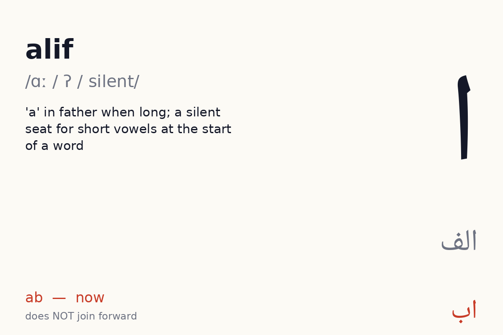
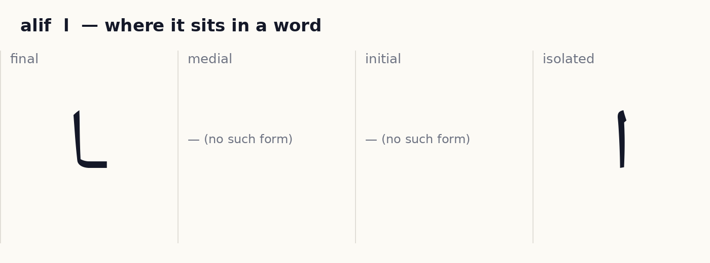

✎ *How the pen moves:* one stroke, top to bottom; when it follows a joiner it rises from the joining line. (Right to left; dots and marks last, after the whole word. These are the conventional Naskh/Nastaliq stroke orders as taught in Pakistani qaida classes; no published study was found, see research/05_open_assets.md.)

**ب be** — joins forward (4 forms).

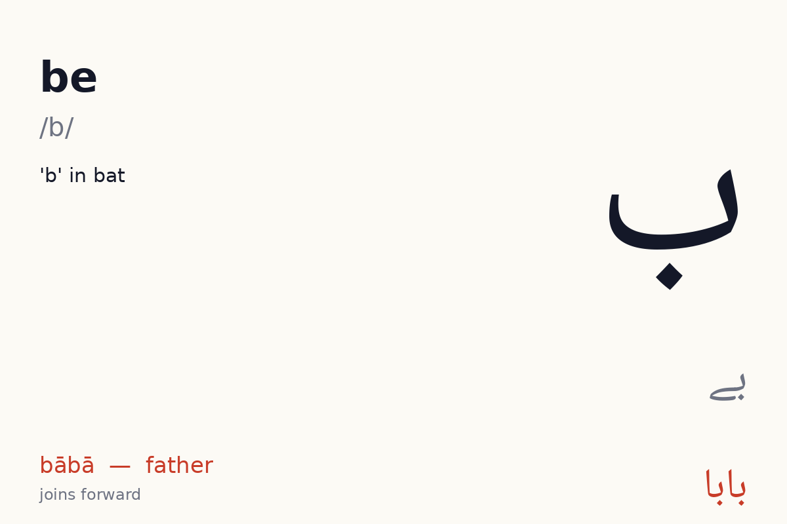
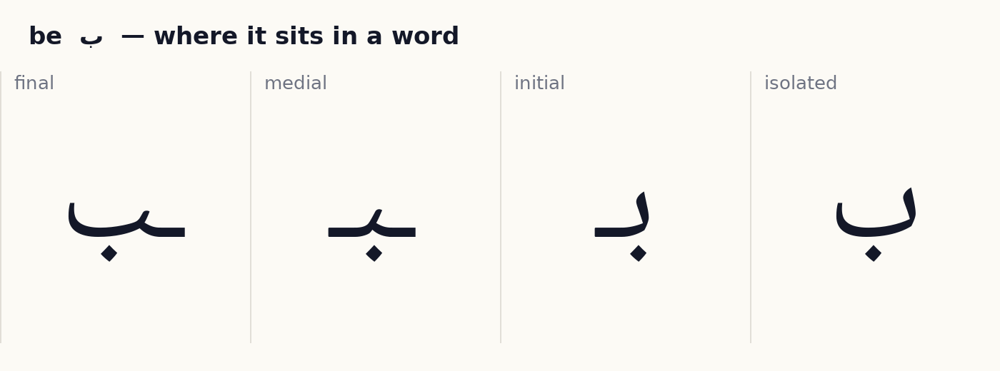

✎ *How the pen moves:* start top-right, draw the shallow bowl leftwards, hook up at the left end; dots after. (Right to left; dots and marks last, after the whole word. These are the conventional Naskh/Nastaliq stroke orders as taught in Pakistani qaida classes; no published study was found, see research/05_open_assets.md.)

**ک kāf** — joins forward (4 forms).

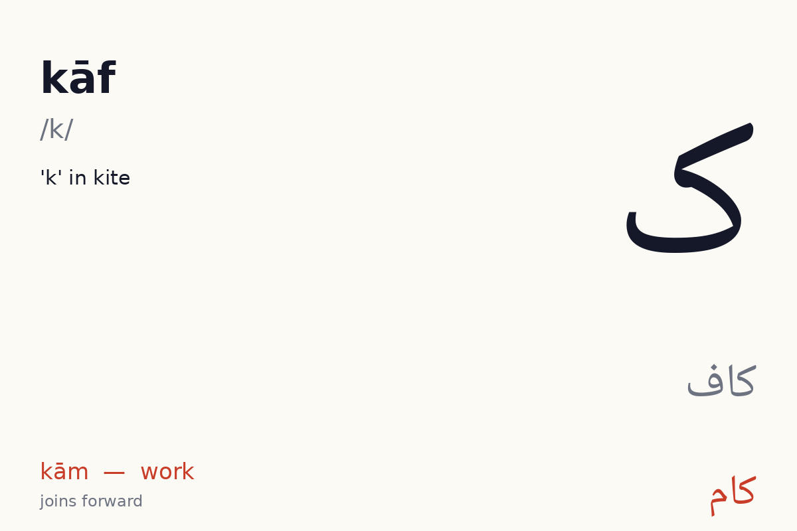
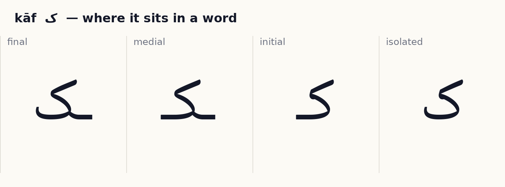

✎ *How the pen moves:* base stroke first, right to left along the line, then the sloping cap (sar-kash) added on top last; گ gets a second cap. (Right to left; dots and marks last, after the whole word. These are the conventional Naskh/Nastaliq stroke orders as taught in Pakistani qaida classes; no published study was found, see research/05_open_assets.md.)

**ل lām** — joins forward (4 forms).

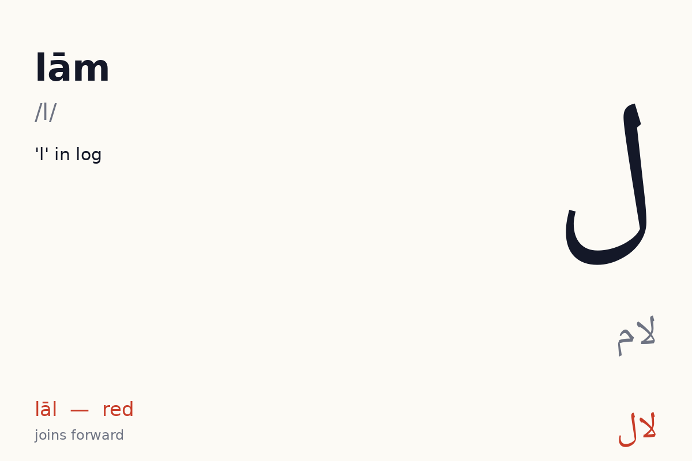
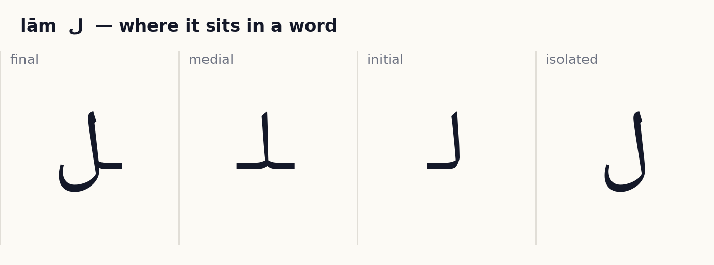

✎ *How the pen moves:* tall stroke down, then curve into the bowl leftwards. (Right to left; dots and marks last, after the whole word. These are the conventional Naskh/Nastaliq stroke orders as taught in Pakistani qaida classes; no published study was found, see research/05_open_assets.md.)

**م mīm** — joins forward (4 forms).

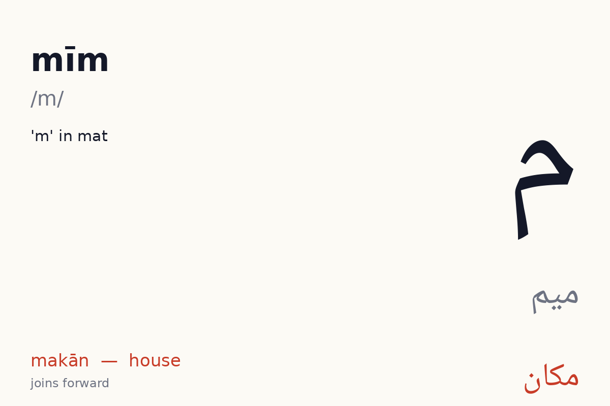
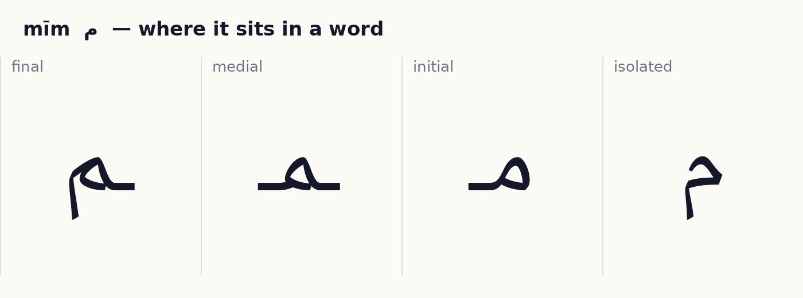

✎ *How the pen moves:* small closed loop, then the tail down-left. (Right to left; dots and marks last, after the whole word. These are the conventional Naskh/Nastaliq stroke orders as taught in Pakistani qaida classes; no published study was found, see research/05_open_assets.md.)

**ن nūn** — joins forward (4 forms).

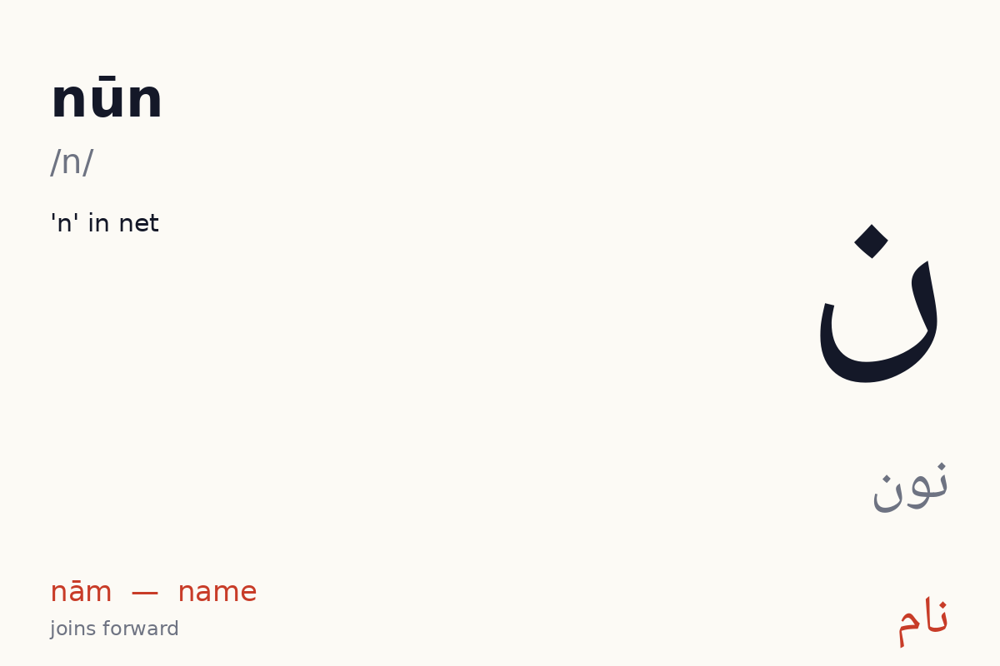
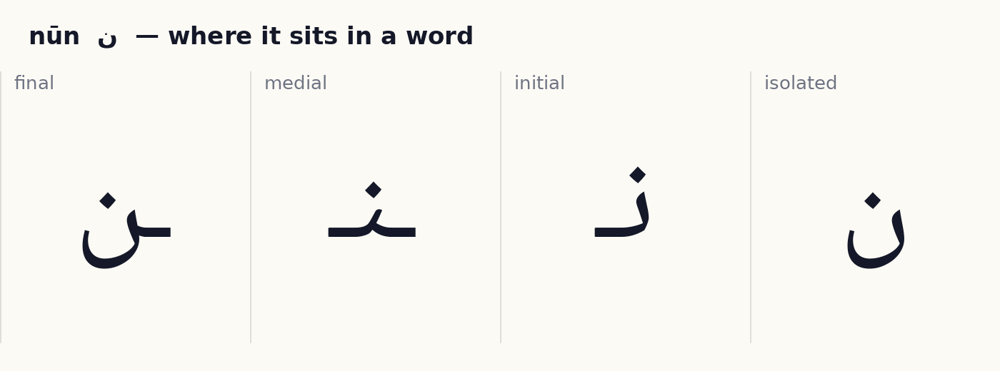

✎ *How the pen moves:* the same bowl as ب but deeper and rounder; dot after (none for ں). (Right to left; dots and marks last, after the whole word. These are the conventional Naskh/Nastaliq stroke orders as taught in Pakistani qaida classes; no published study was found, see research/05_open_assets.md.)

## 3 · Tell it apart  ·  *recognition · self-check with audio*

- ا vs ل — same body, different dots or marks. Drill: play `names/` audio for each, learner points at the right one. 10 rounds, shuffled.
- ب vs ن — same body, different dots or marks. Drill: play `names/` audio for each, learner points at the right one. 10 rounds, shuffled.

## 4 · Join it  ·  *production · self-check against the answer shown*

Build each word from letter tiles, right to left. Watch which letters change shape and which refuse to join.

- ک + ا + م  →  **کام**  (kām, work)
- ن + ا + م  →  **نام**  (nām, name)
- م + ل + ک  →  **مُلْک**  (mulk, country)

## 4b · Blend  ·  *recognition · self-check with audio*

A letter plus a vowel letter makes a sound you can say. Play a syllable, learner points to it. Vowels available so far: ا.

| Syllable | Audio |
|---|---|
| با | `assets/audio/syllables/be_a.mp3` |
| کا | `assets/audio/syllables/kaf_a.mp3` |
| لا | `assets/audio/syllables/lam_a.mp3` |
| ما | `assets/audio/syllables/mim_a.mp3` |
| نا | `assets/audio/syllables/nun_a.mp3` |

## 5 · Read it  ·  *reading aloud · self-check with audio, or a helper listens*

Vowel marks are shown. Read aloud, then play the audio and compare.

| Word | Say | Means | Audio |
|---|---|---|---|
| کام | kām | work | `assets/audio/units/u01_00.mp3` |
| نام | nām | name | `assets/audio/units/u01_01.mp3` |
| کَم | kam | few, less | `assets/audio/units/u01_02.mp3` |
| اَب | ab | now | `assets/audio/units/u01_03.mp3` |
| کَل | kal | tomorrow, yesterday | `assets/audio/units/u01_04.mp3` |
| مُلْک | mulk | country | `assets/audio/units/u01_05.mp3` |
| مِلا | milā | met, got | `assets/audio/units/u01_06.mp3` |
| کَب | kab | when? | `assets/audio/units/u01_07.mp3` |
| بال | bāl | hair | `assets/audio/units/u01_08.mp3` |
| بِنا | binā | without | `assets/audio/units/u01_09.mp3` |
| بِالکُل | bilkul | absolutely | `assets/audio/units/u01_10.mp3` |
| اِمام | imām | prayer leader | `assets/audio/units/u01_11.mp3` |
| مُکَمَّل | mukammal | complete | `assets/audio/units/u01_12.mp3` |
| مُمْکِن | mumkin | possible | `assets/audio/units/u01_13.mp3` |
| مالِک | mālik | owner | `assets/audio/units/u01_14.mp3` |
| لَمْبا | lambā | long, tall | `assets/audio/units/u01_15.mp3` |
| لال | lāl | red | `assets/audio/units/u01_16.mp3` |
| نانا | nānā | maternal grandfather | `assets/audio/units/u01_17.mp3` |
| اِمْکان | imkān | possibility | `assets/audio/units/u01_18.mp3` |
| مال | māl | goods, wealth | `assets/audio/units/u01_19.mp3` |
| بَنانا | banānā | to make | `assets/audio/units/u01_20.mp3` |
| کَلام | kalām | speech, words | `assets/audio/units/u01_21.mp3` |
| بابا | bābā | dad | `assets/audio/units/u01_22.mp3` |
| کَمال | kamāl | perfection, skill | `assets/audio/units/u01_23.mp3` |
| ناک | nāk | nose | `assets/audio/units/u01_24.mp3` |
| ناکام | nākām | unsuccessful | `assets/audio/units/u01_25.mp3` |
| کالا | kālā | black | `assets/audio/units/u01_26.mp3` |
| مان | mān | pride, honour | `assets/audio/units/u01_27.mp3` |
| نامُمْکِن | nāmumkin | impossible | `assets/audio/units/u01_28.mp3` |
| کان | kān | ear | `assets/audio/units/u01_29.mp3` |
| نَمَک | namak | salt | `assets/audio/units/u01_30.mp3` |
| کامِل | kāmil | perfect | `assets/audio/units/u01_31.mp3` |
| مانْنا | mānnā | to accept, obey | `assets/audio/units/u01_32.mp3` |
| لانا | lānā | to bring | `assets/audio/units/u01_33.mp3` |
| مَکان | makān | house | `assets/audio/units/u01_34.mp3` |
| نِکالْنا | nikālnā | to take out | `assets/audio/units/u01_35.mp3` |
| کَمان | kamān | bow | `assets/audio/units/u01_36.mp3` |
| مالا | mālā | garland | `assets/audio/units/u01_37.mp3` |
| نان | nān | naan bread | `assets/audio/units/u01_38.mp3` |
| بُلْبُل | bulbul | nightingale | `assets/audio/units/u01_39.mp3` |
| مِلْنا | milnā | to meet | `assets/audio/units/u01_40.mp3` |
| اِملا | imlā | spelling | `assets/audio/units/u01_41.mp3` |
| کَباب | kabāb | kebab | `assets/audio/units/u01_42.mp3` |
| کَمْبَل | kambal | blanket | `assets/audio/units/u01_43.mp3` |
| مُنّا | munnā | dear little boy | `assets/audio/units/u01_44.mp3` |
| مِلانا | milānā | to mix, join | `assets/audio/units/u01_45.mp3` |
| مَنانا | manānā | to persuade, celebrate | `assets/audio/units/u01_46.mp3` |
| کَمانا | kamānā | to earn | `assets/audio/units/u01_47.mp3` |

**Sentences**

- بابا کا نام کَمال  —  *bābā kā nām kamāl*  —  dad's name is Kamal  · `assets/audio/sentences/u01_00.mp3`
- نانا کا مَکان  —  *nānā kā makān*  —  grandfather's house  · `assets/audio/sentences/u01_01.mp3`
- کالا کَمْبَل لانا  —  *kālā kambal lānā*  —  bring the black blanket  · `assets/audio/sentences/u01_02.mp3`
- نَمَک کَم  —  *namak kam*  —  a little salt  · `assets/audio/sentences/u01_03.mp3`
- مال کا مالِک  —  *māl kā mālik*  —  the owner of the goods  · `assets/audio/sentences/u01_04.mp3`
- مُلْک کا نام  —  *mulk kā nām*  —  the name of the country  · `assets/audio/sentences/u01_05.mp3`
- اِمام کا کَلام  —  *imām kā kalām*  —  the imam's words  · `assets/audio/sentences/u01_06.mp3`
- اَب کَمْبَل لانا  —  *ab kambal lānā*  —  now bring the blanket  · `assets/audio/sentences/u01_07.mp3`
- کَمال کا کام مُکَمَّل  —  *kamāl kā kām mukammal*  —  Kamal's work is complete  · `assets/audio/sentences/u01_08.mp3`
- نان کَباب لانا  —  *nān kabāb lānā*  —  bring naan and kebab  · `assets/audio/sentences/u01_09.mp3`
- کَمان کا مالِک  —  *kamān kā mālik*  —  the owner of the bow  · `assets/audio/sentences/u01_10.mp3`
- نَمَک کا مالِک  —  *namak kā mālik*  —  the owner of the salt  · `assets/audio/sentences/u01_11.mp3`

**Passage** (19 words) · `assets/audio/passages/u01.mp3`

> کَمال کا بابا۔ کَمال کا نانا۔ نانا کا مَکان لَمْبا۔ نانا کا کَمْبَل کالا۔ کَمال کا کام: نَمَک لانا۔
>
> *kamāl kā bābā. kamāl kā nānā. nānā kā makān lambā. nānā kā kambal kālā. kamāl kā kām: namak lānā.*
>
> Kamal's dad. Kamal's grandfather. Grandfather's house is long. Grandfather's blanket is black. Kamal's job: bringing salt.

## 6 · Write it  ·  *production · needs a helper or the app tracer to check*

Trace each new letter in all its forms three times (children: required; adults: recommended). Use the forms card as the model. Then write these words from the list without looking: کام, نام, کَم, اَب, کَل.

Pen movement for each letter is described in step 2 above.

## 7 · Dictation  ·  *production · self-check with the key below*

Play each clip twice. Learner writes the word. Then reveal.

1. `assets/audio/units/u01_20.mp3`
2. `assets/audio/units/u01_09.mp3`
3. `assets/audio/units/u01_25.mp3`
4. `assets/audio/units/u01_41.mp3`
5. `assets/audio/units/u01_03.mp3`

Answer key

1. بَنانا (banānā)
2. بِنا (binā)
3. ناکام (nākām)
4. اِملا (imlā)
5. اَب (ab)

## 8 · Check (score 8/10 to move on)  ·  *recognition · self-check*

1. Which one says **kal** (tomorrow, yesterday)?   (a) مان   (b) کَل   (c) نامُمْکِن   (d) مُلْک
2. Which one says **makān** (house)?   (a) اِملا   (b) مالِک   (c) مَکان   (d) نان
3. Which one says **milā** (met, got)?   (a) کَمان   (b) کَم   (c) مِلا   (d) بِنا
4. Which one says **kamāl** (perfection, skill)?   (a) اِمام   (b) مِلا   (c) کَمال   (d) مُنّا
5. Which one says **mālā** (garland)?   (a) کَل   (b) کَمان   (c) مالا   (d) اَب
6. Which one says **ab** (now)?   (a) ناک   (b) اَب   (c) نان   (d) نَمَک
7. Which one says **mānnā** (to accept, obey)?   (a) مالا   (b) مال   (c) مانْنا   (d) مَکان
8. Which one says **mumkin** (possible)?   (a) کَب   (b) مُمْکِن   (c) لانا   (d) کَل
9. Which one says **kam** (few, less)?   (a) مُلْک   (b) اَب   (c) کَم   (d) کَمْبَل
10. Which one says **mulk** (country)?   (a) کَمال   (b) بُلْبُل   (c) مُلْک   (d) مِلانا

Answer key

1. کَل
2. مَکان
3. مِلا
4. کَمال
5. مالا
6. اَب
7. مانْنا
8. مُمْکِن
9. کَم
10. مُلْک

