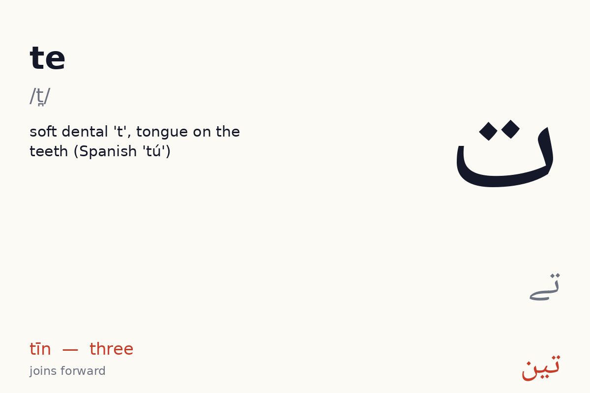
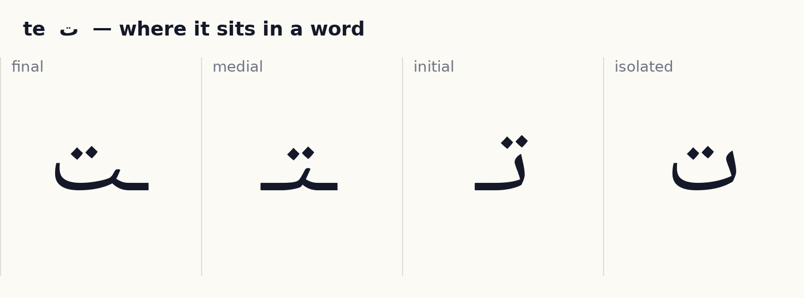
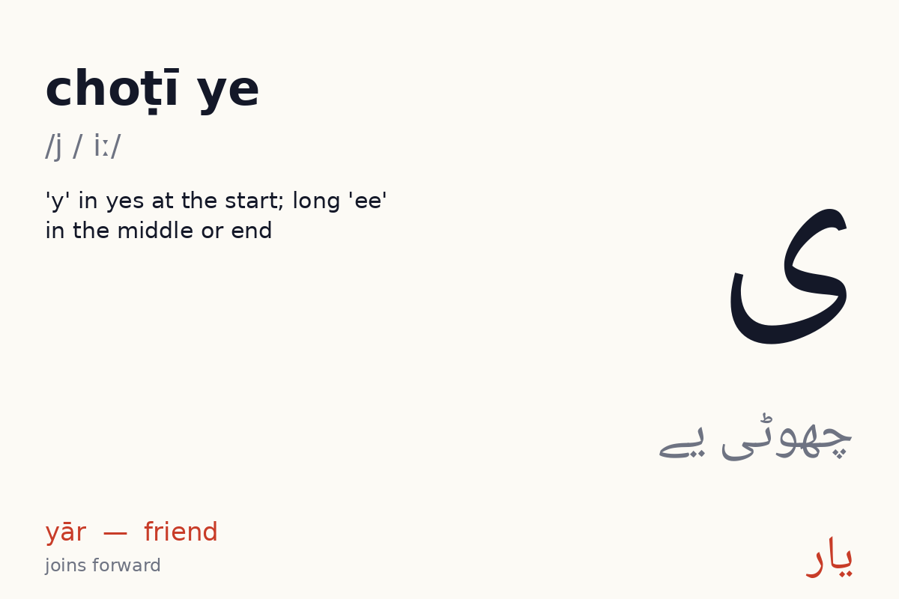
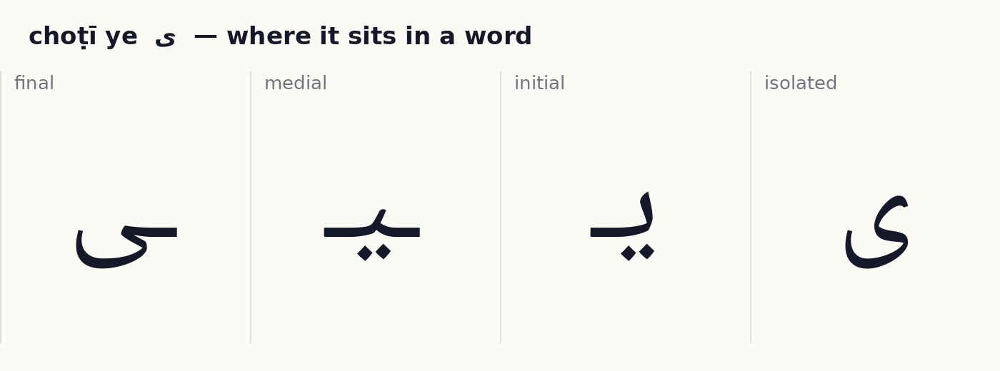
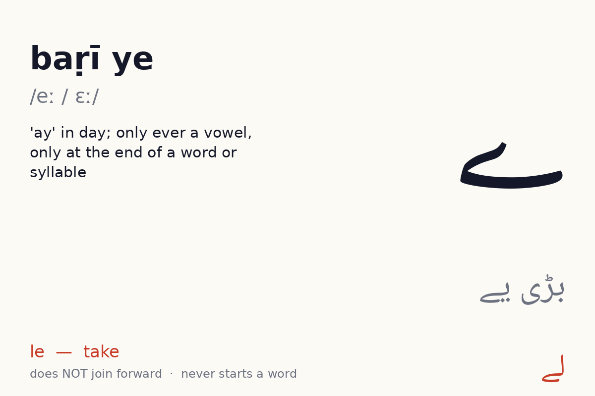
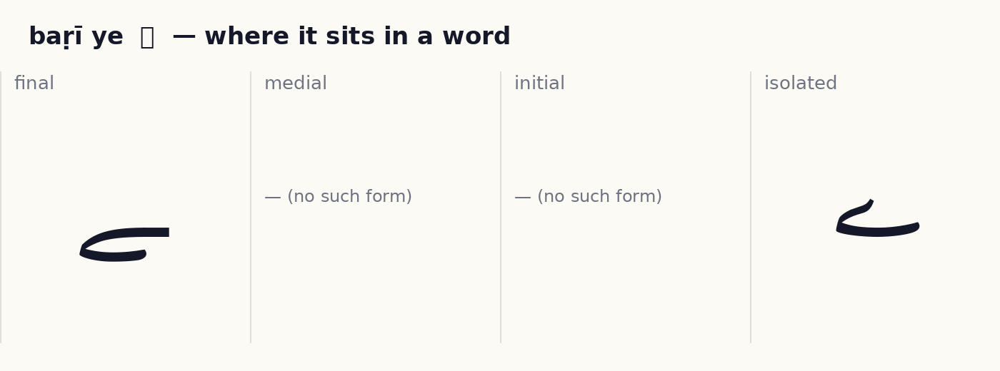

# Unit 2 — Dots and the two ye  ·  نقطے اور دو یے

**Focus:** The dot-confusable cluster ب ت ن ی: same body, different dots; ی for ī and y; ے for e and ai only at the end

**On the phone, this unit is these lessons, in order:** te ت → choṭī ye ی → baṛī ye ے → Join them → Blend → Words 1 → Words 2 → Read → Unit check. Children rotate through them one at a time; the Unit check (8 of 10) unlocks the next unit.

## 1 · Hear it

| Letter | Name | Sound | Say it like… | Audio |
|---|---|---|---|---|
| ت | te (تے) | /t̪/ | soft dental 't', tongue on the teeth (Spanish 'tú') | `assets/audio/names/te.mp3` · `assets/audio/words/te.mp3` (تین tīn — three) |
| ی | choṭī ye (چھوٹی یے) | /j / iː/ | 'y' in yes at the start; long 'ee' in the middle or end | `assets/audio/names/choti_ye.mp3` · `assets/audio/words/choti_ye.mp3` (یار yār — friend) |
| ے | baṛī ye (بڑی یے) | /eː / ɛː/ | 'ay' in day; only ever a vowel, only at the end of a word or syllable | `assets/audio/names/bari_ye.mp3` · `assets/audio/words/bari_ye.mp3` (لے le — take) |

## 2 · See it

**ت te** — joins forward (4 forms).

✎ *How the pen moves:* start top-right, draw the shallow bowl leftwards, hook up at the left end; dots after. (Right to left; dots and marks last, after the whole word. These are the conventional Naskh/Nastaliq stroke orders as taught in Pakistani qaida classes; no published study was found, see research/05_open_assets.md.)

**ی choṭī ye** — joins forward (4 forms).

✎ *How the pen moves:* ی is the ب bowl that swings back under itself; ے is a long flat sweep leftwards. (Right to left; dots and marks last, after the whole word. These are the conventional Naskh/Nastaliq stroke orders as taught in Pakistani qaida classes; no published study was found, see research/05_open_assets.md.)

**ے baṛī ye** — does **not** join forward (2 forms: isolated, final). No Urdu word begins with it.

✎ *How the pen moves:* ی is the ب bowl that swings back under itself; ے is a long flat sweep leftwards. (Right to left; dots and marks last, after the whole word. These are the conventional Naskh/Nastaliq stroke orders as taught in Pakistani qaida classes; no published study was found, see research/05_open_assets.md.)

## 3 · Tell it apart  ·  *recognition · self-check with audio*

- ت vs ب ن — same body, different dots or marks. Drill: play `names/` audio for each, learner points at the right one. 10 rounds, shuffled.
- ی vs ب ت ن ے — same body, different dots or marks. Drill: play `names/` audio for each, learner points at the right one. 10 rounds, shuffled.

## 4 · Join it  ·  *production · self-check against the answer shown*

Build each word from letter tiles, right to left. Watch which letters change shape and which refuse to join.

- ت + ی + ن  →  **تین**  (tīn, three)
- ب + ی + ل  →  **بَیل**  (bail, ox)
- م + ی + ل  →  **میل**  (mīl, mile)

## 4b · Blend  ·  *recognition · self-check with audio*

A letter plus a vowel letter makes a sound you can say. Play a syllable, learner points to it. Vowels available so far: ا ی.

| Syllable | Audio |
|---|---|
| تا | `assets/audio/syllables/te_a.mp3` |
| تی | `assets/audio/syllables/te_i.mp3` |

## 5 · Read it  ·  *reading aloud · self-check with audio, or a helper listens*

Vowel marks are shown. Read aloud, then play the audio and compare.

| Word | Say | Means | Audio |
|---|---|---|---|
| تُم | tum | you | `assets/audio/units/u02_00.mp3` |
| تین | tīn | three | `assets/audio/units/u02_01.mp3` |
| بَیل | bail | ox | `assets/audio/units/u02_02.mp3` |
| میل | mīl | mile | `assets/audio/units/u02_03.mp3` |
| نیلا | nīlā | blue | `assets/audio/units/u02_04.mp3` |
| کیلا | kelā | banana | `assets/audio/units/u02_05.mp3` |
| تیل | tel | oil | `assets/audio/units/u02_06.mp3` |
| لے | le | take | `assets/audio/units/u02_07.mp3` |
| کے | ke | of | `assets/audio/units/u02_08.mp3` |
| نے | ne | (agent marker) | `assets/audio/units/u02_09.mp3` |
| تالی | tālī | clap | `assets/audio/units/u02_10.mp3` |
| بِلّی | billī | cat | `assets/audio/units/u02_11.mp3` |
| تالا | tālā | lock | `assets/audio/units/u02_12.mp3` |
| کِتاب | kitāb | book | `assets/audio/units/u02_13.mp3` |
| بیتاب | betāb | restless | `assets/audio/units/u02_14.mp3` |
| تَکِیا | takiya | pillow | `assets/audio/units/u02_15.mp3` |
| مالی | mālī | gardener | `assets/audio/units/u02_16.mp3` |
| ناتا | nātā | relation | `assets/audio/units/u02_17.mp3` |
| تالاب | tālāb | pond | `assets/audio/units/u02_18.mp3` |
| کَمانی | kamānī | spring | `assets/audio/units/u02_19.mp3` |

**Sentences**

- تین کِتاب  —  *tīn kitāb*  —  three books  · `assets/audio/sentences/u02_00.mp3`
- بِلّی کالی ہَے  —  *billī kālī hai*  —  the cat is black (ہے is a sight word)  · `assets/audio/sentences/u02_01.mp3`
- نیلا تَکِیا لے  —  *nīlā takiya le*  —  take the blue pillow  · `assets/audio/sentences/u02_02.mp3`

## 6 · Write it  ·  *production · needs a helper or the app tracer to check*

Trace each new letter in all its forms three times (children: required; adults: recommended). Use the forms card as the model. Then write these words from the list without looking: تُم, تین, بَیل, میل, نیلا.

Pen movement for each letter is described in step 2 above.

## 7 · Dictation  ·  *production · self-check with the key below*

Play each clip twice. Learner writes the word. Then reveal.

1. `assets/audio/units/u02_14.mp3`
2. `assets/audio/units/u02_09.mp3`
3. `assets/audio/units/u02_12.mp3`
4. `assets/audio/units/u02_11.mp3`
5. `assets/audio/units/u02_00.mp3`

Answer key

1. بیتاب (betāb)
2. نے (ne)
3. تالا (tālā)
4. بِلّی (billī)
5. تُم (tum)

## 8 · Check (score 8/10 to move on)  ·  *recognition · self-check*

1. Which one says **betāb** (restless)?   (a) تالا   (b) تالاب   (c) لے   (d) بیتاب
2. Which one says **billī** (cat)?   (a) کے   (b) بیتاب   (c) نیلا   (d) بِلّی
3. Which one says **kelā** (banana)?   (a) نیلا   (b) کیلا   (c) کِتاب   (d) کے
4. Which one says **mīl** (mile)?   (a) کَمانی   (b) میل   (c) تیل   (d) نے
5. Which one says **takiya** (pillow)?   (a) ناتا   (b) تالی   (c) نیلا   (d) تَکِیا
6. Which one says **tum** (you)?   (a) کَمانی   (b) تالاب   (c) تُم   (d) کِتاب
7. Which one says **mālī** (gardener)?   (a) بیتاب   (b) تیل   (c) مالی   (d) بَیل
8. Which one says **tālā** (lock)?   (a) تالاب   (b) میل   (c) نیلا   (d) تالا
9. Which one says **nīlā** (blue)?   (a) نے   (b) کیلا   (c) کِتاب   (d) نیلا
10. Which one says **bail** (ox)?   (a) مالی   (b) تَکِیا   (c) کَمانی   (d) بَیل

Answer key

1. بیتاب
2. بِلّی
3. کیلا
4. میل
5. تَکِیا
6. تُم
7. مالی
8. تالا
9. نیلا
10. بَیل

