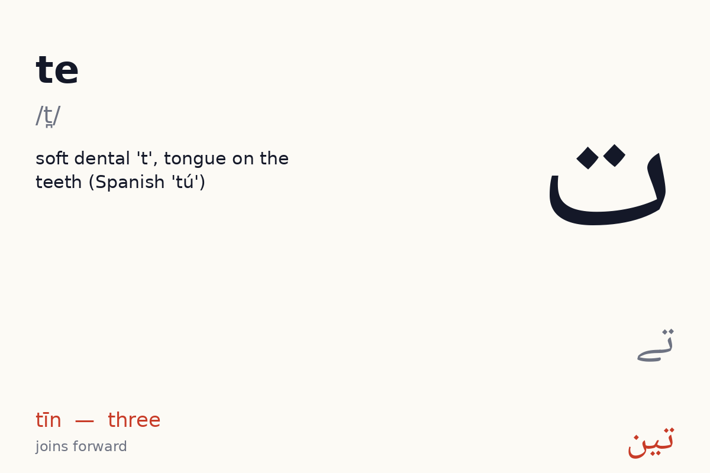
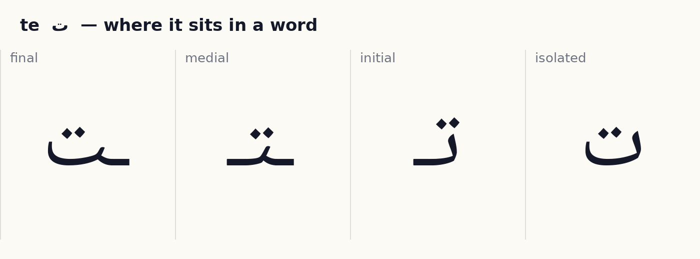
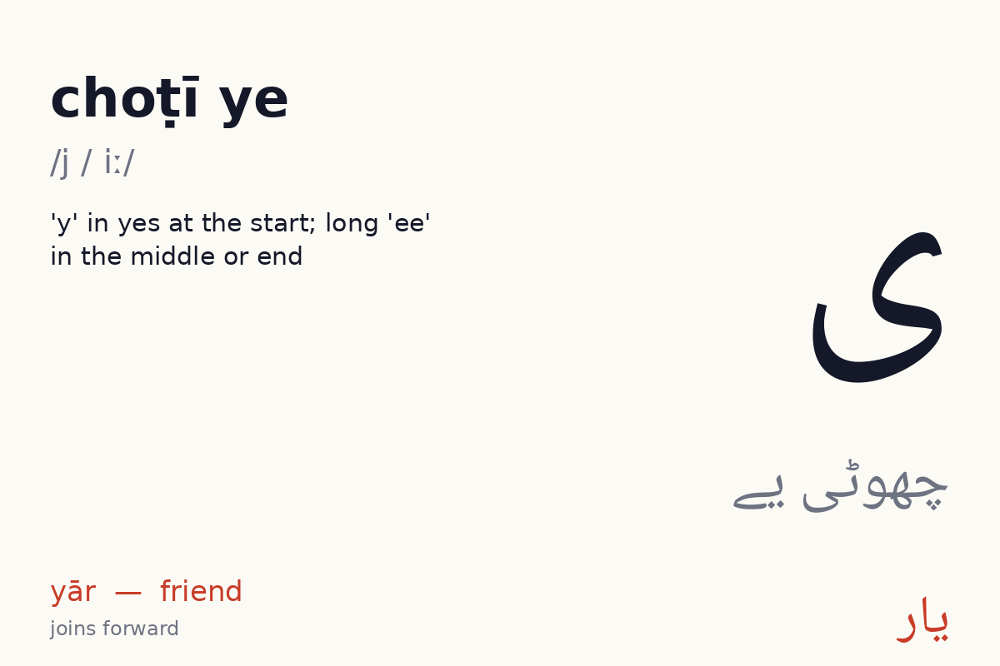
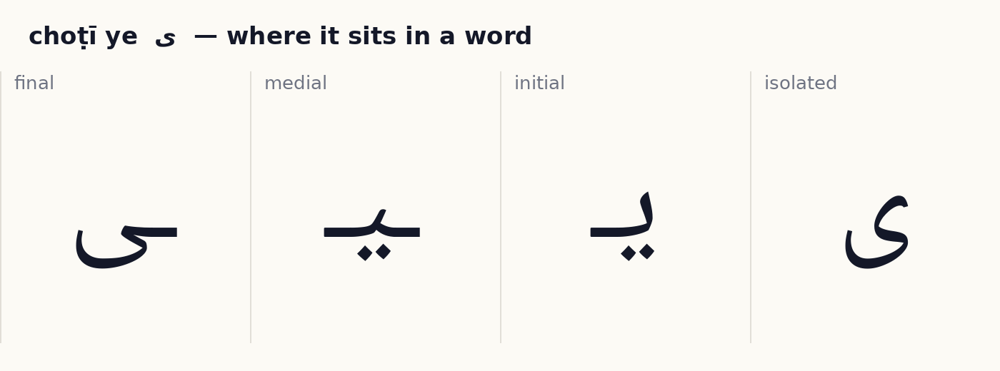
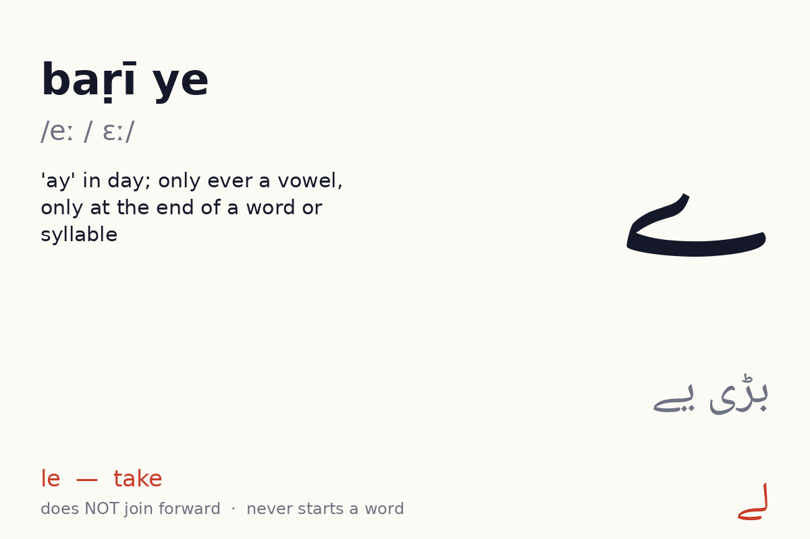
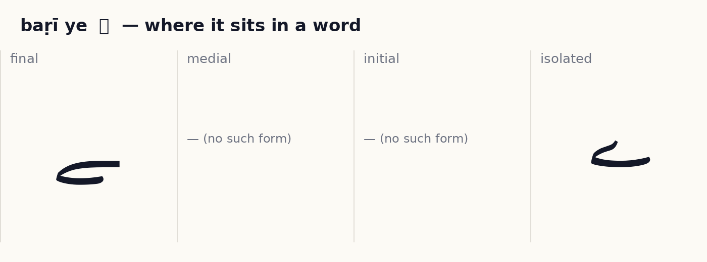

# Unit 2 — Dots and the two ye  ·  نقطے اور دو یے

**Focus:** The dot-confusable cluster ب ت ن ی: same body, different dots; ی for ī and y; ے for e and ai only at the end

**On the phone, this unit is these lessons, in order:** te ت → choṭī ye ی → baṛī ye ے → Join them → Blend → Words 1 → Words 2 → Words 3 → Words 4 → Words 5 → Read → Unit check. Children rotate through them one at a time; the Unit check (8 of 10) unlocks the next unit.

## 1 · Hear it

| Letter | Name | Sound | Say it like… | Audio |
|---|---|---|---|---|
| ت | te (تے) | /t̪/ | soft dental 't', tongue on the teeth (Spanish 'tú') | `assets/audio/names/te.mp3` · `assets/audio/words/te.mp3` (تین tīn — three) |
| ی | choṭī ye (چھوٹی یے) | /j / iː/ | 'y' in yes at the start; long 'ee' in the middle or end | `assets/audio/names/choti_ye.mp3` · `assets/audio/words/choti_ye.mp3` (یار yār — friend) |
| ے | baṛī ye (بڑی یے) | /eː / ɛː/ | 'ay' in day; only ever a vowel, only at the end of a word or syllable | `assets/audio/names/bari_ye.mp3` · `assets/audio/words/bari_ye.mp3` (لے le — take) |

## 2 · See it

**ت te** — joins forward (4 forms).

✎ *How the pen moves:* start top-right, draw the shallow bowl leftwards, hook up at the left end; dots after. (Right to left; dots and marks last, after the whole word. These are the conventional Naskh/Nastaliq stroke orders as taught in Pakistani qaida classes; no published study was found, see research/05_open_assets.md.)

**ی choṭī ye** — joins forward (4 forms).

✎ *How the pen moves:* ی is the ب bowl that swings back under itself; ے is a long flat sweep leftwards. (Right to left; dots and marks last, after the whole word. These are the conventional Naskh/Nastaliq stroke orders as taught in Pakistani qaida classes; no published study was found, see research/05_open_assets.md.)

**ے baṛī ye** — does **not** join forward (2 forms: isolated, final). No Urdu word begins with it.

✎ *How the pen moves:* ی is the ب bowl that swings back under itself; ے is a long flat sweep leftwards. (Right to left; dots and marks last, after the whole word. These are the conventional Naskh/Nastaliq stroke orders as taught in Pakistani qaida classes; no published study was found, see research/05_open_assets.md.)

## 3 · Tell it apart  ·  *recognition · self-check with audio*

- ت vs ب ن — same body, different dots or marks. Drill: play `names/` audio for each, learner points at the right one. 10 rounds, shuffled.
- ی vs ب ت ن ے — same body, different dots or marks. Drill: play `names/` audio for each, learner points at the right one. 10 rounds, shuffled.

## 4 · Join it  ·  *production · self-check against the answer shown*

Build each word from letter tiles, right to left. Watch which letters change shape and which refuse to join.

- ا + ی + ک  →  **ایک**  (ek, one)
- ل + ی + ے  →  **لِیے**  (liye, for)
- ب + ا + ت  →  **بات**  (bāt, talk, matter)

## 4b · Blend  ·  *recognition · self-check with audio*

A letter plus a vowel letter makes a sound you can say. Play a syllable, learner points to it. Vowels available so far: ا ی.

| Syllable | Audio |
|---|---|
| تا | `assets/audio/syllables/te_a.mp3` |
| تی | `assets/audio/syllables/te_i.mp3` |

## 5 · Read it  ·  *reading aloud · self-check with audio, or a helper listens*

Vowel marks are shown. Read aloud, then play the audio and compare.

| Word | Say | Means | Audio |
|---|---|---|---|
| کے | ke | of | `assets/audio/units/u02_00.mp3` |
| نے | ne | (agent marker) | `assets/audio/units/u02_01.mp3` |
| ایک | ek | one | `assets/audio/units/u02_02.mp3` |
| تُم | tum | you | `assets/audio/units/u02_03.mp3` |
| لِیے | liye | for | `assets/audio/units/u02_04.mp3` |
| تَک | tak | until, up to | `assets/audio/units/u02_05.mp3` |
| یا | yā | or | `assets/audio/units/u02_06.mp3` |
| بات | bāt | talk, matter | `assets/audio/units/u02_07.mp3` |
| لیکِن | lekin | but | `assets/audio/units/u02_08.mp3` |
| لِیا | liyā | took | `assets/audio/units/u02_09.mp3` |
| لے | le | take | `assets/audio/units/u02_10.mp3` |
| تین | tīn | three | `assets/audio/units/u02_11.mp3` |
| کِتاب | kitāb | book | `assets/audio/units/u02_12.mp3` |
| مَت | mat | don't | `assets/audio/units/u02_13.mp3` |
| بے | be | without, un- | `assets/audio/units/u02_14.mp3` |
| اِتنے | itne | so many | `assets/audio/units/u02_15.mp3` |
| تَمام | tamām | all, whole | `assets/audio/units/u02_16.mp3` |
| بَتایا | batāyā | told | `assets/audio/units/u02_17.mp3` |
| لی | lī | took | `assets/audio/units/u02_18.mp3` |
| اِتنی | itnī | so much | `assets/audio/units/u02_19.mp3` |
| اِتنا | itnā | this much | `assets/audio/units/u02_20.mp3` |
| کِتنی | kitnī | how much | `assets/audio/units/u02_21.mp3` |
| بِلّی | billī | cat | `assets/audio/units/u02_22.mp3` |
| نَیا | nayā | new | `assets/audio/units/u02_23.mp3` |
| اَکیلے | akele | alone | `assets/audio/units/u02_24.mp3` |
| میل | mīl | mile | `assets/audio/units/u02_25.mp3` |
| لَمبی | lambī | long | `assets/audio/units/u02_26.mp3` |
| کامیابی | kāmyābī | success | `assets/audio/units/u02_27.mp3` |
| تَب | tab | then | `assets/audio/units/u02_28.mp3` |
| کِتنے | kitne | how many | `assets/audio/units/u02_29.mp3` |
| کِتنا | kitnā | how much | `assets/audio/units/u02_30.mp3` |
| کیک | kek | cake | `assets/audio/units/u02_31.mp3` |
| کامیاب | kāmyāb | successful | `assets/audio/units/u02_32.mp3` |
| بینک | baink | bank | `assets/audio/units/u02_33.mp3` |
| لینا | lenā | to take | `assets/audio/units/u02_34.mp3` |
| ایمان | īmān | faith | `assets/audio/units/u02_35.mp3` |
| مُلکی | mulkī | of the country | `assets/audio/units/u02_36.mp3` |
| کُتّا | kuttā | dog | `assets/audio/units/u02_37.mp3` |
| بَتانا | batānā | to tell | `assets/audio/units/u02_38.mp3` |
| بیتاب | betāb | restless | `assets/audio/units/u02_39.mp3` |
| کَمی | kamī | shortage | `assets/audio/units/u02_40.mp3` |
| تیل | tel | oil | `assets/audio/units/u02_41.mp3` |
| کُتّے | kutte | dogs | `assets/audio/units/u02_42.mp3` |
| نِیَّت | niyyat | intention | `assets/audio/units/u02_43.mp3` |
| مالی | mālī | gardener | `assets/audio/units/u02_44.mp3` |
| تالا | tālā | lock | `assets/audio/units/u02_45.mp3` |
| تایا | tāyā | father's elder brother | `assets/audio/units/u02_46.mp3` |
| بانی | bānī | founder | `assets/audio/units/u02_47.mp3` |
| بَیل | bail | ox | `assets/audio/units/u02_48.mp3` |
| تَمَنّا | tamannā | wish | `assets/audio/units/u02_49.mp3` |
| نیکی | nekī | goodness | `assets/audio/units/u02_50.mp3` |
| اَکیلا | akelā | alone | `assets/audio/units/u02_51.mp3` |
| نانی | nānī | maternal grandmother | `assets/audio/units/u02_52.mp3` |
| تالی | tālī | clap | `assets/audio/units/u02_53.mp3` |
| مَکْتَب | maktab | school | `assets/audio/units/u02_54.mp3` |
| تالاب | tālāb | pond | `assets/audio/units/u02_55.mp3` |
| کیمِیا | kīmiyā | chemistry | `assets/audio/units/u02_56.mp3` |
| یَتیم | yatīm | orphan | `assets/audio/units/u02_57.mp3` |
| نابینا | nābīnā | blind | `assets/audio/units/u02_58.mp3` |
| نیلا | nīlā | blue | `assets/audio/units/u02_59.mp3` |
| نَمکین | namkīn | salty | `assets/audio/units/u02_60.mp3` |
| نیلَم | nīlam | sapphire, a girl's name | `assets/audio/units/u02_61.mp3` |
| کیلا | kelā | banana | `assets/audio/units/u02_62.mp3` |
| ناتا | nātā | relation | `assets/audio/units/u02_63.mp3` |

**Sentences**

- نَیا کَمْبَل لے  —  *nayā kambal le*  —  take the new blanket  · `assets/audio/sentences/u02_00.mp3`
- تین کیک لینا  —  *tīn kek lenā*  —  take three cakes  · `assets/audio/sentences/u02_01.mp3`
- نانی کا نیلا کَمْبَل  —  *nānī kā nīlā kambal*  —  grandma's blue blanket  · `assets/audio/sentences/u02_02.mp3`
- تایا کا نَیا مَکان  —  *tāyā kā nayā makān*  —  uncle's new house  · `assets/audio/sentences/u02_03.mp3`
- اِتنا نَمَک مَت لینا  —  *itnā namak mat lenā*  —  don't take so much salt  · `assets/audio/sentences/u02_04.mp3`
- بینک کا نام بَتانا  —  *baink kā nām batānā*  —  tell me the name of the bank  · `assets/audio/sentences/u02_05.mp3`
- نانی کا تالا لے  —  *nānī kā tālā le*  —  take grandma's lock  · `assets/audio/sentences/u02_06.mp3`
- تُم کیک لے لینا  —  *tum kek le lenā*  —  you take the cake  · `assets/audio/sentences/u02_07.mp3`
- نیلَم کا نَیا کیک  —  *nīlam kā nayā kek*  —  Neelam's new cake  · `assets/audio/sentences/u02_08.mp3`
- کِتنا لَمْبا کَمْبَل  —  *kitnā lambā kambal*  —  what a long blanket  · `assets/audio/sentences/u02_09.mp3`
- نیلا کیک  —  *nīlā kek*  —  a blue cake  · `assets/audio/sentences/u02_10.mp3`
- تایا کا کُتّا  —  *tāyā kā kuttā*  —  uncle's dog  · `assets/audio/sentences/u02_11.mp3`

**Passage** (32 words) · `assets/audio/passages/u02.mp3`

> نیلَم نے نانی کا کیک لِیا۔ نانی نے بَتایا: اِتنا کیک مَت لینا۔ نیلَم نے ایک کیک لِیا۔ ایک کیک نیلَم کا، ایک کیک نانی کا۔ تایا کے کُتّے نے کیک لِیا۔
>
> *nīlam ne nānī kā kek liyā. nānī ne batāyā: itnā kek mat lenā. nīlam ne ek kek liyā. ek kek nīlam kā, ek kek nānī kā. tāyā ke kutte ne kek liyā.*
>
> Neelam took grandma's cake. Grandma said: don't take so much cake. Neelam took one cake. One cake is Neelam's, one is grandma's. Uncle's dog took a cake.

## 6 · Write it  ·  *production · needs a helper or the app tracer to check*

Trace each new letter in all its forms three times (children: required; adults: recommended). Use the forms card as the model. Then write these words from the list without looking: کے, نے, ایک, تُم, لِیے.

Pen movement for each letter is described in step 2 above.

## 7 · Dictation  ·  *production · self-check with the key below*

Play each clip twice. Learner writes the word. Then reveal.

1. `assets/audio/units/u02_34.mp3`
2. `assets/audio/units/u02_60.mp3`
3. `assets/audio/units/u02_08.mp3`
4. `assets/audio/units/u02_07.mp3`
5. `assets/audio/units/u02_39.mp3`

Answer key

1. لینا (lenā)
2. نَمکین (namkīn)
3. لیکِن (lekin)
4. بات (bāt)
5. بیتاب (betāb)

## 8 · Check (score 8/10 to move on)  ·  *recognition · self-check*

1. Which one says **yatīm** (orphan)?   (a) لے   (b) بیتاب   (c) یَتیم   (d) بات
2. Which one says **lī** (took (fem))?   (a) لَمبی   (b) کیمِیا   (c) نیلا   (d) لی
3. Which one says **tālā** (lock)?   (a) لیکِن   (b) کامیابی   (c) تالی   (d) تالا
4. Which one says **akele** (alone (plural))?   (a) یَتیم   (b) میل   (c) اَکیلے   (d) کیلا
5. Which one says **kīmiyā** (chemistry)?   (a) کیک   (b) کے   (c) تالی   (d) کیمِیا
6. Which one says **kutte** (dogs)?   (a) نَیا   (b) کُتّے   (c) بیتاب   (d) مُلکی
7. Which one says **billī** (cat)?   (a) بِلّی   (b) مالی   (c) بَیل   (d) کُتّے
8. Which one says **ne** ((agent marker))?   (a) نانی   (b) نے   (c) لَمبی   (d) مُلکی
9. Which one says **kitne** (how many)?   (a) مَت   (b) کِتاب   (c) کِتنے   (d) لِیے
10. Which one says **nātā** (relation)?   (a) لِیا   (b) ناتا   (c) مُلکی   (d) لینا

Answer key

1. یَتیم
2. لی
3. تالا
4. اَکیلے
5. کیمِیا
6. کُتّے
7. بِلّی
8. نے
9. کِتنے
10. ناتا

