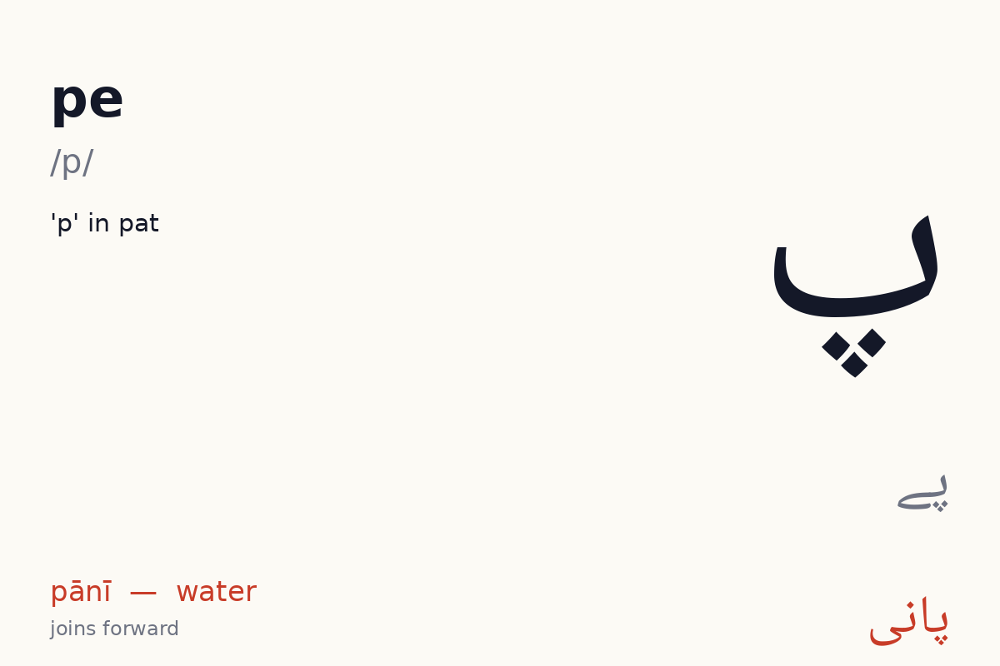
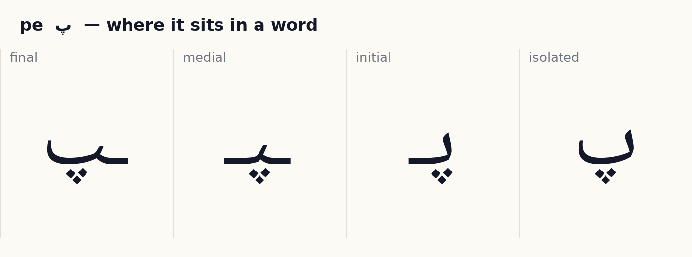
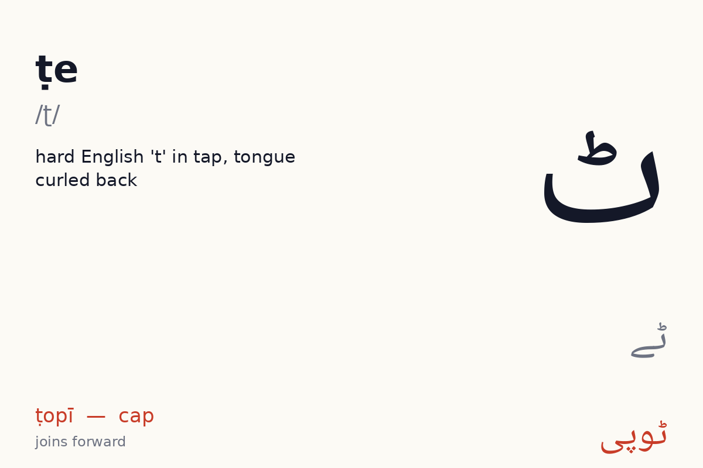
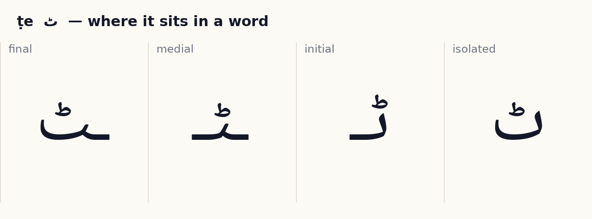
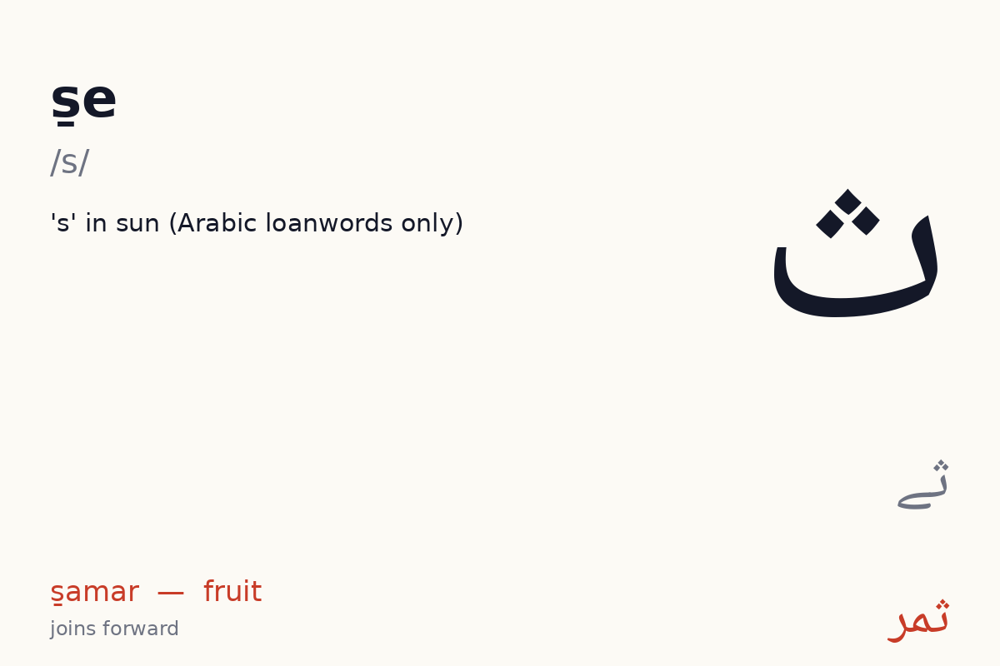
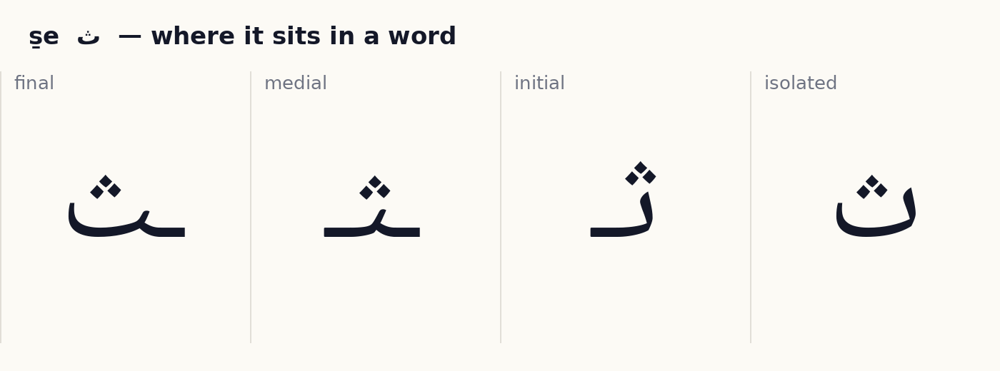

# Unit 3 — Finishing the be family  ·  بے کا خاندان

**Focus:** Three dots below (پ), the small ط-mark above (ٹ), three dots above (ث). Retroflex ٹ vs dental ت

## 1 · Hear it

| Letter | Name | Sound | Say it like… | Audio |
|---|---|---|---|---|
| پ | pe (پے) | /p/ | 'p' in pat | `assets/audio/names/pe.mp3` · `assets/audio/words/pe.mp3` (پانی pānī — water) |
| ٹ | ṭe (ٹے) | /ʈ/ | hard English 't' in tap, tongue curled back | `assets/audio/names/tte.mp3` · `assets/audio/words/tte.mp3` (ٹوپی ṭopī — cap) |
| ث | s̱e (ثے) | /s/ | 's' in sun (Arabic loanwords only) | `assets/audio/names/se.mp3` · `assets/audio/words/se.mp3` (ثمر s̱amar — fruit) |

## 2 · See it

**پ pe** — joins forward (4 forms).

**ٹ ṭe** — joins forward (4 forms).

**ث s̱e** — joins forward (4 forms).

## 3 · Tell it apart

- پ vs ب ت ث — same body, different dots or marks. Drill: play `names/` audio for each, learner points at the right one. 10 rounds, shuffled.
- ٹ vs ت ب — same body, different dots or marks. Drill: play `names/` audio for each, learner points at the right one. 10 rounds, shuffled.

## 4 · Join it

Build each word from letter tiles, right to left. Watch which letters change shape and which refuse to join.

- پ + ا + ن + ی  →  **پانی**  (pānī, water)
- ٹ + و + پ + ی  →  **ٹوپی**  (ṭopī, cap (و comes in unit 4, preview))
- پ + ت + ا  →  **پَتا**  (patā, address)

## 5 · Read it

Vowel marks are shown. Read aloud, then play the audio and compare.

| Word | Say | Means | Audio |
|---|---|---|---|
| پانی | pānī | water | `assets/audio/units/u03_00.mp3` |
| پُل | pul | bridge | `assets/audio/units/u03_01.mp3` |
| ٹوپی | ṭopī | cap (و comes in unit 4, preview) | `assets/audio/units/u03_02.mp3` |
| پَتا | patā | address | `assets/audio/units/u03_03.mp3` |
| پاک | pāk | pure | `assets/audio/units/u03_04.mp3` |
| پیٹ | peṭ | stomach | `assets/audio/units/u03_05.mp3` |
| ٹَب | ṭab | tub | `assets/audio/units/u03_06.mp3` |
| پَتْلی | patlī | thin | `assets/audio/units/u03_07.mp3` |
| ثابِت | s̱ābit | proven | `assets/audio/units/u03_08.mp3` |
| پیپَل | pīpal | fig tree | `assets/audio/units/u03_09.mp3` |
| ٹَماٹَر | ṭamāṭar | tomato (ر preview) | `assets/audio/units/u03_10.mp3` |
| ٹانْکا | ṭānkā | stitch | `assets/audio/units/u03_11.mp3` |
| پِیالا | piyālā | bowl | `assets/audio/units/u03_12.mp3` |
| نَپا | napā | measured | `assets/audio/units/u03_13.mp3` |
| پَلَک | palak | eyelash | `assets/audio/units/u03_14.mp3` |
| کَپاس | kapās | cotton (س preview) | `assets/audio/units/u03_15.mp3` |
| تَپْتا | taptā | scorching | `assets/audio/units/u03_16.mp3` |
| پَتْلا | patlā | thin | `assets/audio/units/u03_17.mp3` |
| ٹال | ṭāl | wood-stall | `assets/audio/units/u03_18.mp3` |
| بَٹَن | baṭan | button | `assets/audio/units/u03_19.mp3` |

**Sentences**

- پانی لا  —  *pānī lā*  —  bring water  · `assets/audio/sentences/u03_00.mp3`
- پَتْلی بِلّی  —  *patlī billī*  —  thin cat  · `assets/audio/sentences/u03_01.mp3`
- مَیں ٹوپی لے  —  *maiṉ ṭopī le*  —  (preview) I take the cap  · `assets/audio/sentences/u03_02.mp3`

## 6 · Write it

Trace each new letter in all its forms three times (children: required; adults: recommended). Use the forms card as the model. Then write these words from the list without looking: پانی, پُل, ٹوپی, پَتا, پاک.

## 7 · Dictation

Play each clip twice. Learner writes the word. Then reveal.

1. `assets/audio/units/u03_08.mp3`
2. `assets/audio/units/u03_15.mp3`
3. `assets/audio/units/u03_05.mp3`
4. `assets/audio/units/u03_16.mp3`
5. `assets/audio/units/u03_00.mp3`

Answer key

1. ثابِت (s̱ābit)
2. کَپاس (kapās)
3. پیٹ (peṭ)
4. تَپْتا (taptā)
5. پانی (pānī)

## 8 · Check (score 8/10 to move on)

1. Which one says **ṭab** (tub)?   (a) پَتْلا   (b) پیپَل   (c) پِیالا   (d) ٹَب
2. Which one says **taptā** (scorching)?   (a) پَتْلی   (b) تَپْتا   (c) ٹَماٹَر   (d) پَتْلا
3. Which one says **ṭānkā** (stitch)?   (a) ٹانْکا   (b) پَتْلی   (c) نَپا   (d) بَٹَن
4. Which one says **pāk** (pure)?   (a) پاک   (b) تَپْتا   (c) پیپَل   (d) بَٹَن
5. Which one says **pānī** (water)?   (a) بَٹَن   (b) پَتا   (c) پانی   (d) پِیالا
6. Which one says **piyālā** (bowl)?   (a) پانی   (b) تَپْتا   (c) پِیالا   (d) ٹانْکا
7. Which one says **s̱ābit** (proven)?   (a) تَپْتا   (b) ثابِت   (c) ٹَب   (d) پیٹ
8. Which one says **ṭāl** (wood-stall)?   (a) پِیالا   (b) پَلَک   (c) ٹال   (d) بَٹَن
9. Which one says **ṭamāṭar** (tomato (ر preview))?   (a) پانی   (b) ٹَماٹَر   (c) پاک   (d) کَپاس
10. Which one says **pul** (bridge)?   (a) پُل   (b) ٹال   (c) پیٹ   (d) پِیالا

Answer key

1. ٹَب
2. تَپْتا
3. ٹانْکا
4. پاک
5. پانی
6. پِیالا
7. ثابِت
8. ٹال
9. ٹَماٹَر
10. پُل

