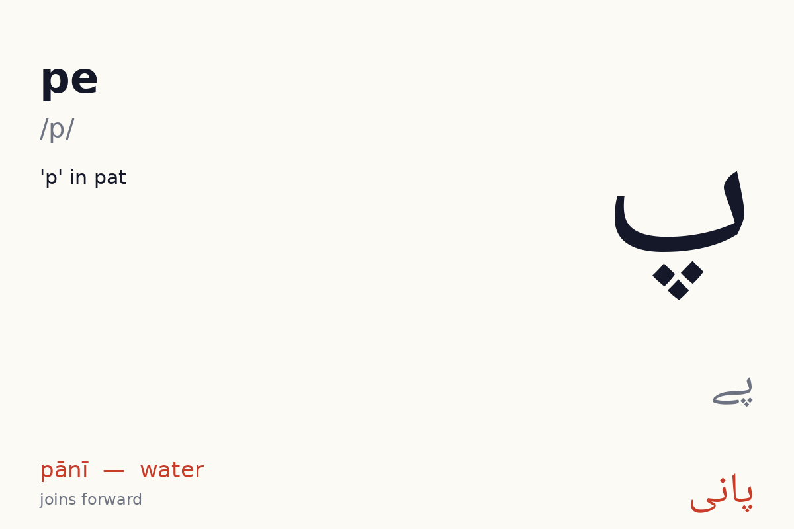
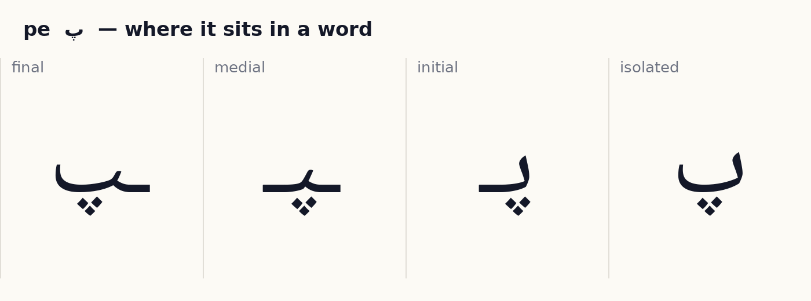
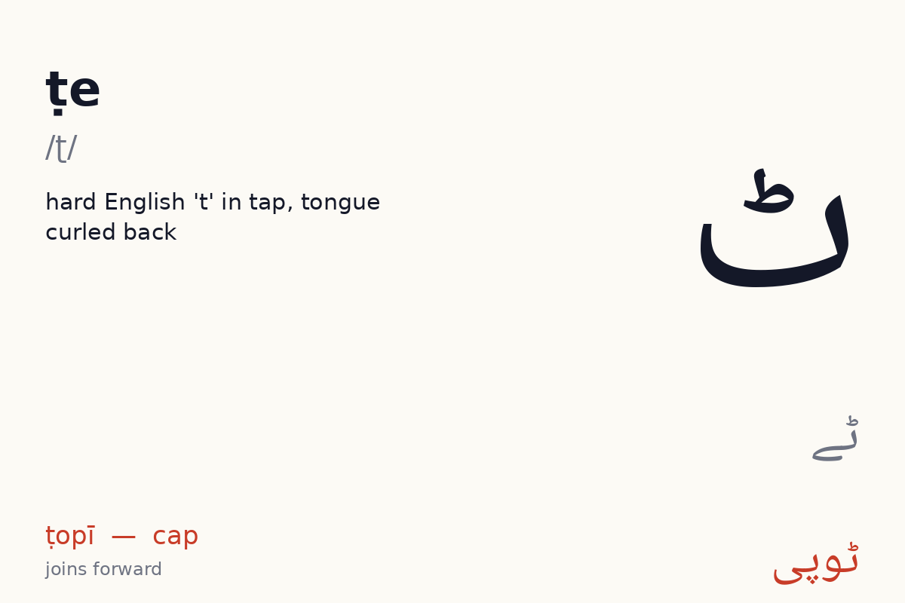
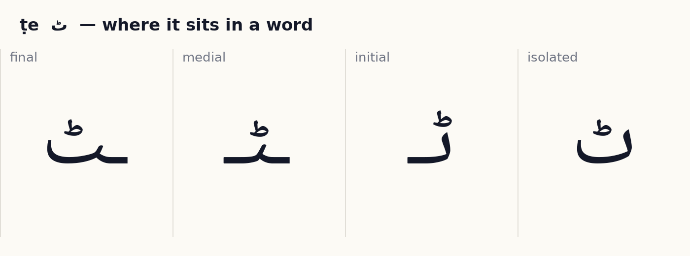
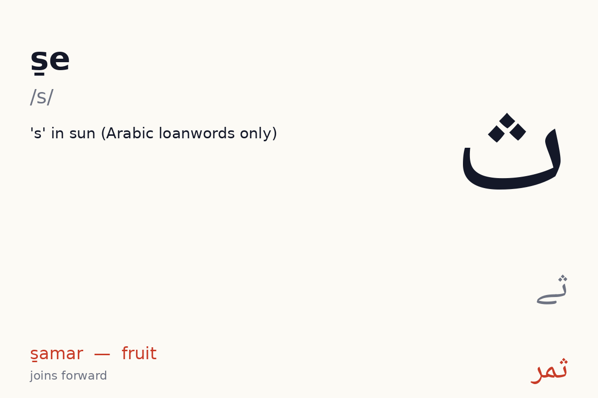
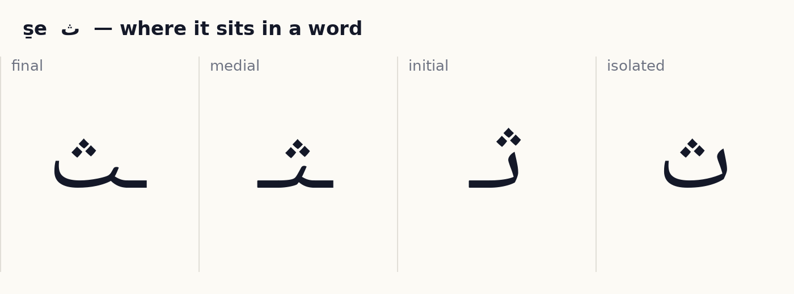

# Unit 3 — Finishing the be family  ·  بے کا خاندان

**Focus:** Three dots below (پ), the small ط-mark above (ٹ), three dots above (ث). Retroflex ٹ vs dental ت

**On the phone, this unit is these lessons, in order:** pe پ → ṭe ٹ → s̱e ث → Join them → Blend → Words 1 → Words 2 → Words 3 → Words 4 → Read → Unit check. Children rotate through them one at a time; the Unit check (8 of 10) unlocks the next unit.

## 1 · Hear it

| Letter | Name | Sound | Say it like… | Audio |
|---|---|---|---|---|
| پ | pe (پے) | /p/ | 'p' in pat | `assets/audio/names/pe.mp3` · `assets/audio/words/pe.mp3` (پانی pānī — water) |
| ٹ | ṭe (ٹے) | /ʈ/ | hard English 't' in tap, tongue curled back | `assets/audio/names/tte.mp3` · `assets/audio/words/tte.mp3` (ٹوپی ṭopī — cap) |
| ث | s̱e (ثے) | /s/ | 's' in sun (Arabic loanwords only) | `assets/audio/names/se.mp3` · `assets/audio/words/se.mp3` (ثمر s̱amar — fruit) |

## 2 · See it

**پ pe** — joins forward (4 forms).

✎ *How the pen moves:* start top-right, draw the shallow bowl leftwards, hook up at the left end; dots after. (Right to left; dots and marks last, after the whole word. These are the conventional Naskh/Nastaliq stroke orders as taught in Pakistani qaida classes; no published study was found, see research/05_open_assets.md.)

**ٹ ṭe** — joins forward (4 forms).

✎ *How the pen moves:* start top-right, draw the shallow bowl leftwards, hook up at the left end; dots after. (Right to left; dots and marks last, after the whole word. These are the conventional Naskh/Nastaliq stroke orders as taught in Pakistani qaida classes; no published study was found, see research/05_open_assets.md.)

**ث s̱e** — joins forward (4 forms).

✎ *How the pen moves:* start top-right, draw the shallow bowl leftwards, hook up at the left end; dots after. (Right to left; dots and marks last, after the whole word. These are the conventional Naskh/Nastaliq stroke orders as taught in Pakistani qaida classes; no published study was found, see research/05_open_assets.md.)

## 3 · Tell it apart  ·  *recognition · self-check with audio*

- پ vs ب ت ث — same body, different dots or marks. Drill: play `names/` audio for each, learner points at the right one. 10 rounds, shuffled.
- ٹ vs ت ب — same body, different dots or marks. Drill: play `names/` audio for each, learner points at the right one. 10 rounds, shuffled.

## 4 · Join it  ·  *production · self-check against the answer shown*

Build each word from letter tiles, right to left. Watch which letters change shape and which refuse to join.

- ا + پ + ن + ے  →  **اَپنے**  (apne, own (plural))
- ا + پ + ن + ی  →  **اَپنی**  (apnī, own (fem))
- ا + پ + ن + ا  →  **اَپنا**  (apnā, own)

## 4b · Blend  ·  *recognition · self-check with audio*

A letter plus a vowel letter makes a sound you can say. Play a syllable, learner points to it. Vowels available so far: ا ی.

| Syllable | Audio |
|---|---|
| پا | `assets/audio/syllables/pe_a.mp3` |
| پی | `assets/audio/syllables/pe_i.mp3` |
| ٹا | `assets/audio/syllables/tte_a.mp3` |
| ٹی | `assets/audio/syllables/tte_i.mp3` |
| ثا | `assets/audio/syllables/se_a.mp3` |
| ثی | `assets/audio/syllables/se_i.mp3` |

## 5 · Read it  ·  *reading aloud · self-check with audio, or a helper listens*

Vowel marks are shown. Read aloud, then play the audio and compare.

| Word | Say | Means | Audio |
|---|---|---|---|
| اَپنے | apne | own | `assets/audio/units/u03_00.mp3` |
| اَپنی | apnī | own | `assets/audio/units/u03_01.mp3` |
| اَپنا | apnā | own | `assets/audio/units/u03_02.mp3` |
| پانی | pānī | water | `assets/audio/units/u03_03.mp3` |
| مِنَٹ | minaṭ | minute | `assets/audio/units/u03_04.mp3` |
| بیٹی | beṭī | daughter | `assets/audio/units/u03_05.mp3` |
| ثابِت | s̱ābit | proven | `assets/audio/units/u03_06.mp3` |
| بیٹے | beṭe | sons | `assets/audio/units/u03_07.mp3` |
| پاک | pāk | pure | `assets/audio/units/u03_08.mp3` |
| باپ | bāp | father | `assets/audio/units/u03_09.mp3` |
| کاپی | kāpī | notebook | `assets/audio/units/u03_10.mp3` |
| مِثال | mis̱āl | example | `assets/audio/units/u03_11.mp3` |
| بیٹا | beṭā | son | `assets/audio/units/u03_12.mp3` |
| ٹِکَٹ | ṭikaṭ | ticket | `assets/audio/units/u03_13.mp3` |
| پُل | pul | bridge | `assets/audio/units/u03_14.mp3` |
| پَکّا | pakkā | ripe, firm | `assets/audio/units/u03_15.mp3` |
| کَپ | kap | cup | `assets/audio/units/u03_16.mp3` |
| پیٹ | peṭ | stomach | `assets/audio/units/u03_17.mp3` |
| پَتْلی | patlī | thin | `assets/audio/units/u03_18.mp3` |
| پیلا | pīlā | yellow | `assets/audio/units/u03_19.mp3` |
| کَپْتان | kaptān | captain | `assets/audio/units/u03_20.mp3` |
| مِٹّی | miṭṭī | soil, clay | `assets/audio/units/u03_21.mp3` |
| بَٹَن | baṭan | button | `assets/audio/units/u03_22.mp3` |
| پینا | pīnā | to drink | `assets/audio/units/u03_23.mp3` |
| پلیٹ | pleṭ | plate | `assets/audio/units/u03_24.mp3` |
| پَٹّی | paṭṭī | bandage, strip | `assets/audio/units/u03_25.mp3` |
| پَتّی | pattī | leaf, petal | `assets/audio/units/u03_26.mp3` |
| ناٹَک | nāṭak | play, drama | `assets/audio/units/u03_27.mp3` |
| اینٹ | īnṭ | brick | `assets/audio/units/u03_28.mp3` |
| پَکّی | pakkī | ripe, firm | `assets/audio/units/u03_29.mp3` |
| کانْٹے | kānṭe | thorns | `assets/audio/units/u03_30.mp3` |
| پیتَل | pītal | brass | `assets/audio/units/u03_31.mp3` |
| مالْٹا | mālṭā | orange | `assets/audio/units/u03_32.mp3` |
| ناپاک | nāpāk | impure | `assets/audio/units/u03_33.mp3` |
| پانا | pānā | to get, find | `assets/audio/units/u03_34.mp3` |
| پالَک | pālak | spinach | `assets/audio/units/u03_35.mp3` |
| کاٹْنا | kāṭnā | to cut | `assets/audio/units/u03_36.mp3` |
| لالْٹین | lālṭen | lantern | `assets/audio/units/u03_37.mp3` |
| پالْنا | pālnā | to raise | `assets/audio/units/u03_38.mp3` |
| پَتْلا | patlā | thin | `assets/audio/units/u03_39.mp3` |
| پیپَل | pīpal | fig tree | `assets/audio/units/u03_40.mp3` |
| پَلَک | palak | eyelash | `assets/audio/units/u03_41.mp3` |

**Sentences**

- پانی پینا  —  *pānī pīnā*  —  drink water  · `assets/audio/sentences/u03_00.mp3`
- بیٹی کا پیلا کَپ  —  *beṭī kā pīlā kap*  —  the daughter's yellow cup  · `assets/audio/sentences/u03_01.mp3`
- باپ کا نَیا کَمْبَل  —  *bāp kā nayā kambal*  —  father's new blanket  · `assets/audio/sentences/u03_02.mp3`
- اَپنا کَپ لے  —  *apnā kap le*  —  take your own cup  · `assets/audio/sentences/u03_03.mp3`
- اَپنی کاپی لینا  —  *apnī kāpī lenā*  —  take your own notebook  · `assets/audio/sentences/u03_04.mp3`
- پلیٹ لانا  —  *pleṭ lānā*  —  bring a plate  · `assets/audio/sentences/u03_05.mp3`
- بیٹے کا ٹِکَٹ  —  *beṭe kā ṭikaṭ*  —  the son's ticket  · `assets/audio/sentences/u03_06.mp3`
- مِٹّی کا کَپ  —  *miṭṭī kā kap*  —  a clay cup  · `assets/audio/sentences/u03_07.mp3`
- کَپْتان کا نام بَتانا  —  *kaptān kā nām batānā*  —  tell me the captain's name  · `assets/audio/sentences/u03_08.mp3`
- اِتنا پانی مَت پینا  —  *itnā pānī mat pīnā*  —  don't drink so much water  · `assets/audio/sentences/u03_09.mp3`
- پَتْلی پَتّی  —  *patlī pattī*  —  a thin leaf  · `assets/audio/sentences/u03_10.mp3`
- پانی کا کَپ  —  *pānī kā kap*  —  a cup of water  · `assets/audio/sentences/u03_11.mp3`
- بیٹے کی پلیٹ  —  *beṭe kī pleṭ*  —  the son's plate  · `assets/audio/sentences/u03_12.mp3`

**Passage** (29 words) · `assets/audio/passages/u03.mp3`

> بیٹی نے اَپنا پیلا کَپ لِیا۔ بیٹے نے اَپنی پلیٹ لی۔ باپ نے بَتایا: اِتنا پانی مَت پینا۔ نانی کا مالْٹا پَکّا۔ بیٹا مالْٹا لانا۔ کَپْتان کا ٹِکَٹ پَکّا۔
>
> *beṭī ne apnā pīlā kap liyā. beṭe ne apnī pleṭ lī. bāp ne batāyā: itnā pānī mat pīnā. nānī kā mālṭā pakkā. beṭā mālṭā lānā. kaptān kā ṭikaṭ pakkā.*
>
> The daughter took her yellow cup. The son took his plate. Father said: don't drink so much water. Grandma's orange is ripe. Son, bring the orange. The captain's ticket is confirmed.

## 6 · Write it  ·  *production · needs a helper or the app tracer to check*

Trace each new letter in all its forms three times (children: required; adults: recommended). Use the forms card as the model. Then write these words from the list without looking: اَپنے, اَپنی, اَپنا, پانی, مِنَٹ.

Pen movement for each letter is described in step 2 above.

## 7 · Dictation  ·  *production · self-check with the key below*

Play each clip twice. Learner writes the word. Then reveal.

1. `assets/audio/units/u03_39.mp3`
2. `assets/audio/units/u03_24.mp3`
3. `assets/audio/units/u03_09.mp3`
4. `assets/audio/units/u03_40.mp3`
5. `assets/audio/units/u03_16.mp3`

Answer key

1. پَتْلا (patlā)
2. پلیٹ (pleṭ)
3. باپ (bāp)
4. پیپَل (pīpal)
5. کَپ (kap)

## 8 · Check (score 8/10 to move on)  ·  *recognition · self-check*

1. Which one says **baṭan** (button)?   (a) بَٹَن   (b) بیٹی   (c) پیلا   (d) باپ
2. Which one says **pālnā** (to raise (animals))?   (a) پالْنا   (b) ناپاک   (c) اَپنی   (d) کاپی
3. Which one says **pīnā** (to drink)?   (a) پیلا   (b) پانا   (c) اَپنی   (d) پینا
4. Which one says **kānṭe** (thorns)?   (a) بَٹَن   (b) پینا   (c) کانْٹے   (d) کاپی
5. Which one says **beṭe** (sons)?   (a) ٹِکَٹ   (b) پیپَل   (c) بیٹے   (d) پَکّا
6. Which one says **lālṭen** (lantern)?   (a) بَٹَن   (b) لالْٹین   (c) پیتَل   (d) ناپاک
7. Which one says **pītal** (brass)?   (a) پیتَل   (b) بیٹا   (c) بَٹَن   (d) پَتْلا
8. Which one says **pakkī** (ripe, firm (fem))?   (a) پَکّی   (b) بیٹی   (c) پینا   (d) پُل
9. Which one says **pīpal** (fig tree)?   (a) پَتْلا   (b) اَپنے   (c) کانْٹے   (d) پیپَل
10. Which one says **nāpāk** (impure)?   (a) بیٹے   (b) بیٹا   (c) ناپاک   (d) پلیٹ

Answer key

1. بَٹَن
2. پالْنا
3. پینا
4. کانْٹے
5. بیٹے
6. لالْٹین
7. پیتَل
8. پَکّی
9. پیپَل
10. ناپاک

