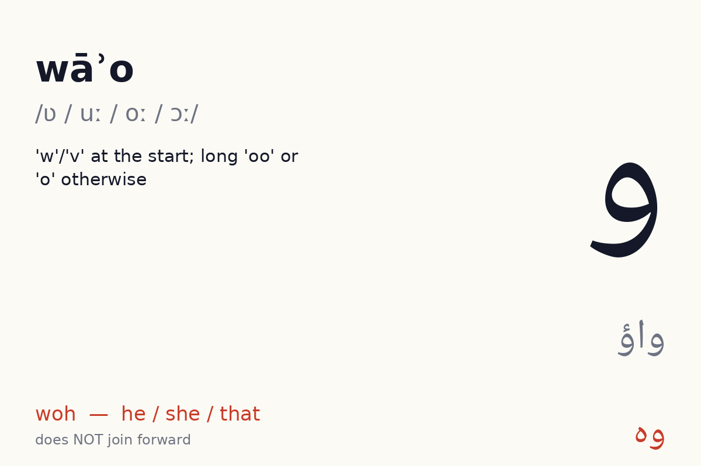
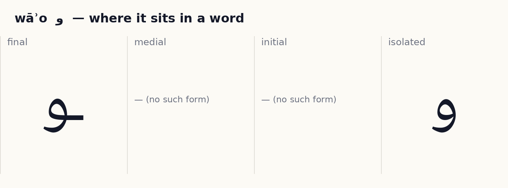
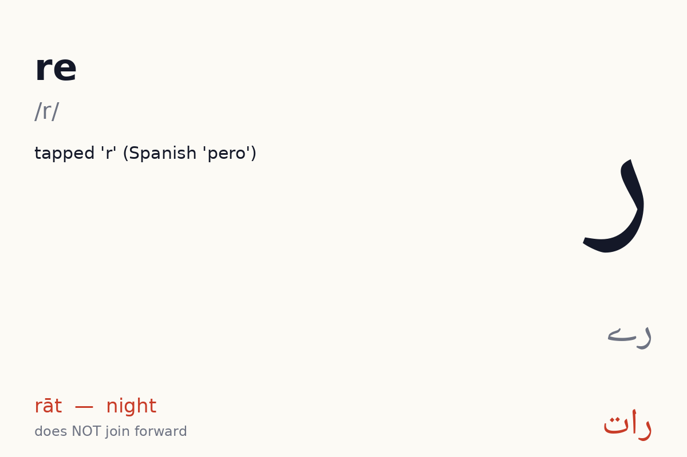
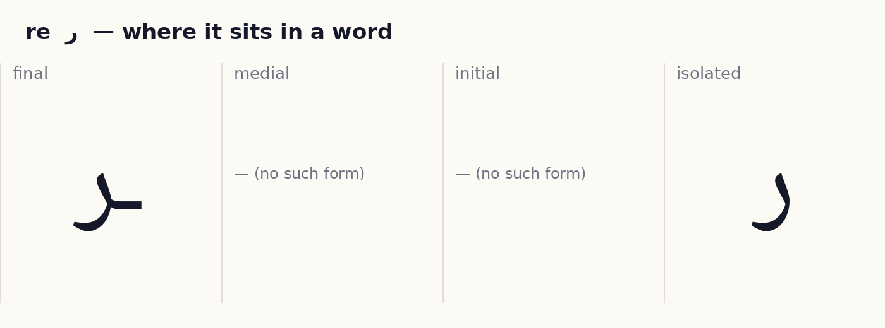
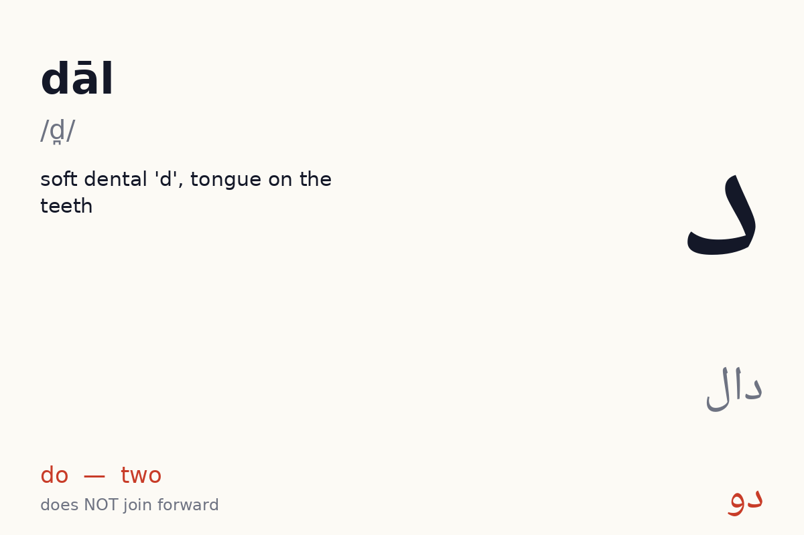
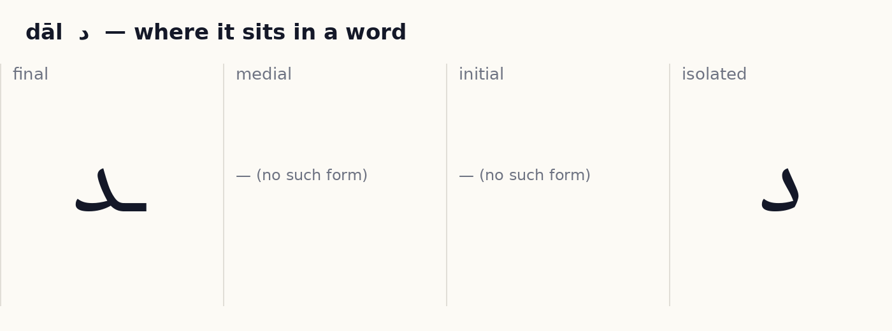
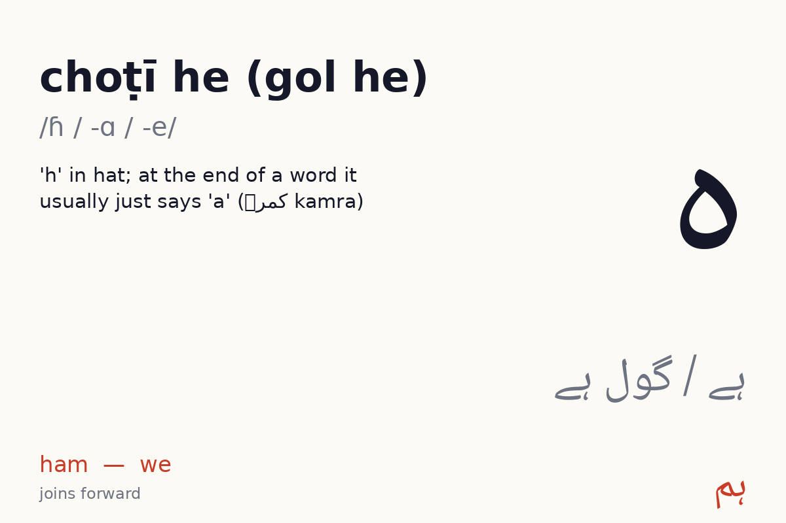
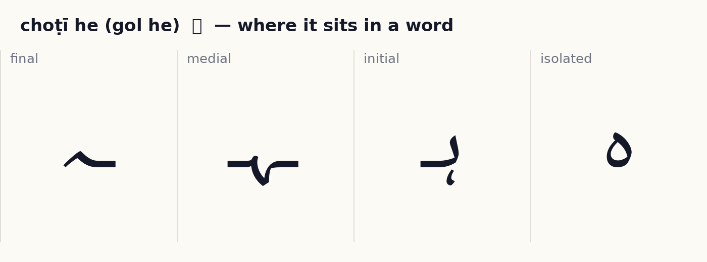

# Unit 4 — The non-joiners  ·  نہ ملنے والے حرف

**Focus:** و ر د never join forward; و as w/ū/o/au; ہ as h and as the final -a sound; the full non-joiner list ا د ڈ ذ ر ڑ ز ژ و ے

**On the phone, this unit is these lessons, in order:** wāʾo و → re ر → dāl د → choṭī he (gol he) ہ → Join them → Blend → Words 1 → Words 2 → The non-joiners → Read → Unit check. Children rotate through them one at a time; the Unit check (8 of 10) unlocks the next unit.

## 1 · Hear it

| Letter | Name | Sound | Say it like… | Audio |
|---|---|---|---|---|
| و | wāʾo (واؤ) | /ʋ / uː / oː / ɔː/ | 'w'/'v' at the start; long 'oo' or 'o' otherwise | `assets/audio/names/wao.mp3` · `assets/audio/words/wao.mp3` (وہ woh — he / she / that) |
| ر | re (رے) | /r/ | tapped 'r' (Spanish 'pero') | `assets/audio/names/re.mp3` · `assets/audio/words/re.mp3` (رات rāt — night) |
| د | dāl (دال) | /d̪/ | soft dental 'd', tongue on the teeth | `assets/audio/names/dal.mp3` · `assets/audio/words/dal.mp3` (دو do — two) |
| ہ | choṭī he (gol he) (ہے / گول ہے) | /ɦ / -ɑ / -e/ | 'h' in hat; at the end of a word it usually just says 'a' (کمرہ kamra) | `assets/audio/names/he.mp3` · `assets/audio/words/he.mp3` (ہم ham — we) |

## 2 · See it

**و wāʾo** — does **not** join forward (2 forms: isolated, final).

✎ *How the pen moves:* small loop, then a short tail down-left; never joins forward. (Right to left; dots and marks last, after the whole word. These are the conventional Naskh/Nastaliq stroke orders as taught in Pakistani qaida classes; no published study was found, see research/05_open_assets.md.)

**ر re** — does **not** join forward (2 forms: isolated, final).

✎ *How the pen moves:* start at the top and sweep down-left below the line; ز ژ dots after; never joins forward. (Right to left; dots and marks last, after the whole word. These are the conventional Naskh/Nastaliq stroke orders as taught in Pakistani qaida classes; no published study was found, see research/05_open_assets.md.)

**د dāl** — does **not** join forward (2 forms: isolated, final).

✎ *How the pen moves:* start at the top, come down and out to the left in one angled stroke; never joins forward. (Right to left; dots and marks last, after the whole word. These are the conventional Naskh/Nastaliq stroke orders as taught in Pakistani qaida classes; no published study was found, see research/05_open_assets.md.)

**ہ choṭī he (gol he)** — joins forward (4 forms).

✎ *How the pen moves:* ہ is a small loop with a short tail; ھ is two connected bowls open at the top. (Right to left; dots and marks last, after the whole word. These are the conventional Naskh/Nastaliq stroke orders as taught in Pakistani qaida classes; no published study was found, see research/05_open_assets.md.)

## 3 · Tell it apart  ·  *recognition · self-check with audio*

- ر vs د — same body, different dots or marks. Drill: play `names/` audio for each, learner points at the right one. 10 rounds, shuffled.

## 4 · Join it  ·  *production · self-check against the answer shown*

Build each word from letter tiles, right to left. Watch which letters change shape and which refuse to join.

- د + ا + ل  →  **دال**  (dāl, lentils)
- ر + ا + ت  →  **رات**  (rāt, night)
- ر + و + ٹ + ی  →  **روٹی**  (roṭī, bread)

## 4b · Blend  ·  *recognition · self-check with audio*

A letter plus a vowel letter makes a sound you can say. Play a syllable, learner points to it. Vowels available so far: ا ی و.

| Syllable | Audio |
|---|---|
| را | `assets/audio/syllables/re_a.mp3` |
| ری | `assets/audio/syllables/re_i.mp3` |
| رو | `assets/audio/syllables/re_u.mp3` |
| دا | `assets/audio/syllables/dal_a.mp3` |
| دی | `assets/audio/syllables/dal_i.mp3` |
| دو | `assets/audio/syllables/dal_u.mp3` |
| ہا | `assets/audio/syllables/he_a.mp3` |
| ہی | `assets/audio/syllables/he_i.mp3` |
| ہو | `assets/audio/syllables/he_u.mp3` |

## 5 · Read it  ·  *reading aloud · self-check with audio, or a helper listens*

Vowel marks are shown. Read aloud, then play the audio and compare.

| Word | Say | Means | Audio |
|---|---|---|---|
| وُہ | woh | he / she / that | `assets/audio/units/u04_00.mp3` |
| دو | do | two | `assets/audio/units/u04_01.mp3` |
| دِن | din | day | `assets/audio/units/u04_02.mp3` |
| دال | dāl | lentils | `assets/audio/units/u04_03.mp3` |
| دَم | dam | breath | `assets/audio/units/u04_04.mp3` |
| رات | rāt | night | `assets/audio/units/u04_05.mp3` |
| روٹی | roṭī | bread | `assets/audio/units/u04_06.mp3` |
| دور | dūr | far | `assets/audio/units/u04_07.mp3` |
| ہَم | ham | we | `assets/audio/units/u04_08.mp3` |
| ہار | hār | necklace | `assets/audio/units/u04_09.mp3` |
| کَمْرہ | kamra | room | `assets/audio/units/u04_10.mp3` |
| بادام | bādām | almond | `assets/audio/units/u04_11.mp3` |
| دادا | dādā | grandfather | `assets/audio/units/u04_12.mp3` |
| دَرْیا | daryā | river | `assets/audio/units/u04_13.mp3` |
| ہَوا | hawā | wind | `assets/audio/units/u04_14.mp3` |
| راہ | rāh | path | `assets/audio/units/u04_15.mp3` |
| دودھ | dūdh | milk *(peek ahead: has a letter from a later unit)* | `assets/audio/units/u04_16.mp3` |
| مور | mor | peacock | `assets/audio/units/u04_17.mp3` |
| پَودا | paudā | plant | `assets/audio/units/u04_18.mp3` |
| نَہَر | nahar | canal | `assets/audio/units/u04_19.mp3` |

**Sentences**

- دو روٹی  —  *do roṭī*  —  two breads  · `assets/audio/sentences/u04_00.mp3`
- وُہ کَمْرہ بَڑا ہَے  —  *woh kamra baṛā hai*  —  (preview) that room is big  · `assets/audio/sentences/u04_01.mp3`
- ہَم دور ہَیں  —  *ham dūr haiṉ*  —  we are far  · `assets/audio/sentences/u04_02.mp3`

## 6 · Write it  ·  *production · needs a helper or the app tracer to check*

Trace each new letter in all its forms three times (children: required; adults: recommended). Use the forms card as the model. Then write these words from the list without looking: وُہ, دو, دِن, دال, دَم.

Pen movement for each letter is described in step 2 above.

## 7 · Dictation  ·  *production · self-check with the key below*

Play each clip twice. Learner writes the word. Then reveal.

1. `assets/audio/units/u04_04.mp3`
2. `assets/audio/units/u04_15.mp3`
3. `assets/audio/units/u04_11.mp3`
4. `assets/audio/units/u04_19.mp3`
5. `assets/audio/units/u04_08.mp3`

Answer key

1. دَم (dam)
2. راہ (rāh)
3. بادام (bādām)
4. نَہَر (nahar)
5. ہَم (ham)

## 8 · Check (score 8/10 to move on)  ·  *recognition · self-check*

1. Which one says **paudā** (plant)?   (a) پَودا   (b) دَرْیا   (c) روٹی   (d) مور
2. Which one says **dam** (breath)?   (a) بادام   (b) ہار   (c) دَم   (d) ہَوا
3. Which one says **woh** (he / she / that)?   (a) ہَوا   (b) رات   (c) پَودا   (d) وُہ
4. Which one says **mor** (peacock)?   (a) مور   (b) رات   (c) دَم   (d) وُہ
5. Which one says **dādā** (grandfather)?   (a) کَمْرہ   (b) مور   (c) پَودا   (d) دادا
6. Which one says **bādām** (almond)?   (a) بادام   (b) ہَم   (c) دو   (d) دال
7. Which one says **kamra** (room)?   (a) راہ   (b) روٹی   (c) بادام   (d) کَمْرہ
8. Which one says **do** (two)?   (a) پَودا   (b) ہار   (c) ہَم   (d) دو
9. Which one says **ham** (we)?   (a) ہَوا   (b) دَرْیا   (c) دال   (d) ہَم
10. Which one says **din** (day)?   (a) رات   (b) دَم   (c) کَمْرہ   (d) دِن

Answer key

1. پَودا
2. دَم
3. وُہ
4. مور
5. دادا
6. بادام
7. کَمْرہ
8. دو
9. ہَم
10. دِن

## Guess before you look
Cover the forms cards. For each of و ر د ہ, write the word **دور** *dūr* and **ہار** *hār* from tiles first. Which letters made the next letter start fresh? Now check the cards: the rule is that ا د ڈ ذ ر ڑ ز ژ و ے never join forward. You have just discovered it rather than been told it.
