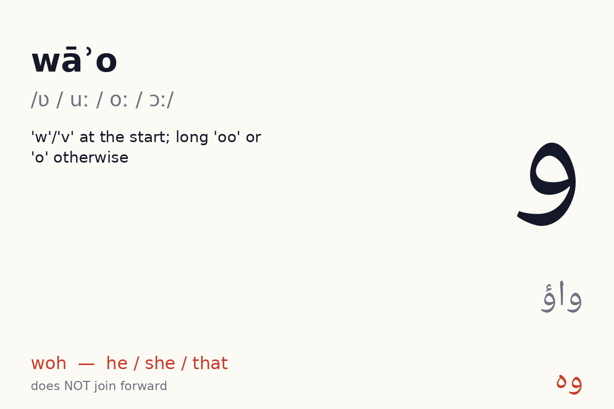
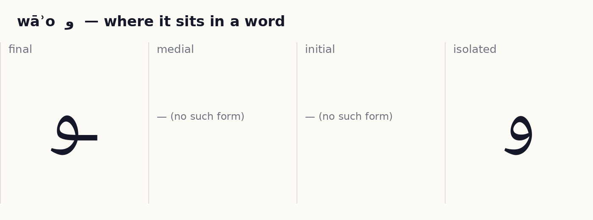
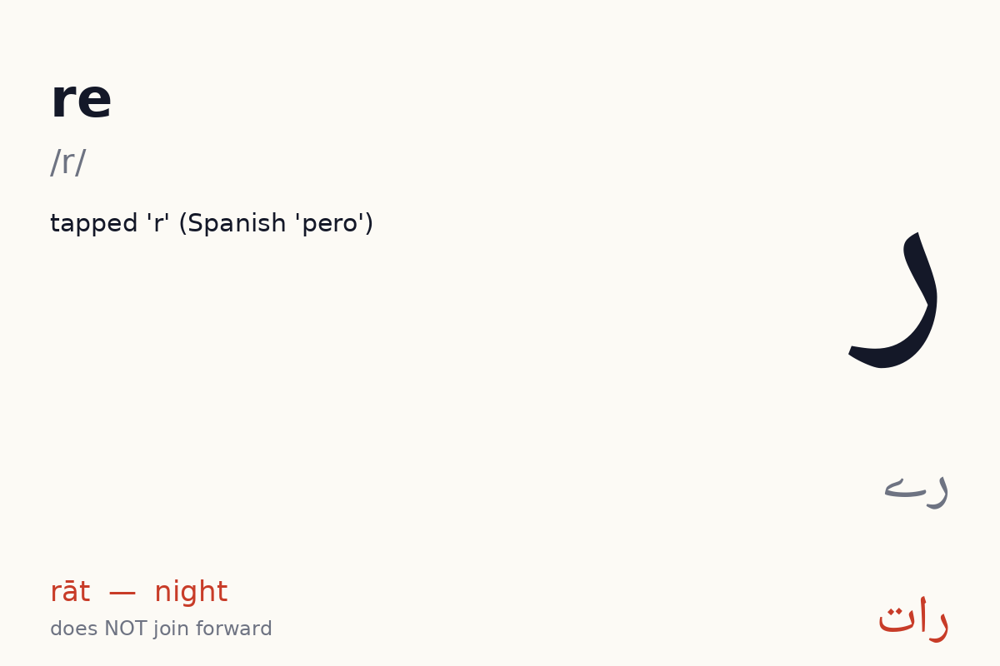
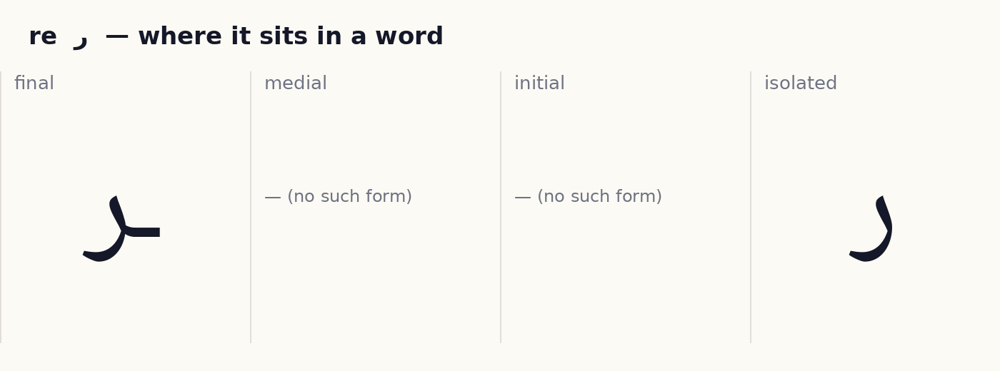
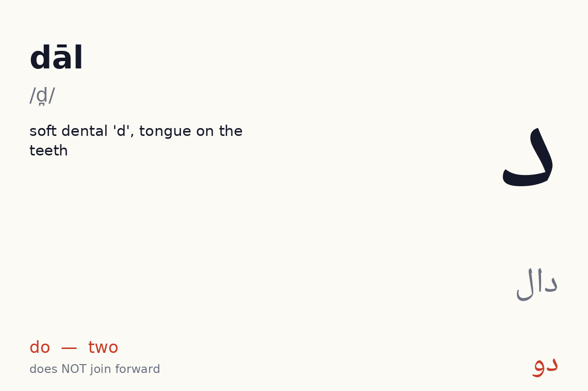
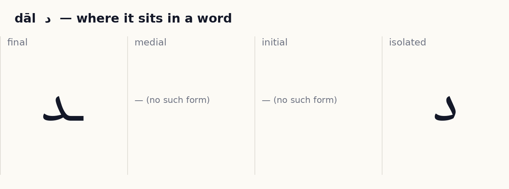
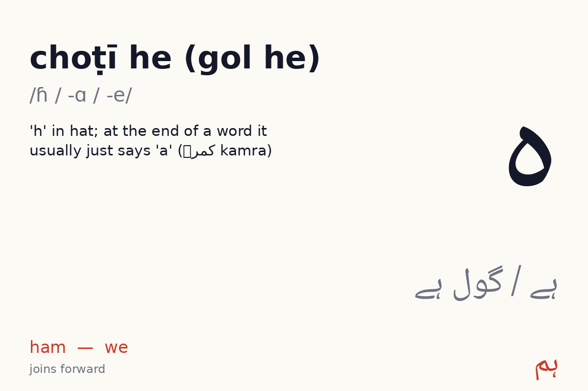
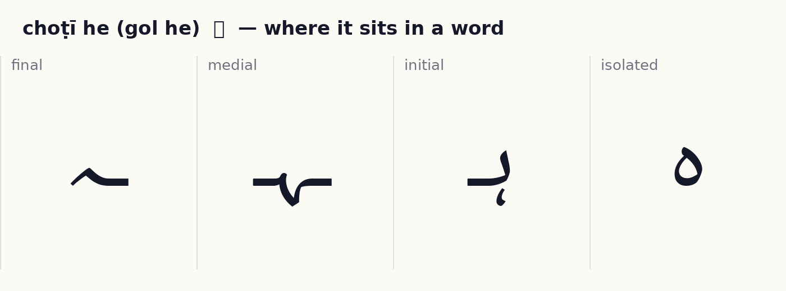

# Unit 4 — The non-joiners  ·  نہ ملنے والے حرف

**Focus:** و ر د never join forward; و as w/ū/o/au; ہ as h and as the final -a sound; the full non-joiner list ا د ڈ ذ ر ڑ ز ژ و ے

**On the phone, this unit is these lessons, in order:** wāʾo و → re ر → dāl د → choṭī he (gol he) ہ → Join them → Blend → Words 1 → Words 2 → Words 3 → Words 4 → Words 5 → Words 6 → Words 7 → Words 8 → Words 9 → Words 10 → Words 11 → Words 12 → The non-joiners → Read → Unit check. Children rotate through them one at a time; the Unit check (8 of 10) unlocks the next unit.

## 1 · Hear it

| Letter | Name | Sound | Say it like… | Audio |
|---|---|---|---|---|
| و | wāʾo (واؤ) | /ʋ / uː / oː / ɔː/ | 'w'/'v' at the start; long 'oo' or 'o' otherwise | `assets/audio/names/wao.mp3` · `assets/audio/words/wao.mp3` (وہ woh — he / she / that) |
| ر | re (رے) | /r/ | tapped 'r' (Spanish 'pero') | `assets/audio/names/re.mp3` · `assets/audio/words/re.mp3` (رات rāt — night) |
| د | dāl (دال) | /d̪/ | soft dental 'd', tongue on the teeth | `assets/audio/names/dal.mp3` · `assets/audio/words/dal.mp3` (دو do — two) |
| ہ | choṭī he (gol he) (ہے / گول ہے) | /ɦ / -ɑ / -e/ | 'h' in hat; at the end of a word it usually just says 'a' (کمرہ kamra) | `assets/audio/names/he.mp3` · `assets/audio/words/he.mp3` (ہم ham — we) |

## 2 · See it

**و wāʾo** — does **not** join forward (2 forms: isolated, final).

✎ *How the pen moves:* small loop, then a short tail down-left; never joins forward. (Right to left; dots and marks last, after the whole word. These are the conventional Naskh/Nastaliq stroke orders as taught in Pakistani qaida classes; no published study was found, see research/05_open_assets.md.)

**ر re** — does **not** join forward (2 forms: isolated, final).

✎ *How the pen moves:* start at the top and sweep down-left below the line; ز ژ dots after; never joins forward. (Right to left; dots and marks last, after the whole word. These are the conventional Naskh/Nastaliq stroke orders as taught in Pakistani qaida classes; no published study was found, see research/05_open_assets.md.)

**د dāl** — does **not** join forward (2 forms: isolated, final).

✎ *How the pen moves:* start at the top, come down and out to the left in one angled stroke; never joins forward. (Right to left; dots and marks last, after the whole word. These are the conventional Naskh/Nastaliq stroke orders as taught in Pakistani qaida classes; no published study was found, see research/05_open_assets.md.)

**ہ choṭī he (gol he)** — joins forward (4 forms).

✎ *How the pen moves:* ہ is a small loop with a short tail; ھ is two connected bowls open at the top. (Right to left; dots and marks last, after the whole word. These are the conventional Naskh/Nastaliq stroke orders as taught in Pakistani qaida classes; no published study was found, see research/05_open_assets.md.)

## 3 · Tell it apart  ·  *recognition · self-check with audio*

- ر vs د — same body, different dots or marks. Drill: play `names/` audio for each, learner points at the right one. 10 rounds, shuffled.

## 4 · Join it  ·  *production · self-check against the answer shown*

Build each word from letter tiles, right to left. Watch which letters change shape and which refuse to join.

- ب + ہ + ت  →  **بَہُت**  (bahut, very, much)
- ر + ہ + ا  →  **رَہا**  (rahā, was (doing))
- ک + ر + ن + ے  →  **کَرنے**  (karne, to do (oblique))

## 4b · Blend  ·  *recognition · self-check with audio*

A letter plus a vowel letter makes a sound you can say. Play a syllable, learner points to it. Vowels available so far: ا ی و.

| Syllable | Audio |
|---|---|
| را | `assets/audio/syllables/re_a.mp3` |
| ری | `assets/audio/syllables/re_i.mp3` |
| رو | `assets/audio/syllables/re_u.mp3` |
| دا | `assets/audio/syllables/dal_a.mp3` |
| دی | `assets/audio/syllables/dal_i.mp3` |
| دو | `assets/audio/syllables/dal_u.mp3` |
| ہا | `assets/audio/syllables/he_a.mp3` |
| ہی | `assets/audio/syllables/he_i.mp3` |
| ہو | `assets/audio/syllables/he_u.mp3` |

## 5 · Read it  ·  *reading aloud · self-check with audio, or a helper listens*

Vowel marks are shown. Read aloud, then play the audio and compare.

| Word | Say | Means | Audio |
|---|---|---|---|
| وُہ | woh | he / she / that | `assets/audio/units/u04_00.mp3` |
| ہو | ho | be, are | `assets/audio/units/u04_01.mp3` |
| کَر | kar | do; having done | `assets/audio/units/u04_02.mp3` |
| بَہُت | bahut | very, much | `assets/audio/units/u04_03.mp3` |
| رَہا | rahā | was | `assets/audio/units/u04_04.mp3` |
| کَرنے | karne | to do | `assets/audio/units/u04_05.mp3` |
| تو | to | then, as for | `assets/audio/units/u04_06.mp3` |
| ہی | hī | only, just | `assets/audio/units/u04_07.mp3` |
| مِیری | merī | my | `assets/audio/units/u04_08.mp3` |
| مِیرے | mere | my | `assets/audio/units/u04_09.mp3` |
| ہَم | ham | we | `assets/audio/units/u04_10.mp3` |
| دِیا | diyā | gave | `assets/audio/units/u04_11.mp3` |
| رَہے | rahe | were | `assets/audio/units/u04_12.mp3` |
| رَہی | rahī | was | `assets/audio/units/u04_13.mp3` |
| ہَوا | hawā | wind | `assets/audio/units/u04_14.mp3` |
| نَہ | na | not, no | `assets/audio/units/u04_15.mp3` |
| کَرنا | karnā | to do | `assets/audio/units/u04_16.mp3` |
| دو | do | two | `assets/audio/units/u04_17.mp3` |
| کَرتے | karte | do | `assets/audio/units/u04_18.mp3` |
| پَہلے | pahle | before, first | `assets/audio/units/u04_19.mp3` |
| مِیرا | merā | my | `assets/audio/units/u04_20.mp3` |
| کَرتا | kartā | does | `assets/audio/units/u04_21.mp3` |
| ہوتا | hotā | happens, is usually | `assets/audio/units/u04_22.mp3` |
| کَہا | kahā | said | `assets/audio/units/u04_23.mp3` |
| ہونے | hone | to be | `assets/audio/units/u04_24.mp3` |
| دی | dī | gave | `assets/audio/units/u04_25.mp3` |
| کَرو | karo | do! | `assets/audio/units/u04_26.mp3` |
| ہَر | har | every, each | `assets/audio/units/u04_27.mp3` |
| مَدَد | madad | help | `assets/audio/units/u04_28.mp3` |
| ہوتی | hotī | happens | `assets/audio/units/u04_29.mp3` |
| دِن | din | day | `assets/audio/units/u04_30.mp3` |
| پَتَہ | pata | address, clue | `assets/audio/units/u04_31.mp3` |
| دُنیا | dunyā | world | `assets/audio/units/u04_32.mp3` |
| دے | de | give | `assets/audio/units/u04_33.mp3` |
| مَریَم | maryam | Maryam | `assets/audio/units/u04_34.mp3` |
| رات | rāt | night | `assets/audio/units/u04_35.mp3` |
| دور | dūr | far | `assets/audio/units/u04_36.mp3` |
| پَہلی | pahlī | first | `assets/audio/units/u04_37.mp3` |
| ہوتے | hote | happen | `assets/audio/units/u04_38.mp3` |
| دَرْیا | daryā | river | `assets/audio/units/u04_39.mp3` |
| اَبُّو | abbū | dad | `assets/audio/units/u04_40.mp3` |
| والا | wālā | one who | `assets/audio/units/u04_41.mp3` |
| والی | wālī | one who | `assets/audio/units/u04_42.mp3` |
| کَرتی | kartī | does | `assets/audio/units/u04_43.mp3` |
| کَرے | kare | may do | `assets/audio/units/u04_44.mp3` |
| باہَر | bāhar | outside | `assets/audio/units/u04_45.mp3` |
| رَہتا | rahtā | lives | `assets/audio/units/u04_46.mp3` |
| اُردو | urdū | Urdu | `assets/audio/units/u04_47.mp3` |
| بَند | band | closed | `assets/audio/units/u04_48.mp3` |
| بار | bār | time | `assets/audio/units/u04_49.mp3` |
| تُمہارا | tumhārā | your | `assets/audio/units/u04_50.mp3` |
| بِہتَر | behtar | better | `assets/audio/units/u04_51.mp3` |
| دوبارہ | dobārah | again | `assets/audio/units/u04_52.mp3` |
| کَون | kaun | who | `assets/audio/units/u04_53.mp3` |
| پوری | pūrī | whole | `assets/audio/units/u04_54.mp3` |
| دِل | dil | heart | `assets/audio/units/u04_55.mp3` |
| کَہانی | kahānī | story | `assets/audio/units/u04_56.mp3` |
| بَہَن | bahan | sister | `assets/audio/units/u04_57.mp3` |
| تَیّار | taiyār | ready | `assets/audio/units/u04_58.mp3` |
| کَمرے | kamre | rooms | `assets/audio/units/u04_59.mp3` |
| ہونا | honā | to be, to become | `assets/audio/units/u04_60.mp3` |
| بیوی | bīwī | wife | `assets/audio/units/u04_61.mp3` |
| کَہتے | kahte | say | `assets/audio/units/u04_62.mp3` |
| کَہنا | kahnā | to say | `assets/audio/units/u04_63.mp3` |
| اُوپَر | ūpar | above, up | `assets/audio/units/u04_64.mp3` |
| رَہتے | rahte | live | `assets/audio/units/u04_65.mp3` |
| تُمہارے | tumhāre | your | `assets/audio/units/u04_66.mp3` |
| یاد | yād | memory | `assets/audio/units/u04_67.mp3` |
| ہَمارے | hamāre | our | `assets/audio/units/u04_68.mp3` |
| ہَماری | hamārī | our | `assets/audio/units/u04_69.mp3` |
| اَندَر | andar | inside | `assets/audio/units/u04_70.mp3` |
| لو | lo | take! | `assets/audio/units/u04_71.mp3` |
| پورا | pūrā | whole, complete | `assets/audio/units/u04_72.mp3` |
| بول | bol | speak | `assets/audio/units/u04_73.mp3` |
| بیمار | bīmār | ill, sick | `assets/audio/units/u04_74.mp3` |
| تُمہاری | tumhārī | your | `assets/audio/units/u04_75.mp3` |
| دینا | denā | to give | `assets/audio/units/u04_76.mp3` |
| بولتا | boltā | speaks | `assets/audio/units/u04_77.mp3` |
| دیتا | detā | gives | `assets/audio/units/u04_78.mp3` |
| ریل | rel | train, rail | `assets/audio/units/u04_79.mp3` |
| رَہتی | rahtī | lives | `assets/audio/units/u04_80.mp3` |
| دیتے | dete | give | `assets/audio/units/u04_81.mp3` |
| بَدَل | badal | change | `assets/audio/units/u04_82.mp3` |
| ہار | hār | necklace | `assets/audio/units/u04_83.mp3` |
| دادا | dādā | grandfather | `assets/audio/units/u04_84.mp3` |
| پَہلا | pahlā | first | `assets/audio/units/u04_85.mp3` |
| رَہو | raho | stay! | `assets/audio/units/u04_86.mp3` |
| مُبارَک | mubārak | blessed, congratulations | `assets/audio/units/u04_87.mp3` |
| ہَمارا | hamārā | our | `assets/audio/units/u04_88.mp3` |
| نَو | nau | nine | `assets/audio/units/u04_89.mp3` |
| دَرْد | dard | pain | `assets/audio/units/u04_90.mp3` |
| روٹی | roṭī | bread | `assets/audio/units/u04_91.mp3` |
| بادَل | bādal | cloud | `assets/audio/units/u04_92.mp3` |
| بارہ | bārah | twelve | `assets/audio/units/u04_93.mp3` |
| مَرْد | mard | man | `assets/audio/units/u04_94.mp3` |
| دیتی | detī | gives | `assets/audio/units/u04_95.mp3` |
| پُرانی | purānī | old | `assets/audio/units/u04_96.mp3` |
| مَہینے | mahīne | months | `assets/audio/units/u04_97.mp3` |
| ٹوپی | ṭopī | cap | `assets/audio/units/u04_98.mp3` |
| کَمْرہ | kamra | room | `assets/audio/units/u04_99.mp3` |
| نیند | nīnd | sleep | `assets/audio/units/u04_100.mp3` |
| رَہنا | rahnā | to live, stay | `assets/audio/units/u04_101.mp3` |
| دُکان | dukān | shop | `assets/audio/units/u04_102.mp3` |
| کَہتا | kahtā | says | `assets/audio/units/u04_103.mp3` |
| بُرا | burā | bad | `assets/audio/units/u04_104.mp3` |
| دانْت | dānt | tooth | `assets/audio/units/u04_105.mp3` |
| دَم | dam | breath | `assets/audio/units/u04_106.mp3` |
| راہ | rāh | path | `assets/audio/units/u04_107.mp3` |
| موٹا | moṭā | fat, thick | `assets/audio/units/u04_108.mp3` |
| بَدَن | badan | body | `assets/audio/units/u04_109.mp3` |
| دادی | dādī | paternal grandmother | `assets/audio/units/u04_110.mp3` |
| دَہی | dahī | yoghurt | `assets/audio/units/u04_111.mp3` |
| ہَرا | harā | green | `assets/audio/units/u04_112.mp3` |
| پَنیر | panīr | cheese | `assets/audio/units/u04_113.mp3` |
| دال | dāl | lentils | `assets/audio/units/u04_114.mp3` |
| پُرانا | purānā | old | `assets/audio/units/u04_115.mp3` |
| دَوا | dawā | medicine | `assets/audio/units/u04_116.mp3` |
| نَہَر | nahar | canal | `assets/audio/units/u04_117.mp3` |
| اُونْٹ | ūnṭ | camel | `assets/audio/units/u04_118.mp3` |
| ہادی | hādī | Hadi | `assets/audio/units/u04_119.mp3` |
| مَہینَہ | mahīna | month | `assets/audio/units/u04_120.mp3` |
| کَہتی | kahtī | says | `assets/audio/units/u04_121.mp3` |
| بَندَر | bandar | monkey | `assets/audio/units/u04_122.mp3` |
| مور | mor | peacock | `assets/audio/units/u04_123.mp3` |
| ہَرَن | haran | deer | `assets/audio/units/u04_124.mp3` |
| اَنار | anār | pomegranate | `assets/audio/units/u04_125.mp3` |
| بَکری | bakrī | goat | `assets/audio/units/u04_126.mp3` |
| تارا | tārā | star | `assets/audio/units/u04_127.mp3` |
| پَودا | paudā | plant | `assets/audio/units/u04_128.mp3` |
| تَکِیَہ | takiya | pillow | `assets/audio/units/u04_129.mp3` |
| ٹَماٹَر | ṭamāṭar | tomato | `assets/audio/units/u04_130.mp3` |
| رونا | ronā | to cry | `assets/audio/units/u04_131.mp3` |
| نادِیَہ | nādiya | Nadia | `assets/audio/units/u04_132.mp3` |
| پِیالَہ | piyāla | cup, bowl | `assets/audio/units/u04_133.mp3` |
| دانِیال | dāniyāl | Daniyal | `assets/audio/units/u04_134.mp3` |
| بادام | bādām | almond | `assets/audio/units/u04_135.mp3` |
| بَدَلنا | badalnā | to change | `assets/audio/units/u04_136.mp3` |
| بولنا | bolnā | to speak | `assets/audio/units/u04_137.mp3` |
| کَبُوتَر | kabūtar | pigeon | `assets/audio/units/u04_138.mp3` |
| کَوّا | kavvā | crow | `assets/audio/units/u04_139.mp3` |
| ہونْٹ | honṭ | lip | `assets/audio/units/u04_140.mp3` |

**Sentences**

- یَہ مِیرا کَمْرہ ہَے  —  *yeh merā kamra hai*  —  this is my room  · `assets/audio/sentences/u04_00.mp3`
- وُہ مِیری بَہَن ہَے  —  *woh merī bahan hai*  —  she is my sister  · `assets/audio/sentences/u04_01.mp3`
- مِیرا نام ہادی ہَے  —  *merā nām hādī hai*  —  my name is Hadi  · `assets/audio/sentences/u04_02.mp3`
- اَبُّو دُکان پَر ہَے  —  *abbū dukān par hai*  —  dad is at the shop  · `assets/audio/sentences/u04_03.mp3`
- دادی روٹی دیتی ہَے  —  *dādī roṭī detī hai*  —  grandma gives bread  · `assets/audio/sentences/u04_04.mp3`
- اَبُّو دُکان پَر بَہُت کام کَرتا ہَے  —  *abbū dukān par bahut kām kartā hai*  —  dad works a lot at the shop  · `assets/audio/sentences/u04_05.mp3`
- نادِیَہ اَپنا پَنیر دانِیال کو دیتی ہَے  —  *nādiya apnā panīr dāniyāl ko detī hai*  —  Nadia gives her cheese to Daniyal  · `assets/audio/sentences/u04_06.mp3`
- دانِیال کا تَکِیَہ نَیا ہَے  —  *dāniyāl kā takiya nayā hai*  —  Daniyal's pillow is new  · `assets/audio/sentences/u04_07.mp3`
- بَندَر دَرْیا پَر ہَے  —  *bandar daryā par hai*  —  the monkey is at the river  · `assets/audio/sentences/u04_08.mp3`
- تارا بَہُت دور ہَے  —  *tārā bahut dūr hai*  —  the star is very far  · `assets/audio/sentences/u04_09.mp3`
- دَوا اَور پانی لو  —  *dawā aur pānī lo*  —  take the medicine and water  · `assets/audio/sentences/u04_10.mp3`
- کَون ہَے؟  —  *kaun hai?*  —  who is it?  · `assets/audio/sentences/u04_11.mp3`
- مُبارَک ہو  —  *mubārak ho*  —  congratulations  · `assets/audio/sentences/u04_12.mp3`
- دادا کا کَمْرہ دور ہَے  —  *dādā kā kamra dūr hai*  —  grandfather's room is far  · `assets/audio/sentences/u04_13.mp3`
- ہادی کی بَہَن مَریَم ہَے  —  *hādī kī bahan maryam hai*  —  Hadi's sister is Maryam  · `assets/audio/sentences/u04_14.mp3`
- اَبُّو دَہی اَور پَنیر دیتا ہَے  —  *abbū dahī aur panīr detā hai*  —  dad gives yoghurt and cheese  · `assets/audio/sentences/u04_15.mp3`
- نادِیَہ کا کَمْرہ پُرانا ہَے  —  *nādiya kā kamra purānā hai*  —  Nadia's room is old  · `assets/audio/sentences/u04_16.mp3`
- مَریَم کی بَہَن نادِیَہ ہَے  —  *maryam kī bahan nādiya hai*  —  Maryam's sister is Nadia  · `assets/audio/sentences/u04_17.mp3`

**Passage** (56 words) · `assets/audio/passages/u04.mp3`

> یَہ ہادی کا کَمْرہ ہَے۔ کَمْرہ بَہُت پُرانا ہَے۔ دادی کَہتی ہَے: ہادی کا تَکِیَہ پُرانا ہَے۔ اَبُّو دُکان پَر ہَے۔ اَبُّو ہادی کو نَیا تَکِیَہ دیتا ہَے۔ اَبُّو کَہتا ہَے: ہادی، تَیّار ہو۔ ہادی کی بَہَن مَریَم ہَے۔ مَریَم کا کَمْرہ دور ہَے۔ نادِیَہ ہادی کو پَنیر دیتی ہَے۔ دانِیال ہادی کو دَہی دیتا ہَے۔
>
> *yeh hādī kā kamra hai. kamra bahut purānā hai. dādī kahtī hai: hādī kā takiya purānā hai. abbū dukān par hai. abbū hādī ko nayā takiya detā hai. abbū kahtā hai: hādī, taiyār ho. hādī kī bahan maryam hai. maryam kā kamra dūr hai. nādiya hādī ko panīr detī hai. dāniyāl hādī ko dahī detā hai.*
>
> This is Hadi's room. The room is very old. Grandma says: Hadi's pillow is old. Dad is at the shop. Dad gives Hadi a new pillow. Dad says: Hadi, be ready. Hadi's sister is Maryam. Maryam's room is far. Nadia gives Hadi cheese. Daniyal gives Hadi yoghurt.

## 6 · Write it  ·  *production · needs a helper or the app tracer to check*

Trace each new letter in all its forms three times (children: required; adults: recommended). Use the forms card as the model. Then write these words from the list without looking: وُہ, ہو, کَر, بَہُت, رَہا.

Pen movement for each letter is described in step 2 above.

## 7 · Dictation  ·  *production · self-check with the key below*

Play each clip twice. Learner writes the word. Then reveal.

1. `assets/audio/units/u04_101.mp3`
2. `assets/audio/units/u04_118.mp3`
3. `assets/audio/units/u04_102.mp3`
4. `assets/audio/units/u04_21.mp3`
5. `assets/audio/units/u04_40.mp3`

Answer key

1. رَہنا (rahnā)
2. اُونْٹ (ūnṭ)
3. دُکان (dukān)
4. کَرتا (kartā)
5. اَبُّو (abbū)

## 8 · Check (score 8/10 to move on)  ·  *recognition · self-check*

1. Which one says **kartī** (does (fem))?   (a) کَرنے   (b) دے   (c) بَہُت   (d) کَرتی
2. Which one says **dunyā** (world)?   (a) دور   (b) ہَرا   (c) تُمہارا   (d) دُنیا
3. Which one says **hī** (only, just)?   (a) دادا   (b) ہی   (c) یاد   (d) کَہتے
4. Which one says **hote** (happen (plural))?   (a) پِیالَہ   (b) موٹا   (c) ہوتے   (d) اُونْٹ
5. Which one says **hādī** (Hadi (a name))?   (a) ہَرا   (b) رونا   (c) رَہا   (d) ہادی
6. Which one says **pahlī** (first (fem))?   (a) دور   (b) بَندَر   (c) دِن   (d) پَہلی
7. Which one says **kahtī** (says (fem))?   (a) ہَر   (b) ہَوا   (c) کَہتی   (d) کَہنا
8. Which one says **nau** (nine)?   (a) دال   (b) نَو   (c) کَرنا   (d) ہی
9. Which one says **daryā** (river)?   (a) لو   (b) دَرْیا   (c) رونا   (d) دَوا
10. Which one says **honṭ** (lip)?   (a) دال   (b) تُمہارے   (c) ہونْٹ   (d) بِہتَر

Answer key

1. کَرتی
2. دُنیا
3. ہی
4. ہوتے
5. ہادی
6. پَہلی
7. کَہتی
8. نَو
9. دَرْیا
10. ہونْٹ

## Guess before you look
Cover the forms cards. For each of و ر د ہ, write the word **دور** *dūr* and **ہار** *hār* from tiles first. Which letters made the next letter start fresh? Now check the cards: the rule is that ا د ڈ ذ ر ڑ ز ژ و ے never join forward. You have just discovered it rather than been told it.
