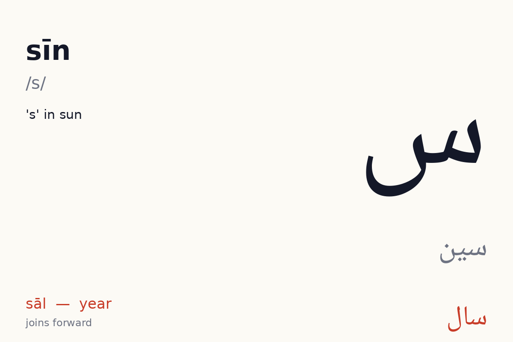
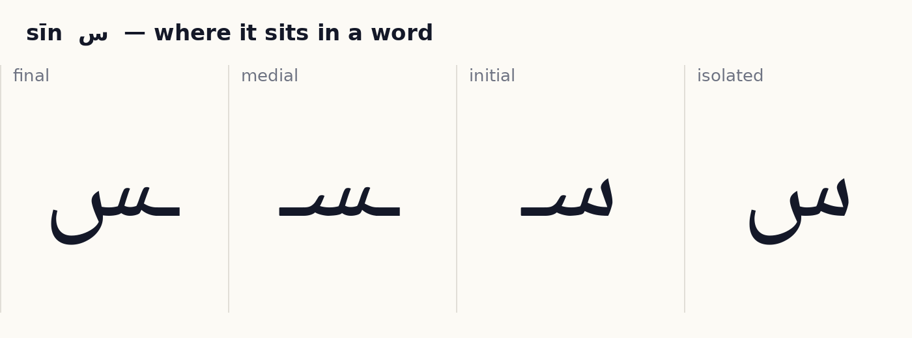
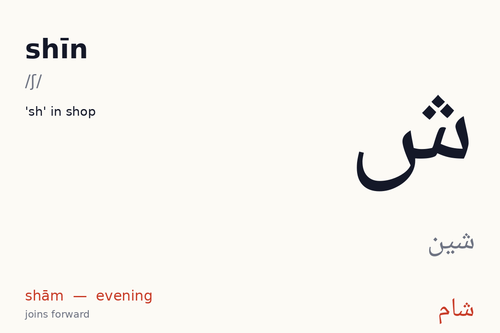
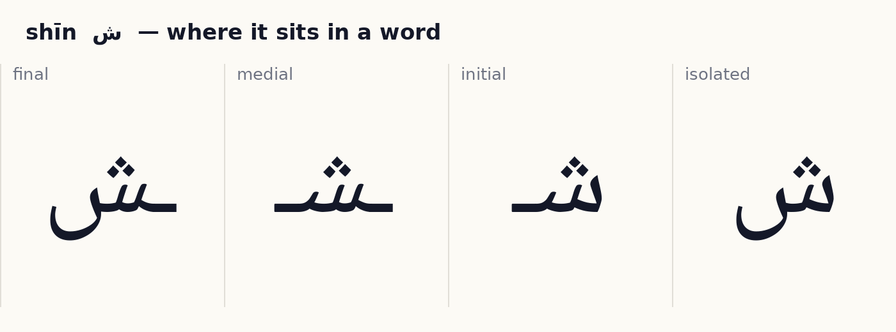
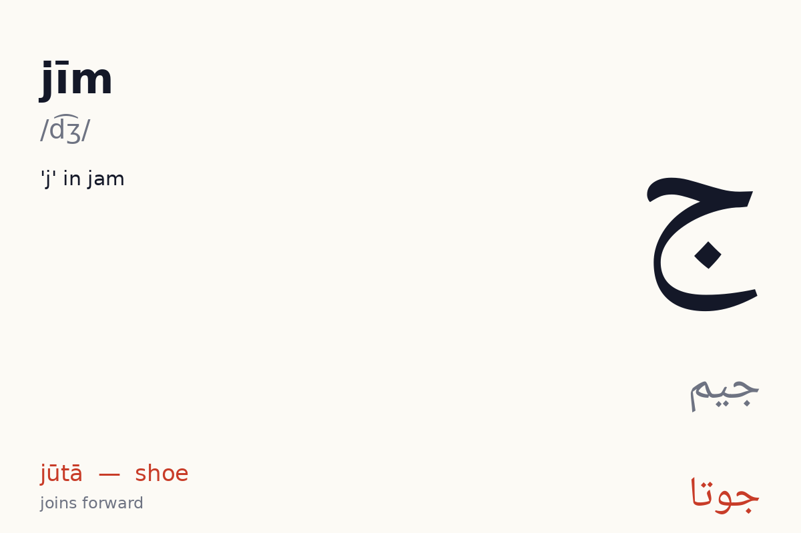
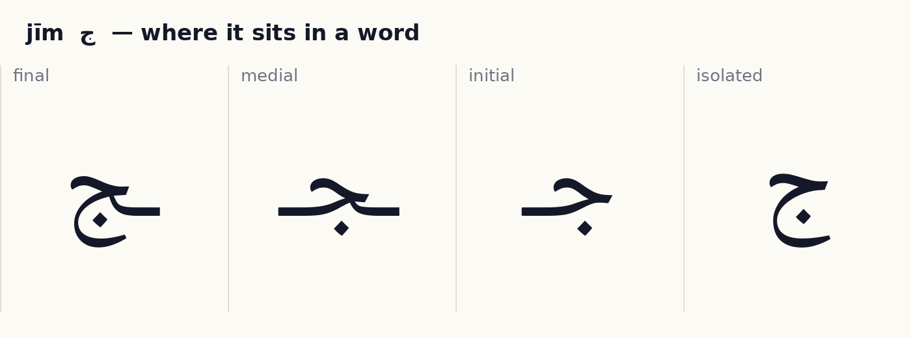
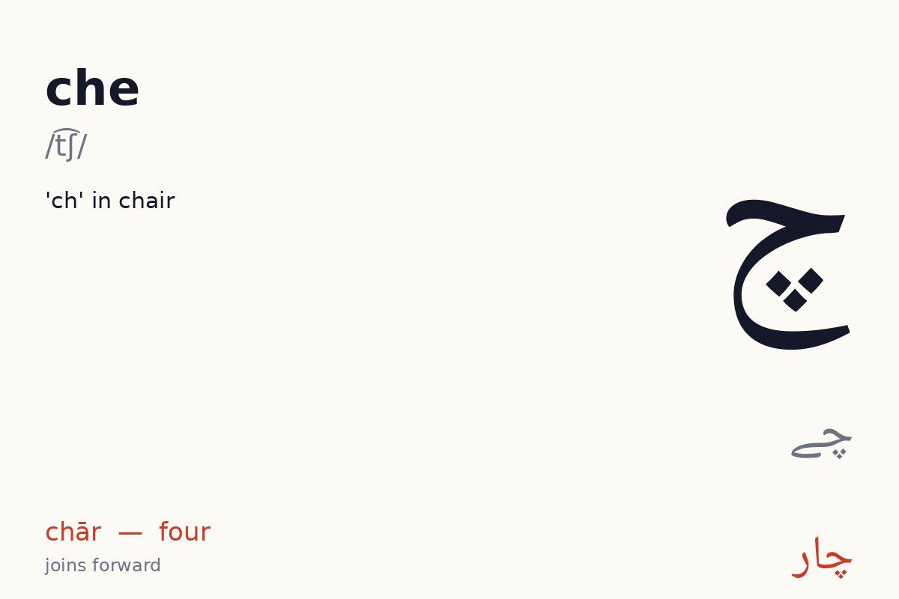
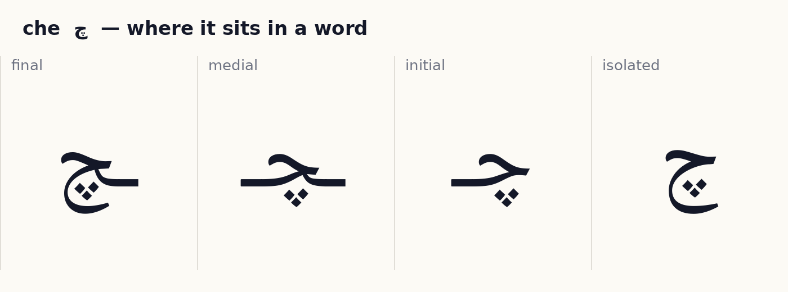
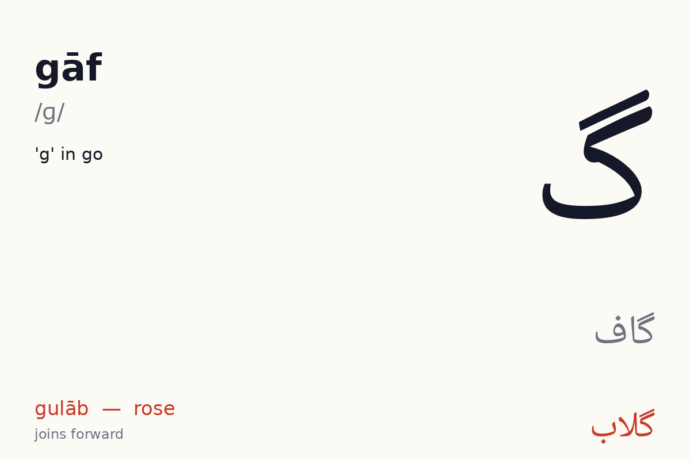
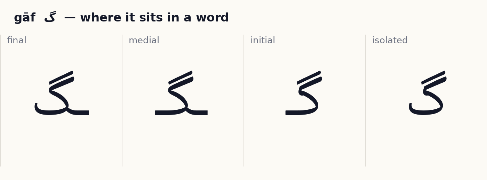

# Unit 5 — Sīn, jīm and gāf  ·  سین، جیم، گاف

**Focus:** The toothed sīn family; the bowl-shaped jīm family; گ as kāf with an extra stroke

**On the phone, this unit is these lessons, in order:** sīn س → shīn ش → jīm ج → che چ → gāf گ → Join them → Blend → Words 1 → Words 2 → Read → Unit check. Children rotate through them one at a time; the Unit check (8 of 10) unlocks the next unit.

## 1 · Hear it

| Letter | Name | Sound | Say it like… | Audio |
|---|---|---|---|---|
| س | sīn (سین) | /s/ | 's' in sun | `assets/audio/names/sin.mp3` · `assets/audio/words/sin.mp3` (سال sāl — year) |
| ش | shīn (شین) | /ʃ/ | 'sh' in shop | `assets/audio/names/shin.mp3` · `assets/audio/words/shin.mp3` (شام shām — evening) |
| ج | jīm (جیم) | /d͡ʒ/ | 'j' in jam | `assets/audio/names/jim.mp3` · `assets/audio/words/jim.mp3` (جوتا jūtā — shoe) |
| چ | che (چے) | /t͡ʃ/ | 'ch' in chair | `assets/audio/names/che.mp3` · `assets/audio/words/che.mp3` (چار chār — four) |
| گ | gāf (گاف) | /ɡ/ | 'g' in go | `assets/audio/names/gaf.mp3` · `assets/audio/words/gaf.mp3` (گلاب gulāb — rose) |

## 2 · See it

**س sīn** — joins forward (4 forms).

✎ *How the pen moves:* three small teeth from right to left, then the deep bowl; dots after. (Right to left; dots and marks last, after the whole word. These are the conventional Naskh/Nastaliq stroke orders as taught in Pakistani qaida classes; no published study was found, see research/05_open_assets.md.)

**ش shīn** — joins forward (4 forms).

✎ *How the pen moves:* three small teeth from right to left, then the deep bowl; dots after. (Right to left; dots and marks last, after the whole word. These are the conventional Naskh/Nastaliq stroke orders as taught in Pakistani qaida classes; no published study was found, see research/05_open_assets.md.)

**ج jīm** — joins forward (4 forms).

✎ *How the pen moves:* start at the top-right with the small head stroke going left, then drop into the round bowl below; dot after. (Right to left; dots and marks last, after the whole word. These are the conventional Naskh/Nastaliq stroke orders as taught in Pakistani qaida classes; no published study was found, see research/05_open_assets.md.)

**چ che** — joins forward (4 forms).

✎ *How the pen moves:* start at the top-right with the small head stroke going left, then drop into the round bowl below; dot after. (Right to left; dots and marks last, after the whole word. These are the conventional Naskh/Nastaliq stroke orders as taught in Pakistani qaida classes; no published study was found, see research/05_open_assets.md.)

**گ gāf** — joins forward (4 forms).

✎ *How the pen moves:* base stroke first, right to left along the line, then the sloping cap (sar-kash) added on top last; گ gets a second cap. (Right to left; dots and marks last, after the whole word. These are the conventional Naskh/Nastaliq stroke orders as taught in Pakistani qaida classes; no published study was found, see research/05_open_assets.md.)

## 3 · Tell it apart  ·  *recognition · self-check with audio*

- س vs ش — same body, different dots or marks. Drill: play `names/` audio for each, learner points at the right one. 10 rounds, shuffled.
- ج vs چ — same body, different dots or marks. Drill: play `names/` audio for each, learner points at the right one. 10 rounds, shuffled.
- گ vs ک — same body, different dots or marks. Drill: play `names/` audio for each, learner points at the right one. 10 rounds, shuffled.

## 4 · Join it  ·  *production · self-check against the answer shown*

Build each word from letter tiles, right to left. Watch which letters change shape and which refuse to join.

- س + ا + ل  →  **سال**  (sāl, year)
- ش + ا + م  →  **شام**  (shām, evening)
- ش + ی + ر  →  **شیر**  (sher, lion)

## 4b · Blend  ·  *recognition · self-check with audio*

A letter plus a vowel letter makes a sound you can say. Play a syllable, learner points to it. Vowels available so far: ا ی و.

| Syllable | Audio |
|---|---|
| سا | `assets/audio/syllables/sin_a.mp3` |
| سی | `assets/audio/syllables/sin_i.mp3` |
| سو | `assets/audio/syllables/sin_u.mp3` |
| شا | `assets/audio/syllables/shin_a.mp3` |
| شی | `assets/audio/syllables/shin_i.mp3` |
| شو | `assets/audio/syllables/shin_u.mp3` |
| جا | `assets/audio/syllables/jim_a.mp3` |
| جی | `assets/audio/syllables/jim_i.mp3` |
| جو | `assets/audio/syllables/jim_u.mp3` |
| چا | `assets/audio/syllables/che_a.mp3` |
| چی | `assets/audio/syllables/che_i.mp3` |
| چو | `assets/audio/syllables/che_u.mp3` |
| گا | `assets/audio/syllables/gaf_a.mp3` |
| گی | `assets/audio/syllables/gaf_i.mp3` |
| گو | `assets/audio/syllables/gaf_u.mp3` |

## 5 · Read it  ·  *reading aloud · self-check with audio, or a helper listens*

Vowel marks are shown. Read aloud, then play the audio and compare.

| Word | Say | Means | Audio |
|---|---|---|---|
| سَب | sab | all | `assets/audio/units/u05_00.mp3` |
| سو | so | hundred / sleep | `assets/audio/units/u05_01.mp3` |
| سال | sāl | year | `assets/audio/units/u05_02.mp3` |
| شام | shām | evening | `assets/audio/units/u05_03.mp3` |
| شیر | sher | lion | `assets/audio/units/u05_04.mp3` |
| جوتا | jūtā | shoe | `assets/audio/units/u05_05.mp3` |
| جام | jām | goblet | `assets/audio/units/u05_06.mp3` |
| چار | chār | four | `assets/audio/units/u05_07.mp3` |
| چاند | chānd | moon | `assets/audio/units/u05_08.mp3` |
| چابی | chābī | key | `assets/audio/units/u05_09.mp3` |
| گُلاب | gulāb | rose | `assets/audio/units/u05_10.mp3` |
| گاجَر | gājar | carrot | `assets/audio/units/u05_11.mp3` |
| گانا | gānā | song | `assets/audio/units/u05_12.mp3` |
| سَبُک | sabuk | light | `assets/audio/units/u05_13.mp3` |
| شادی | shādī | wedding | `assets/audio/units/u05_14.mp3` |
| جَنگَل | jangal | forest | `assets/audio/units/u05_15.mp3` |
| مَچھلی | machhlī | fish *(peek ahead: has a letter from a later unit)* | `assets/audio/units/u05_16.mp3` |
| گَرْم | garm | hot | `assets/audio/units/u05_17.mp3` |
| سَرْدی | sardī | cold | `assets/audio/units/u05_18.mp3` |
| دوسْت | dost | friend | `assets/audio/units/u05_19.mp3` |

**Sentences**

- چار گُلاب  —  *chār gulāb*  —  four roses  · `assets/audio/sentences/u05_00.mp3`
- شیر جَنگَل مَیں ہَے  —  *sher jangal meṉ hai*  —  the lion is in the forest  · `assets/audio/sentences/u05_01.mp3`
- دوسْت کا جوتا  —  *dost kā jūtā*  —  friend's shoe  · `assets/audio/sentences/u05_02.mp3`

## 6 · Write it  ·  *production · needs a helper or the app tracer to check*

Trace each new letter in all its forms three times (children: required; adults: recommended). Use the forms card as the model. Then write these words from the list without looking: سَب, سو, سال, شام, شیر.

Pen movement for each letter is described in step 2 above.

## 7 · Dictation  ·  *production · self-check with the key below*

Play each clip twice. Learner writes the word. Then reveal.

1. `assets/audio/units/u05_04.mp3`
2. `assets/audio/units/u05_14.mp3`
3. `assets/audio/units/u05_07.mp3`
4. `assets/audio/units/u05_03.mp3`
5. `assets/audio/units/u05_06.mp3`

Answer key

1. شیر (sher)
2. شادی (shādī)
3. چار (chār)
4. شام (shām)
5. جام (jām)

## 8 · Check (score 8/10 to move on)  ·  *recognition · self-check*

1. Which one says **jangal** (forest)?   (a) جَنگَل   (b) گاجَر   (c) جام   (d) گُلاب
2. Which one says **jūtā** (shoe)?   (a) گاجَر   (b) سَب   (c) جوتا   (d) سَبُک
3. Which one says **chār** (four)?   (a) چاند   (b) چار   (c) سال   (d) شام
4. Which one says **sardī** (cold)?   (a) سَرْدی   (b) چاند   (c) سَبُک   (d) شیر
5. Which one says **gājar** (carrot)?   (a) گاجَر   (b) چاند   (c) سال   (d) گُلاب
6. Which one says **jām** (goblet)?   (a) سال   (b) جام   (c) سَب   (d) چابی
7. Which one says **chānd** (moon)?   (a) جَنگَل   (b) گاجَر   (c) سَب   (d) چاند
8. Which one says **sabuk** (light)?   (a) چار   (b) سَرْدی   (c) سَبُک   (d) سو
9. Which one says **dost** (friend)?   (a) سَرْدی   (b) دوسْت   (c) جام   (d) چابی
10. Which one says **shādī** (wedding)?   (a) شادی   (b) سو   (c) چاند   (d) سَب

Answer key

1. جَنگَل
2. جوتا
3. چار
4. سَرْدی
5. گاجَر
6. جام
7. چاند
8. سَبُک
9. دوسْت
10. شادی

