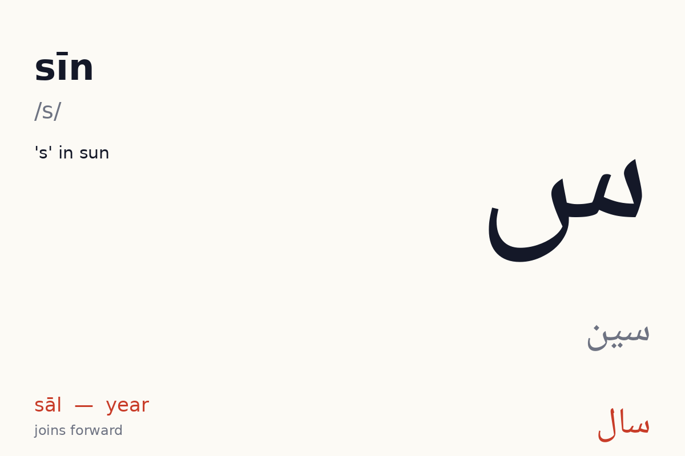
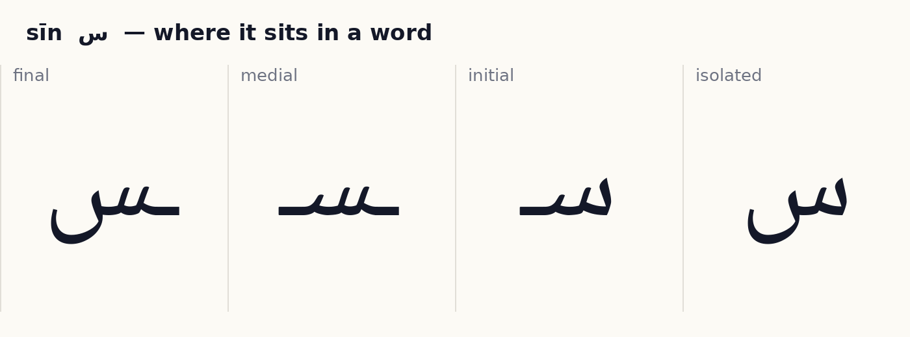
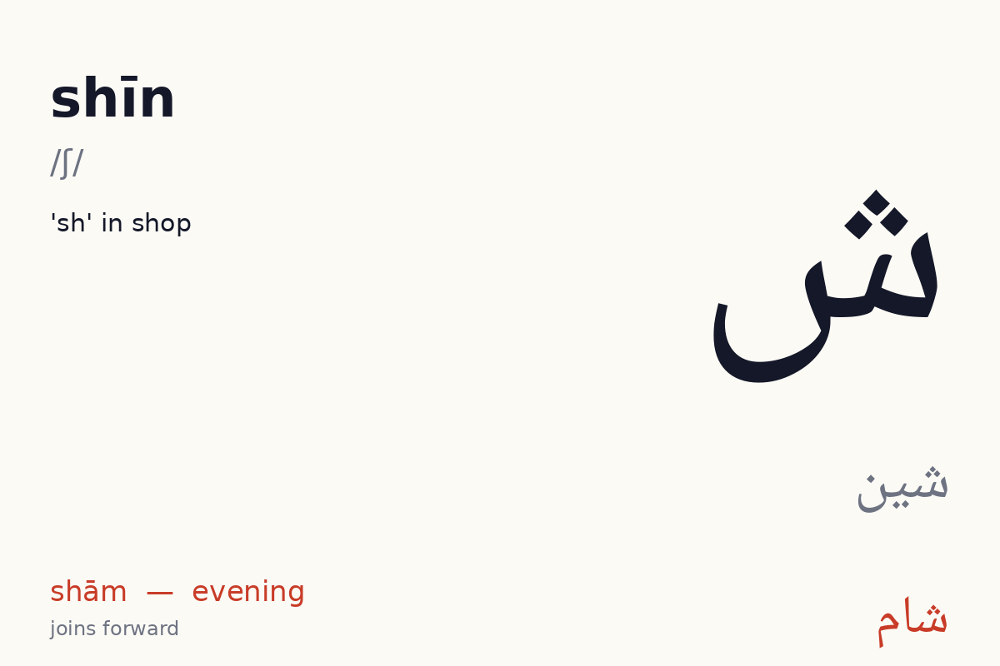
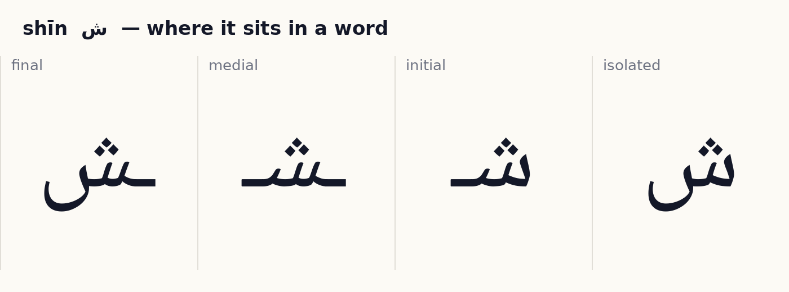
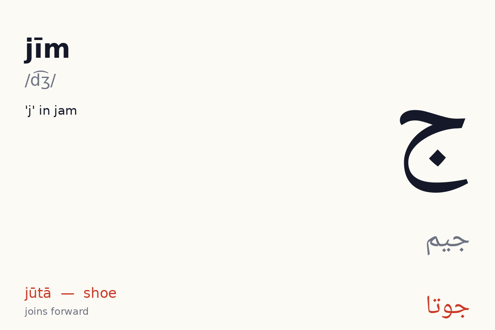
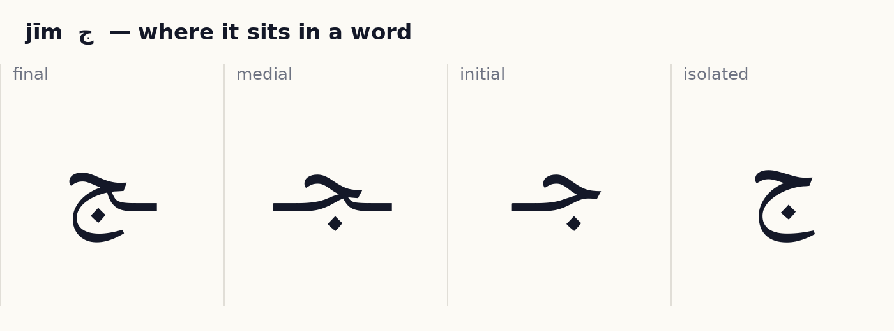
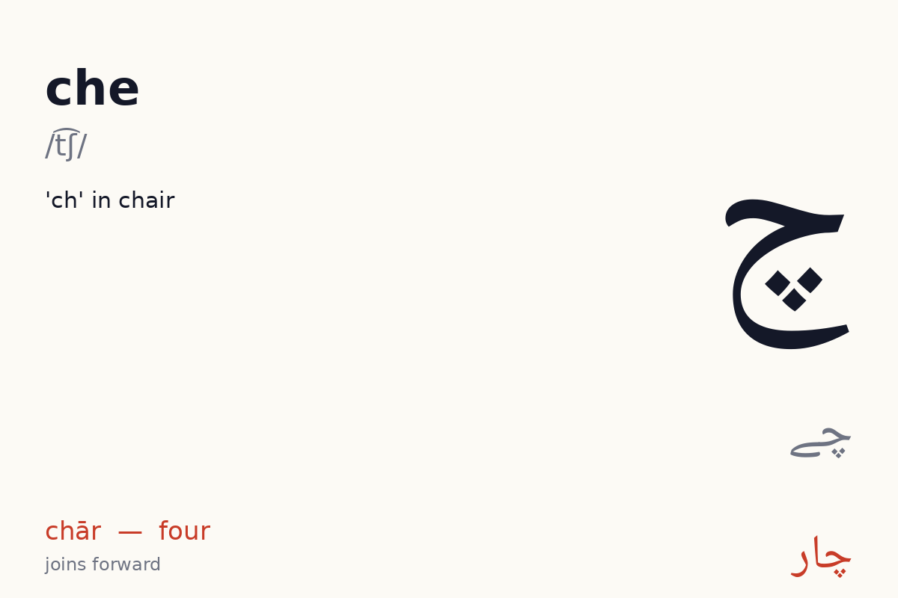
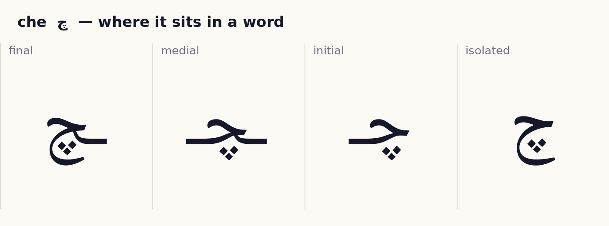
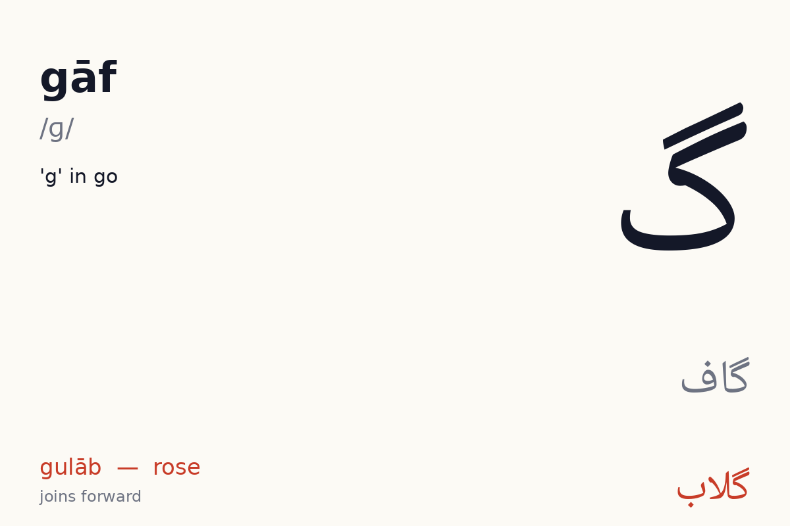
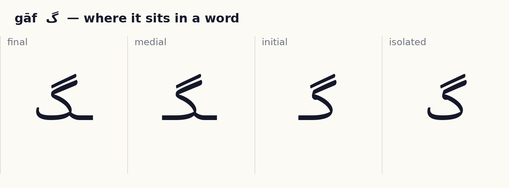

# Unit 5 — Sīn, jīm and gāf  ·  سین، جیم، گاف

**Focus:** The toothed sīn family; the bowl-shaped jīm family; گ as kāf with an extra stroke

**On the phone, this unit is these lessons, in order:** sīn س → shīn ش → jīm ج → che چ → gāf گ → Join them → Blend → Words 1 → Words 2 → Words 3 → Words 4 → Words 5 → Words 6 → Words 7 → Words 8 → Words 9 → Words 10 → Read → Unit check. Children rotate through them one at a time; the Unit check (8 of 10) unlocks the next unit.

## 1 · Hear it

| Letter | Name | Sound | Say it like… | Audio |
|---|---|---|---|---|
| س | sīn (سین) | /s/ | 's' in sun | `assets/audio/names/sin.mp3` · `assets/audio/words/sin.mp3` (سال sāl — year) |
| ش | shīn (شین) | /ʃ/ | 'sh' in shop | `assets/audio/names/shin.mp3` · `assets/audio/words/shin.mp3` (شام shām — evening) |
| ج | jīm (جیم) | /d͡ʒ/ | 'j' in jam | `assets/audio/names/jim.mp3` · `assets/audio/words/jim.mp3` (جوتا jūtā — shoe) |
| چ | che (چے) | /t͡ʃ/ | 'ch' in chair | `assets/audio/names/che.mp3` · `assets/audio/words/che.mp3` (چار chār — four) |
| گ | gāf (گاف) | /ɡ/ | 'g' in go | `assets/audio/names/gaf.mp3` · `assets/audio/words/gaf.mp3` (گلاب gulāb — rose) |

## 2 · See it

**س sīn** — joins forward (4 forms).

✎ *How the pen moves:* three small teeth from right to left, then the deep bowl; dots after. (Right to left; dots and marks last, after the whole word. These are the conventional Naskh/Nastaliq stroke orders as taught in Pakistani qaida classes; no published study was found, see research/05_open_assets.md.)

**ش shīn** — joins forward (4 forms).

✎ *How the pen moves:* three small teeth from right to left, then the deep bowl; dots after. (Right to left; dots and marks last, after the whole word. These are the conventional Naskh/Nastaliq stroke orders as taught in Pakistani qaida classes; no published study was found, see research/05_open_assets.md.)

**ج jīm** — joins forward (4 forms).

✎ *How the pen moves:* start at the top-right with the small head stroke going left, then drop into the round bowl below; dot after. (Right to left; dots and marks last, after the whole word. These are the conventional Naskh/Nastaliq stroke orders as taught in Pakistani qaida classes; no published study was found, see research/05_open_assets.md.)

**چ che** — joins forward (4 forms).

✎ *How the pen moves:* start at the top-right with the small head stroke going left, then drop into the round bowl below; dot after. (Right to left; dots and marks last, after the whole word. These are the conventional Naskh/Nastaliq stroke orders as taught in Pakistani qaida classes; no published study was found, see research/05_open_assets.md.)

**گ gāf** — joins forward (4 forms).

✎ *How the pen moves:* base stroke first, right to left along the line, then the sloping cap (sar-kash) added on top last; گ gets a second cap. (Right to left; dots and marks last, after the whole word. These are the conventional Naskh/Nastaliq stroke orders as taught in Pakistani qaida classes; no published study was found, see research/05_open_assets.md.)

## 3 · Tell it apart  ·  *recognition · self-check with audio*

- س vs ش — same body, different dots or marks. Drill: play `names/` audio for each, learner points at the right one. 10 rounds, shuffled.
- ج vs چ — same body, different dots or marks. Drill: play `names/` audio for each, learner points at the right one. 10 rounds, shuffled.
- گ vs ک — same body, different dots or marks. Drill: play `names/` audio for each, learner points at the right one. 10 rounds, shuffled.

## 4 · Join it  ·  *production · self-check against the answer shown*

Build each word from letter tiles, right to left. Watch which letters change shape and which refuse to join.

- گ + ی + ا  →  **گَیا**  (gayā, went)
- ا + س + ے  →  **اِسے**  (ise, him, her, it)
- ک + س + ی  →  **کِسی**  (kisī, some, any)

## 4b · Blend  ·  *recognition · self-check with audio*

A letter plus a vowel letter makes a sound you can say. Play a syllable, learner points to it. Vowels available so far: ا ی و.

| Syllable | Audio |
|---|---|
| سا | `assets/audio/syllables/sin_a.mp3` |
| سی | `assets/audio/syllables/sin_i.mp3` |
| سو | `assets/audio/syllables/sin_u.mp3` |
| شا | `assets/audio/syllables/shin_a.mp3` |
| شی | `assets/audio/syllables/shin_i.mp3` |
| شو | `assets/audio/syllables/shin_u.mp3` |
| جا | `assets/audio/syllables/jim_a.mp3` |
| جی | `assets/audio/syllables/jim_i.mp3` |
| جو | `assets/audio/syllables/jim_u.mp3` |
| چا | `assets/audio/syllables/che_a.mp3` |
| چی | `assets/audio/syllables/che_i.mp3` |
| چو | `assets/audio/syllables/che_u.mp3` |
| گا | `assets/audio/syllables/gaf_a.mp3` |
| گی | `assets/audio/syllables/gaf_i.mp3` |
| گو | `assets/audio/syllables/gaf_u.mp3` |

## 5 · Read it  ·  *reading aloud · self-check with audio, or a helper listens*

Vowel marks are shown. Read aloud, then play the audio and compare.

| Word | Say | Means | Audio |
|---|---|---|---|
| گَیا | gayā | went | `assets/audio/units/u05_00.mp3` |
| جو | jo | who, which | `assets/audio/units/u05_01.mp3` |
| اِسے | ise | him, her, it | `assets/audio/units/u05_02.mp3` |
| گا | gā | will | `assets/audio/units/u05_03.mp3` |
| سَب | sab | all | `assets/audio/units/u05_04.mp3` |
| کِسی | kisī | some, any | `assets/audio/units/u05_05.mp3` |
| جاتا | jātā | goes | `assets/audio/units/u05_06.mp3` |
| سال | sāl | year | `assets/audio/units/u05_07.mp3` |
| سَکتا | saktā | can | `assets/audio/units/u05_08.mp3` |
| سَکتے | sakte | can | `assets/audio/units/u05_09.mp3` |
| گے | ge | will | `assets/audio/units/u05_10.mp3` |
| پَسَند | pasand | liking | `assets/audio/units/u05_11.mp3` |
| پاس | pās | near | `assets/audio/units/u05_12.mp3` |
| جَب | jab | when | `assets/audio/units/u05_13.mp3` |
| جا | jā | go | `assets/audio/units/u05_14.mp3` |
| چاہتا | chāhtā | wants | `assets/audio/units/u05_15.mp3` |
| سو | sau, so | hundred, to sleep | `assets/audio/units/u05_16.mp3` |
| گی | gī | will | `assets/audio/units/u05_17.mp3` |
| لوگ | log | people | `assets/audio/units/u05_18.mp3` |
| لَگا | lagā | began, seemed | `assets/audio/units/u05_19.mp3` |
| اُسی | usī | that very | `assets/audio/units/u05_20.mp3` |
| کوشِش | koshish | effort | `assets/audio/units/u05_21.mp3` |
| جاتی | jātī | goes | `assets/audio/units/u05_22.mp3` |
| شامِل | shāmil | included | `assets/audio/units/u05_23.mp3` |
| شَہْر | shahr | city | `assets/audio/units/u05_24.mp3` |
| ہَمیشَہ | hamesha | always | `assets/audio/units/u05_25.mp3` |
| مَگَر | magar | but | `assets/audio/units/u05_26.mp3` |
| کَیسے | kaise | how | `assets/audio/units/u05_27.mp3` |
| بارِش | bārish | rain | `assets/audio/units/u05_28.mp3` |
| جانا | jānā | to go | `assets/audio/units/u05_29.mp3` |
| بَس | bas | enough | `assets/audio/units/u05_30.mp3` |
| دوسْت | dost | friend | `assets/audio/units/u05_31.mp3` |
| واپَس | wāpas | back | `assets/audio/units/u05_32.mp3` |
| اَگَر | agar | if | `assets/audio/units/u05_33.mp3` |
| لَگتا | lagtā | seems | `assets/audio/units/u05_34.mp3` |
| جَلدی | jaldī | quickly | `assets/audio/units/u05_35.mp3` |
| سَکتی | saktī | can | `assets/audio/units/u05_36.mp3` |
| پَیسے | paise | money | `assets/audio/units/u05_37.mp3` |
| شادی | shādī | wedding | `assets/audio/units/u05_38.mp3` |
| بَچّے | bachche | children | `assets/audio/units/u05_39.mp3` |
| جَواب | jawāb | answer | `assets/audio/units/u05_40.mp3` |
| سارے | sāre | all | `assets/audio/units/u05_41.mp3` |
| اِسکول | iskūl | school | `assets/audio/units/u05_42.mp3` |
| مَشہور | mashhūr | famous | `assets/audio/units/u05_43.mp3` |
| جاتے | jāte | go | `assets/audio/units/u05_44.mp3` |
| چاہِیے | chāhiye | is needed, should | `assets/audio/units/u05_45.mp3` |
| چاہتے | chāhte | want | `assets/audio/units/u05_46.mp3` |
| دوسرے | dūsre | other, second | `assets/audio/units/u05_47.mp3` |
| چار | chār | four | `assets/audio/units/u05_48.mp3` |
| پانچ | pānch | five | `assets/audio/units/u05_49.mp3` |
| جان | jān | life, dear | `assets/audio/units/u05_50.mp3` |
| مَوسَم | mausam | weather, season | `assets/audio/units/u05_51.mp3` |
| دَس | das | ten | `assets/audio/units/u05_52.mp3` |
| بَجے | baje | o'clock | `assets/audio/units/u05_53.mp3` |
| دوسری | dūsrī | other | `assets/audio/units/u05_54.mp3` |
| جیت | jīt | victory | `assets/audio/units/u05_55.mp3` |
| چَلا | chalā | walked | `assets/audio/units/u05_56.mp3` |
| اَیسا | aisā | like this | `assets/audio/units/u05_57.mp3` |
| جانتا | jāntā | knows | `assets/audio/units/u05_58.mp3` |
| مُشکِل | mushkil | difficult | `assets/audio/units/u05_59.mp3` |
| چینی | chīnī | sugar | `assets/audio/units/u05_60.mp3` |
| شُکرِیَہ | shukriya | thank you | `assets/audio/units/u05_61.mp3` |
| جَلد | jald | soon | `assets/audio/units/u05_62.mp3` |
| جَگَہ | jagah | place | `assets/audio/units/u05_63.mp3` |
| رَنگ | rang | colour | `assets/audio/units/u05_64.mp3` |
| سوچ | soch | thought | `assets/audio/units/u05_65.mp3` |
| شایَد | shāyad | maybe | `assets/audio/units/u05_66.mp3` |
| سامنے | sāmne | in front | `assets/audio/units/u05_67.mp3` |
| اُستاد | ustād | teacher | `assets/audio/units/u05_68.mp3` |
| شام | shām | evening | `assets/audio/units/u05_69.mp3` |
| سارا | sārā | whole, all | `assets/audio/units/u05_70.mp3` |
| شَکْل | shakl | face, shape | `assets/audio/units/u05_71.mp3` |
| دوپَہَر | dopahar | afternoon, noon | `assets/audio/units/u05_72.mp3` |
| کاش | kāsh | if only | `assets/audio/units/u05_73.mp3` |
| سات | sāt | seven | `assets/audio/units/u05_74.mp3` |
| لَگی | lagī | seemed | `assets/audio/units/u05_75.mp3` |
| سَچ | sach | truth | `assets/audio/units/u05_76.mp3` |
| اِنسان | insān | human being | `assets/audio/units/u05_77.mp3` |
| نیچے | nīche | below | `assets/audio/units/u05_78.mp3` |
| گَرْم | garm | hot | `assets/audio/units/u05_79.mp3` |
| جانوَر | jānwar | animal | `assets/audio/units/u05_80.mp3` |
| رَوشْنی | raushnī | light, brightness | `assets/audio/units/u05_81.mp3` |
| دوسرا | dūsrā | other, second | `assets/audio/units/u05_82.mp3` |
| شَوہَر | shauhar | husband | `assets/audio/units/u05_83.mp3` |
| سَوال | sawāl | question | `assets/audio/units/u05_84.mp3` |
| گَرمی | garmī | heat, summer | `assets/audio/units/u05_85.mp3` |
| جِتنا | jitnā | as much as | `assets/audio/units/u05_86.mp3` |
| اونچا | ūnchā | tall, high | `assets/audio/units/u05_87.mp3` |
| گوشْت | gosht | meat | `assets/audio/units/u05_88.mp3` |
| کَیسی | kaisī | how | `assets/audio/units/u05_89.mp3` |
| سورَج | sūraj | sun | `assets/audio/units/u05_90.mp3` |
| ہَسپَتال | haspatāl | hospital | `assets/audio/units/u05_91.mp3` |
| سَلام | salām | hello, greeting | `assets/audio/units/u05_92.mp3` |
| شیر | sher | lion | `assets/audio/units/u05_93.mp3` |
| سَرْدی | sardī | cold | `assets/audio/units/u05_94.mp3` |
| چَلنا | chalnā | to walk | `assets/audio/units/u05_95.mp3` |
| چاند | chānd | moon | `assets/audio/units/u05_96.mp3` |
| شور | shor | noise | `assets/audio/units/u05_97.mp3` |
| گُلاب | gulāb | rose | `assets/audio/units/u05_98.mp3` |
| گیند | gend | ball | `assets/audio/units/u05_99.mp3` |
| جیب | jeb | pocket | `assets/audio/units/u05_100.mp3` |
| جَنگَل | jangal | forest | `assets/audio/units/u05_101.mp3` |
| چابی | chābī | key | `assets/audio/units/u05_102.mp3` |
| چَلتا | chaltā | walks | `assets/audio/units/u05_103.mp3` |
| پیاس | pyās | thirst | `assets/audio/units/u05_104.mp3` |
| کَپاس | kapās | cotton | `assets/audio/units/u05_105.mp3` |
| مَنگَل | mangal | Tuesday | `assets/audio/units/u05_106.mp3` |
| سُنو | suno | listen | `assets/audio/units/u05_107.mp3` |
| جاوید | jāvīd | Javed | `assets/audio/units/u05_108.mp3` |
| شاگِرد | shāgird | pupil, student | `assets/audio/units/u05_109.mp3` |
| شاہِد | shāhid | Shahid | `assets/audio/units/u05_110.mp3` |
| گانا | gānā | song | `assets/audio/units/u05_111.mp3` |
| سونا | sonā | gold, to sleep | `assets/audio/units/u05_112.mp3` |
| سِتارَہ | sitāra | star | `assets/audio/units/u05_113.mp3` |
| جام | jām | goblet | `assets/audio/units/u05_114.mp3` |
| سَلمان | salmān | Salman | `assets/audio/units/u05_115.mp3` |
| سواری | sawārī | ride, vehicle | `assets/audio/units/u05_116.mp3` |
| سارَہ | sārah | Sara | `assets/audio/units/u05_117.mp3` |
| سَبُک | sabuk | light | `assets/audio/units/u05_118.mp3` |
| سَہیلی | sahelī | girl's friend | `assets/audio/units/u05_119.mp3` |
| جوتا | jūtā | shoe | `assets/audio/units/u05_120.mp3` |
| چَمَچ | chamach | spoon | `assets/audio/units/u05_121.mp3` |
| پیاسا | pyāsā | thirsty | `assets/audio/units/u05_122.mp3` |
| گاجَر | gājar | carrot | `assets/audio/units/u05_123.mp3` |
| گِرنا | girnā | to fall | `assets/audio/units/u05_124.mp3` |

**Sentences**

- ہادی اِسکول جاتا ہَے  —  *hādī iskūl jātā hai*  —  Hadi goes to school  · `assets/audio/sentences/u05_00.mp3`
- سارَہ اِسکول جاتی ہَے  —  *sārah iskūl jātī hai*  —  Sara goes to school  · `assets/audio/sentences/u05_01.mp3`
- اُستاد کا نام جاوید ہَے  —  *ustād kā nām jāvīd hai*  —  the teacher's name is Javed  · `assets/audio/sentences/u05_02.mp3`
- بارِش ہوتی ہَے  —  *bārish hotī hai*  —  it rains  · `assets/audio/sentences/u05_03.mp3`
- سورَج بَہُت گَرْم ہَے  —  *sūraj bahut garm hai*  —  the sun is very hot  · `assets/audio/sentences/u05_04.mp3`
- رات کو چاند ہوتا ہَے  —  *rāt ko chānd hotā hai*  —  at night there is a moon  · `assets/audio/sentences/u05_05.mp3`
- سَلمان جَلدی سے اِسکول جاتا ہَے  —  *salmān jaldī se iskūl jātā hai*  —  Salman goes to school quickly  · `assets/audio/sentences/u05_06.mp3`
- سارَہ اَپنی سَہیلی کو سَلام کَہتی ہَے  —  *sārah apnī sahelī ko salām kahtī hai*  —  Sara says salaam to her friend  · `assets/audio/sentences/u05_07.mp3`
- شاہِد کا دوسْت جاوید ہَے  —  *shāhid kā dost jāvīd hai*  —  Shahid's friend is Javed  · `assets/audio/sentences/u05_08.mp3`
- دُکان پَر گاجَر ہَے  —  *dukān par gājar hai*  —  there is a carrot at the shop  · `assets/audio/sentences/u05_09.mp3`
- تُم کیا چاہتے ہو؟  —  *tum kyā chāhte ho?*  —  what do you want?  · `assets/audio/sentences/u05_10.mp3`
- وُہ جَلدی جا سَکتا ہَے  —  *woh jaldī jā saktā hai*  —  he can go quickly  · `assets/audio/sentences/u05_11.mp3`
- بَہُت شُکرِیَہ  —  *bahut shukriya*  —  thank you very much  · `assets/audio/sentences/u05_12.mp3`
- سارَہ جاوید کو سَلام کَہتی ہَے  —  *sārah jāvīd ko salām kahtī hai*  —  Sara says salaam to Javed  · `assets/audio/sentences/u05_13.mp3`
- وُہ اِسکول جَلدی جا سَکتی ہَے  —  *woh iskūl jaldī jā saktī hai*  —  she can go to school quickly  · `assets/audio/sentences/u05_14.mp3`
- چینی بَہُت کَم ہَے  —  *chīnī bahut kam hai*  —  there is very little sugar  · `assets/audio/sentences/u05_15.mp3`
- پانچ بَجے اِسکول بَند ہوتا ہَے  —  *pānch baje iskūl band hotā hai*  —  school closes at five o'clock  · `assets/audio/sentences/u05_16.mp3`

**Passage** (74 words) · `assets/audio/passages/u05.mp3`

> سارَہ جَلدی سے اِسکول جاتی ہَے۔ اِسکول کا اُستاد جاوید ہَے۔ جاوید سارَہ کو ایک کِتاب دیتا ہَے۔ سارَہ کَہتی ہَے: بَہُت شُکرِیَہ۔ جاوید کَہتا ہَے: سارَہ کا کام مُکَمَّل ہَے۔ سارَہ کی سَہیلی سَلام کَہتی ہَے۔ اَب دوپَہَر ہَے۔ دوپَہَر کو سورَج بَہُت گَرْم ہوتا ہَے۔ سَلمان کَہتا ہَے: سارَہ جَلدی جا سَکتی ہَے۔ پانچ بَجے اِسکول بَند ہوتا ہَے۔ سَلمان اَپنی کِتاب جاوید کو دیتا ہَے۔ جاوید کَہتا ہَے: بَہُت شُکرِیَہ سَلمان۔
>
> *sārah jaldī se iskūl jātī hai. iskūl kā ustād jāvīd hai. jāvīd sārah ko ek kitāb detā hai. sārah kahtī hai: bahut shukriya. jāvīd kahtā hai: sārah kā kām mukammal hai. sārah kī sahelī salām kahtī hai. ab dopahar hai. dopahar ko sūraj bahut garm hotā hai. salmān kahtā hai: sārah jaldī jā saktī hai. pānch baje iskūl band hotā hai. salmān apnī kitāb jāvīd ko detā hai. jāvīd kahtā hai: bahut shukriya salmān.*
>
> Sara goes to school quickly. The school's teacher is Javed. Javed gives Sara a book. Sara says: thank you very much! Javed says: Sara's work is complete. Sara's friend says salaam. Now it is afternoon. At noon the sun is very hot. Salman says: Sara can go quickly. School closes at five o'clock. Salman gives his book to Javed. Javed says: thank you very much, Salman.

## 6 · Write it  ·  *production · needs a helper or the app tracer to check*

Trace each new letter in all its forms three times (children: required; adults: recommended). Use the forms card as the model. Then write these words from the list without looking: گَیا, جو, اِسے, گا, سَب.

Pen movement for each letter is described in step 2 above.

## 7 · Dictation  ·  *production · self-check with the key below*

Play each clip twice. Learner writes the word. Then reveal.

1. `assets/audio/units/u05_30.mp3`
2. `assets/audio/units/u05_54.mp3`
3. `assets/audio/units/u05_09.mp3`
4. `assets/audio/units/u05_27.mp3`
5. `assets/audio/units/u05_85.mp3`

Answer key

1. بَس (bas)
2. دوسری (dūsrī)
3. سَکتے (sakte)
4. کَیسے (kaise)
5. گَرمی (garmī)

## 8 · Check (score 8/10 to move on)  ·  *recognition · self-check*

1. Which one says **shādī** (wedding)?   (a) لوگ   (b) شادی   (c) واپَس   (d) دوسرے
2. Which one says **jeb** (pocket)?   (a) جیب   (b) جام   (c) جان   (d) جَلد
3. Which one says **chāhtā** (wants)?   (a) دَس   (b) شایَد   (c) جاتے   (d) چاہتا
4. Which one says **jām** (goblet)?   (a) مَشہور   (b) سارا   (c) جام   (d) جانتا
5. Which one says **gend** (ball)?   (a) گیند   (b) گاجَر   (c) سَکتا   (d) سوچ
6. Which one says **lagā** (began, seemed)?   (a) لَگا   (b) جَلدی   (c) لَگتا   (d) گے
7. Which one says **jūtā** (shoe)?   (a) جاوید   (b) سواری   (c) جوتا   (d) دوسری
8. Which one says **haspatāl** (hospital)?   (a) کاش   (b) سوچ   (c) جَگَہ   (d) ہَسپَتال
9. Which one says **dūsrā** (other, second)?   (a) دوسری   (b) سَلمان   (c) سَکتے   (d) دوسرا
10. Which one says **sawāl** (question)?   (a) سَوال   (b) بارِش   (c) شاہِد   (d) اِنسان

Answer key

1. شادی
2. جیب
3. چاہتا
4. جام
5. گیند
6. لَگا
7. جوتا
8. ہَسپَتال
9. دوسرا
10. سَوال

