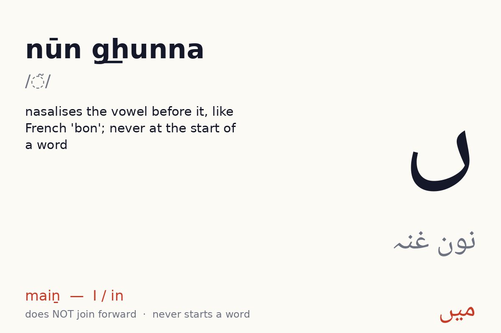
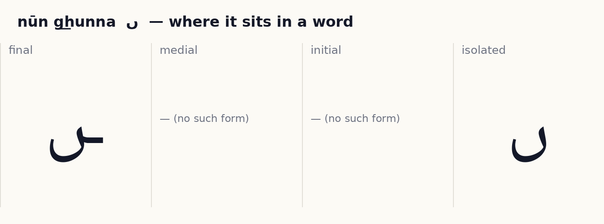
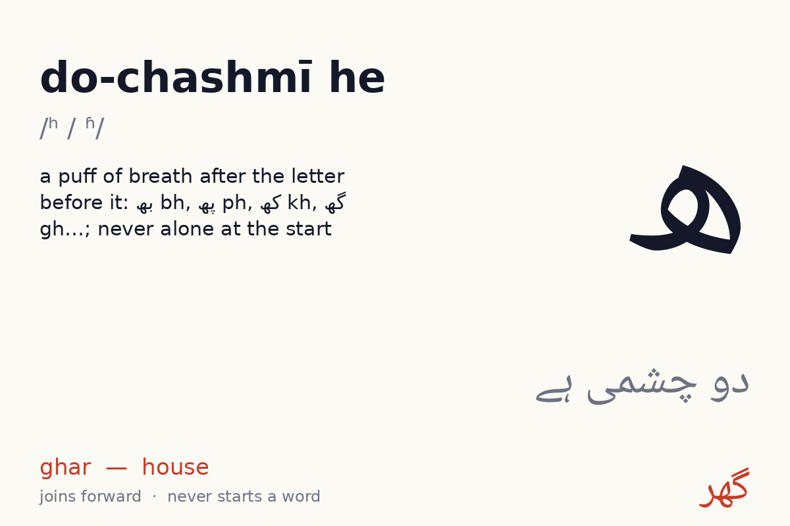
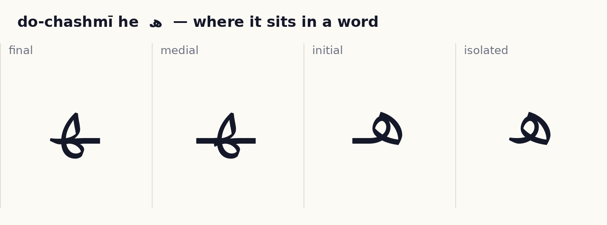

# Unit 6 — Breath and nose  ·  سانس اور ناک

**Focus:** do-chashmī he makes aspirates (بھ پھ تھ ٹھ جھ چھ دھ کھ گھ); nūn ghunna nasalises; میں ہیں ہاں کہاں are among the most frequent words in Urdu

## 1 · Hear it

| Letter | Name | Sound | Say it like… | Audio |
|---|---|---|---|---|
| ں | nūn g͟hunna (نون غنہ) | /◌̃/ | nasalises the vowel before it, like French 'bon'; never at the start of a word | `assets/audio/names/nun_ghunna.mp3` · `assets/audio/words/nun_ghunna.mp3` (میں maiṉ — I / in) |
| ھ | do-chashmī he (دو چشمی ہے) | /ʰ / ʱ/ | a puff of breath after the letter before it: بھ bh, پھ ph, کھ kh, گھ gh…; never alone at the start | `assets/audio/names/do_chashmi_he.mp3` · `assets/audio/words/do_chashmi_he.mp3` (گھر ghar — house) |

## 2 · See it

**ں nūn g͟hunna** — does **not** join forward (2 forms: isolated, final). No Urdu word begins with it.

✎ *How the pen moves:* the same bowl as ب but deeper and rounder; dot after (none for ں). (Right to left; dots and marks last, after the whole word. These are the conventional Naskh/Nastaliq stroke orders as taught in Pakistani qaida classes; no published study was found, see research/05_open_assets.md.)

**ھ do-chashmī he** — joins forward (4 forms). No Urdu word begins with it.

✎ *How the pen moves:* ہ is a small loop with a short tail; ھ is two connected bowls open at the top. (Right to left; dots and marks last, after the whole word. These are the conventional Naskh/Nastaliq stroke orders as taught in Pakistani qaida classes; no published study was found, see research/05_open_assets.md.)

## 3 · Tell it apart  ·  *recognition · self-check with audio*

- ں vs ن — same body, different dots or marks. Drill: play `names/` audio for each, learner points at the right one. 10 rounds, shuffled.
- ھ vs ہ — same body, different dots or marks. Drill: play `names/` audio for each, learner points at the right one. 10 rounds, shuffled.

## 4 · Join it  ·  *production · self-check against the answer shown*

Build each word from letter tiles, right to left. Watch which letters change shape and which refuse to join.

- م + ی + ں  →  **مَیں**  (maiṉ, I / in)
- ہ + ا + ں  →  **ہاں**  (hāṉ, yes)
- ک + ہ + ا + ں  →  **کَہاں**  (kahāṉ, where)

## 5 · Read it  ·  *reading aloud · self-check with audio, or a helper listens*

Vowel marks are shown. Read aloud, then play the audio and compare.

| Word | Say | Means | Audio |
|---|---|---|---|
| مَیں | maiṉ | I / in | `assets/audio/units/u06_00.mp3` |
| ہاں | hāṉ | yes | `assets/audio/units/u06_01.mp3` |
| کَہاں | kahāṉ | where | `assets/audio/units/u06_02.mp3` |
| ہَیں | haiṉ | are | `assets/audio/units/u06_03.mp3` |
| گَھر | ghar | house | `assets/audio/units/u06_04.mp3` |
| بَھائی | bhāʾī | brother (ئ preview) | `assets/audio/units/u06_05.mp3` |
| پھول | phūl | flower | `assets/audio/units/u06_06.mp3` |
| تھالی | thālī | plate | `assets/audio/units/u06_07.mp3` |
| ٹَھنڈا | ṭhanḍā | cold (ڈ preview) | `assets/audio/units/u06_08.mp3` |
| کھانا | khānā | food | `assets/audio/units/u06_09.mp3` |
| دھاگا | dhāgā | thread | `assets/audio/units/u06_10.mp3` |
| چَھت | chhat | roof | `assets/audio/units/u06_11.mp3` |
| جھولا | jhūlā | swing | `assets/audio/units/u06_12.mp3` |
| ہاتھ | hāth | hand | `assets/audio/units/u06_13.mp3` |
| دودھ | dūdh | milk | `assets/audio/units/u06_14.mp3` |
| مَچھلی | machhlī | fish | `assets/audio/units/u06_15.mp3` |
| آنکھ | āṉkh | eye | `assets/audio/units/u06_16.mp3` |
| یَہاں | yahāṉ | here | `assets/audio/units/u06_17.mp3` |
| سِکھانا | sikhānā | to teach | `assets/audio/units/u06_18.mp3` |
| بَھالو | bhālū | bear | `assets/audio/units/u06_19.mp3` |

**Sentences**

- مَیں گَھر مَیں ہوں  —  *maiṉ ghar meṉ hūṉ*  —  I am at home  · `assets/audio/sentences/u06_00.mp3`
- پھول کَہاں ہَیں  —  *phūl kahāṉ haiṉ*  —  where are the flowers  · `assets/audio/sentences/u06_01.mp3`
- بَھائی کھانا کھاتا ہَے  —  *bhāʾī khānā khātā hai*  —  brother eats food  · `assets/audio/sentences/u06_02.mp3`

## 6 · Write it  ·  *production · needs a helper or the app tracer to check*

Trace each new letter in all its forms three times (children: required; adults: recommended). Use the forms card as the model. Then write these words from the list without looking: مَیں, ہاں, کَہاں, ہَیں, گَھر.

Pen movement for each letter is described in step 2 above.

## 7 · Dictation  ·  *production · self-check with the key below*

Play each clip twice. Learner writes the word. Then reveal.

1. `assets/audio/units/u06_16.mp3`
2. `assets/audio/units/u06_15.mp3`
3. `assets/audio/units/u06_07.mp3`
4. `assets/audio/units/u06_14.mp3`
5. `assets/audio/units/u06_03.mp3`

Answer key

1. آنکھ (āṉkh)
2. مَچھلی (machhlī)
3. تھالی (thālī)
4. دودھ (dūdh)
5. ہَیں (haiṉ)

## 8 · Check (score 8/10 to move on)  ·  *recognition · self-check*

1. Which one says **hāth** (hand)?   (a) جھولا   (b) چَھت   (c) گَھر   (d) ہاتھ
2. Which one says **machhlī** (fish)?   (a) مَچھلی   (b) ہاتھ   (c) بَھائی   (d) ٹَھنڈا
3. Which one says **yahāṉ** (here)?   (a) بَھالو   (b) یَہاں   (c) کھانا   (d) تھالی
4. Which one says **jhūlā** (swing)?   (a) جھولا   (b) دھاگا   (c) سِکھانا   (d) چَھت
5. Which one says **khānā** (food)?   (a) کھانا   (b) ہاتھ   (c) مَیں   (d) چَھت
6. Which one says **chhat** (roof)?   (a) مَیں   (b) ٹَھنڈا   (c) کَہاں   (d) چَھت
7. Which one says **haiṉ** (are)?   (a) ہَیں   (b) ٹَھنڈا   (c) بَھالو   (d) دھاگا
8. Which one says **bhālū** (bear)?   (a) مَچھلی   (b) بَھالو   (c) دھاگا   (d) جھولا
9. Which one says **bhāʾī** (brother (ئ preview))?   (a) بَھائی   (b) دودھ   (c) یَہاں   (d) بَھالو
10. Which one says **āṉkh** (eye)?   (a) آنکھ   (b) کَہاں   (c) مَیں   (d) تھالی

Answer key

1. ہاتھ
2. مَچھلی
3. یَہاں
4. جھولا
5. کھانا
6. چَھت
7. ہَیں
8. بَھالو
9. بَھائی
10. آنکھ

## Aspirates — one letter, one puff of breath
Write دو چشمی ہے (ھ) after a consonant to add a breath. English speakers already do this ("p" in *pin* has it, "p" in *spin* does not).

| Pair | Say | Word | Roman | Means | Audio |
|---|---|---|---|---|---|
| بھ | bh | بھائی | bhāʾī | brother | `assets/audio/aspirates/bh.mp3` |
| پھ | ph | پھول | phūl | flower | `assets/audio/aspirates/ph.mp3` |
| تھ | th | تھالی | thālī | plate | `assets/audio/aspirates/th.mp3` |
| ٹھ | ṭh | ٹھنڈا | ṭhanḍā | cold | `assets/audio/aspirates/ṭh.mp3` |
| جھ | jh | جھنڈا | jhanḍā | flag | `assets/audio/aspirates/jh.mp3` |
| چھ | chh | چھت | chhat | roof | `assets/audio/aspirates/chh.mp3` |
| دھ | dh | دھاگا | dhāgā | thread | `assets/audio/aspirates/dh.mp3` |
| ڈھ | ḍh | ڈھول | ḍhol | drum | `assets/audio/aspirates/ḍh.mp3` |
| ڑھ | ṛh | پڑھنا | paṛhnā | to read | `assets/audio/aspirates/ṛh.mp3` |
| کھ | kh | کھانا | khānā | food | `assets/audio/aspirates/kh.mp3` |
| گھ | gh | گھر | ghar | house | `assets/audio/aspirates/gh.mp3` |

## Nūn ghunna — the nasal vowel
ں at the end of a word (or ن in the middle) nasalises the vowel before it, like French *bon*. Compare: ہاں hāṉ (yes) vs ہا. میں maiṉ, ہیں haiṉ, کہاں kahāṉ, یہاں yahāṉ are among the twenty most common words in Urdu.
