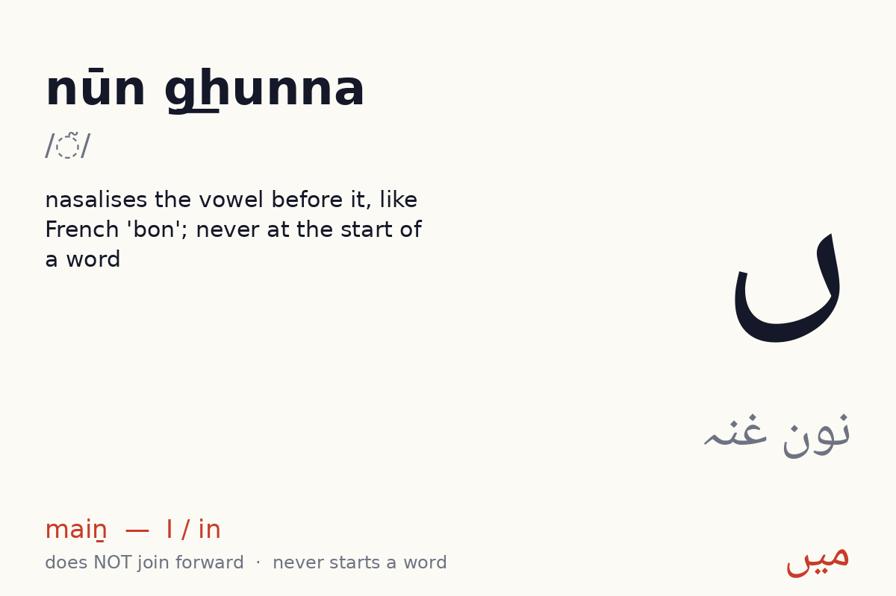
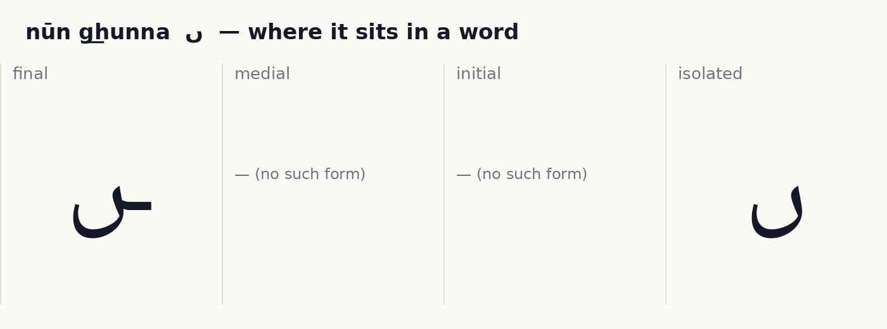
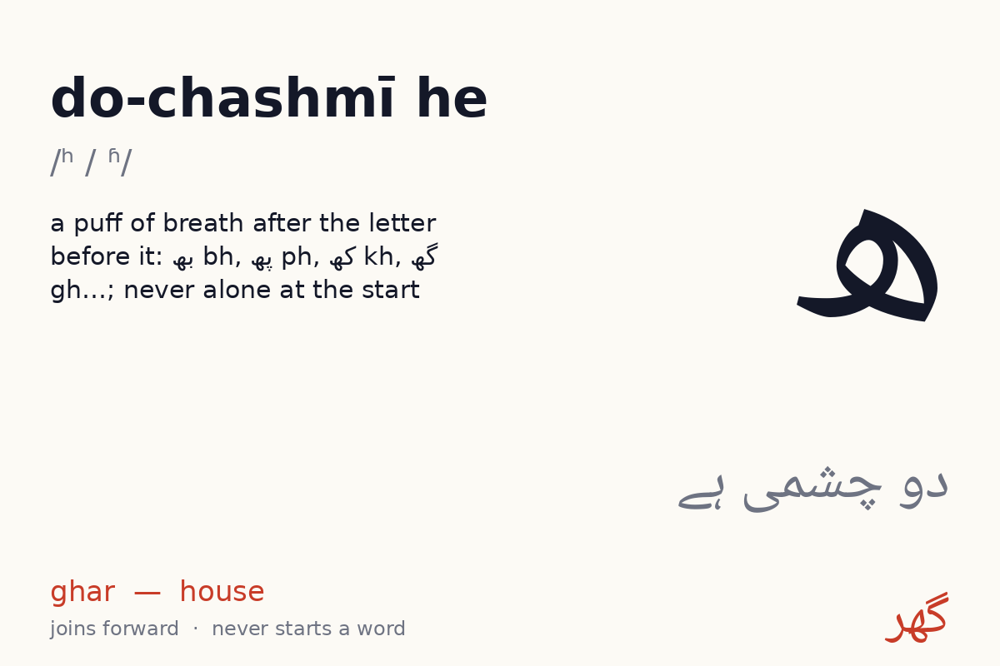
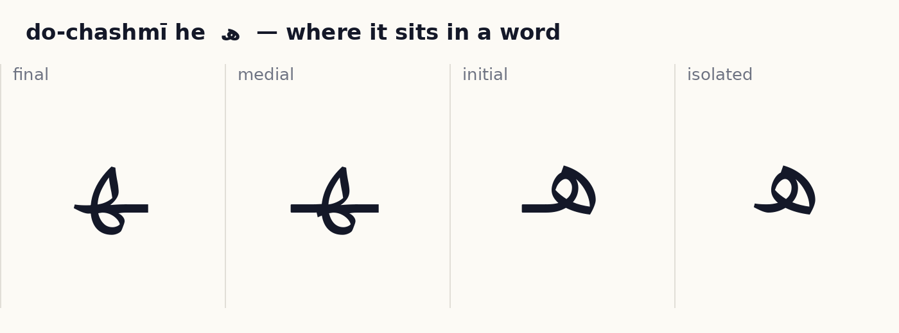

# Unit 6 — Breath and nose  ·  سانس اور ناک

**Focus:** do-chashmī he makes aspirates (بھ پھ تھ ٹھ جھ چھ دھ کھ گھ); nūn ghunna nasalises; میں ہیں ہاں کہاں are among the most frequent words in Urdu

**On the phone, this unit is these lessons, in order:** nūn g͟hunna ں → do-chashmī he ھ → Breath letters → Join them → Blend → Words 1 → Words 2 → Words 3 → Words 4 → Words 5 → Words 6 → Words 7 → Words 8 → Words 9 → Words 10 → Read → Unit check. Children rotate through them one at a time; the Unit check (8 of 10) unlocks the next unit.

## 1 · Hear it

| Letter | Name | Sound | Say it like… | Audio |
|---|---|---|---|---|
| ں | nūn g͟hunna (نون غنہ) | /◌̃/ | nasalises the vowel before it, like French 'bon'; never at the start of a word | `assets/audio/names/nun_ghunna.mp3` · `assets/audio/words/nun_ghunna.mp3` (میں maiṉ — I / in) |
| ھ | do-chashmī he (دو چشمی ہے) | /ʰ / ʱ/ | a puff of breath after the letter before it: بھ bh, پھ ph, کھ kh, گھ gh…; never alone at the start | `assets/audio/names/do_chashmi_he.mp3` · `assets/audio/words/do_chashmi_he.mp3` (گھر ghar — house) |

## 2 · See it

**ں nūn g͟hunna** — does **not** join forward (2 forms: isolated, final). No Urdu word begins with it.

✎ *How the pen moves:* the same bowl as ب but deeper and rounder; dot after (none for ں). (Right to left; dots and marks last, after the whole word. These are the conventional Naskh/Nastaliq stroke orders as taught in Pakistani qaida classes; no published study was found, see research/05_open_assets.md.)

**ھ do-chashmī he** — joins forward (4 forms). No Urdu word begins with it.

✎ *How the pen moves:* ہ is a small loop with a short tail; ھ is two connected bowls open at the top. (Right to left; dots and marks last, after the whole word. These are the conventional Naskh/Nastaliq stroke orders as taught in Pakistani qaida classes; no published study was found, see research/05_open_assets.md.)

## 3 · Tell it apart  ·  *recognition · self-check with audio*

- ں vs ن — same body, different dots or marks. Drill: play `names/` audio for each, learner points at the right one. 10 rounds, shuffled.
- ھ vs ہ — same body, different dots or marks. Drill: play `names/` audio for each, learner points at the right one. 10 rounds, shuffled.

## 4 · Join it  ·  *production · self-check against the answer shown*

Build each word from letter tiles, right to left. Watch which letters change shape and which refuse to join.

- م + ی + ں  →  **مَیں**  (maiṉ, I / in)
- ہ + ی + ں  →  **ہَیں**  (haiṉ, are)
- ہ + و + ں  →  **ہوں**  (hūṉ, am)

## 5 · Read it  ·  *reading aloud · self-check with audio, or a helper listens*

Vowel marks are shown. Read aloud, then play the audio and compare.

| Word | Say | Means | Audio |
|---|---|---|---|
| مَیں | maiṉ | I / in | `assets/audio/units/u06_00.mp3` |
| ہَیں | haiṉ | are | `assets/audio/units/u06_01.mp3` |
| ہوں | hūṉ | am | `assets/audio/units/u06_02.mp3` |
| مُجھے | mujhe | to me | `assets/audio/units/u06_03.mp3` |
| تھے | the | were | `assets/audio/units/u06_04.mp3` |
| کُچھ | kuchh | some, something | `assets/audio/units/u06_05.mp3` |
| ساتھ | sāth | with, together | `assets/audio/units/u06_06.mp3` |
| کَبھی | kabhī | ever, sometimes | `assets/audio/units/u06_07.mp3` |
| تُمہیں | tumheṉ | to you | `assets/audio/units/u06_08.mp3` |
| یَہاں | yahāṉ | here | `assets/audio/units/u06_09.mp3` |
| گَھر | ghar | house | `assets/audio/units/u06_10.mp3` |
| اَبھی | abhī | right now | `assets/audio/units/u06_11.mp3` |
| کیوں | kyoṉ | why | `assets/audio/units/u06_12.mp3` |
| پِھر | phir | then, again | `assets/audio/units/u06_13.mp3` |
| مُجھ | mujh | me | `assets/audio/units/u06_14.mp3` |
| ہَمیں | hameṉ | to us | `assets/audio/units/u06_15.mp3` |
| دونوں | donoṉ | both | `assets/audio/units/u06_16.mp3` |
| اَچّھا | achchhā | good | `assets/audio/units/u06_17.mp3` |
| دیکھا | dekhā | saw | `assets/audio/units/u06_18.mp3` |
| اُنہیں | unheṉ | to them | `assets/audio/units/u06_19.mp3` |
| ٹھیک | ṭhīk | right, fine | `assets/audio/units/u06_20.mp3` |
| وَہاں | wahāṉ | there | `assets/audio/units/u06_21.mp3` |
| کھانا | khānā | food | `assets/audio/units/u06_22.mp3` |
| جَہاں | jahāṉ | where | `assets/audio/units/u06_23.mp3` |
| کَہاں | kahāṉ | where? | `assets/audio/units/u06_24.mp3` |
| کَریں | kareṉ | do | `assets/audio/units/u06_25.mp3` |
| تھیں | thīṉ | were | `assets/audio/units/u06_26.mp3` |
| اِدھَر | idhar | here, this way | `assets/audio/units/u06_27.mp3` |
| ہاتھ | hāth | hand | `assets/audio/units/u06_28.mp3` |
| کِتابیں | kitābeṉ | books | `assets/audio/units/u06_29.mp3` |
| دیکھ | dekh | look | `assets/audio/units/u06_30.mp3` |
| کِدھَر | kidhar | where, which way | `assets/audio/units/u06_31.mp3` |
| بَچّوں | bachchoṉ | children | `assets/audio/units/u06_32.mp3` |
| کیونکہ | kyoṉki | because | `assets/audio/units/u06_33.mp3` |
| سَمَجھ | samajh | understanding | `assets/audio/units/u06_34.mp3` |
| اَچّھے | achchhe | good | `assets/audio/units/u06_35.mp3` |
| اَچّھی | achchhī | good | `assets/audio/units/u06_36.mp3` |
| اُدھار | udhār | loan | `assets/audio/units/u06_37.mp3` |
| ماں | māṉ | mother | `assets/audio/units/u06_38.mp3` |
| کَروں | karūṉ | I may do | `assets/audio/units/u06_39.mp3` |
| کھیل | khel | game | `assets/audio/units/u06_40.mp3` |
| کھانے | khāne | to eat | `assets/audio/units/u06_41.mp3` |
| کھا | khā | eat | `assets/audio/units/u06_42.mp3` |
| کَہیں | kahīṉ | somewhere | `assets/audio/units/u06_43.mp3` |
| گَھنْٹے | ghanṭe | hours | `assets/audio/units/u06_44.mp3` |
| رَکھنا | rakhnā | to keep, put | `assets/audio/units/u06_45.mp3` |
| دُکھ | dukh | sorrow | `assets/audio/units/u06_46.mp3` |
| دیکھو | dekho | look! | `assets/audio/units/u06_47.mp3` |
| لِکھا | likhā | wrote | `assets/audio/units/u06_48.mp3` |
| دیکھنا | dekhnā | to see | `assets/audio/units/u06_49.mp3` |
| دِنوں | dinoṉ | days | `assets/audio/units/u06_50.mp3` |
| چھوٹی | chhoṭī | small | `assets/audio/units/u06_51.mp3` |
| چھوٹا | chhoṭā | small | `assets/audio/units/u06_52.mp3` |
| ہاں | hāṉ | yes | `assets/audio/units/u06_53.mp3` |
| تھَکا | thakā | tired | `assets/audio/units/u06_54.mp3` |
| دیکھی | dekhī | saw | `assets/audio/units/u06_55.mp3` |
| مُنہ | munh | mouth, face | `assets/audio/units/u06_56.mp3` |
| اُٹھا | uṭhā | got up | `assets/audio/units/u06_57.mp3` |
| بَہنیں | bahneṉ | sisters | `assets/audio/units/u06_58.mp3` |
| باتیں | bāteṉ | talks, things said | `assets/audio/units/u06_59.mp3` |
| چھوٹے | chhoṭe | small | `assets/audio/units/u06_60.mp3` |
| چھ | chhe | six | `assets/audio/units/u06_61.mp3` |
| چُھٹّی | chhuṭṭī | holiday | `assets/audio/units/u06_62.mp3` |
| کھاتے | khāte | eat | `assets/audio/units/u06_63.mp3` |
| جھوٹ | jhūṭ | lie | `assets/audio/units/u06_64.mp3` |
| دیکھتے | dekhte | see | `assets/audio/units/u06_65.mp3` |
| لاکھ | lākh | hundred thousand | `assets/audio/units/u06_66.mp3` |
| دودھ | dūdh | milk | `assets/audio/units/u06_67.mp3` |
| پھول | phūl | flower | `assets/audio/units/u06_68.mp3` |
| پَتَّھر | patthar | stone | `assets/audio/units/u06_69.mp3` |
| کِتابوں | kitāboṉ | books | `assets/audio/units/u06_70.mp3` |
| پھَل | phal | fruit | `assets/audio/units/u06_71.mp3` |
| بھاری | bhārī | heavy | `assets/audio/units/u06_72.mp3` |
| دیکھتا | dekhtā | sees | `assets/audio/units/u06_73.mp3` |
| دھوپ | dhūp | sunshine | `assets/audio/units/u06_74.mp3` |
| سَمَجھنا | samajhnā | to understand | `assets/audio/units/u06_75.mp3` |
| کھاتا | khātā | eats | `assets/audio/units/u06_76.mp3` |
| جھیل | jhīl | lake | `assets/audio/units/u06_77.mp3` |
| مَچھلی | machhlī | fish | `assets/audio/units/u06_78.mp3` |
| چَھت | chhat | roof | `assets/audio/units/u06_79.mp3` |
| ماموں | māmūṉ | maternal uncle | `assets/audio/units/u06_80.mp3` |
| کھیلتے | khelte | play | `assets/audio/units/u06_81.mp3` |
| اَندھا | andhā | blind | `assets/audio/units/u06_82.mp3` |
| کھیلنا | khelnā | to play | `assets/audio/units/u06_83.mp3` |
| بھَینس | bhaiṉs | buffalo | `assets/audio/units/u06_84.mp3` |
| سیکھنا | sīkhnā | to learn | `assets/audio/units/u06_85.mp3` |
| مَچّھَر | machchhar | mosquito | `assets/audio/units/u06_86.mp3` |
| چھَتری | chhatrī | umbrella | `assets/audio/units/u06_87.mp3` |
| اَندھیرا | andherā | darkness | `assets/audio/units/u06_88.mp3` |
| بھوک | bhūk | hunger | `assets/audio/units/u06_89.mp3` |
| ہاتھی | hāthī | elephant | `assets/audio/units/u06_90.mp3` |
| لِکھتا | likhtā | writes | `assets/audio/units/u06_91.mp3` |
| کھیت | khet | field | `assets/audio/units/u06_92.mp3` |
| بَیٹھنا | baiṭhnā | to sit | `assets/audio/units/u06_93.mp3` |
| بھوکا | bhūkā | hungry | `assets/audio/units/u06_94.mp3` |
| اُٹھنا | uṭhnā | to get up | `assets/audio/units/u06_95.mp3` |
| تھَکے | thake | tired | `assets/audio/units/u06_96.mp3` |
| لِکھو | likho | write! | `assets/audio/units/u06_97.mp3` |
| گَھنْٹَہ | ghanṭa | hour | `assets/audio/units/u06_98.mp3` |
| لِکھنا | likhnā | to write | `assets/audio/units/u06_99.mp3` |
| گھاس | ghās | grass | `assets/audio/units/u06_100.mp3` |
| میٹھا | mīṭhā | sweet | `assets/audio/units/u06_101.mp3` |
| کھَجور | khajūr | date | `assets/audio/units/u06_102.mp3` |
| دھُواں | dhuāṉ | smoke | `assets/audio/units/u06_103.mp3` |
| جھوٹا | jhūṭā | false | `assets/audio/units/u06_104.mp3` |
| کھاتی | khātī | eats | `assets/audio/units/u06_105.mp3` |
| بھاگنا | bhāgnā | to run | `assets/audio/units/u06_106.mp3` |
| تھالی | thālī | plate | `assets/audio/units/u06_107.mp3` |
| پوچھنا | pūchhnā | to ask | `assets/audio/units/u06_108.mp3` |
| کھولنا | kholnā | to open | `assets/audio/units/u06_109.mp3` |
| گَھنْٹی | ghanṭī | bell | `assets/audio/units/u06_110.mp3` |
| پھوپھی | phūphī | paternal aunt | `assets/audio/units/u06_111.mp3` |
| چھونا | chhūnā | to touch | `assets/audio/units/u06_112.mp3` |
| کِھلَونا | khilaunā | toy | `assets/audio/units/u06_113.mp3` |
| کھَٹّا | khaṭṭā | sour | `assets/audio/units/u06_114.mp3` |
| بَھالو | bhālū | bear | `assets/audio/units/u06_115.mp3` |
| نَنھا | nanhā | tiny | `assets/audio/units/u06_116.mp3` |
| ٹھَہَرنا | ṭhaharnā | to stay, wait | `assets/audio/units/u06_117.mp3` |
| پھَینکنا | phaiṉknā | to throw | `assets/audio/units/u06_118.mp3` |
| چھُپنا | chhupnā | to hide | `assets/audio/units/u06_119.mp3` |
| گھومنا | ghūmnā | to turn about, wander | `assets/audio/units/u06_120.mp3` |
| ہَنسنا | hansnā | to laugh | `assets/audio/units/u06_121.mp3` |
| جھولا | jhūlā | swing | `assets/audio/units/u06_122.mp3` |
| دھاگا | dhāgā | thread | `assets/audio/units/u06_123.mp3` |
| سِکھانا | sikhānā | to teach | `assets/audio/units/u06_124.mp3` |

**Sentences**

- مَیں گَھر پَر ہوں  —  *maiṉ ghar par hūṉ*  —  I am at home  · `assets/audio/sentences/u06_00.mp3`
- تُم کَہاں ہو؟  —  *tum kahāṉ ho?*  —  where are you?  · `assets/audio/sentences/u06_01.mp3`
- ہَم یَہاں ہَیں  —  *ham yahāṉ haiṉ*  —  we are here  · `assets/audio/sentences/u06_02.mp3`
- بَچّے کھیل کھیلتے ہَیں  —  *bachche khel khelte haiṉ*  —  the children play games  · `assets/audio/sentences/u06_03.mp3`
- ماں کھانا دیتی ہَے  —  *māṉ khānā detī hai*  —  mother serves the food  · `assets/audio/sentences/u06_04.mp3`
- ہاتھی بَہُت بھاری ہَے  —  *hāthī bahut bhārī hai*  —  the elephant is very heavy  · `assets/audio/sentences/u06_05.mp3`
- مُجھے بھوک لَگی ہَے  —  *mujhe bhūk lagī hai*  —  I am hungry  · `assets/audio/sentences/u06_06.mp3`
- ماموں کے ہاتھ مَیں پھَل ہَے  —  *māmūṉ ke hāth meṉ phal hai*  —  there is fruit in uncle's hand  · `assets/audio/sentences/u06_07.mp3`
- دھوپ بَہُت گَرْم ہَے  —  *dhūp bahut garm hai*  —  the sunshine is very hot  · `assets/audio/sentences/u06_08.mp3`
- یَہ پھول بَہُت اَچّھا ہَے  —  *yeh phūl bahut achchhā hai*  —  this flower is very nice  · `assets/audio/sentences/u06_09.mp3`
- ماموں کِتاب لِکھتا ہَے  —  *māmūṉ kitāb likhtā hai*  —  uncle writes a book  · `assets/audio/sentences/u06_10.mp3`
- تُم کیوں تھَکے ہو؟  —  *tum kyoṉ thake ho?*  —  why are you tired?  · `assets/audio/sentences/u06_11.mp3`
- سیکھنا اَچّھا ہَے  —  *sīkhnā achchhā hai*  —  learning is good  · `assets/audio/sentences/u06_12.mp3`
- کھیت مَیں گھاس ہَے  —  *khet meṉ ghās hai*  —  there is grass in the field  · `assets/audio/sentences/u06_13.mp3`
- بھَینس گھاس کھاتی ہَے  —  *bhaiṉs ghās khātī hai*  —  the buffalo eats grass  · `assets/audio/sentences/u06_14.mp3`
- مَچھلی پانی مَیں ہَے  —  *machhlī pānī meṉ hai*  —  the fish is in the water  · `assets/audio/sentences/u06_15.mp3`
- ہَم پھَل کھاتے ہَیں  —  *ham phal khāte haiṉ*  —  we eat fruit  · `assets/audio/sentences/u06_16.mp3`
- نَنھا ہاتھی بَہُت چھوٹا ہَے  —  *nanhā hāthī bahut chhoṭā hai*  —  the baby elephant is very small  · `assets/audio/sentences/u06_17.mp3`
- ماں کی چھَتری پُرانی ہَے  —  *māṉ kī chhatrī purānī hai*  —  mother's umbrella is old  · `assets/audio/sentences/u06_18.mp3`
- ہاتھی جھیل کے پاس ہَے  —  *hāthī jhīl ke pās hai*  —  the elephant is near the lake  · `assets/audio/sentences/u06_19.mp3`

**Passage** (79 words) · `assets/audio/passages/u06.mp3`

> ماموں کا گَھر کھیت کے پاس ہَے۔ کھیت مَیں گھاس اَور پھول ہَیں۔ ماموں کی بھَینس بھی ہَے۔ بھَینس گھاس کھاتی ہَے اَور دودھ دیتی ہَے۔ ہَم ماموں کے گَھر جاتے ہَیں۔ بَچّے کھیت مَیں کھیلتے ہَیں۔ ماموں کَہتا ہَے: دیکھو، بھَینس بَہُت بھاری ہَے۔ دھوپ بَہُت گَرْم ہَے۔ ماموں دودھ دیتا ہَے۔ دودھ بَہُت میٹھا ہَے۔ ماموں کی جھیل بھی ہَے۔ جھیل مَیں مَچھلی ہَے۔ نَنھا ہاتھی مَچھلی دیکھتا ہَے۔ ہاتھی مَچھلی نَہیں کھاتا۔ ہاتھی گھاس کھاتا ہَے۔
>
> *māmūṉ kā ghar khet ke pās hai. khet meṉ ghās aur phūl haiṉ. māmūṉ kī bhaiṉs bhī hai. bhaiṉs ghās khātī hai aur dūdh detī hai. ham māmūṉ ke ghar jāte haiṉ. bachche khet meṉ khelte haiṉ. māmūṉ kahtā hai: dekho, bhaiṉs bahut bhārī hai. dhūp bahut garm hai. māmūṉ dūdh detā hai. dūdh bahut mīṭhā hai. māmūṉ kī jhīl bhī hai. jhīl meṉ machhlī hai. nanhā hāthī machhlī dekhtā hai. hāthī machhlī nahīṉ khātā. hāthī ghās khātā hai.*
>
> Uncle's house is near the field. In the field there is grass and there are flowers. Uncle also has a buffalo. The buffalo eats grass and gives milk. We go to uncle's house. The children play in the field. Uncle says: look, the buffalo is very heavy. The sunshine is very hot. Uncle gives milk. The milk is very sweet. Uncle also has a lake. There is a fish in the lake. The little elephant looks at the fish. The elephant does not eat fish. The elephant eats grass.

## 6 · Write it  ·  *production · needs a helper or the app tracer to check*

Trace each new letter in all its forms three times (children: required; adults: recommended). Use the forms card as the model. Then write these words from the list without looking: مَیں, ہَیں, ہوں, مُجھے, تھے.

Pen movement for each letter is described in step 2 above.

## 7 · Dictation  ·  *production · self-check with the key below*

Play each clip twice. Learner writes the word. Then reveal.

1. `assets/audio/units/u06_70.mp3`
2. `assets/audio/units/u06_53.mp3`
3. `assets/audio/units/u06_118.mp3`
4. `assets/audio/units/u06_117.mp3`
5. `assets/audio/units/u06_34.mp3`

Answer key

1. کِتابوں (kitāboṉ)
2. ہاں (hāṉ)
3. پھَینکنا (phaiṉknā)
4. ٹھَہَرنا (ṭhaharnā)
5. سَمَجھ (samajh)

## 8 · Check (score 8/10 to move on)  ·  *recognition · self-check*

1. Which one says **chhat** (roof)?   (a) چَھت   (b) ساتھ   (c) کیونکہ   (d) جَہاں
2. Which one says **donoṉ** (both)?   (a) ماں   (b) دونوں   (c) بَہنیں   (d) دیکھتے
3. Which one says **kuchh** (some, something)?   (a) ہَیں   (b) ہوں   (c) تھے   (d) کُچھ
4. Which one says **dūdh** (milk)?   (a) پِھر   (b) گھومنا   (c) اُٹھا   (d) دودھ
5. Which one says **hāthī** (elephant)?   (a) جھوٹ   (b) کھَٹّا   (c) دِنوں   (d) ہاتھی
6. Which one says **dekh** (look (stem))?   (a) بھوکا   (b) لِکھتا   (c) کِھلَونا   (d) دیکھ
7. Which one says **ghūmnā** (to turn about, wander)?   (a) یَہاں   (b) ہَیں   (c) گھومنا   (d) دونوں
8. Which one says **mujh** (me (oblique))?   (a) دیکھنا   (b) پوچھنا   (c) مَچّھَر   (d) مُجھ
9. Which one says **sikhānā** (to teach)?   (a) کُچھ   (b) سِکھانا   (c) اُدھار   (d) بَہنیں
10. Which one says **ṭhīk** (right, fine)?   (a) ٹھیک   (b) پھَل   (c) کھا   (d) کَہیں

Answer key

1. چَھت
2. دونوں
3. کُچھ
4. دودھ
5. ہاتھی
6. دیکھ
7. گھومنا
8. مُجھ
9. سِکھانا
10. ٹھیک

## Aspirates — one letter, one puff of breath
Write دو چشمی ہے (ھ) after a consonant to add a breath. English speakers already do this ("p" in *pin* has it, "p" in *spin* does not).

| Pair | Say | Word | Roman | Means | Audio |
|---|---|---|---|---|---|
| بھ | bh | بھائی | bhāʾī | brother | `assets/audio/aspirates/bh.mp3` |
| پھ | ph | پھول | phūl | flower | `assets/audio/aspirates/ph.mp3` |
| تھ | th | تھالی | thālī | plate | `assets/audio/aspirates/th.mp3` |
| ٹھ | ṭh | ٹھنڈا | ṭhanḍā | cold | `assets/audio/aspirates/ṭh.mp3` |
| جھ | jh | جھنڈا | jhanḍā | flag | `assets/audio/aspirates/jh.mp3` |
| چھ | chh | چھت | chhat | roof | `assets/audio/aspirates/chh.mp3` |
| دھ | dh | دھاگا | dhāgā | thread | `assets/audio/aspirates/dh.mp3` |
| ڈھ | ḍh | ڈھول | ḍhol | drum | `assets/audio/aspirates/ḍh.mp3` |
| ڑھ | ṛh | پڑھنا | paṛhnā | to read | `assets/audio/aspirates/ṛh.mp3` |
| کھ | kh | کھانا | khānā | food | `assets/audio/aspirates/kh.mp3` |
| گھ | gh | گھر | ghar | house | `assets/audio/aspirates/gh.mp3` |

## Nūn ghunna — the nasal vowel
ں at the end of a word (or ن in the middle) nasalises the vowel before it, like French *bon*. Compare: ہاں hāṉ (yes) vs ہا. میں maiṉ, ہیں haiṉ, کہاں kahāṉ, یہاں yahāṉ are among the twenty most common words in Urdu.
