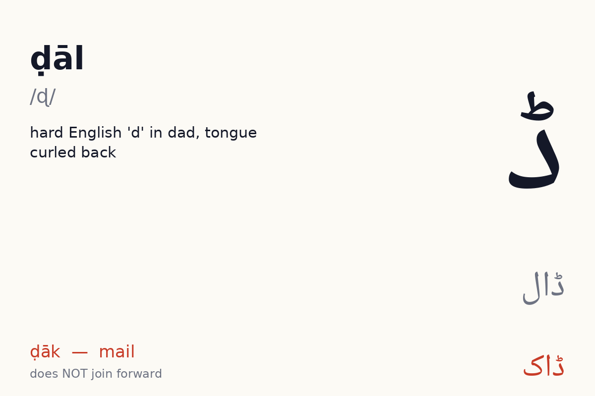
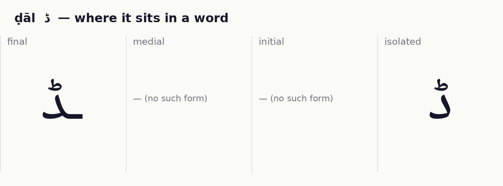
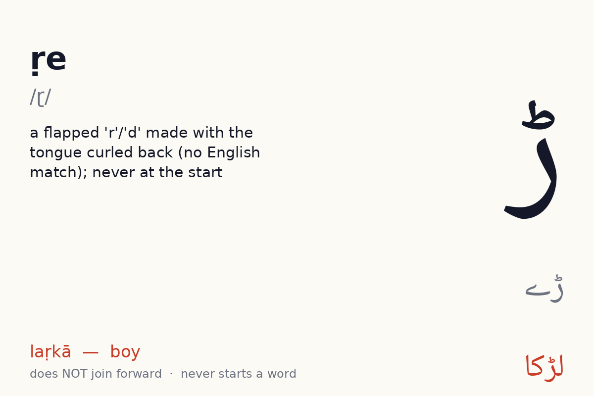
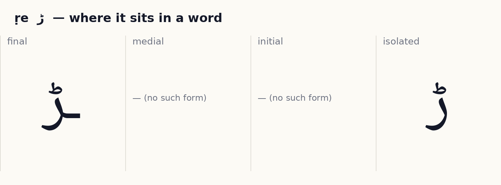
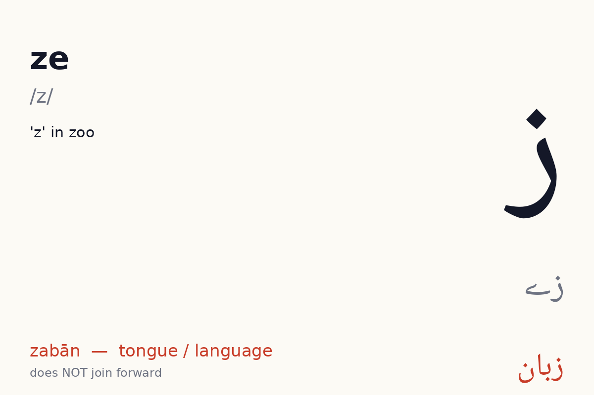
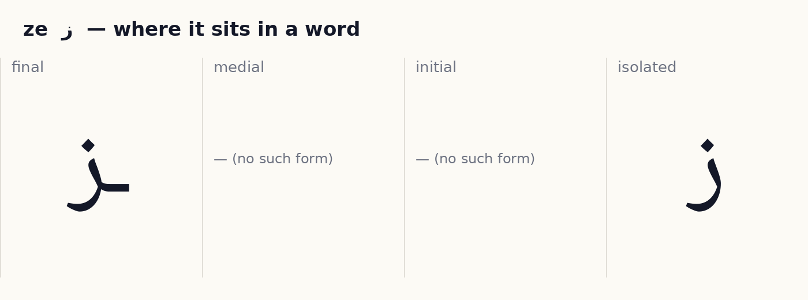
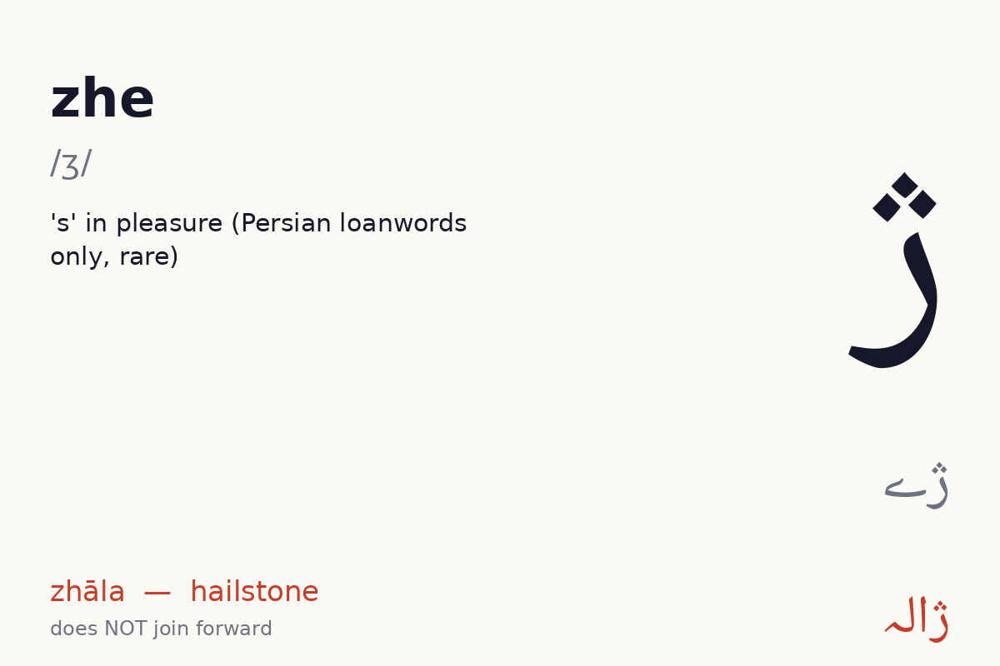
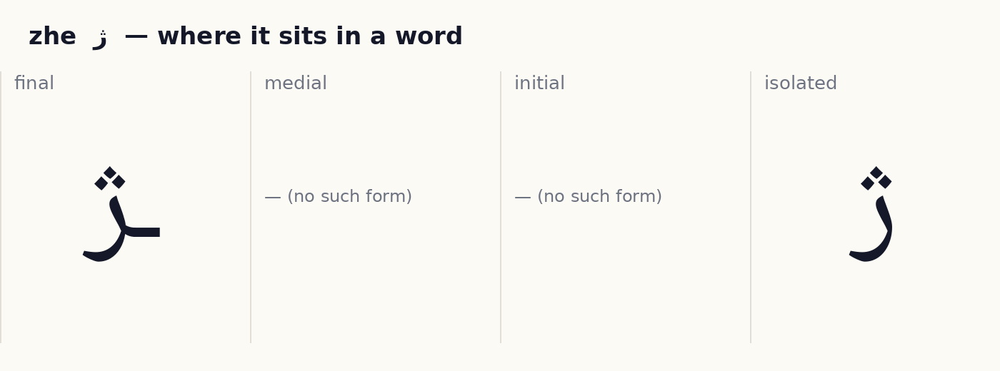

# Unit 7 — Retroflex and z  ·  ڈ ڑ ز ژ

**Focus:** Hard ڈ vs soft د; ڑ the flapped r that never starts a word; ز; the rare Persian ژ

## 1 · Hear it

| Letter | Name | Sound | Say it like… | Audio |
|---|---|---|---|---|
| ڈ | ḍāl (ڈال) | /ɖ/ | hard English 'd' in dad, tongue curled back | `assets/audio/names/ddal.mp3` · `assets/audio/words/ddal.mp3` (ڈاک ḍāk — mail) |
| ڑ | ṛe (ڑے) | /ɽ/ | a flapped 'r'/'d' made with the tongue curled back (no English match); never at the start | `assets/audio/names/rre.mp3` · `assets/audio/words/rre.mp3` (لڑکا laṛkā — boy) |
| ز | ze (زے) | /z/ | 'z' in zoo | `assets/audio/names/ze.mp3` · `assets/audio/words/ze.mp3` (زبان zabān — tongue / language) |
| ژ | zhe (ژے) | /ʒ/ | 's' in pleasure (Persian loanwords only, rare) | `assets/audio/names/zhe.mp3` · `assets/audio/words/zhe.mp3` (ژالہ zhāla — hailstone) |

## 2 · See it

**ڈ ḍāl** — does **not** join forward (2 forms: isolated, final).

**ڑ ṛe** — does **not** join forward (2 forms: isolated, final). No Urdu word begins with it.

**ز ze** — does **not** join forward (2 forms: isolated, final).

**ژ zhe** — does **not** join forward (2 forms: isolated, final).

## 3 · Tell it apart

- ڈ vs د — same body, different dots or marks. Drill: play `names/` audio for each, learner points at the right one. 10 rounds, shuffled.
- ڑ vs ر ز — same body, different dots or marks. Drill: play `names/` audio for each, learner points at the right one. 10 rounds, shuffled.
- ژ vs ز ر — same body, different dots or marks. Drill: play `names/` audio for each, learner points at the right one. 10 rounds, shuffled.

## 4 · Join it

Build each word from letter tiles, right to left. Watch which letters change shape and which refuse to join.

- ڈ + ا + ک  →  **ڈاک**  (ḍāk, mail)
- ڈ + ب + ہ  →  **ڈَبّہ**  (ḍabba, box)
- ل + ڑ + ک + ا  →  **لَڑْکا**  (laṛkā, boy)

## 5 · Read it

Vowel marks are shown. Read aloud, then play the audio and compare.

| Word | Say | Means | Audio |
|---|---|---|---|
| ڈاک | ḍāk | mail | `assets/audio/units/u07_00.mp3` |
| ڈَبّہ | ḍabba | box | `assets/audio/units/u07_01.mp3` |
| لَڑْکا | laṛkā | boy | `assets/audio/units/u07_02.mp3` |
| لَڑْکی | laṛkī | girl | `assets/audio/units/u07_03.mp3` |
| بَڑا | baṛā | big | `assets/audio/units/u07_04.mp3` |
| پَڑھنا | paṛhnā | to read | `assets/audio/units/u07_05.mp3` |
| زَبان | zabān | tongue / language | `assets/audio/units/u07_06.mp3` |
| زَمین | zamīn | earth | `assets/audio/units/u07_07.mp3` |
| ژَالہ | zhāla | hailstone | `assets/audio/units/u07_08.mp3` |
| روزانہ | rozāna | daily | `assets/audio/units/u07_09.mp3` |
| ڈھول | ḍhol | drum | `assets/audio/units/u07_10.mp3` |
| گُڑِیا | guṛiyā | doll | `assets/audio/units/u07_11.mp3` |
| سَڑَک | saṛak | road | `assets/audio/units/u07_12.mp3` |
| زَرْد | zard | yellow | `assets/audio/units/u07_13.mp3` |
| ڈَر | ḍar | fear | `assets/audio/units/u07_14.mp3` |
| کَپْڑا | kapṛā | cloth | `assets/audio/units/u07_15.mp3` |
| مَزا | mazā | fun | `assets/audio/units/u07_16.mp3` |
| اَنڈا | anḍā | egg | `assets/audio/units/u07_17.mp3` |
| ٹَھنڈا | ṭhanḍā | cold | `assets/audio/units/u07_18.mp3` |
| گَھڑی | ghaṛī | watch | `assets/audio/units/u07_19.mp3` |

**Sentences**

- لَڑْکا سَڑَک پَر ہَے  —  *laṛkā saṛak par hai*  —  the boy is on the road  · `assets/audio/sentences/u07_00.mp3`
- بَڑا ڈَبّہ  —  *baṛā ḍabba*  —  big box  · `assets/audio/sentences/u07_01.mp3`
- زَمین زَرْد ہَے  —  *zamīn zard hai*  —  the ground is yellow  · `assets/audio/sentences/u07_02.mp3`

## 6 · Write it

Trace each new letter in all its forms three times (children: required; adults: recommended). Use the forms card as the model. Then write these words from the list without looking: ڈاک, ڈَبّہ, لَڑْکا, لَڑْکی, بَڑا.

## 7 · Dictation

Play each clip twice. Learner writes the word. Then reveal.

1. `assets/audio/units/u07_14.mp3`
2. `assets/audio/units/u07_17.mp3`
3. `assets/audio/units/u07_01.mp3`
4. `assets/audio/units/u07_00.mp3`
5. `assets/audio/units/u07_07.mp3`

Answer key

1. ڈَر (ḍar)
2. اَنڈا (anḍā)
3. ڈَبّہ (ḍabba)
4. ڈاک (ḍāk)
5. زَمین (zamīn)

## 8 · Check (score 8/10 to move on)

1. Which one says **kapṛā** (cloth)?   (a) اَنڈا   (b) کَپْڑا   (c) لَڑْکا   (d) مَزا
2. Which one says **zhāla** (hailstone)?   (a) زَبان   (b) زَمین   (c) ژَالہ   (d) کَپْڑا
3. Which one says **ḍāk** (mail)?   (a) لَڑْکا   (b) ڈاک   (c) زَمین   (d) لَڑْکی
4. Which one says **ḍar** (fear)?   (a) ڈاک   (b) ڈَر   (c) گَھڑی   (d) بَڑا
5. Which one says **laṛkā** (boy)?   (a) زَمین   (b) مَزا   (c) لَڑْکا   (d) ڈھول
6. Which one says **guṛiyā** (doll)?   (a) زَبان   (b) روزانہ   (c) ٹَھنڈا   (d) گُڑِیا
7. Which one says **ṭhanḍā** (cold)?   (a) ژَالہ   (b) ٹَھنڈا   (c) مَزا   (d) ڈَر
8. Which one says **zard** (yellow)?   (a) زَرْد   (b) لَڑْکا   (c) بَڑا   (d) اَنڈا
9. Which one says **ḍabba** (box)?   (a) سَڑَک   (b) ڈَبّہ   (c) بَڑا   (d) روزانہ
10. Which one says **ḍhol** (drum)?   (a) کَپْڑا   (b) ڈھول   (c) مَزا   (d) ڈاک

Answer key

1. کَپْڑا
2. ژَالہ
3. ڈاک
4. ڈَر
5. لَڑْکا
6. گُڑِیا
7. ٹَھنڈا
8. زَرْد
9. ڈَبّہ
10. ڈھول

