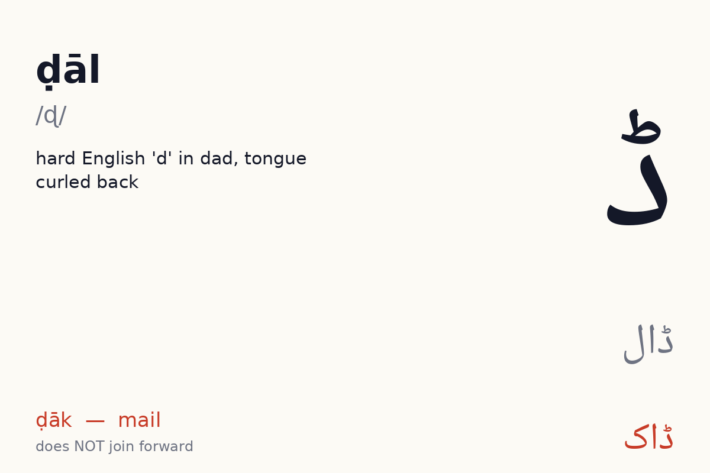
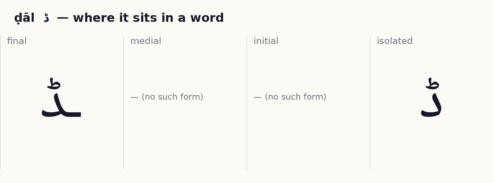
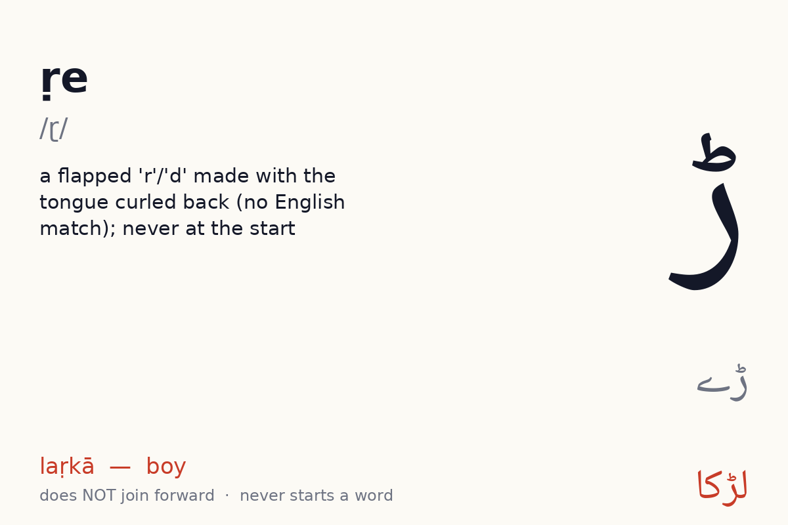
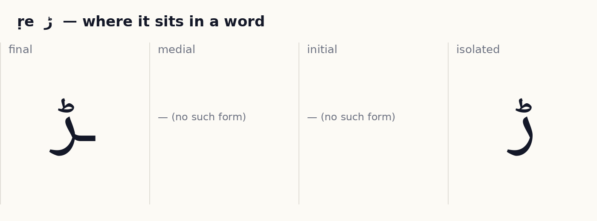
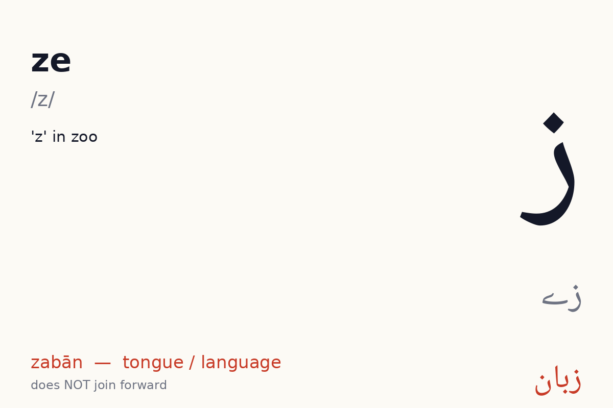
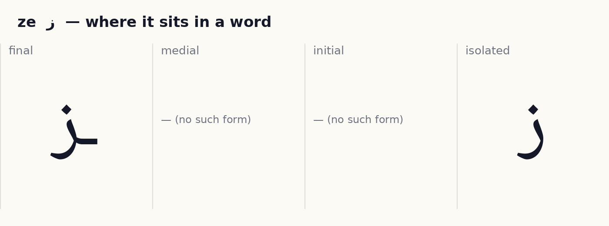
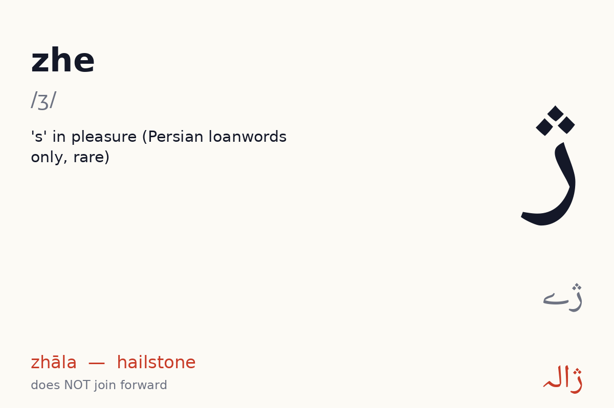
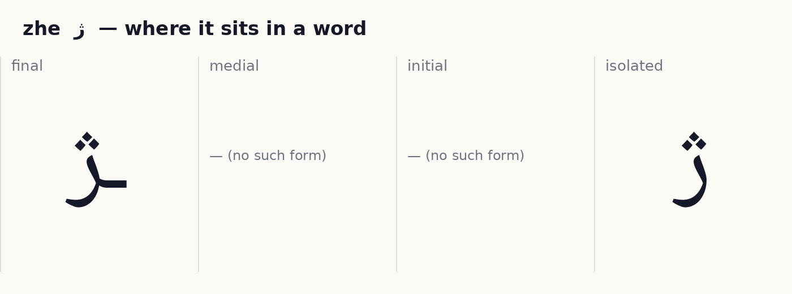

# Unit 7 — Retroflex and z  ·  ڈ ڑ ز ژ

**Focus:** Hard ڈ vs soft د; ڑ the flapped r that never starts a word; ز; the rare Persian ژ

**On the phone, this unit is these lessons, in order:** ḍāl ڈ → ṛe ڑ → ze ز → zhe ژ → Join them → Blend → Words 1 → Words 2 → Words 3 → Words 4 → Words 5 → Words 6 → Words 7 → Words 8 → Words 9 → Words 10 → Read → Unit check. Children rotate through them one at a time; the Unit check (8 of 10) unlocks the next unit.

## 1 · Hear it

| Letter | Name | Sound | Say it like… | Audio |
|---|---|---|---|---|
| ڈ | ḍāl (ڈال) | /ɖ/ | hard English 'd' in dad, tongue curled back | `assets/audio/names/ddal.mp3` · `assets/audio/words/ddal.mp3` (ڈاک ḍāk — mail) |
| ڑ | ṛe (ڑے) | /ɽ/ | a flapped 'r'/'d' made with the tongue curled back (no English match); never at the start | `assets/audio/names/rre.mp3` · `assets/audio/words/rre.mp3` (لڑکا laṛkā — boy) |
| ز | ze (زے) | /z/ | 'z' in zoo | `assets/audio/names/ze.mp3` · `assets/audio/words/ze.mp3` (زبان zabān — tongue / language) |
| ژ | zhe (ژے) | /ʒ/ | 's' in pleasure (Persian loanwords only, rare) | `assets/audio/names/zhe.mp3` · `assets/audio/words/zhe.mp3` (ژالہ zhāla — hailstone) |

## 2 · See it

**ڈ ḍāl** — does **not** join forward (2 forms: isolated, final).

✎ *How the pen moves:* start at the top, come down and out to the left in one angled stroke; never joins forward. (Right to left; dots and marks last, after the whole word. These are the conventional Naskh/Nastaliq stroke orders as taught in Pakistani qaida classes; no published study was found, see research/05_open_assets.md.)

**ڑ ṛe** — does **not** join forward (2 forms: isolated, final). No Urdu word begins with it.

✎ *How the pen moves:* start at the top and sweep down-left below the line; ز ژ dots after; never joins forward. (Right to left; dots and marks last, after the whole word. These are the conventional Naskh/Nastaliq stroke orders as taught in Pakistani qaida classes; no published study was found, see research/05_open_assets.md.)

**ز ze** — does **not** join forward (2 forms: isolated, final).

✎ *How the pen moves:* start at the top and sweep down-left below the line; ز ژ dots after; never joins forward. (Right to left; dots and marks last, after the whole word. These are the conventional Naskh/Nastaliq stroke orders as taught in Pakistani qaida classes; no published study was found, see research/05_open_assets.md.)

**ژ zhe** — does **not** join forward (2 forms: isolated, final).

✎ *How the pen moves:* start at the top and sweep down-left below the line; ز ژ dots after; never joins forward. (Right to left; dots and marks last, after the whole word. These are the conventional Naskh/Nastaliq stroke orders as taught in Pakistani qaida classes; no published study was found, see research/05_open_assets.md.)

## 3 · Tell it apart  ·  *recognition · self-check with audio*

- ڈ vs د — same body, different dots or marks. Drill: play `names/` audio for each, learner points at the right one. 10 rounds, shuffled.
- ڑ vs ر ز — same body, different dots or marks. Drill: play `names/` audio for each, learner points at the right one. 10 rounds, shuffled.
- ژ vs ز ر — same body, different dots or marks. Drill: play `names/` audio for each, learner points at the right one. 10 rounds, shuffled.

## 4 · Join it  ·  *production · self-check against the answer shown*

Build each word from letter tiles, right to left. Watch which letters change shape and which refuse to join.

- ز + ی + ا + د + ہ  →  **زِیادَہ**  (ziyāda, more, too much)
- ز + ب + ا + ن  →  **زَبان**  (zabān, tongue / language)
- ز + ن + د + گ + ی  →  **زِندَگی**  (zindagī, life)

## 4b · Blend  ·  *recognition · self-check with audio*

A letter plus a vowel letter makes a sound you can say. Play a syllable, learner points to it. Vowels available so far: ا ی و.

| Syllable | Audio |
|---|---|
| ڈا | `assets/audio/syllables/ddal_a.mp3` |
| ڈی | `assets/audio/syllables/ddal_i.mp3` |
| ڈو | `assets/audio/syllables/ddal_u.mp3` |
| زا | `assets/audio/syllables/ze_a.mp3` |
| زی | `assets/audio/syllables/ze_i.mp3` |
| زو | `assets/audio/syllables/ze_u.mp3` |
| ژا | `assets/audio/syllables/zhe_a.mp3` |
| ژی | `assets/audio/syllables/zhe_i.mp3` |
| ژو | `assets/audio/syllables/zhe_u.mp3` |

## 5 · Read it  ·  *reading aloud · self-check with audio, or a helper listens*

Vowel marks are shown. Read aloud, then play the audio and compare.

| Word | Say | Means | Audio |
|---|---|---|---|
| زِیادَہ | ziyāda | more, too much | `assets/audio/units/u07_00.mp3` |
| زَبان | zabān | tongue / language | `assets/audio/units/u07_01.mp3` |
| زِندَگی | zindagī | life | `assets/audio/units/u07_02.mp3` |
| گاڑی | gāṛī | car, vehicle | `assets/audio/units/u07_03.mp3` |
| بَڑی | baṛī | big | `assets/audio/units/u07_04.mp3` |
| اَنگریزی | angrezī | English | `assets/audio/units/u07_05.mp3` |
| بَڑا | baṛā | big | `assets/audio/units/u07_06.mp3` |
| ہَزار | hazār | thousand | `assets/audio/units/u07_07.mp3` |
| بَڑے | baṛe | big | `assets/audio/units/u07_08.mp3` |
| پیار | pyār | love | `assets/audio/units/u07_09.mp3` |
| مِہرْبانی | mehrbānī | kindness | `assets/audio/units/u07_10.mp3` |
| ڈاکْٹَر | ḍākṭar | doctor | `assets/audio/units/u07_11.mp3` |
| چھوڑ | chhoṛ | leave | `assets/audio/units/u07_12.mp3` |
| والِد | wālid | father | `assets/audio/units/u07_13.mp3` |
| تھوڑا | thoṛā | a little | `assets/audio/units/u07_14.mp3` |
| اُمّید | ummīd | hope | `assets/audio/units/u07_15.mp3` |
| زَمین | zamīn | earth | `assets/audio/units/u07_16.mp3` |
| لَڑْکی | laṛkī | girl | `assets/audio/units/u07_17.mp3` |
| گَھڑی | ghaṛī | watch | `assets/audio/units/u07_18.mp3` |
| اَمیر | amīr | rich | `assets/audio/units/u07_19.mp3` |
| زِندَہ | zinda | alive | `assets/audio/units/u07_20.mp3` |
| تیز | tez | fast, sharp | `assets/audio/units/u07_21.mp3` |
| چیز | chīz | thing | `assets/audio/units/u07_22.mp3` |
| والِدَہ | wālida | mother | `assets/audio/units/u07_23.mp3` |
| اَکثَر | aks̱ar | often | `assets/audio/units/u07_24.mp3` |
| سَڑَک | saṛak | road | `assets/audio/units/u07_25.mp3` |
| پَڑھا | paṛhā | read | `assets/audio/units/u07_26.mp3` |
| زور | zor | strength | `assets/audio/units/u07_27.mp3` |
| بَلکِہ | balki | rather, but also | `assets/audio/units/u07_28.mp3` |
| اِتوار | itwār | Sunday | `assets/audio/units/u07_29.mp3` |
| پَڑھنے | paṛhne | to read | `assets/audio/units/u07_30.mp3` |
| دَروازَہ | darwāza | door | `assets/audio/units/u07_31.mp3` |
| جَہاز | jahāz | ship, aeroplane | `assets/audio/units/u07_32.mp3` |
| پیر | pīr | Monday | `assets/audio/units/u07_33.mp3` |
| بَندَہ | banda | person | `assets/audio/units/u07_34.mp3` |
| روز | roz | day, daily | `assets/audio/units/u07_35.mp3` |
| چیزیں | chīzeṉ | things | `assets/audio/units/u07_36.mp3` |
| میز | mez | table | `assets/audio/units/u07_37.mp3` |
| پَڑھ | paṛh | read | `assets/audio/units/u07_38.mp3` |
| روزانہ | rozāna | daily | `assets/audio/units/u07_39.mp3` |
| نَوکری | naukrī | job | `assets/audio/units/u07_40.mp3` |
| کھَڑے | khaṛe | standing | `assets/audio/units/u07_41.mp3` |
| ڈَر | ḍar | fear | `assets/audio/units/u07_42.mp3` |
| اَنڈے | anḍe | eggs | `assets/audio/units/u07_43.mp3` |
| کھِڑکی | khiṛkī | window | `assets/audio/units/u07_44.mp3` |
| لَڑکے | laṛke | boys | `assets/audio/units/u07_45.mp3` |
| پَڑھو | paṛho | read! | `assets/audio/units/u07_46.mp3` |
| کھَڑی | khaṛī | standing | `assets/audio/units/u07_47.mp3` |
| تازَہ | tāza | fresh | `assets/audio/units/u07_48.mp3` |
| والِدَین | wālidain | parents | `assets/audio/units/u07_49.mp3` |
| بُزُرگ | buzurg | elderly person | `assets/audio/units/u07_50.mp3` |
| تھوڑی | thoṛī | a little | `assets/audio/units/u07_51.mp3` |
| لَڑْکا | laṛkā | boy | `assets/audio/units/u07_52.mp3` |
| راز | rāz | secret | `assets/audio/units/u07_53.mp3` |
| پَڑھنا | paṛhnā | to read | `assets/audio/units/u07_54.mp3` |
| تیزی | tezī | speed | `assets/audio/units/u07_55.mp3` |
| دَروازے | darwāze | doors | `assets/audio/units/u07_56.mp3` |
| ڈَرتے | ḍarte | are afraid | `assets/audio/units/u07_57.mp3` |
| کھَڑا | khaṛā | standing | `assets/audio/units/u07_58.mp3` |
| پَڑھتے | paṛhte | read | `assets/audio/units/u07_59.mp3` |
| چِڑِیا | chiṛiyā | sparrow, bird | `assets/audio/units/u07_60.mp3` |
| نَماز | namāz | prayer | `assets/audio/units/u07_61.mp3` |
| زَمانَہ | zamāna | time, age | `assets/audio/units/u07_62.mp3` |
| پَڑھتا | paṛhtā | reads | `assets/audio/units/u07_63.mp3` |
| پَہاڑ | pahāṛ | mountain | `assets/audio/units/u07_64.mp3` |
| بازار | bāzār | market | `assets/audio/units/u07_65.mp3` |
| بازی | bāzī | game, bet | `assets/audio/units/u07_66.mp3` |
| کَپْڑے | kapṛe | clothes | `assets/audio/units/u07_67.mp3` |
| کَمزور | kamzor | weak | `assets/audio/units/u07_68.mp3` |
| روزَہ | roza | fast | `assets/audio/units/u07_69.mp3` |
| جوڑا | joṛā | pair, couple | `assets/audio/units/u07_70.mp3` |
| بازو | bāzū | arm | `assets/audio/units/u07_71.mp3` |
| نازُک | nāzuk | delicate | `assets/audio/units/u07_72.mp3` |
| ہَرگِز | hargiz | never | `assets/audio/units/u07_73.mp3` |
| تَمیز | tamīz | manners | `assets/audio/units/u07_74.mp3` |
| ٹُکْڑا | ṭukṛā | piece | `assets/audio/units/u07_75.mp3` |
| داڑھی | dāṛhī | beard | `assets/audio/units/u07_76.mp3` |
| مَزے | maze | fun | `assets/audio/units/u07_77.mp3` |
| پَڑھتی | paṛhtī | reads | `assets/audio/units/u07_78.mp3` |
| ڈِبّے | ḍibbe | boxes | `assets/audio/units/u07_79.mp3` |
| کیڑا | kīṛā | insect, worm | `assets/audio/units/u07_80.mp3` |
| ڈَبّہ | ḍabba | box | `assets/audio/units/u07_81.mp3` |
| بوڑھی | būṛhī | old woman | `assets/audio/units/u07_82.mp3` |
| ٹیڑھا | ṭeṛhā | crooked | `assets/audio/units/u07_83.mp3` |
| مَزیدار | mazedār | tasty | `assets/audio/units/u07_84.mp3` |
| لَڑکِیاں | laṛkiyāṉ | girls | `assets/audio/units/u07_85.mp3` |
| سیکَنڈ | sekanḍ | second | `assets/audio/units/u07_86.mp3` |
| زَبَردَست | zabardast | excellent | `assets/audio/units/u07_87.mp3` |
| ٹَھنڈا | ṭhanḍā | cold | `assets/audio/units/u07_88.mp3` |
| پَڑوسی | paṛosī | neighbour | `assets/audio/units/u07_89.mp3` |
| ٹرَک | ṭrak | truck | `assets/audio/units/u07_90.mp3` |
| ڈھول | ḍhol | drum | `assets/audio/units/u07_91.mp3` |
| چھوڑنا | chhoṛnā | to leave, let go | `assets/audio/units/u07_92.mp3` |
| لَڑنا | laṛnā | to fight | `assets/audio/units/u07_93.mp3` |
| کَڑوا | kaṛwā | bitter | `assets/audio/units/u07_94.mp3` |
| زَینَب | zainab | Zainab | `assets/audio/units/u07_95.mp3` |
| مَزدور | mazdūr | labourer | `assets/audio/units/u07_96.mp3` |
| دَوڑ | dauṛ | race, run | `assets/audio/units/u07_97.mp3` |
| ڈاک | ḍāk | mail | `assets/audio/units/u07_98.mp3` |
| ہَڈّی | haḍḍī | bone | `assets/audio/units/u07_99.mp3` |
| ڈیڑھ | ḍeṛh | one and a half | `assets/audio/units/u07_100.mp3` |
| وَرنہ | warna | otherwise | `assets/audio/units/u07_101.mp3` |
| کَپْڑا | kapṛā | cloth | `assets/audio/units/u07_102.mp3` |
| زَنجیر | zanjīr | chain | `assets/audio/units/u07_103.mp3` |
| زیوَر | zewar | jewellery | `assets/audio/units/u07_104.mp3` |
| زَرْد | zard | yellow | `assets/audio/units/u07_105.mp3` |
| ڈھیر | ḍher | heap | `assets/audio/units/u07_106.mp3` |
| سیڑھی | sīṛhī | stairs, ladder | `assets/audio/units/u07_107.mp3` |
| زَیتون | zaitūn | olive | `assets/audio/units/u07_108.mp3` |
| بوڑھا | būṛhā | old man | `assets/audio/units/u07_109.mp3` |
| دَرزی | darzī | tailor | `assets/audio/units/u07_110.mp3` |
| ڈالنا | ḍālnā | to put, pour | `assets/audio/units/u07_111.mp3` |
| ہوشْیار | hoshyār | clever, alert | `assets/audio/units/u07_112.mp3` |
| بَڑھنا | baṛhnā | to grow, advance | `assets/audio/units/u07_113.mp3` |
| گُڑ | guṛ | jaggery | `assets/audio/units/u07_114.mp3` |
| اَنڈا | anḍā | egg | `assets/audio/units/u07_115.mp3` |
| بَڑھِیا | baṛhiyā | great, first-rate | `assets/audio/units/u07_116.mp3` |
| مَزا | mazā | fun | `assets/audio/units/u07_117.mp3` |
| ڈَرنا | ḍarnā | to be afraid | `assets/audio/units/u07_118.mp3` |
| ڈھونڈنا | ḍhūnḍnā | to look for | `assets/audio/units/u07_119.mp3` |
| گُڑِیا | guṛiyā | doll | `assets/audio/units/u07_120.mp3` |
| مُڑنا | muṛnā | to turn | `assets/audio/units/u07_121.mp3` |
| ژَالہ | zhāla | hailstone | `assets/audio/units/u07_122.mp3` |

**Sentences**

- لَڑْکا سَڑَک پَر ہَے  —  *laṛkā saṛak par hai*  —  the boy is on the road  · `assets/audio/sentences/u07_00.mp3`
- لَڑْکی بَڑی ہوشْیار ہَے  —  *laṛkī baṛī hoshyār hai*  —  the girl is very clever  · `assets/audio/sentences/u07_01.mp3`
- زَینَب روز کِتاب پَڑھتی ہَے  —  *zainab roz kitāb paṛhtī hai*  —  Zainab reads a book every day  · `assets/audio/sentences/u07_02.mp3`
- ڈاکْٹَر کی گاڑی بَڑی ہَے  —  *ḍākṭar kī gāṛī baṛī hai*  —  the doctor's car is big  · `assets/audio/sentences/u07_03.mp3`
- بازار مَیں بَہُت چیزیں ہَیں  —  *bāzār meṉ bahut chīzeṉ haiṉ*  —  there are many things in the market  · `assets/audio/sentences/u07_04.mp3`
- دَروازَہ بَند ہَے  —  *darwāza band hai*  —  the door is closed  · `assets/audio/sentences/u07_05.mp3`
- کھِڑکی کے پاس میز ہَے  —  *khiṛkī ke pās mez hai*  —  there is a table near the window  · `assets/audio/sentences/u07_06.mp3`
- پَہاڑ بَہُت اونچا ہَے  —  *pahāṛ bahut ūnchā hai*  —  the mountain is very high  · `assets/audio/sentences/u07_07.mp3`
- مَزدور بَہُت کام کَرتا ہَے  —  *mazdūr bahut kām kartā hai*  —  the labourer works a lot  · `assets/audio/sentences/u07_08.mp3`
- دَرزی کے پاس کَپْڑے ہَیں  —  *darzī ke pās kapṛe haiṉ*  —  the tailor has clothes  · `assets/audio/sentences/u07_09.mp3`
- اَنڈے تازَہ ہَیں  —  *anḍe tāza haiṉ*  —  the eggs are fresh  · `assets/audio/sentences/u07_10.mp3`
- ہَم روز اِسکول پَڑھنے جاتے ہَیں  —  *ham roz iskūl paṛhne jāte haiṉ*  —  we go to school to study every day  · `assets/audio/sentences/u07_11.mp3`
- ڈَرنا مَت  —  *ḍarnā mat*  —  don't be afraid  · `assets/audio/sentences/u07_12.mp3`
- ڈاکْٹَر بیمار کو دَوا دیتا ہَے  —  *ḍākṭar bīmār ko dawā detā hai*  —  the doctor gives the sick person medicine  · `assets/audio/sentences/u07_13.mp3`
- لَڑکے بازار مَیں کھیلتے ہَیں  —  *laṛke bāzār meṉ khelte haiṉ*  —  the boys play in the market  · `assets/audio/sentences/u07_14.mp3`
- گاڑی بَہُت تیز ہَے  —  *gāṛī bahut tez hai*  —  the car is very fast  · `assets/audio/sentences/u07_15.mp3`
- نانی کے پاس زیوَر ہَے  —  *nānī ke pās zewar hai*  —  grandma has jewellery  · `assets/audio/sentences/u07_16.mp3`
- زَینَب کی گُڑِیا بَڑی ہَے  —  *zainab kī guṛiyā baṛī hai*  —  Zainab's doll is big  · `assets/audio/sentences/u07_17.mp3`
- ڈِبّے مَیں اَنڈے ہَیں  —  *ḍibbe meṉ anḍe haiṉ*  —  there are eggs in the box  · `assets/audio/sentences/u07_18.mp3`

**Passage** (94 words) · `assets/audio/passages/u07.mp3`

> زَینَب ایک ہوشْیار لَڑْکی ہَے۔ وُہ روز اِسکول جاتی ہَے۔ اِسکول بازار کے پاس ہَے۔ بازار مَیں بَہُت چیزیں ہَیں۔ دُکان پَر اَنڈے اَور کَپْڑے ہَیں۔ اَنڈے تازَہ ہَیں۔ زَینَب کا اَبُّو بازار مَیں کام کَرتا ہَے۔ اَبُّو کے پاس بَڑی گاڑی ہَے۔ شام کو اَبُّو گَھر جاتا ہَے۔ زَینَب اَپنی کِتاب پَڑھتی ہَے۔ زَینَب کا کَمْرہ بَہُت بَڑا ہَے۔ زَینَب کی زِندَگی بَہُت اَچّھی ہَے۔ ڈاکْٹَر کی گاڑی بَہُت تیز ہَے۔ لَڑکے بازار مَیں کھیلتے ہَیں۔ بوڑھی نانی کے پاس زیوَر ہَے۔ ڈاکْٹَر روز اِسکول جاتا ہَے۔ لَڑْکی ڈاکْٹَر کو کِتاب دیتی ہَے۔
>
> *zainab ek hoshyār laṛkī hai. woh roz iskūl jātī hai. iskūl bāzār ke pās hai. bāzār meṉ bahut chīzeṉ haiṉ. dukān par anḍe aur kapṛe haiṉ. anḍe tāza haiṉ. zainab kā abbū bāzār meṉ kām kartā hai. abbū ke pās baṛī gāṛī hai. shām ko abbū ghar jātā hai. zainab apnī kitāb paṛhtī hai. zainab kā kamra bahut baṛā hai. zainab kī zindagī bahut achchhī hai. ḍākṭar kī gāṛī bahut tez hai. laṛke bāzār meṉ khelte haiṉ. būṛhī nānī ke pās zewar hai. ḍākṭar roz iskūl jātā hai. laṛkī ḍākṭar ko kitāb detī hai.*
>
> Zainab is a clever girl. She goes to school every day. The school is near the market. There are many things in the market. At the shop there are eggs and clothes. The eggs are fresh. Zainab's dad works in the market. Dad has a big car. In the evening dad goes home. Zainab reads her book. Zainab's room is very big. Zainab's life is very good. The doctor's car is very fast. The boys play in the market. Old grandma has jewellery. The doctor goes to school every day. The girl gives the doctor a book.

## 6 · Write it  ·  *production · needs a helper or the app tracer to check*

Trace each new letter in all its forms three times (children: required; adults: recommended). Use the forms card as the model. Then write these words from the list without looking: زِیادَہ, زَبان, زِندَگی, گاڑی, بَڑی.

Pen movement for each letter is described in step 2 above.

## 7 · Dictation  ·  *production · self-check with the key below*

Play each clip twice. Learner writes the word. Then reveal.

1. `assets/audio/units/u07_00.mp3`
2. `assets/audio/units/u07_42.mp3`
3. `assets/audio/units/u07_48.mp3`
4. `assets/audio/units/u07_10.mp3`
5. `assets/audio/units/u07_60.mp3`

Answer key

1. زِیادَہ (ziyāda)
2. ڈَر (ḍar)
3. تازَہ (tāza)
4. مِہرْبانی (mehrbānī)
5. چِڑِیا (chiṛiyā)

## 8 · Check (score 8/10 to move on)  ·  *recognition · self-check*

1. Which one says **roz** (day, daily)?   (a) گَھڑی   (b) ڈاکْٹَر   (c) روز   (d) لَڑْکا
2. Which one says **pahāṛ** (mountain)?   (a) مِہرْبانی   (b) کَمزور   (c) پَہاڑ   (d) ٹُکْڑا
3. Which one says **ṭeṛhā** (crooked)?   (a) والِدَین   (b) ٹیڑھا   (c) ڈاک   (d) داڑھی
4. Which one says **saṛak** (road)?   (a) اَنگریزی   (b) گَھڑی   (c) ٹیڑھا   (d) سَڑَک
5. Which one says **darwāza** (door)?   (a) دَروازَہ   (b) زیوَر   (c) ٹرَک   (d) بازار
6. Which one says **haḍḍī** (bone)?   (a) ہَڈّی   (b) زِندَگی   (c) زَنجیر   (d) ڈھیر
7. Which one says **ziyāda** (more, too much)?   (a) زِیادَہ   (b) ڈاکْٹَر   (c) ٹیڑھا   (d) پَڑھنے
8. Which one says **ḍākṭar** (doctor)?   (a) سیڑھی   (b) ڈاکْٹَر   (c) نازُک   (d) کھَڑا
9. Which one says **pīr** (Monday)?   (a) زِیادَہ   (b) پَڑھتے   (c) بَندَہ   (d) پیر
10. Which one says **zewar** (jewellery)?   (a) مَزیدار   (b) زیوَر   (c) کَپْڑے   (d) بَڑے

Answer key

1. روز
2. پَہاڑ
3. ٹیڑھا
4. سَڑَک
5. دَروازَہ
6. ہَڈّی
7. زِیادَہ
8. ڈاکْٹَر
9. پیر
10. زیوَر

