# Unit 8 — Sounds from Arabic and Persian  ·  عربی فارسی کے حرف

**Focus:** Six letters common in everyday Urdu loanwords; ع mostly a vowel seat; ح same sound as ہ

## 1 · Hear it

| Letter | Name | Sound | Say it like… | Audio |
|---|---|---|---|---|
| ف | fe (فے) | /f/ | 'f' in fat | `assets/audio/names/fe.mp3` · `assets/audio/words/fe.mp3` (فرش farsh — floor) |
| ق | qāf (قاف) | /q/ | a 'k' made far back in the throat (Arabic loanwords) | `assets/audio/names/qaf.mp3` · `assets/audio/words/qaf.mp3` (قلم qalam — pen) |
| خ | k͟he (خے) | /x/ | 'ch' in Scottish loch | `assets/audio/names/khe.mp3` · `assets/audio/words/khe.mp3` (خط k͟hat — letter) |
| غ | g͟hain (غین) | /ɣ/ | a gargled 'g', like the French 'r' | `assets/audio/names/ghain.mp3` · `assets/audio/words/ghain.mp3` (غریب g͟harīb — poor) |
| ع | ʻain (عین) | /ʔ / vowel/ | in Urdu it mostly just carries the vowel written around it (عمر umar) | `assets/audio/names/ain.mp3` · `assets/audio/words/ain.mp3` (عمر ʻumr — age) |
| ح | baṛī ḥe (بڑی حے) | /ɦ/ | 'h' in hat (Arabic loanwords) | `assets/audio/names/bari_he.mp3` · `assets/audio/words/bari_he.mp3` (حال ḥāl — condition) |

## 2 · See it

**ف fe** — joins forward (4 forms).

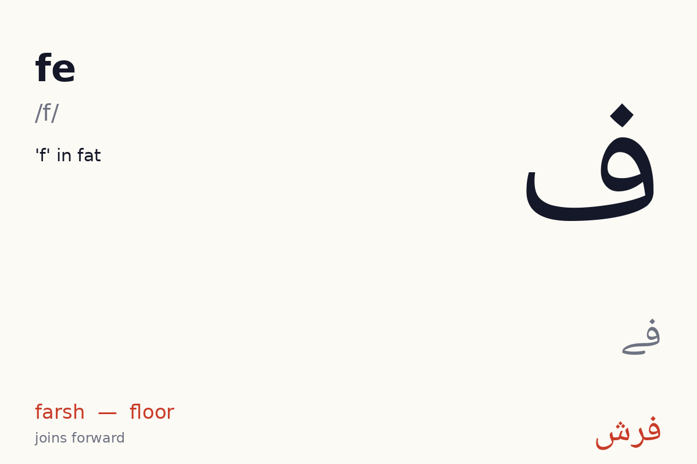
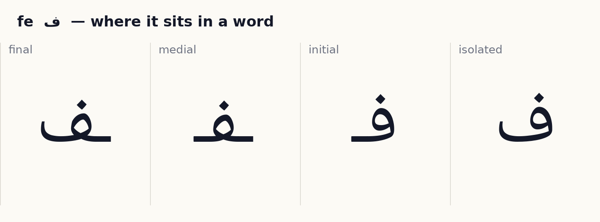

**ق qāf** — joins forward (4 forms).

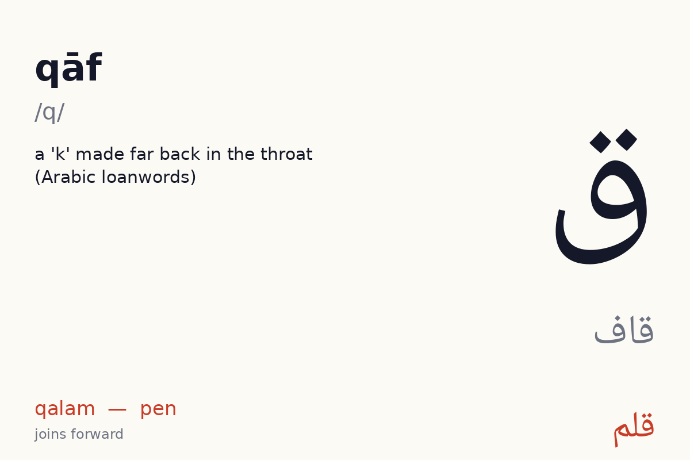
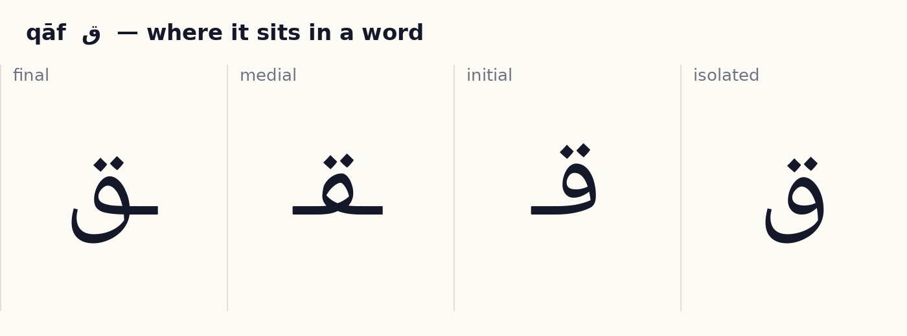

**خ k͟he** — joins forward (4 forms).

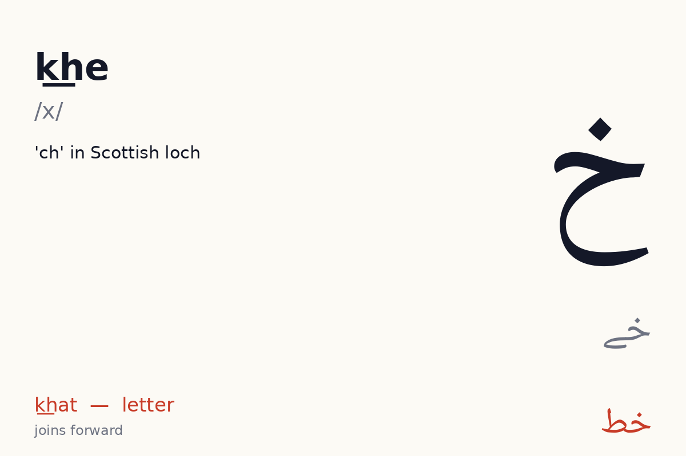
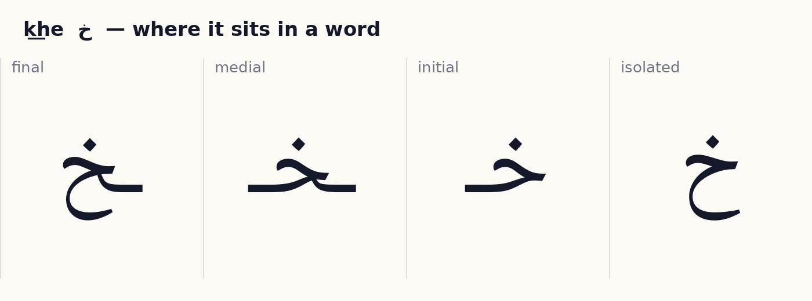

**غ g͟hain** — joins forward (4 forms).

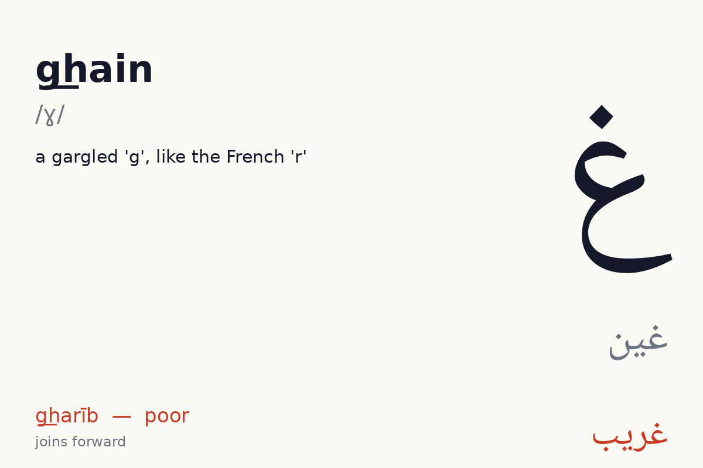
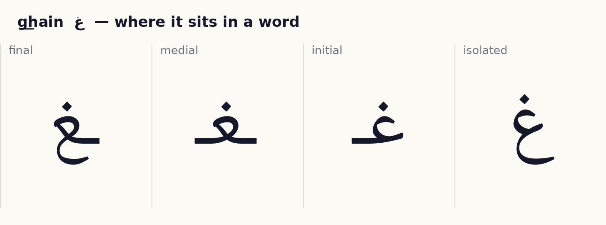

**ع ʻain** — joins forward (4 forms).

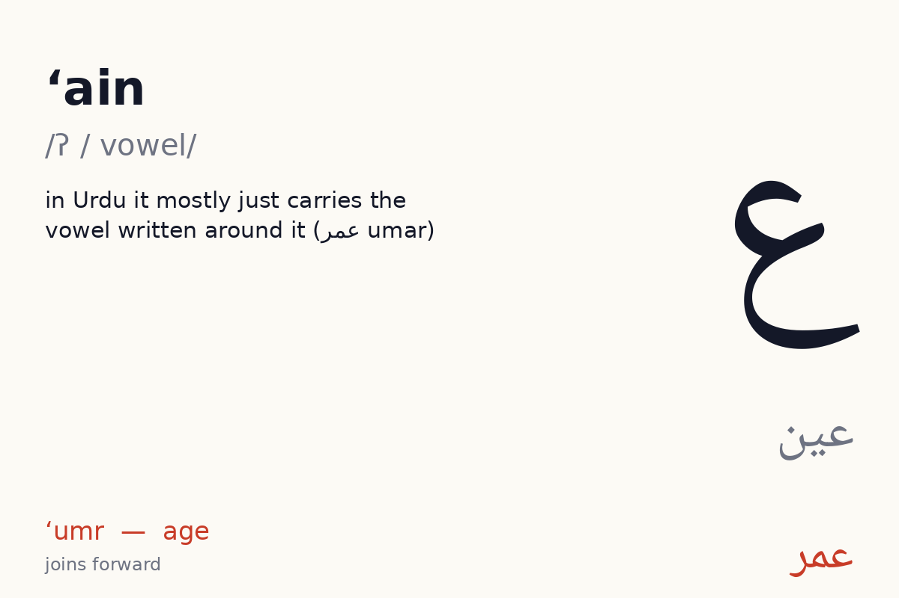
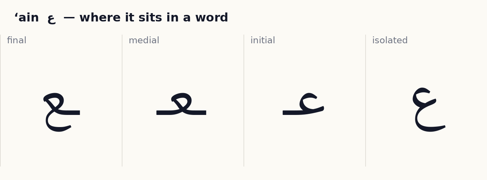

**ح baṛī ḥe** — joins forward (4 forms).

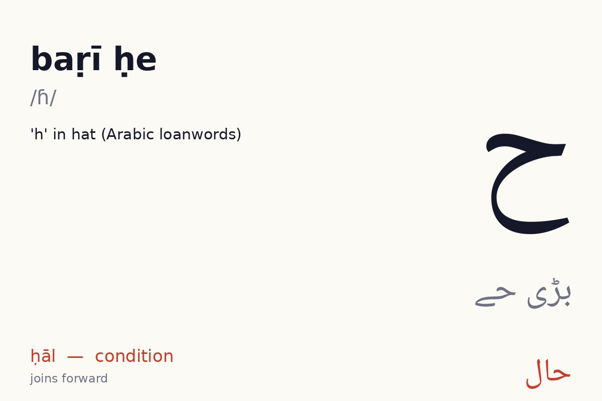
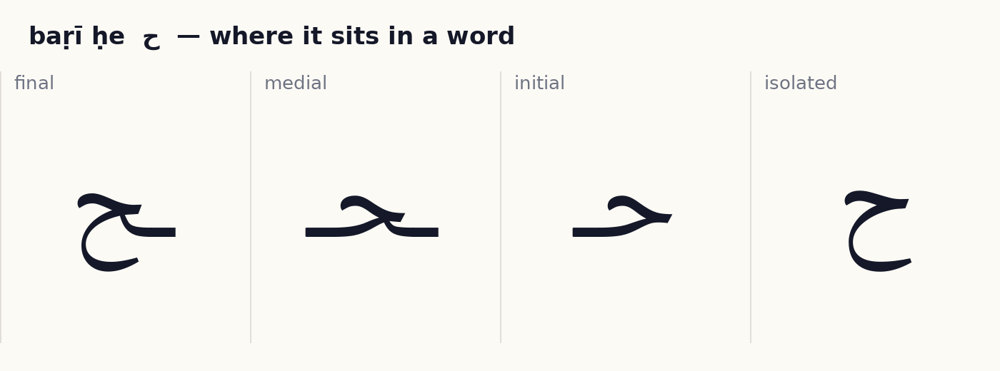

## 3 · Tell it apart  ·  *recognition · self-check with audio*

- ف vs ق — same body, different dots or marks. Drill: play `names/` audio for each, learner points at the right one. 10 rounds, shuffled.
- خ vs ج چ ح — same body, different dots or marks. Drill: play `names/` audio for each, learner points at the right one. 10 rounds, shuffled.
- غ vs ع — same body, different dots or marks. Drill: play `names/` audio for each, learner points at the right one. 10 rounds, shuffled.

## 4 · Join it  ·  *production · self-check against the answer shown*

Build each word from letter tiles, right to left. Watch which letters change shape and which refuse to join.

- ف + ر + ش  →  **فَرْش**  (farsh, floor)
- ف + و + ن  →  **فون**  (fon, phone)
- ق + ل + م  →  **قَلَم**  (qalam, pen)

## 5 · Read it  ·  *reading aloud · self-check with audio, or a helper listens*

Vowel marks are shown. Read aloud, then play the audio and compare.

| Word | Say | Means | Audio |
|---|---|---|---|
| فَرْش | farsh | floor | `assets/audio/units/u08_00.mp3` |
| فون | fon | phone | `assets/audio/units/u08_01.mp3` |
| قَلَم | qalam | pen | `assets/audio/units/u08_02.mp3` |
| قَمیض | qamīẕ | shirt (ض preview) | `assets/audio/units/u08_03.mp3` |
| خَط | k͟hat | letter (ط preview) | `assets/audio/units/u08_04.mp3` |
| خُوش | k͟hush | happy | `assets/audio/units/u08_05.mp3` |
| غَریب | g͟harīb | poor | `assets/audio/units/u08_06.mp3` |
| باغ | bāg͟h | garden | `assets/audio/units/u08_07.mp3` |
| عُمْر | ʻumr | age | `assets/audio/units/u08_08.mp3` |
| عِلْم | ʻilm | knowledge | `assets/audio/units/u08_09.mp3` |
| حال | ḥāl | condition | `assets/audio/units/u08_10.mp3` |
| حَلْوہ | ḥalwa | halwa | `assets/audio/units/u08_11.mp3` |
| صاف | ṣāf | clean (ص preview) | `assets/audio/units/u08_12.mp3` |
| فَوج | fauj | army | `assets/audio/units/u08_13.mp3` |
| وَقْت | waqt | time | `assets/audio/units/u08_14.mp3` |
| خالی | k͟hālī | empty | `assets/audio/units/u08_15.mp3` |
| غَم | g͟ham | grief | `assets/audio/units/u08_16.mp3` |
| عام | ʻām | common | `assets/audio/units/u08_17.mp3` |
| حِساب | ḥisāb | maths | `assets/audio/units/u08_18.mp3` |
| دَفْتَر | daftar | office | `assets/audio/units/u08_19.mp3` |

**Sentences**

- قَلَم کَہاں ہَے  —  *qalam kahāṉ hai*  —  where is the pen  · `assets/audio/sentences/u08_00.mp3`
- باغ خالی ہَے  —  *bāg͟h k͟hālī hai*  —  the garden is empty  · `assets/audio/sentences/u08_01.mp3`
- وَقْت کیا ہُوا ہَے  —  *waqt kyā huā hai*  —  what time is it  · `assets/audio/sentences/u08_02.mp3`

## 6 · Write it  ·  *production · needs a helper or the app tracer to check*

Trace each new letter in all its forms three times (children: required; adults: recommended). Use the forms card as the model. Then write these words from the list without looking: فَرْش, فون, قَلَم, قَمیض, خَط.

**How the pen moves.** Urdu is written right to left and each letter body is drawn in one stroke where possible; dots and small marks are added last, after the whole word.

- ف fe: small loop at the top, then the long shallow bowl (ف) or deep bowl (ق) leftwards; dots after.
- ق qāf: small loop at the top, then the long shallow bowl (ف) or deep bowl (ق) leftwards; dots after.
- خ k͟he: start at the top-right with the small head stroke going left, then drop into the round bowl below; dot after.
- غ g͟hain: small c-shape at the top opening right, then the bowl beneath; dot after for غ.
- ع ʻain: small c-shape at the top opening right, then the bowl beneath; dot after for غ.
- ح baṛī ḥe: start at the top-right with the small head stroke going left, then drop into the round bowl below; dot after.

## 7 · Dictation  ·  *production · self-check with the key below*

Play each clip twice. Learner writes the word. Then reveal.

1. `assets/audio/units/u08_03.mp3`
2. `assets/audio/units/u08_10.mp3`
3. `assets/audio/units/u08_00.mp3`
4. `assets/audio/units/u08_18.mp3`
5. `assets/audio/units/u08_16.mp3`

Answer key

1. قَمیض (qamīẕ)
2. حال (ḥāl)
3. فَرْش (farsh)
4. حِساب (ḥisāb)
5. غَم (g͟ham)

## 8 · Check (score 8/10 to move on)  ·  *recognition · self-check*

1. Which one says **ṣāf** (clean (ص preview))?   (a) حَلْوہ   (b) دَفْتَر   (c) قَلَم   (d) صاف
2. Which one says **qamīẕ** (shirt (ض preview))?   (a) خُوش   (b) قَمیض   (c) فون   (d) حال
3. Which one says **g͟harīb** (poor)?   (a) صاف   (b) غَریب   (c) وَقْت   (d) فَرْش
4. Which one says **farsh** (floor)?   (a) فَرْش   (b) باغ   (c) حِساب   (d) قَمیض
5. Which one says **ʻilm** (knowledge)?   (a) غَم   (b) فون   (c) حال   (d) عِلْم
6. Which one says **k͟hat** (letter (ط preview))?   (a) دَفْتَر   (b) عِلْم   (c) خَط   (d) حال
7. Which one says **k͟hush** (happy)?   (a) غَم   (b) خُوش   (c) فَوج   (d) حال
8. Which one says **fon** (phone)?   (a) غَم   (b) عُمْر   (c) فون   (d) حِساب
9. Which one says **ʻām** (common)?   (a) عام   (b) غَریب   (c) باغ   (d) حِساب
10. Which one says **ḥalwa** (halwa)?   (a) عُمْر   (b) غَریب   (c) فَرْش   (d) حَلْوہ

Answer key

1. صاف
2. قَمیض
3. غَریب
4. فَرْش
5. عِلْم
6. خَط
7. خُوش
8. فون
9. عام
10. حَلْوہ

