# Unit 8 — Sounds from Arabic and Persian  ·  عربی فارسی کے حرف

**Focus:** Six letters common in everyday Urdu loanwords; ع mostly a vowel seat; ح same sound as ہ

**On the phone, this unit is these lessons, in order:** fe ف → qāf ق → k͟he خ → g͟hain غ → ʻain ع → baṛī ḥe ح → Join them → Blend → Words 1 → Words 2 → Words 3 → Words 4 → Words 5 → Words 6 → Words 7 → Words 8 → Words 9 → Read → Unit check. Children rotate through them one at a time; the Unit check (8 of 10) unlocks the next unit.

## 1 · Hear it

| Letter | Name | Sound | Say it like… | Audio |
|---|---|---|---|---|
| ف | fe (فے) | /f/ | 'f' in fat | `assets/audio/names/fe.mp3` · `assets/audio/words/fe.mp3` (فرش farsh — floor) |
| ق | qāf (قاف) | /q/ | a 'k' made far back in the throat (Arabic loanwords) | `assets/audio/names/qaf.mp3` · `assets/audio/words/qaf.mp3` (قلم qalam — pen) |
| خ | k͟he (خے) | /x/ | 'ch' in Scottish loch | `assets/audio/names/khe.mp3` · `assets/audio/words/khe.mp3` (خط k͟hat — letter) |
| غ | g͟hain (غین) | /ɣ/ | a gargled 'g', like the French 'r' | `assets/audio/names/ghain.mp3` · `assets/audio/words/ghain.mp3` (غریب g͟harīb — poor) |
| ع | ʻain (عین) | /ʔ / vowel/ | in Urdu it mostly just carries the vowel written around it (عمر umar) | `assets/audio/names/ain.mp3` · `assets/audio/words/ain.mp3` (عمر ʻumr — age) |
| ح | baṛī ḥe (بڑی حے) | /ɦ/ | 'h' in hat (Arabic loanwords) | `assets/audio/names/bari_he.mp3` · `assets/audio/words/bari_he.mp3` (حال ḥāl — condition) |

## 2 · See it

**ف fe** — joins forward (4 forms).

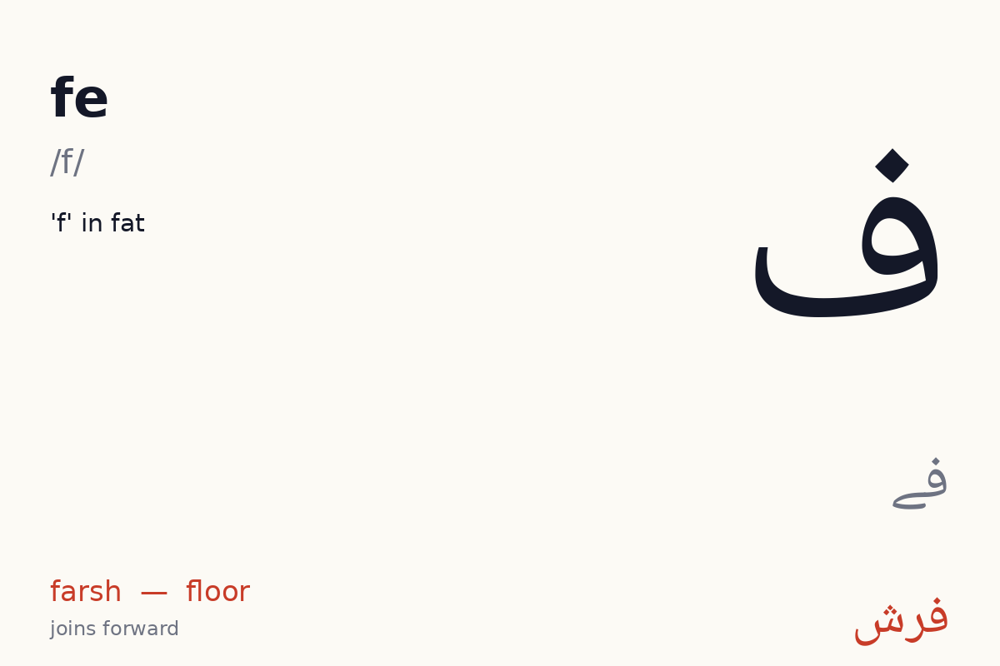
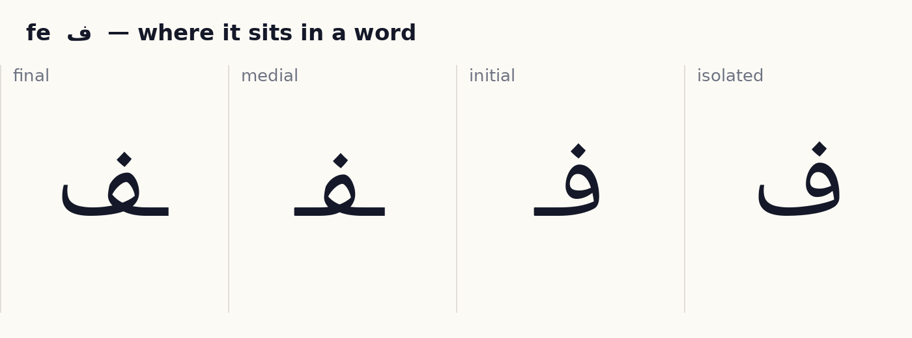

✎ *How the pen moves:* small loop at the top, then the long shallow bowl (ف) or deep bowl (ق) leftwards; dots after. (Right to left; dots and marks last, after the whole word. These are the conventional Naskh/Nastaliq stroke orders as taught in Pakistani qaida classes; no published study was found, see research/05_open_assets.md.)

**ق qāf** — joins forward (4 forms).

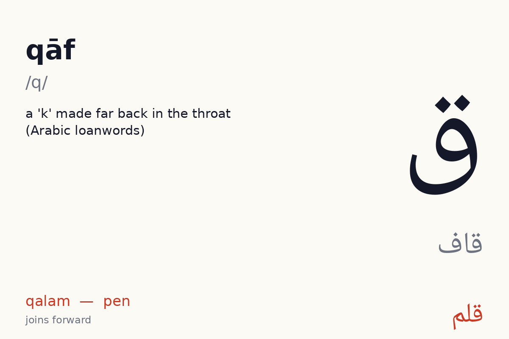
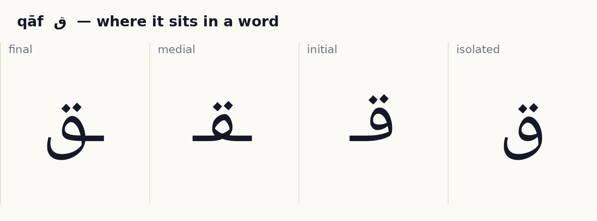

✎ *How the pen moves:* small loop at the top, then the long shallow bowl (ف) or deep bowl (ق) leftwards; dots after. (Right to left; dots and marks last, after the whole word. These are the conventional Naskh/Nastaliq stroke orders as taught in Pakistani qaida classes; no published study was found, see research/05_open_assets.md.)

**خ k͟he** — joins forward (4 forms).

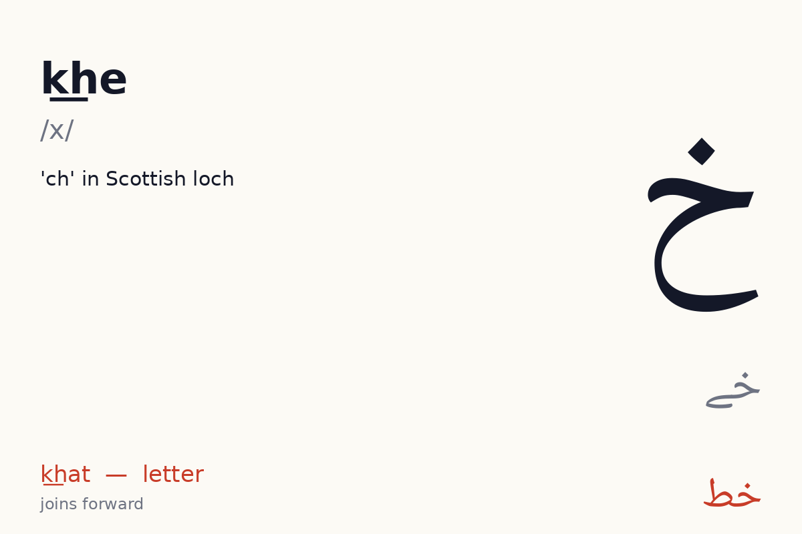
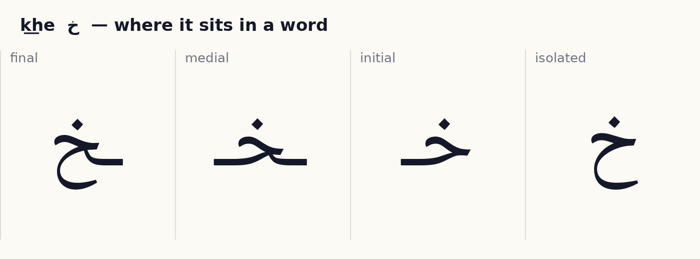

✎ *How the pen moves:* start at the top-right with the small head stroke going left, then drop into the round bowl below; dot after. (Right to left; dots and marks last, after the whole word. These are the conventional Naskh/Nastaliq stroke orders as taught in Pakistani qaida classes; no published study was found, see research/05_open_assets.md.)

**غ g͟hain** — joins forward (4 forms).

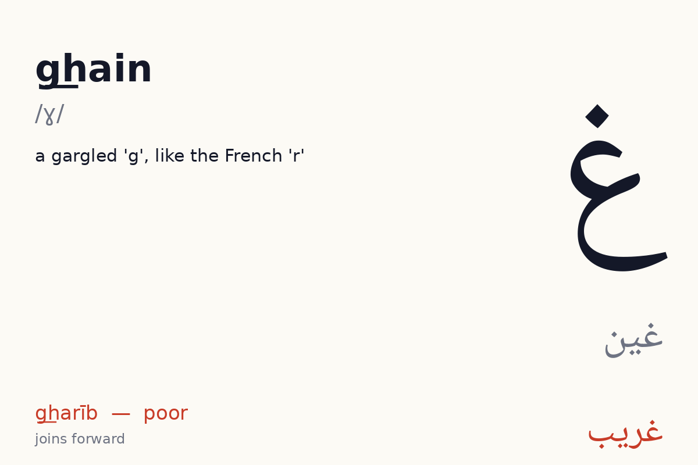
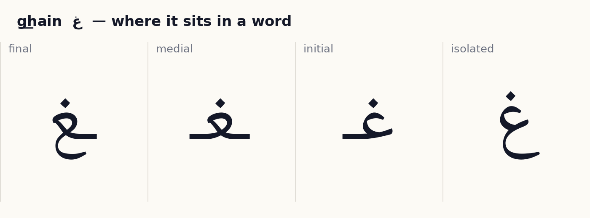

✎ *How the pen moves:* small c-shape at the top opening right, then the bowl beneath; dot after for غ. (Right to left; dots and marks last, after the whole word. These are the conventional Naskh/Nastaliq stroke orders as taught in Pakistani qaida classes; no published study was found, see research/05_open_assets.md.)

**ع ʻain** — joins forward (4 forms).

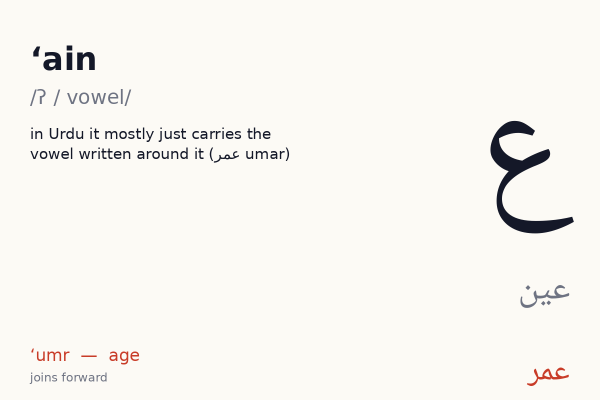
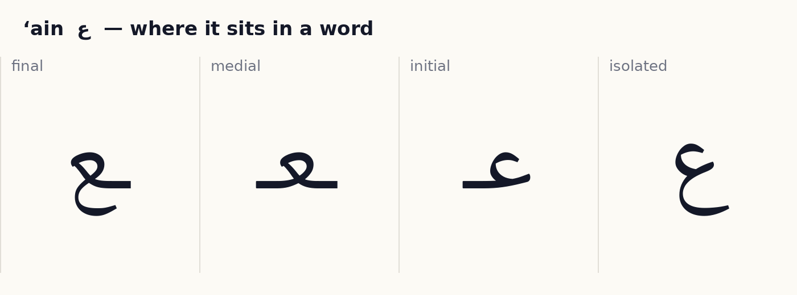

✎ *How the pen moves:* small c-shape at the top opening right, then the bowl beneath; dot after for غ. (Right to left; dots and marks last, after the whole word. These are the conventional Naskh/Nastaliq stroke orders as taught in Pakistani qaida classes; no published study was found, see research/05_open_assets.md.)

**ح baṛī ḥe** — joins forward (4 forms).

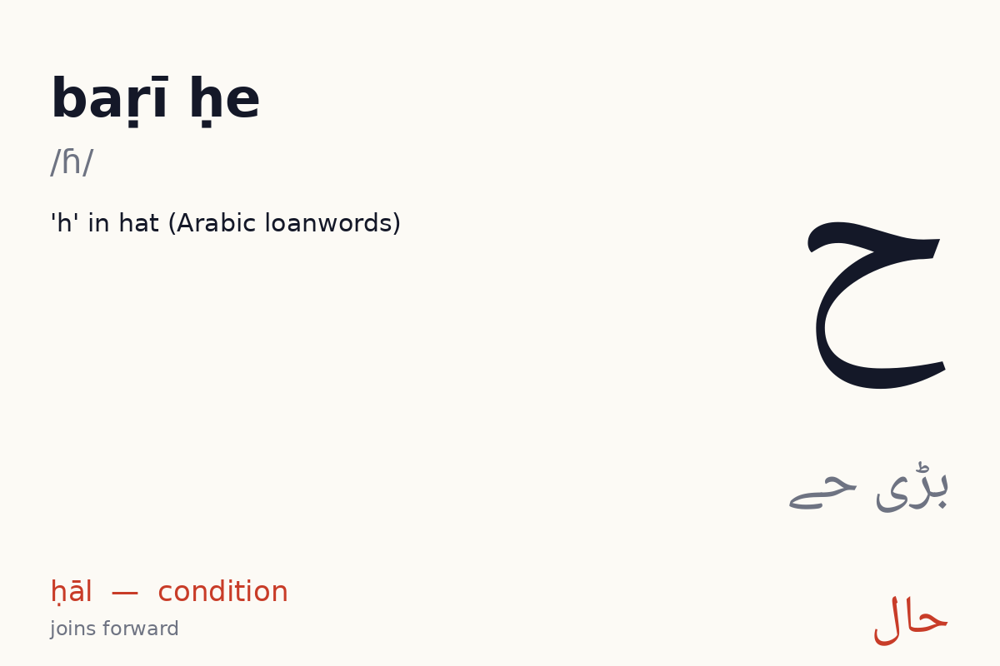
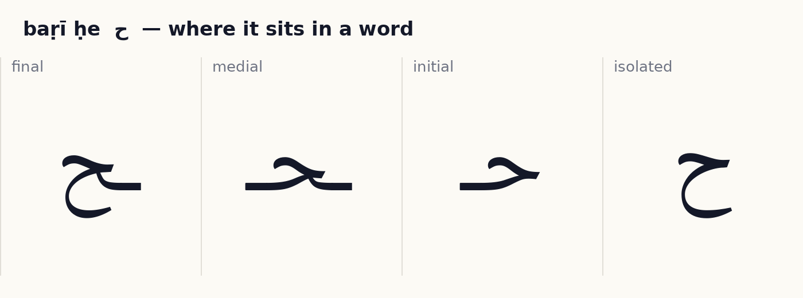

✎ *How the pen moves:* start at the top-right with the small head stroke going left, then drop into the round bowl below; dot after. (Right to left; dots and marks last, after the whole word. These are the conventional Naskh/Nastaliq stroke orders as taught in Pakistani qaida classes; no published study was found, see research/05_open_assets.md.)

## 3 · Tell it apart  ·  *recognition · self-check with audio*

- ف vs ق — same body, different dots or marks. Drill: play `names/` audio for each, learner points at the right one. 10 rounds, shuffled.
- خ vs ج چ ح — same body, different dots or marks. Drill: play `names/` audio for each, learner points at the right one. 10 rounds, shuffled.
- غ vs ع — same body, different dots or marks. Drill: play `names/` audio for each, learner points at the right one. 10 rounds, shuffled.

## 4 · Join it  ·  *production · self-check against the answer shown*

Build each word from letter tiles, right to left. Watch which letters change shape and which refuse to join.

- ب + ع + د  →  **بَعْد**  (baʻd, after)
- و + ق + ت  →  **وَقْت**  (waqt, time)
- س + م + ن + د + ر  →  **سَمُندَر**  (samundar, sea, ocean)

## 4b · Blend  ·  *recognition · self-check with audio*

A letter plus a vowel letter makes a sound you can say. Play a syllable, learner points to it. Vowels available so far: ا ی و.

| Syllable | Audio |
|---|---|
| فا | `assets/audio/syllables/fe_a.mp3` |
| فی | `assets/audio/syllables/fe_i.mp3` |
| فو | `assets/audio/syllables/fe_u.mp3` |
| قا | `assets/audio/syllables/qaf_a.mp3` |
| قی | `assets/audio/syllables/qaf_i.mp3` |
| قو | `assets/audio/syllables/qaf_u.mp3` |
| خا | `assets/audio/syllables/khe_a.mp3` |
| خی | `assets/audio/syllables/khe_i.mp3` |
| خو | `assets/audio/syllables/khe_u.mp3` |
| غا | `assets/audio/syllables/ghain_a.mp3` |
| غی | `assets/audio/syllables/ghain_i.mp3` |
| غو | `assets/audio/syllables/ghain_u.mp3` |
| حا | `assets/audio/syllables/bari_he_a.mp3` |
| حی | `assets/audio/syllables/bari_he_i.mp3` |
| حو | `assets/audio/syllables/bari_he_u.mp3` |

## 5 · Read it  ·  *reading aloud · self-check with audio, or a helper listens*

Vowel marks are shown. Read aloud, then play the audio and compare.

| Word | Say | Means | Audio |
|---|---|---|---|
| بَعْد | baʻd | after | `assets/audio/units/u08_00.mp3` |
| وَقْت | waqt | time | `assets/audio/units/u08_01.mp3` |
| سَمُندَر | samundar | sea, ocean | `assets/audio/units/u08_02.mp3` |
| کافی | kāfī | quite, enough | `assets/audio/units/u08_03.mp3` |
| خَیال | k͟hayāl | thought, idea | `assets/audio/units/u08_04.mp3` |
| شُروع | shurūʻ | beginning | `assets/audio/units/u08_05.mp3` |
| خُود | k͟hud | self | `assets/audio/units/u08_06.mp3` |
| فِلم | film | movie, film | `assets/audio/units/u08_07.mp3` |
| عَلی | ʻalī | Ali | `assets/audio/units/u08_08.mp3` |
| خَتْم | k͟hatm | end | `assets/audio/units/u08_09.mp3` |
| خُوش | k͟hush | happy | `assets/audio/units/u08_10.mp3` |
| عُمْر | ʻumr | age | `assets/audio/units/u08_11.mp3` |
| عام | ʻām | common | `assets/audio/units/u08_12.mp3` |
| تَعلیم | taʻlīm | education | `assets/audio/units/u08_13.mp3` |
| خاندان | k͟hāndān | family, clan | `assets/audio/units/u08_14.mp3` |
| بِغَیر | bag͟hair | without | `assets/audio/units/u08_15.mp3` |
| تاریخ | tārīk͟h | history, date | `assets/audio/units/u08_16.mp3` |
| قَریب | qarīb | near | `assets/audio/units/u08_17.mp3` |
| فَوج | fauj | army | `assets/audio/units/u08_18.mp3` |
| یَقین | yaqīn | belief, certainty | `assets/audio/units/u08_19.mp3` |
| اَحمَد | aḥmad | Ahmad | `assets/audio/units/u08_20.mp3` |
| ہَفْتے | hafte | weeks, on Saturday | `assets/audio/units/u08_21.mp3` |
| عِلْم | ʻilm | knowledge | `assets/audio/units/u08_22.mp3` |
| مَعلوم | maʻlūm | known | `assets/audio/units/u08_23.mp3` |
| سَفَر | safar | journey | `assets/audio/units/u08_24.mp3` |
| فون | fon | phone | `assets/audio/units/u08_25.mp3` |
| عِلاقَہ | ʻilāqa | area, region | `assets/audio/units/u08_26.mp3` |
| حال | ḥāl | condition | `assets/audio/units/u08_27.mp3` |
| قَسَم | qasam | oath, kind | `assets/audio/units/u08_28.mp3` |
| مِحنَت | miḥnat | hard work | `assets/audio/units/u08_29.mp3` |
| ہَفْتَہ | hafta | week, Saturday | `assets/audio/units/u08_30.mp3` |
| عَورَت | ʻaurat | woman | `assets/audio/units/u08_31.mp3` |
| قابِل | qābil | capable | `assets/audio/units/u08_32.mp3` |
| عِمارَت | ʻimārat | building | `assets/audio/units/u08_33.mp3` |
| خَرید | k͟harīd | buy | `assets/audio/units/u08_34.mp3` |
| مَسجِد | masjid | mosque | `assets/audio/units/u08_35.mp3` |
| عَرَبی | ʻarabī | Arabic | `assets/audio/units/u08_36.mp3` |
| وَعْدَہ | waʻda | promise | `assets/audio/units/u08_37.mp3` |
| دَعْوَت | daʻwat | invitation | `assets/audio/units/u08_38.mp3` |
| مُلاقات | mulāqāt | meeting | `assets/audio/units/u08_39.mp3` |
| اَخبار | ak͟hbār | newspaper | `assets/audio/units/u08_40.mp3` |
| اِمتِحان | imtiḥān | exam | `assets/audio/units/u08_41.mp3` |
| بَرْف | barf | snow, ice | `assets/audio/units/u08_42.mp3` |
| فِہْرِست | fihrist | list | `assets/audio/units/u08_43.mp3` |
| فَرْق | farq | difference | `assets/audio/units/u08_44.mp3` |
| خَراب | k͟harāb | bad, spoiled | `assets/audio/units/u08_45.mp3` |
| خوب | k͟hūb | good, fine | `assets/audio/units/u08_46.mp3` |
| شَوق | shauq | liking, hobby | `assets/audio/units/u08_47.mp3` |
| غَریب | g͟harīb | poor | `assets/audio/units/u08_48.mp3` |
| سِیاہ | siyāh | black, dark | `assets/audio/units/u08_49.mp3` |
| بِستَر | bistar | bed | `assets/audio/units/u08_50.mp3` |
| دَفْتَر | daftar | office | `assets/audio/units/u08_51.mp3` |
| خُدا | k͟hudā | God | `assets/audio/units/u08_52.mp3` |
| گُفتَگو | guftagū | conversation | `assets/audio/units/u08_53.mp3` |
| خواب | k͟hwāb | dream | `assets/audio/units/u08_54.mp3` |
| موسیقی | mūsīqī | music | `assets/audio/units/u08_55.mp3` |
| قِلعَہ | qilʻa | fort | `assets/audio/units/u08_56.mp3` |
| مَعنی | maʻnī | meaning | `assets/audio/units/u08_57.mp3` |
| سَفید | safīd | white | `assets/audio/units/u08_58.mp3` |
| مُعاف | muʻāf | forgiven | `assets/audio/units/u08_59.mp3` |
| مُحَبَّت | muḥabbat | love | `assets/audio/units/u08_60.mp3` |
| حادِثَہ | ḥādis̱a | accident | `assets/audio/units/u08_61.mp3` |
| عادَت | ʻādat | habit | `assets/audio/units/u08_62.mp3` |
| عِزَّت | ʻizzat | honour | `assets/audio/units/u08_63.mp3` |
| باغ | bāg͟h | garden | `assets/audio/units/u08_64.mp3` |
| خَبَر | k͟habar | news | `assets/audio/units/u08_65.mp3` |
| حِساب | ḥisāb | maths | `assets/audio/units/u08_66.mp3` |
| سَخْت | sak͟ht | hard, tough | `assets/audio/units/u08_67.mp3` |
| خُوشی | k͟hushī | happiness | `assets/audio/units/u08_68.mp3` |
| خَریدنا | k͟harīdnā | to buy | `assets/audio/units/u08_69.mp3` |
| فِکْر | fikr | worry, thought | `assets/audio/units/u08_70.mp3` |
| عَجیب | ʻajīb | strange | `assets/audio/units/u08_71.mp3` |
| عَقْل | ʻaql | intelligence | `assets/audio/units/u08_72.mp3` |
| خون | k͟hūn | blood | `assets/audio/units/u08_73.mp3` |
| خالی | k͟hālī | empty | `assets/audio/units/u08_74.mp3` |
| عَینَک | ʻainak | spectacles | `assets/audio/units/u08_75.mp3` |
| قیمَت | qīmat | price | `assets/audio/units/u08_76.mp3` |
| نَقشَہ | naqsha | map | `assets/audio/units/u08_77.mp3` |
| خُوشبو | k͟hushbū | fragrance | `assets/audio/units/u08_78.mp3` |
| عُمدَہ | ʻumda | excellent | `assets/audio/units/u08_79.mp3` |
| قَلَم | qalam | pen | `assets/audio/units/u08_80.mp3` |
| بُخار | buk͟hār | fever | `assets/audio/units/u08_81.mp3` |
| سیب | seb | apple | `assets/audio/units/u08_82.mp3` |
| خُشْک | k͟hushk | dry | `assets/audio/units/u08_83.mp3` |
| شیشَہ | shīsha | glass, mirror | `assets/audio/units/u08_84.mp3` |
| فُٹْبال | fuṭbāl | football | `assets/audio/units/u08_85.mp3` |
| قَدَم | qadam | step | `assets/audio/units/u08_86.mp3` |
| تَکلیف | taklīf | trouble | `assets/audio/units/u08_87.mp3` |
| جُمعَہ | jumʻa | Friday | `assets/audio/units/u08_88.mp3` |
| خاموش | k͟hāmosh | silent | `assets/audio/units/u08_89.mp3` |
| غَم | g͟ham | grief | `assets/audio/units/u08_90.mp3` |
| عِلاج | ʻilāj | treatment | `assets/audio/units/u08_91.mp3` |
| خالِد | k͟hālid | Khalid | `assets/audio/units/u08_92.mp3` |
| فَرْش | farsh | floor | `assets/audio/units/u08_93.mp3` |
| فَوری | faurī | immediate | `assets/audio/units/u08_94.mp3` |
| لِباس | libās | clothes | `assets/audio/units/u08_95.mp3` |
| خالَہ | k͟hāla | maternal aunt | `assets/audio/units/u08_96.mp3` |
| جُمعِرات | jumʻerāt | Thursday | `assets/audio/units/u08_97.mp3` |
| خَرگوش | k͟hargosh | rabbit | `assets/audio/units/u08_98.mp3` |
| چالاک | chālāk | cunning, sly | `assets/audio/units/u08_99.mp3` |
| چَچا | chachā | paternal uncle | `assets/audio/units/u08_100.mp3` |
| حَرْف | ḥarf | letter, word | `assets/audio/units/u08_101.mp3` |
| مُسافِر | musāfir | traveller | `assets/audio/units/u08_102.mp3` |
| عید | ʻīd | Eid | `assets/audio/units/u08_103.mp3` |
| خَیمَہ | k͟haima | tent | `assets/audio/units/u08_104.mp3` |
| قاعِدَہ | qāʻida | rule, primer | `assets/audio/units/u08_105.mp3` |
| شَرارَت | sharārat | mischief | `assets/audio/units/u08_106.mp3` |
| حَلْوہ | ḥalwa | halwa | `assets/audio/units/u08_107.mp3` |
| حَیوان | ḥaiwān | animal | `assets/audio/units/u08_108.mp3` |
| ناخُن | nāk͟hun | nail | `assets/audio/units/u08_109.mp3` |

**Sentences**

- عَلی کا قَلَم میز پَر ہَے  —  *ʻalī kā qalam mez par hai*  —  Ali's pen is on the table  · `assets/audio/sentences/u08_00.mp3`
- اَحمَد اَور عَلی دوسْت ہَیں  —  *aḥmad aur ʻalī dost haiṉ*  —  Ahmad and Ali are friends  · `assets/audio/sentences/u08_01.mp3`
- خالَہ کا گَھر باغ کے پاس ہَے  —  *k͟hāla kā ghar bāg͟h ke pās hai*  —  aunt's house is near the garden  · `assets/audio/sentences/u08_02.mp3`
- جُمعَہ کو ہَم مَسجِد جاتے ہَیں  —  *jumʻa ko ham masjid jāte haiṉ*  —  on Friday we go to the mosque  · `assets/audio/sentences/u08_03.mp3`
- عید بَہُت اَچّھی ہوتی ہَے  —  *ʻīd bahut achchhī hotī hai*  —  Eid is very nice  · `assets/audio/sentences/u08_04.mp3`
- اِمتِحان کے بَعْد چُھٹّی ہَے  —  *imtiḥān ke baʻd chhuṭṭī hai*  —  after the exam there is a holiday  · `assets/audio/sentences/u08_05.mp3`
- خالِد کا خَرگوش سَفید ہَے  —  *k͟hālid kā k͟hargosh safīd hai*  —  Khalid's rabbit is white  · `assets/audio/sentences/u08_06.mp3`
- مُجھے فُٹْبال کا کھیل پَسَند ہَے  —  *mujhe fuṭbāl kā khel pasand hai*  —  I like the game of football  · `assets/audio/sentences/u08_07.mp3`
- ہَفْتے مَیں سات دِن ہوتے ہَیں  —  *hafte meṉ sāt din hote haiṉ*  —  there are seven days in a week  · `assets/audio/sentences/u08_08.mp3`
- مُجھے بُخار ہَے  —  *mujhe buk͟hār hai*  —  I have a fever  · `assets/audio/sentences/u08_09.mp3`
- کَمرے کا فَرْش سِیاہ ہَے  —  *kamre kā farsh siyāh hai*  —  the floor of the room is black  · `assets/audio/sentences/u08_10.mp3`
- خَبَر اَخبار مَیں ہَے  —  *k͟habar ak͟hbār meṉ hai*  —  the news is in the newspaper  · `assets/audio/sentences/u08_11.mp3`
- مِحنَت اَچّھی عادَت ہَے  —  *miḥnat achchhī ʻādat hai*  —  hard work is a good habit  · `assets/audio/sentences/u08_12.mp3`
- ہَفْتے کو ہَم خالَہ کے گَھر جاتے ہَیں  —  *hafte ko ham k͟hāla ke ghar jāte haiṉ*  —  on Saturday we go to aunt's house  · `assets/audio/sentences/u08_13.mp3`
- خالِد اَپنا فون دیکھتا ہَے  —  *k͟hālid apnā fon dekhtā hai*  —  Khalid looks at his phone  · `assets/audio/sentences/u08_14.mp3`
- دَفْتَر مَیں بَہُت کام ہَے  —  *daftar meṉ bahut kām hai*  —  there is a lot of work in the office  · `assets/audio/sentences/u08_15.mp3`
- بِستَر پَر نَیا کَمْبَل ہَے  —  *bistar par nayā kambal hai*  —  there is a new blanket on the bed  · `assets/audio/sentences/u08_16.mp3`
- عَلی کی عَینَک سِیاہ ہَے  —  *ʻalī kī ʻainak siyāh hai*  —  Ali's glasses are black  · `assets/audio/sentences/u08_17.mp3`
- خالَہ کی گَھڑی سَفید ہَے  —  *k͟hāla kī ghaṛī safīd hai*  —  aunt's watch is white  · `assets/audio/sentences/u08_18.mp3`

**Passage** (96 words) · `assets/audio/passages/u08.mp3`

> کَل عید ہَے۔ اَحمَد اَور عَلی بَہُت خُوش ہَیں۔ دونوں مَسجِد جاتے ہَیں۔ مَسجِد کے بَعْد وُہ خالَہ کے گَھر جاتے ہَیں۔ خالَہ کا گَھر باغ کے قَریب ہَے۔ خالَہ کے پاس حَلْوہ، کَباب اَور نان ہَیں۔ عَلی کو حَلْوہ پَسَند ہَے۔ اَحمَد کو کَباب پَسَند ہَیں۔ خالَہ کَہتی ہَے: خوب کھانا۔ دونوں خوب کھانا کھاتے ہَیں۔ شام کو دونوں اَپنے گَھر جاتے ہَیں۔ عید بَہُت اَچّھی ہوتی ہَے۔ خالِد کا خَرگوش سَفید ہَے۔ خالِد اَپنے خَرگوش کو گھاس دیتا ہَے۔ سَب بَہُت خُوش ہَیں۔ عَلی اَپنا قَلَم دیکھتا ہَے۔ اَحمَد کا قَلَم میز پَر ہَے۔
>
> *kal ʻīd hai. aḥmad aur ʻalī bahut k͟hush haiṉ. donoṉ masjid jāte haiṉ. masjid ke baʻd woh k͟hāla ke ghar jāte haiṉ. k͟hāla kā ghar bāg͟h ke qarīb hai. k͟hāla ke pās ḥalwa, kabāb aur nān haiṉ. ʻalī ko ḥalwa pasand hai. aḥmad ko kabāb pasand haiṉ. k͟hāla kahtī hai: k͟hūb khānā. donoṉ k͟hūb khānā khāte haiṉ. shām ko donoṉ apne ghar jāte haiṉ. ʻīd bahut achchhī hotī hai. k͟hālid kā k͟hargosh safīd hai. k͟hālid apne k͟hargosh ko ghās detā hai. sab bahut k͟hush haiṉ. ʻalī apnā qalam dekhtā hai. aḥmad kā qalam mez par hai.*
>
> Tomorrow is Eid. Ahmad and Ali are very happy. Both go to the mosque. After the mosque they go to aunt's house. Aunt's house is near the garden. Aunt has halwa, kebab and naan. Ali likes halwa. Ahmad likes kebab. Aunt says: eat well. Both eat plenty of food. In the evening both go to their own home. Eid is very nice. Khalid's rabbit is white. Khalid gives his rabbit grass. Everyone is very happy. Ali looks at his pen. Ahmad's pen is on the table.

## 6 · Write it  ·  *production · needs a helper or the app tracer to check*

Trace each new letter in all its forms three times (children: required; adults: recommended). Use the forms card as the model. Then write these words from the list without looking: بَعْد, وَقْت, سَمُندَر, کافی, خَیال.

Pen movement for each letter is described in step 2 above.

## 7 · Dictation  ·  *production · self-check with the key below*

Play each clip twice. Learner writes the word. Then reveal.

1. `assets/audio/units/u08_30.mp3`
2. `assets/audio/units/u08_93.mp3`
3. `assets/audio/units/u08_96.mp3`
4. `assets/audio/units/u08_26.mp3`
5. `assets/audio/units/u08_29.mp3`

Answer key

1. ہَفْتَہ (hafta)
2. فَرْش (farsh)
3. خالَہ (k͟hāla)
4. عِلاقَہ (ʻilāqa)
5. مِحنَت (miḥnat)

## 8 · Check (score 8/10 to move on)  ·  *recognition · self-check*

1. Which one says **faurī** (immediate)?   (a) چالاک   (b) خُوشبو   (c) شُروع   (d) فَوری
2. Which one says **k͟hushk** (dry)?   (a) خالَہ   (b) خاموش   (c) خُشْک   (d) شیشَہ
3. Which one says **safīd** (white)?   (a) تَکلیف   (b) عام   (c) خَرید   (d) سَفید
4. Which one says **ʻizzat** (honour)?   (a) بِغَیر   (b) چالاک   (c) مُعاف   (d) عِزَّت
5. Which one says **ḥaiwān** (animal)?   (a) وَعْدَہ   (b) حَیوان   (c) مُحَبَّت   (d) سَمُندَر
6. Which one says **g͟harīb** (poor)?   (a) بِستَر   (b) عِلاقَہ   (c) غَریب   (d) خَرید
7. Which one says **k͟hatm** (end)?   (a) خالَہ   (b) خَرید   (c) خُوشی   (d) خَتْم
8. Which one says **ḥādis̱a** (accident)?   (a) خوب   (b) حادِثَہ   (c) عِلاج   (d) خاندان
9. Which one says **taklīf** (trouble)?   (a) عادَت   (b) بَعْد   (c) جُمعَہ   (d) تَکلیف
10. Which one says **ʻarabī** (Arabic)?   (a) اِمتِحان   (b) عَرَبی   (c) بِغَیر   (d) حَیوان

Answer key

1. فَوری
2. خُشْک
3. سَفید
4. عِزَّت
5. حَیوان
6. غَریب
7. خَتْم
8. حادِثَہ
9. تَکلیف
10. عَرَبی

