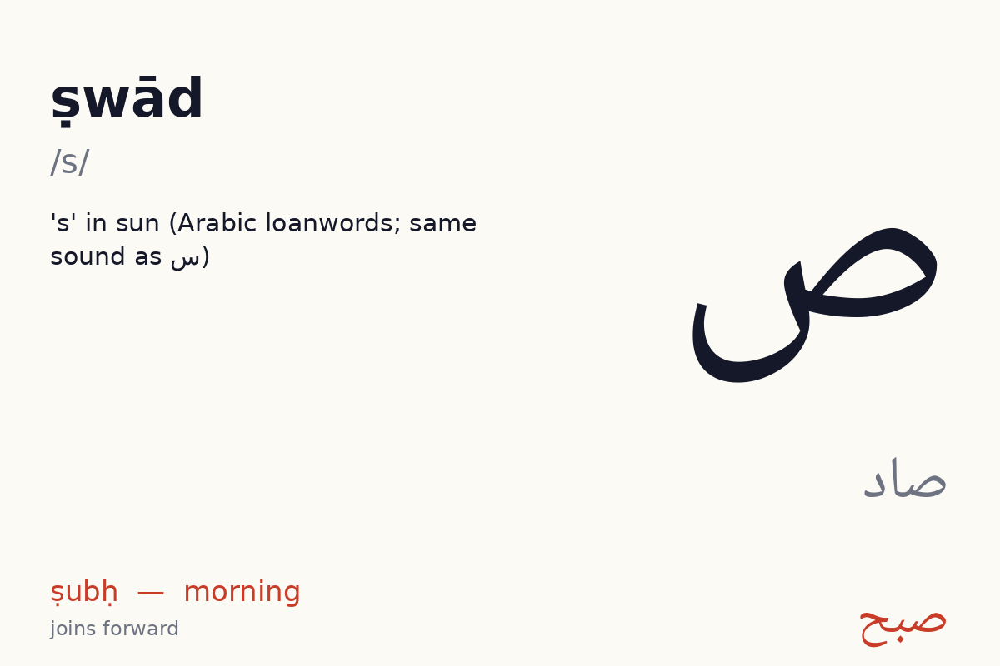
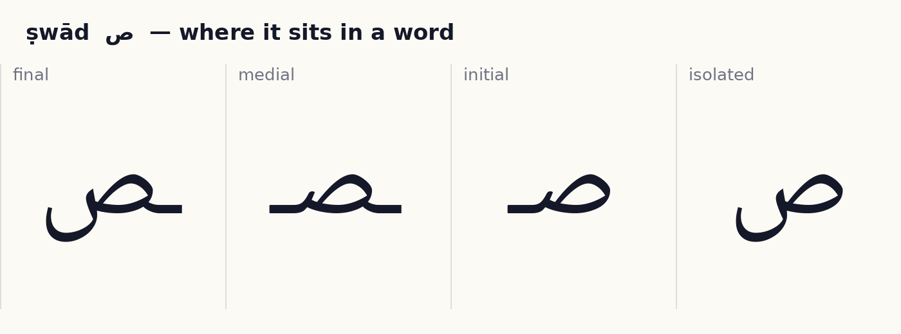
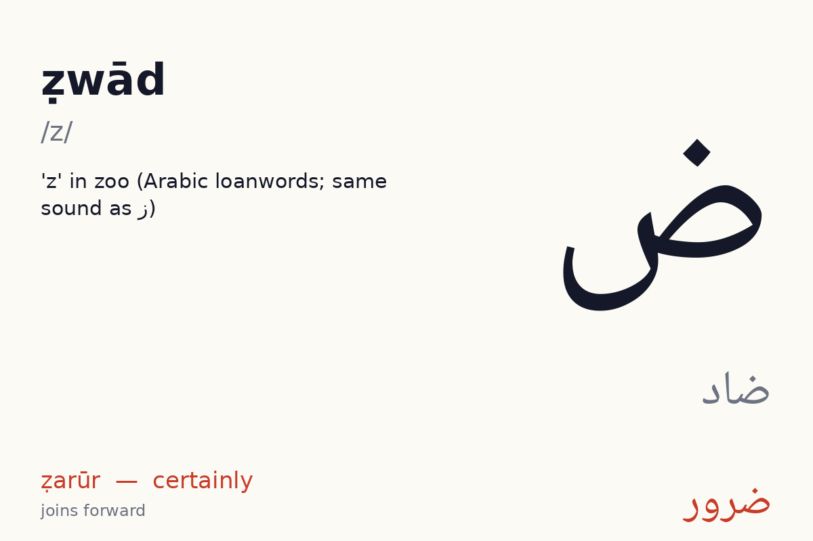
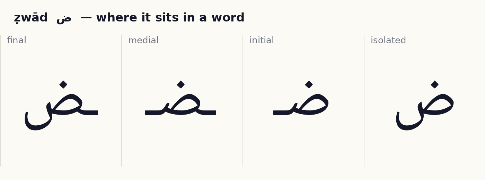
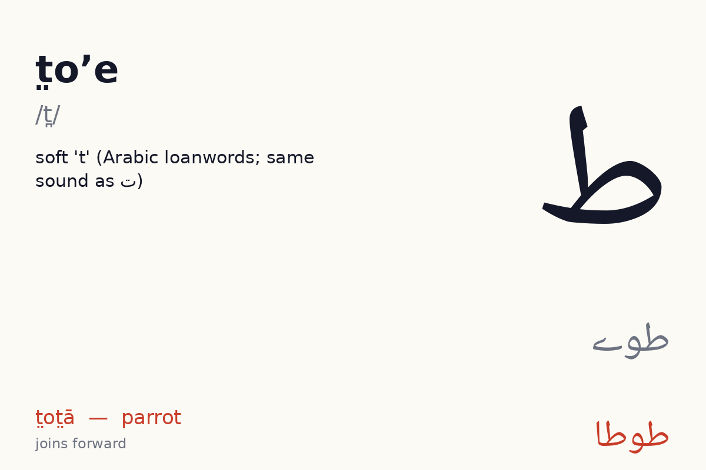
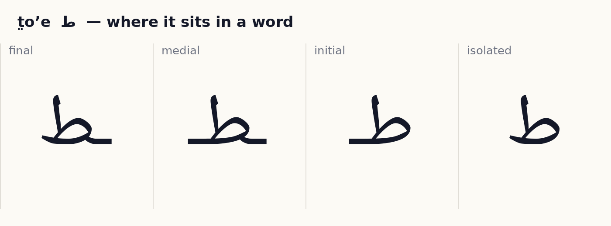
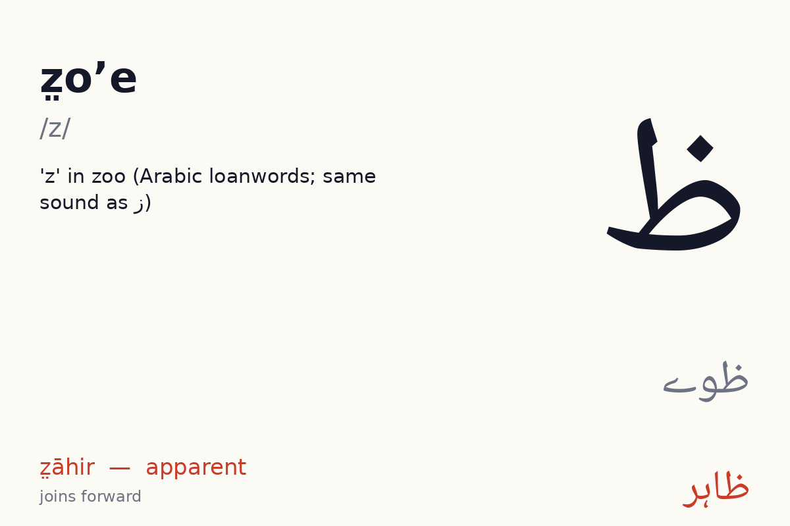
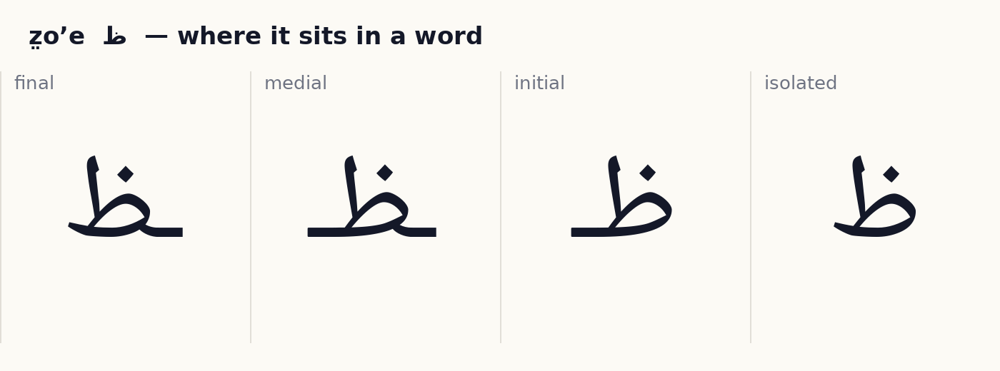
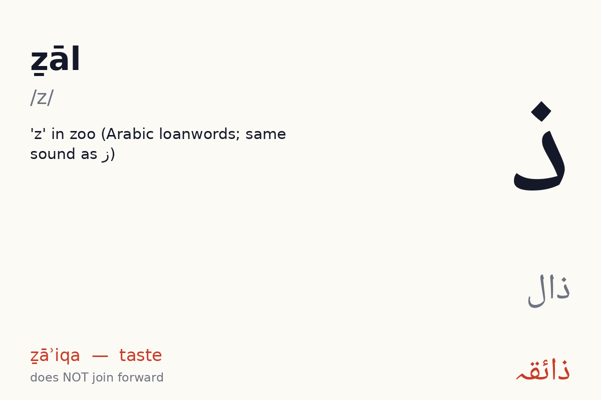
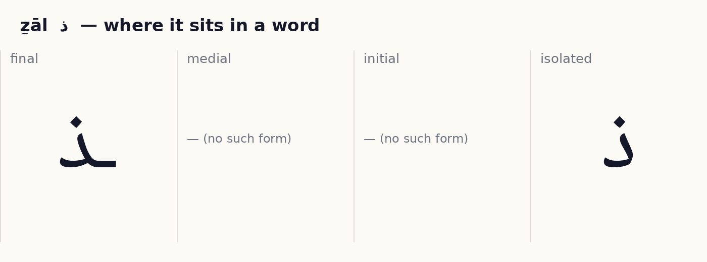

# Unit 9 — Same sound, different letter  ·  ایک آواز، کئی حرف

**Focus:** s: س ث ص · z: ز ذ ض ظ · t: ت ط · h: ہ ح — spelling must be memorised per word; these letters mark Arabic loans

## 1 · Hear it

| Letter | Name | Sound | Say it like… | Audio |
|---|---|---|---|---|
| ص | ṣwād (صاد) | /s/ | 's' in sun (Arabic loanwords; same sound as س) | `assets/audio/names/swad.mp3` · `assets/audio/words/swad.mp3` (صبح ṣubḥ — morning) |
| ض | ẓwād (ضاد) | /z/ | 'z' in zoo (Arabic loanwords; same sound as ز) | `assets/audio/names/zwad.mp3` · `assets/audio/words/zwad.mp3` (ضرور ẓarūr — certainly) |
| ط | t̤oʼe (طوے) | /t̪/ | soft 't' (Arabic loanwords; same sound as ت) | `assets/audio/names/toe.mp3` · `assets/audio/words/toe.mp3` (طوطا t̤ot̤ā — parrot) |
| ظ | z̤oʼe (ظوے) | /z/ | 'z' in zoo (Arabic loanwords; same sound as ز) | `assets/audio/names/zoe.mp3` · `assets/audio/words/zoe.mp3` (ظاہر z̤āhir — apparent) |
| ذ | ẕāl (ذال) | /z/ | 'z' in zoo (Arabic loanwords; same sound as ز) | `assets/audio/names/zal.mp3` · `assets/audio/words/zal.mp3` (ذائقہ ẕāʾiqa — taste) |

## 2 · See it

**ص ṣwād** — joins forward (4 forms).

**ض ẓwād** — joins forward (4 forms).

**ط t̤oʼe** — joins forward (4 forms).

**ظ z̤oʼe** — joins forward (4 forms).

**ذ ẕāl** — does **not** join forward (2 forms: isolated, final).

## 3 · Tell it apart

- ص vs ض س — same body, different dots or marks. Drill: play `names/` audio for each, learner points at the right one. 10 rounds, shuffled.
- ط vs ظ — same body, different dots or marks. Drill: play `names/` audio for each, learner points at the right one. 10 rounds, shuffled.
- ذ vs د ڈ ز — same body, different dots or marks. Drill: play `names/` audio for each, learner points at the right one. 10 rounds, shuffled.

## 4 · Join it

Build each word from letter tiles, right to left. Watch which letters change shape and which refuse to join.

- ص + ب + ح  →  **صُبْح**  (ṣubḥ, morning)
- ص + ب + ر  →  **صَبْر**  (ṣabr, patience)
- ض + ر + و + ر  →  **ضَرور**  (ẕarūr, certainly)

## 5 · Read it

Vowel marks are shown. Read aloud, then play the audio and compare.

| Word | Say | Means | Audio |
|---|---|---|---|
| صُبْح | ṣubḥ | morning | `assets/audio/units/u09_00.mp3` |
| صَبْر | ṣabr | patience | `assets/audio/units/u09_01.mp3` |
| ضَرور | ẕarūr | certainly | `assets/audio/units/u09_02.mp3` |
| مَریض | marīẕ | patient | `assets/audio/units/u09_03.mp3` |
| طالِب | t̤ālib | student | `assets/audio/units/u09_04.mp3` |
| طوطا | t̤ot̤ā | parrot | `assets/audio/units/u09_05.mp3` |
| ظاہِر | z̤āhir | apparent | `assets/audio/units/u09_06.mp3` |
| ظُلْم | z̤ulm | cruelty | `assets/audio/units/u09_07.mp3` |
| ذائِقَہ | ẕāʾiqa | taste | `assets/audio/units/u09_08.mp3` |
| ذِمّہ | ẕimma | responsibility | `assets/audio/units/u09_09.mp3` |
| صابُن | ṣābun | soap | `assets/audio/units/u09_10.mp3` |
| ضِد | ẕid | stubbornness | `assets/audio/units/u09_11.mp3` |
| طاقَت | t̤āqat | strength | `assets/audio/units/u09_12.mp3` |
| حِفاظَت | ḥifāz̤at | protection | `assets/audio/units/u09_13.mp3` |
| ذَرا | ẕarā | a little | `assets/audio/units/u09_14.mp3` |
| خاص | k͟hāṣ | special | `assets/audio/units/u09_15.mp3` |
| ثَواب | s̱awāb | reward | `assets/audio/units/u09_16.mp3` |
| نَظْر | naz̤ar | sight | `assets/audio/units/u09_17.mp3` |
| لَفْظ | lafz̤ | word | `assets/audio/units/u09_18.mp3` |
| صَحیح | ṣaḥīḥ | correct | `assets/audio/units/u09_19.mp3` |

**Sentences**

- صُبْح صاف ہَے  —  *ṣubḥ ṣāf hai*  —  the morning is clear  · `assets/audio/sentences/u09_00.mp3`
- طوطا ذَرا بَڑا ہَے  —  *t̤ot̤ā ẕarā baṛā hai*  —  the parrot is a bit big  · `assets/audio/sentences/u09_01.mp3`
- یِہ لَفْظ صَحیح ہَے  —  *yeh lafz̤ ṣaḥīḥ hai*  —  this word is correct  · `assets/audio/sentences/u09_02.mp3`

## 6 · Write it

Trace each new letter in all its forms three times (children: required; adults: recommended). Use the forms card as the model. Then write these words from the list without looking: صُبْح, صَبْر, ضَرور, مَریض, طالِب.

## 7 · Dictation

Play each clip twice. Learner writes the word. Then reveal.

1. `assets/audio/units/u09_12.mp3`
2. `assets/audio/units/u09_08.mp3`
3. `assets/audio/units/u09_10.mp3`
4. `assets/audio/units/u09_01.mp3`
5. `assets/audio/units/u09_15.mp3`

Answer key

1. طاقَت (t̤āqat)
2. ذائِقَہ (ẕāʾiqa)
3. صابُن (ṣābun)
4. صَبْر (ṣabr)
5. خاص (k͟hāṣ)

## 8 · Check (score 8/10 to move on)

1. Which one says **ẕāʾiqa** (taste)?   (a) ذَرا   (b) صابُن   (c) ذائِقَہ   (d) خاص
2. Which one says **lafz̤** (word)?   (a) لَفْظ   (b) صُبْح   (c) صَحیح   (d) خاص
3. Which one says **ẕid** (stubbornness)?   (a) صَحیح   (b) خاص   (c) ضِد   (d) ظُلْم
4. Which one says **t̤ālib** (student)?   (a) مَریض   (b) ضَرور   (c) طالِب   (d) خاص
5. Which one says **z̤āhir** (apparent)?   (a) صابُن   (b) صَبْر   (c) ظاہِر   (d) طالِب
6. Which one says **ṣabr** (patience)?   (a) صابُن   (b) مَریض   (c) صَبْر   (d) طالِب
7. Which one says **s̱awāb** (reward)?   (a) صُبْح   (b) صَحیح   (c) ذِمّہ   (d) ثَواب
8. Which one says **marīẕ** (patient)?   (a) مَریض   (b) ذائِقَہ   (c) نَظْر   (d) ثَواب
9. Which one says **k͟hāṣ** (special)?   (a) صُبْح   (b) خاص   (c) صَبْر   (d) ذِمّہ
10. Which one says **naz̤ar** (sight)?   (a) ظُلْم   (b) نَظْر   (c) حِفاظَت   (d) ضِد

Answer key

1. ذائِقَہ
2. لَفْظ
3. ضِد
4. طالِب
5. ظاہِر
6. صَبْر
7. ثَواب
8. مَریض
9. خاص
10. نَظْر

