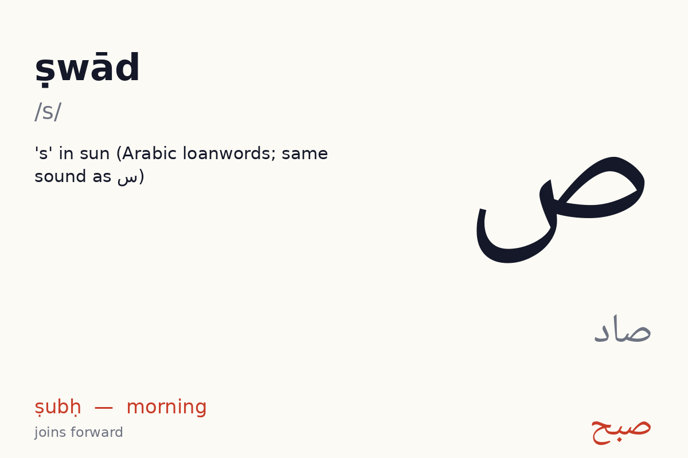
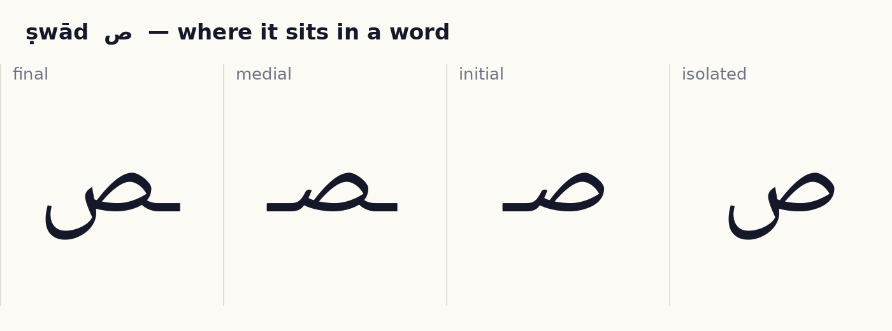
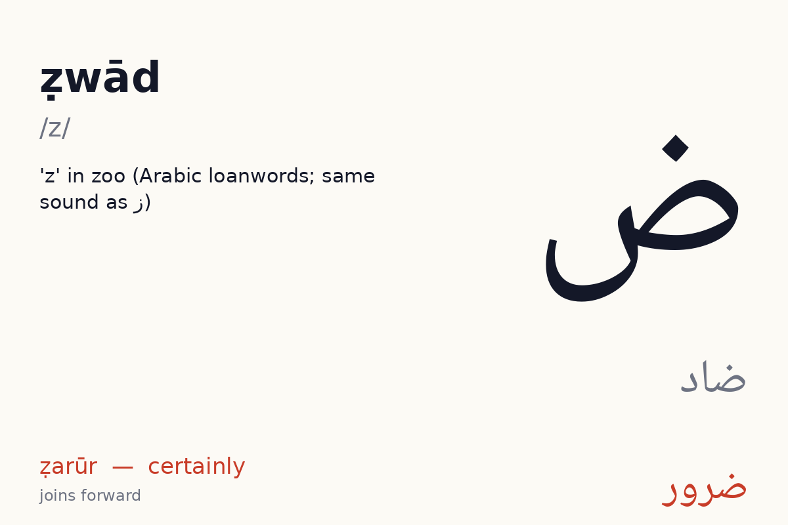
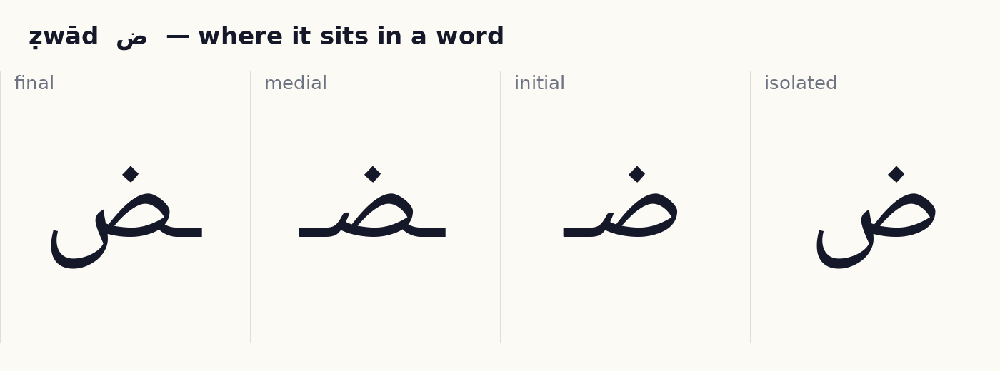
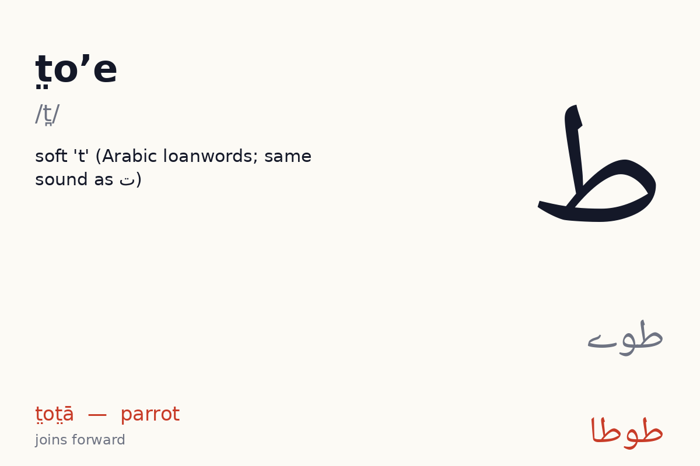
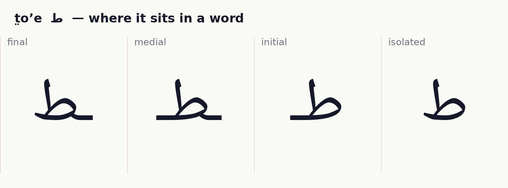
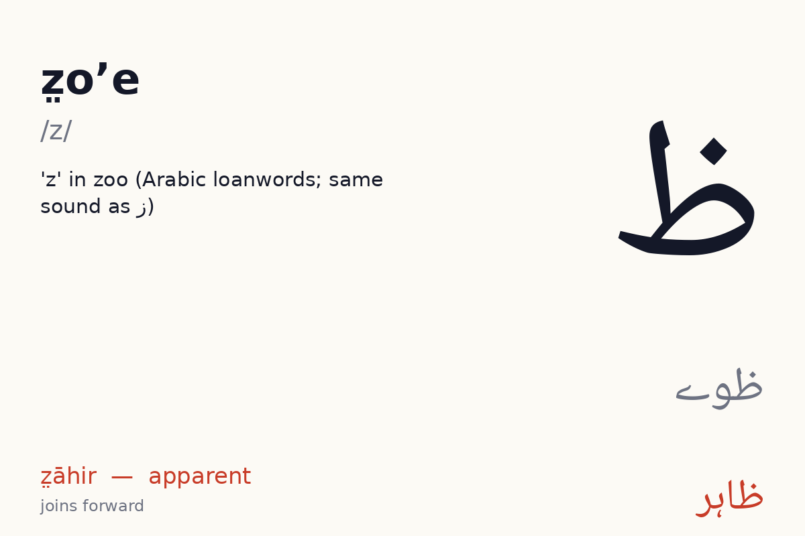
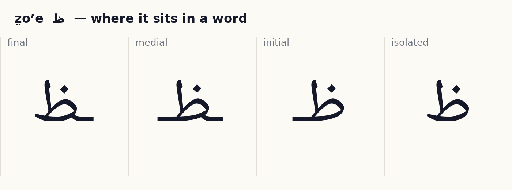
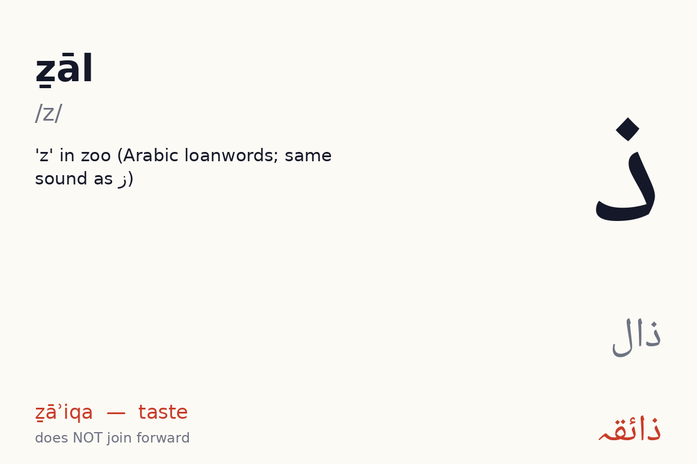
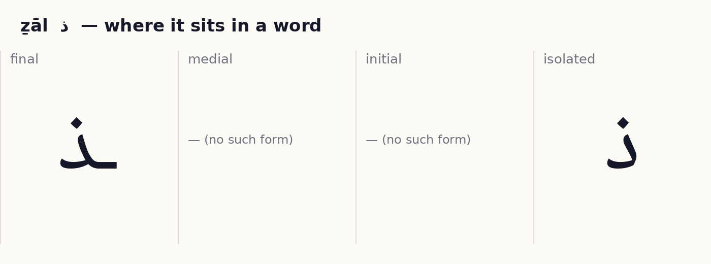

# Unit 9 — Same sound, different letter  ·  ایک آواز، کئی حرف

**Focus:** s: س ث ص · z: ز ذ ض ظ · t: ت ط · h: ہ ح — spelling must be memorised per word; these letters mark Arabic loans

**On the phone, this unit is these lessons, in order:** ṣwād ص → ẓwād ض → t̤oʼe ط → z̤oʼe ظ → ẕāl ذ → Join them → Blend → Words 1 → Words 2 → Words 3 → Words 4 → Words 5 → Words 6 → Words 7 → Read → Unit check. Children rotate through them one at a time; the Unit check (8 of 10) unlocks the next unit.

## 1 · Hear it

| Letter | Name | Sound | Say it like… | Audio |
|---|---|---|---|---|
| ص | ṣwād (صاد) | /s/ | 's' in sun (Arabic loanwords; same sound as س) | `assets/audio/names/swad.mp3` · `assets/audio/words/swad.mp3` (صبح ṣubḥ — morning) |
| ض | ẓwād (ضاد) | /z/ | 'z' in zoo (Arabic loanwords; same sound as ز) | `assets/audio/names/zwad.mp3` · `assets/audio/words/zwad.mp3` (ضرور ẓarūr — certainly) |
| ط | t̤oʼe (طوے) | /t̪/ | soft 't' (Arabic loanwords; same sound as ت) | `assets/audio/names/toe.mp3` · `assets/audio/words/toe.mp3` (طوطا t̤ot̤ā — parrot) |
| ظ | z̤oʼe (ظوے) | /z/ | 'z' in zoo (Arabic loanwords; same sound as ز) | `assets/audio/names/zoe.mp3` · `assets/audio/words/zoe.mp3` (ظاہر z̤āhir — apparent) |
| ذ | ẕāl (ذال) | /z/ | 'z' in zoo (Arabic loanwords; same sound as ز) | `assets/audio/names/zal.mp3` · `assets/audio/words/zal.mp3` (ذائقہ ẕāʾiqa — taste) |

## 2 · See it

**ص ṣwād** — joins forward (4 forms).

✎ *How the pen moves:* three small teeth from right to left, then the deep bowl; dots after. (Right to left; dots and marks last, after the whole word. These are the conventional Naskh/Nastaliq stroke orders as taught in Pakistani qaida classes; no published study was found, see research/05_open_assets.md.)

**ض ẓwād** — joins forward (4 forms).

✎ *How the pen moves:* three small teeth from right to left, then the deep bowl; dots after. (Right to left; dots and marks last, after the whole word. These are the conventional Naskh/Nastaliq stroke orders as taught in Pakistani qaida classes; no published study was found, see research/05_open_assets.md.)

**ط t̤oʼe** — joins forward (4 forms).

✎ *How the pen moves:* draw the loop first (like ص), then the tall stroke rising from its right; dot after for ظ. (Right to left; dots and marks last, after the whole word. These are the conventional Naskh/Nastaliq stroke orders as taught in Pakistani qaida classes; no published study was found, see research/05_open_assets.md.)

**ظ z̤oʼe** — joins forward (4 forms).

✎ *How the pen moves:* draw the loop first (like ص), then the tall stroke rising from its right; dot after for ظ. (Right to left; dots and marks last, after the whole word. These are the conventional Naskh/Nastaliq stroke orders as taught in Pakistani qaida classes; no published study was found, see research/05_open_assets.md.)

**ذ ẕāl** — does **not** join forward (2 forms: isolated, final).

✎ *How the pen moves:* start at the top, come down and out to the left in one angled stroke; never joins forward. (Right to left; dots and marks last, after the whole word. These are the conventional Naskh/Nastaliq stroke orders as taught in Pakistani qaida classes; no published study was found, see research/05_open_assets.md.)

## 3 · Tell it apart  ·  *recognition · self-check with audio*

- ص vs ض س — same body, different dots or marks. Drill: play `names/` audio for each, learner points at the right one. 10 rounds, shuffled.
- ط vs ظ — same body, different dots or marks. Drill: play `names/` audio for each, learner points at the right one. 10 rounds, shuffled.
- ذ vs د ڈ ز — same body, different dots or marks. Drill: play `names/` audio for each, learner points at the right one. 10 rounds, shuffled.

## 4 · Join it  ·  *production · self-check against the answer shown*

Build each word from letter tiles, right to left. Watch which letters change shape and which refuse to join.

- ط + ر + ح  →  **طَرَح**  (t̤araḥ, way, like)
- ص + ر + ف  →  **صِرْف**  (ṣirf, only)
- ط + ر + ف  →  **طَرَف**  (t̤araf, side, direction)

## 4b · Blend  ·  *recognition · self-check with audio*

A letter plus a vowel letter makes a sound you can say. Play a syllable, learner points to it. Vowels available so far: ا ی و.

| Syllable | Audio |
|---|---|
| صا | `assets/audio/syllables/swad_a.mp3` |
| صی | `assets/audio/syllables/swad_i.mp3` |
| صو | `assets/audio/syllables/swad_u.mp3` |
| ضا | `assets/audio/syllables/zwad_a.mp3` |
| ضی | `assets/audio/syllables/zwad_i.mp3` |
| ضو | `assets/audio/syllables/zwad_u.mp3` |
| طا | `assets/audio/syllables/toe_a.mp3` |
| طی | `assets/audio/syllables/toe_i.mp3` |
| طو | `assets/audio/syllables/toe_u.mp3` |
| ظا | `assets/audio/syllables/zoe_a.mp3` |
| ظی | `assets/audio/syllables/zoe_i.mp3` |
| ظو | `assets/audio/syllables/zoe_u.mp3` |
| ذا | `assets/audio/syllables/zal_a.mp3` |
| ذی | `assets/audio/syllables/zal_i.mp3` |
| ذو | `assets/audio/syllables/zal_u.mp3` |

## 5 · Read it  ·  *reading aloud · self-check with audio, or a helper listens*

Vowel marks are shown. Read aloud, then play the audio and compare.

| Word | Say | Means | Audio |
|---|---|---|---|
| طَرَح | t̤araḥ | way, like | `assets/audio/units/u09_00.mp3` |
| صِرْف | ṣirf | only | `assets/audio/units/u09_01.mp3` |
| طَرَف | t̤araf | side, direction | `assets/audio/units/u09_02.mp3` |
| ضَرورَت | ẓarūrat | need | `assets/audio/units/u09_03.mp3` |
| نَظْر | naz̤ar | sight | `assets/audio/units/u09_04.mp3` |
| صُبْح | ṣubḥ | morning | `assets/audio/units/u09_05.mp3` |
| اِنتِظار | intiz̤ār | waiting | `assets/audio/units/u09_06.mp3` |
| غَلَط | g͟halat̤ | wrong | `assets/audio/units/u09_07.mp3` |
| حِصَّہ | ḥiṣṣa | part, share | `assets/audio/units/u09_08.mp3` |
| مُطابِق | mut̤ābiq | according to | `assets/audio/units/u09_09.mp3` |
| خوبصورَت | k͟hūbṣūrat | beautiful | `assets/audio/units/u09_10.mp3` |
| صَحیح | ṣaḥīḥ | correct | `assets/audio/units/u09_11.mp3` |
| صَدی | ṣadī | century | `assets/audio/units/u09_12.mp3` |
| خَط | k͟hat̤ | letter | `assets/audio/units/u09_13.mp3` |
| صاحِب | ṣāḥib | sir, owner | `assets/audio/units/u09_14.mp3` |
| شَخْص | shak͟hṣ | person | `assets/audio/units/u09_15.mp3` |
| خاص | k͟hāṣ | special | `assets/audio/units/u09_16.mp3` |
| صَدْر | ṣadr | president | `assets/audio/units/u09_17.mp3` |
| ضَروری | ẓarūrī | necessary | `assets/audio/units/u09_18.mp3` |
| نِظام | niz̤ām | system | `assets/audio/units/u09_19.mp3` |
| مَصروف | maṣrūf | busy | `assets/audio/units/u09_20.mp3` |
| اَصْل | aṣl | origin, real | `assets/audio/units/u09_21.mp3` |
| ذَریعَہ | ẕarīʻa | means | `assets/audio/units/u09_22.mp3` |
| صاف | ṣāf | clean | `assets/audio/units/u09_23.mp3` |
| عَظیم | ʻaz̤īm | great | `assets/audio/units/u09_24.mp3` |
| مَرضی | marẓī | will, wish | `assets/audio/units/u09_25.mp3` |
| اَلفاظ | alfāz̤ | words | `assets/audio/units/u09_26.mp3` |
| غَلَطی | g͟halat̤ī | mistake | `assets/audio/units/u09_27.mp3` |
| صورَت | ṣūrat | form, face | `assets/audio/units/u09_28.mp3` |
| طَریقَہ | t̤arīqa | method | `assets/audio/units/u09_29.mp3` |
| طالِب | t̤ālib | student | `assets/audio/units/u09_30.mp3` |
| صِحَّت | ṣiḥḥat | health | `assets/audio/units/u09_31.mp3` |
| اِظہار | iz̤hār | expression | `assets/audio/units/u09_32.mp3` |
| لَفْظ | lafz̤ | word | `assets/audio/units/u09_33.mp3` |
| مَطلَب | mat̤lab | meaning, purpose | `assets/audio/units/u09_34.mp3` |
| تَصویر | taṣvīr | picture | `assets/audio/units/u09_35.mp3` |
| خَطرَہ | k͟hat̤ra | danger | `assets/audio/units/u09_36.mp3` |
| اِضافَہ | iẓāfa | increase | `assets/audio/units/u09_37.mp3` |
| مَقصَد | maqṣad | aim | `assets/audio/units/u09_38.mp3` |
| مَنظَر | manz̤ar | scene, view | `assets/audio/units/u09_39.mp3` |
| ظاہِر | z̤āhir | apparent | `assets/audio/units/u09_40.mp3` |
| نَظْم | naz̤m | poem | `assets/audio/units/u09_41.mp3` |
| طَویل | t̤awīl | long | `assets/audio/units/u09_42.mp3` |
| وَطَن | wat̤an | homeland | `assets/audio/units/u09_43.mp3` |
| ناراض | nārāẓ | angry | `assets/audio/units/u09_44.mp3` |
| مَحفوظ | maḥfūz̤ | safe | `assets/audio/units/u09_45.mp3` |
| صَفحَہ | ṣafḥa | page | `assets/audio/units/u09_46.mp3` |
| طاقَت | t̤āqat | strength | `assets/audio/units/u09_47.mp3` |
| ضَرور | ẓarūr | certainly | `assets/audio/units/u09_48.mp3` |
| مُطالَعَہ | mut̤ālaʻa | study, reading | `assets/audio/units/u09_49.mp3` |
| ثُبوت | s̱ubūt | proof | `assets/audio/units/u09_50.mp3` |
| قَرْض | qarẓ | loan, debt | `assets/audio/units/u09_51.mp3` |
| رابِطَہ | rābit̤a | contact | `assets/audio/units/u09_52.mp3` |
| حاضِر | ḥāẓir | present | `assets/audio/units/u09_53.mp3` |
| رَقْص | raqṣ | dance | `assets/audio/units/u09_54.mp3` |
| حَوصْلَہ | ḥauṣla | courage | `assets/audio/units/u09_55.mp3` |
| ذِمّہ | ẕimma | responsibility | `assets/audio/units/u09_56.mp3` |
| صَبْر | ṣabr | patience | `assets/audio/units/u09_57.mp3` |
| رِیاضی | riyāẓī | mathematics | `assets/audio/units/u09_58.mp3` |
| مَعذِرَت | maʻẕirat | apology | `assets/audio/units/u09_59.mp3` |
| شَطْرَنْج | shat̤ranj | chess | `assets/audio/units/u09_60.mp3` |
| طوفان | t̤ūfān | storm | `assets/audio/units/u09_61.mp3` |
| مَضبوط | maẓbūt̤ | strong, firm | `assets/audio/units/u09_62.mp3` |
| طَبیعَت | t̤abīʻat | health, nature | `assets/audio/units/u09_63.mp3` |
| مَذاق | maẕāq | joke | `assets/audio/units/u09_64.mp3` |
| ذَرا | ẕarā | a little | `assets/audio/units/u09_65.mp3` |
| طے | t̤ai | settled | `assets/audio/units/u09_66.mp3` |
| بَطَخ | bat̤ak͟h | duck | `assets/audio/units/u09_67.mp3` |
| قَمیض | qamīẓ | shirt | `assets/audio/units/u09_68.mp3` |
| مَریض | marīẓ | patient | `assets/audio/units/u09_69.mp3` |
| حِفاظَت | ḥifāz̤at | protection | `assets/audio/units/u09_70.mp3` |
| ذِہن | ẕihn | mind | `assets/audio/units/u09_71.mp3` |
| مَضمون | maẓmūn | essay | `assets/audio/units/u09_72.mp3` |
| فَرْض | farẓ | duty | `assets/audio/units/u09_73.mp3` |
| ذَہین | ẕahīn | intelligent | `assets/audio/units/u09_74.mp3` |
| ظُلْم | z̤ulm | cruelty | `assets/audio/units/u09_75.mp3` |
| صابُن | ṣābun | soap | `assets/audio/units/u09_76.mp3` |
| طارِق | t̤āriq | Tariq | `assets/audio/units/u09_77.mp3` |
| نِصاب | niṣāb | syllabus | `assets/audio/units/u09_78.mp3` |
| غِذا | g͟hiẕā | food, diet | `assets/audio/units/u09_79.mp3` |
| صَحرا | ṣaḥrā | desert | `assets/audio/units/u09_80.mp3` |
| صَحْن | ṣaḥn | courtyard | `assets/audio/units/u09_81.mp3` |
| ضِد | ẓid | stubbornness | `assets/audio/units/u09_82.mp3` |
| اَذان | aẕān | call to prayer | `assets/audio/units/u09_83.mp3` |
| ثَواب | s̱awāb | reward | `assets/audio/units/u09_84.mp3` |
| صابِر | ṣābir | Sabir | `assets/audio/units/u09_85.mp3` |
| طالِبَہ | t̤āliba | girl student | `assets/audio/units/u09_86.mp3` |
| صَندوق | ṣandūq | box, chest | `assets/audio/units/u09_87.mp3` |
| طوطا | t̤ot̤ā | parrot | `assets/audio/units/u09_88.mp3` |

**Sentences**

- صُبْح صاف ہَے  —  *ṣubḥ ṣāf hai*  —  the morning is clear  · `assets/audio/sentences/u09_00.mp3`
- صابِر ایک ذَہین شاگِرد ہَے  —  *ṣābir ek ẕahīn shāgird hai*  —  Sabir is a clever pupil  · `assets/audio/sentences/u09_01.mp3`
- طوطا ذَرا بَڑا ہَے  —  *t̤ot̤ā ẕarā baṛā hai*  —  the parrot is a bit big  · `assets/audio/sentences/u09_02.mp3`
- بَطَخ پانی مَیں ہَے  —  *bat̤ak͟h pānī meṉ hai*  —  the duck is in the water  · `assets/audio/sentences/u09_03.mp3`
- قَمیض خوبصورَت ہَے  —  *qamīẓ k͟hūbṣūrat hai*  —  the shirt is beautiful  · `assets/audio/sentences/u09_04.mp3`
- صَحیح لَفْظ لِکھو  —  *ṣaḥīḥ lafz̤ likho*  —  write the right word  · `assets/audio/sentences/u09_05.mp3`
- یَہ تَصویر بَہُت اَچّھی ہَے  —  *yeh taṣvīr bahut achchhī hai*  —  this picture is very good  · `assets/audio/sentences/u09_06.mp3`
- ضَرور مِلْنا  —  *ẓarūr milnā*  —  do meet (me)  · `assets/audio/sentences/u09_07.mp3`
- صِحَّت بَہُت ضَروری ہَے  —  *ṣiḥḥat bahut ẓarūrī hai*  —  health is very important  · `assets/audio/sentences/u09_08.mp3`
- غَلَطی مَت کَرنا  —  *g͟halat̤ī mat karnā*  —  don't make a mistake  · `assets/audio/sentences/u09_09.mp3`
- طارِق اَپنے وَطَن مَیں ہَے  —  *t̤āriq apne wat̤an meṉ hai*  —  Tariq is in his homeland  · `assets/audio/sentences/u09_10.mp3`
- صُبْح کو ہَم مُطالَعَہ کَرتے ہَیں  —  *ṣubḥ ko ham mut̤ālaʻa karte haiṉ*  —  in the morning we study  · `assets/audio/sentences/u09_11.mp3`
- طوفان سے مَت ڈَرنا  —  *t̤ūfān se mat ḍarnā*  —  don't be afraid of the storm  · `assets/audio/sentences/u09_12.mp3`
- ظاہِر ہَے  —  *z̤āhir hai*  —  obviously  · `assets/audio/sentences/u09_13.mp3`
- طالِبَہ صَفحَہ پَڑھتی ہَے  —  *t̤āliba ṣafḥa paṛhtī hai*  —  the girl student reads the page  · `assets/audio/sentences/u09_14.mp3`
- ذَرا اِنتِظار کَرو  —  *ẕarā intiz̤ār karo*  —  wait a little  · `assets/audio/sentences/u09_15.mp3`
- غِذا صِحَّت کے لِیے ضَروری ہَے  —  *g͟hiẕā ṣiḥḥat ke liye ẓarūrī hai*  —  food is necessary for health  · `assets/audio/sentences/u09_16.mp3`
- رِیاضی کا سَوال مُشکِل ہَے  —  *riyāẓī kā sawāl mushkil hai*  —  the maths question is difficult  · `assets/audio/sentences/u09_17.mp3`
- صَندوق مَیں قَمیض ہَے  —  *ṣandūq meṉ qamīẓ hai*  —  there is a shirt in the box  · `assets/audio/sentences/u09_18.mp3`

**Passage** (91 words) · `assets/audio/passages/u09.mp3`

> صابِر ایک ذَہین شاگِرد ہَے۔ صُبْح صابِر نے صاف قَمیض لی۔ پِھر وُہ اِسکول گَیا۔ اِسکول مَیں رِیاضی کا مَضمون ہَے۔ رِیاضی بَہُت ضَروری ہَے۔ اُستاد کَہتا ہَے: صَفحَہ دیکھو۔ صابِر صَحیح جَواب لِکھتا ہَے۔ اُستاد کَہتا ہَے: بَہُت اَچّھا۔ صابِر کا طوطا صَحْن مَیں ہَے۔ اِس کا طوطا ذَرا بَڑا ہَے۔ شام کو صابِر اَپنا طوطا دیکھتا ہَے۔ طوطا کَہتا ہَے: صابِر، مُبارَک ہو۔ کھانا صِحَّت کے لِیے ضَروری ہَے۔ صابِر کی ماں غِذا دیتی ہَے۔ سَب خُوش ہَیں۔ طارِق صُبْح اِسکول جاتا ہَے۔ طارِق کا طوطا بَہُت اَچّھا ہَے۔
>
> *ṣābir ek ẕahīn shāgird hai. ṣubḥ ṣābir ne ṣāf qamīẓ lī. phir woh iskūl gayā. iskūl meṉ riyāẓī kā maẓmūn hai. riyāẓī bahut ẓarūrī hai. ustād kahtā hai: ṣafḥa dekho. ṣābir ṣaḥīḥ jawāb likhtā hai. ustād kahtā hai: bahut achchhā. ṣābir kā t̤ot̤ā ṣaḥn meṉ hai. is kā t̤ot̤ā ẕarā baṛā hai. shām ko ṣābir apnā t̤ot̤ā dekhtā hai. t̤ot̤ā kahtā hai: ṣābir, mubārak ho. khānā ṣiḥḥat ke liye ẓarūrī hai. ṣābir kī māṉ g͟hiẕā detī hai. sab k͟hush haiṉ. t̤āriq ṣubḥ iskūl jātā hai. t̤āriq kā t̤ot̤ā bahut achchhā hai.*
>
> Sabir is a clever pupil. In the morning Sabir took a clean shirt. Then he went to school. In school there is the subject of maths. Maths is very important. The teacher says: look at the page. Sabir writes the right answer. The teacher says: very good. Sabir's parrot is in the courtyard. His parrot is a bit big. In the evening Sabir looks at his parrot. The parrot says: Sabir, congratulations! Food is necessary for health. Sabir's mother gives food. Everyone is happy. Tariq goes to school in the morning. Tariq's parrot is very good.

## 6 · Write it  ·  *production · needs a helper or the app tracer to check*

Trace each new letter in all its forms three times (children: required; adults: recommended). Use the forms card as the model. Then write these words from the list without looking: طَرَح, صِرْف, طَرَف, ضَرورَت, نَظْر.

Pen movement for each letter is described in step 2 above.

## 7 · Dictation  ·  *production · self-check with the key below*

Play each clip twice. Learner writes the word. Then reveal.

1. `assets/audio/units/u09_25.mp3`
2. `assets/audio/units/u09_01.mp3`
3. `assets/audio/units/u09_37.mp3`
4. `assets/audio/units/u09_32.mp3`
5. `assets/audio/units/u09_47.mp3`

Answer key

1. مَرضی (marẓī)
2. صِرْف (ṣirf)
3. اِضافَہ (iẓāfa)
4. اِظہار (iz̤hār)
5. طاقَت (t̤āqat)

## 8 · Check (score 8/10 to move on)  ·  *recognition · self-check*

1. Which one says **ḥiṣṣa** (part, share)?   (a) اِنتِظار   (b) اِضافَہ   (c) حِصَّہ   (d) صابِر
2. Which one says **s̱ubūt** (proof)?   (a) عَظیم   (b) ظاہِر   (c) طاقَت   (d) ثُبوت
3. Which one says **mut̤ālaʻa** (study, reading)?   (a) رابِطَہ   (b) اَلفاظ   (c) مُطالَعَہ   (d) ذِہن
4. Which one says **z̤ulm** (cruelty)?   (a) خَطرَہ   (b) ظُلْم   (c) اَذان   (d) صَدْر
5. Which one says **mut̤ābiq** (according to)?   (a) اِضافَہ   (b) مُطابِق   (c) رَقْص   (d) ناراض
6. Which one says **ṣafḥa** (page)?   (a) طالِب   (b) صَفحَہ   (c) مَقصَد   (d) ثَواب
7. Which one says **raqṣ** (dance)?   (a) اَلفاظ   (b) مُطابِق   (c) رَقْص   (d) ذَرا
8. Which one says **taṣvīr** (picture)?   (a) حَوصْلَہ   (b) رِیاضی   (c) تَصویر   (d) صَدْر
9. Which one says **intiz̤ār** (waiting)?   (a) اِنتِظار   (b) نَظْم   (c) ضَرور   (d) صِحَّت
10. Which one says **k͟hat̤** (letter)?   (a) خَط   (b) حاضِر   (c) قَمیض   (d) ثُبوت

Answer key

1. حِصَّہ
2. ثُبوت
3. مُطالَعَہ
4. ظُلْم
5. مُطابِق
6. صَفحَہ
7. رَقْص
8. تَصویر
9. اِنتِظار
10. خَط

