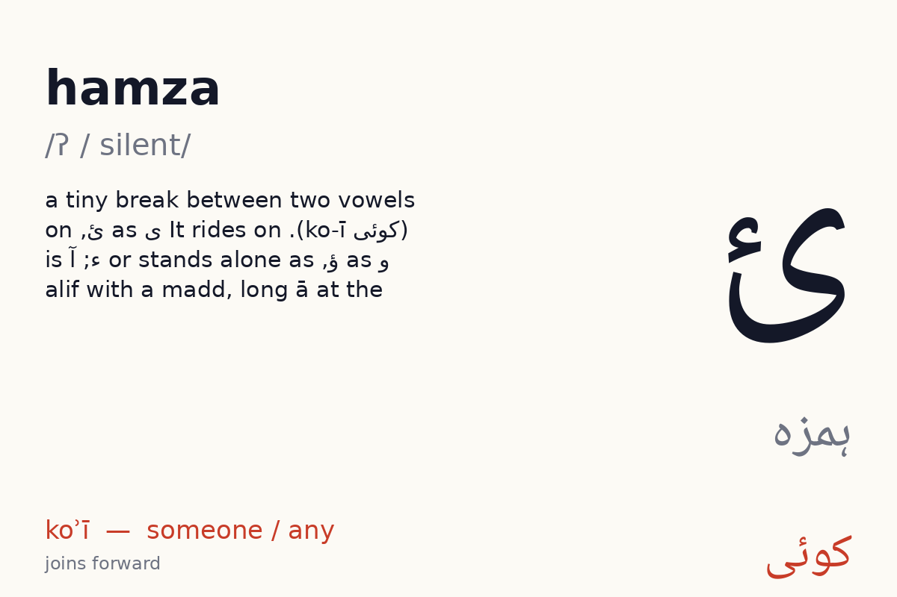
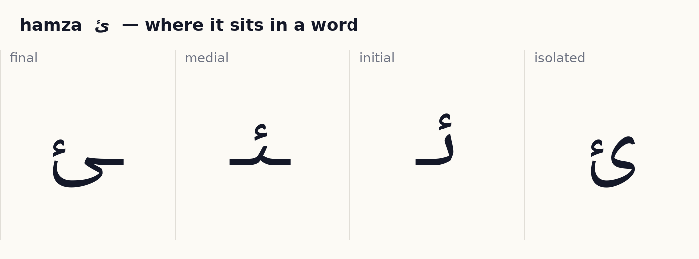

# Unit 10 — Hamza, marks and numbers  ·  ہمزہ، علامتیں، اعداد

**Focus:** ئ ؤ آ; tashdīd doubles; jazm stops the vowel; khaṛā zabar; iẕāfat; ۃ in Arabic words; numerals ۰–۹; punctuation ۔ ، ؟

## 1 · Hear it

| Letter | Name | Sound | Say it like… | Audio |
|---|---|---|---|---|
| ئ | hamza (ہمزہ) | /ʔ / silent/ | a tiny break between two vowels (کوئی ko-ī). It rides on ی as ئ, on و as ؤ, or stands alone as ء; آ is alif with a madd, long ā at the start of a word (آم ām) | `assets/audio/names/hamza.mp3` · `assets/audio/words/hamza.mp3` (کوئی koʾī — someone / any) |

## 2 · See it

**ئ hamza** — joins forward (4 forms).

✎ *How the pen moves:* a small hook, written last, sitting above ی/و or on the line. (Right to left; dots and marks last, after the whole word. These are the conventional Naskh/Nastaliq stroke orders as taught in Pakistani qaida classes; no published study was found, see research/05_open_assets.md.)

## 3 · Tell it apart  ·  *recognition · self-check with audio*

- No new look-alikes this unit. Re-run the unit 2 dot drill (ب ت ن ی) as a warm-up.

## 4 · Join it  ·  *production · self-check against the answer shown*

Build each word from letter tiles, right to left. Watch which letters change shape and which refuse to join.

- ک + و + ئ + ی  →  **کوئی**  (koʾī, someone)
- گ + ئ + ے  →  **گَئے**  (gaʾe, went)
- م + س + ئ + ل + ہ  →  **مَسْئَلہ**  (masʾala, problem)

## 5 · Read it  ·  *reading aloud · self-check with audio, or a helper listens*

Vowel marks are shown. Read aloud, then play the audio and compare.

| Word | Say | Means | Audio |
|---|---|---|---|
| آم | ām | mango | `assets/audio/units/u10_00.mp3` |
| آپ | āp | you (polite) | `assets/audio/units/u10_01.mp3` |
| کوئی | koʾī | someone | `assets/audio/units/u10_02.mp3` |
| گَئے | gaʾe | went | `assets/audio/units/u10_03.mp3` |
| مَسْئَلہ | masʾala | problem | `assets/audio/units/u10_04.mp3` |
| بَچّہ | bachcha | child | `assets/audio/units/u10_05.mp3` |
| اَللّٰہ | allāh | God | `assets/audio/units/u10_06.mp3` |
| دُعا | duʻā | prayer | `assets/audio/units/u10_07.mp3` |
| سُؤال | suwāl | question | `assets/audio/units/u10_08.mp3` |
| آئینہ | āʾīna | mirror | `assets/audio/units/u10_09.mp3` |
| نَئی | naʾī | new (f.) | `assets/audio/units/u10_10.mp3` |
| چائے | chāʾe | tea | `assets/audio/units/u10_11.mp3` |
| گائے | gāʾe | cow | `assets/audio/units/u10_12.mp3` |
| اَعلیٰ | aʻlā | high | `assets/audio/units/u10_13.mp3` |
| صَلوٰۃ | ṣalāt | prayer | `assets/audio/units/u10_14.mp3` |
| دُنیا | dunyā | world | `assets/audio/units/u10_15.mp3` |
| اَبّا | abbā | dad | `assets/audio/units/u10_16.mp3` |
| اَمّی | ammī | mum | `assets/audio/units/u10_17.mp3` |
| مَکّہ | makka | Makkah | `assets/audio/units/u10_18.mp3` |
| اَچّھا | achchhā | good | `assets/audio/units/u10_19.mp3` |

**Sentences**

- آپ کا نام کیا ہَے؟  —  *āp kā nām kyā hai?*  —  what is your name?  · `assets/audio/sentences/u10_00.mp3`
- چائے مَیں ۲ چَمَچ چینی  —  *chāʾe meṉ do chamach chīnī*  —  2 spoons of sugar in the tea  · `assets/audio/sentences/u10_01.mp3`
- کوئی مَسْئَلہ نَہیں۔  —  *koʾī masʾala nahīṉ.*  —  no problem.  · `assets/audio/sentences/u10_02.mp3`

## 6 · Write it  ·  *production · needs a helper or the app tracer to check*

Trace each new letter in all its forms three times (children: required; adults: recommended). Use the forms card as the model. Then write these words from the list without looking: آم, آپ, کوئی, گَئے, مَسْئَلہ.

Pen movement for each letter is described in step 2 above.

## 7 · Dictation  ·  *production · self-check with the key below*

Play each clip twice. Learner writes the word. Then reveal.

1. `assets/audio/units/u10_12.mp3`
2. `assets/audio/units/u10_06.mp3`
3. `assets/audio/units/u10_00.mp3`
4. `assets/audio/units/u10_09.mp3`
5. `assets/audio/units/u10_02.mp3`

Answer key

1. گائے (gāʾe)
2. اَللّٰہ (allāh)
3. آم (ām)
4. آئینہ (āʾīna)
5. کوئی (koʾī)

## 8 · Check (score 8/10 to move on)  ·  *recognition · self-check*

1. Which one says **allāh** (God)?   (a) بَچّہ   (b) گَئے   (c) اَللّٰہ   (d) اَبّا
2. Which one says **dunyā** (world)?   (a) آپ   (b) گائے   (c) دُنیا   (d) مَسْئَلہ
3. Which one says **achchhā** (good)?   (a) گائے   (b) بَچّہ   (c) اَچّھا   (d) آپ
4. Which one says **āʾīna** (mirror)?   (a) آئینہ   (b) چائے   (c) بَچّہ   (d) کوئی
5. Which one says **ammī** (mum)?   (a) چائے   (b) گائے   (c) آئینہ   (d) اَمّی
6. Which one says **gaʾe** (went)?   (a) کوئی   (b) صَلوٰۃ   (c) گَئے   (d) گائے
7. Which one says **duʻā** (prayer)?   (a) دُعا   (b) نَئی   (c) صَلوٰۃ   (d) گائے
8. Which one says **ṣalāt** (prayer)?   (a) اَللّٰہ   (b) صَلوٰۃ   (c) نَئی   (d) دُنیا
9. Which one says **masʾala** (problem)?   (a) مَسْئَلہ   (b) اَعلیٰ   (c) اَچّھا   (d) آپ
10. Which one says **chāʾe** (tea)?   (a) گائے   (b) چائے   (c) نَئی   (d) کوئی

Answer key

1. اَللّٰہ
2. دُنیا
3. اَچّھا
4. آئینہ
5. اَمّی
6. گَئے
7. دُعا
8. صَلوٰۃ
9. مَسْئَلہ
10. چائے

