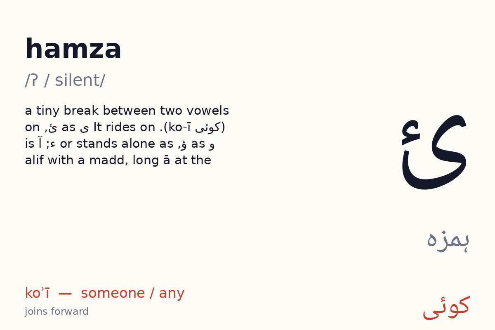
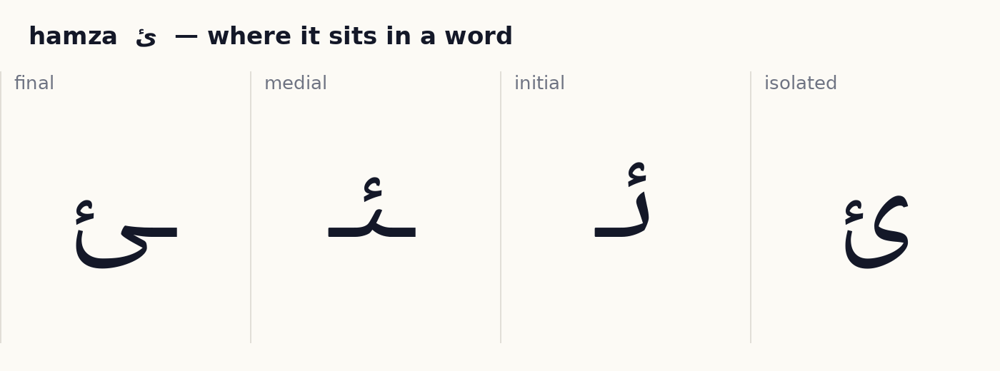

# Unit 10 — Hamza, marks and numbers  ·  ہمزہ، علامتیں، اعداد

**Focus:** ئ ؤ آ; tashdīd doubles; jazm stops the vowel; khaṛā zabar; iẕāfat; ۃ in Arabic words; numerals ۰–۹; punctuation ۔ ، ؟

**On the phone, this unit is these lessons, in order:** hamza ئ → Join them → Blend → Words 1 → Words 2 → Words 3 → Words 4 → Words 5 → Words 6 → Words 7 → Read → Hamza, marks, numbers → Unit check. Children rotate through them one at a time; the Unit check (8 of 10) unlocks the next unit.

## 1 · Hear it

| Letter | Name | Sound | Say it like… | Audio |
|---|---|---|---|---|
| ئ | hamza (ہمزہ) | /ʔ / silent/ | a tiny break between two vowels (کوئی ko-ī). It rides on ی as ئ, on و as ؤ, or stands alone as ء; آ is alif with a madd, long ā at the start of a word (آم ām) | `assets/audio/names/hamza.mp3` · `assets/audio/words/hamza.mp3` (کوئی koʾī — someone / any) |

## 2 · See it

**ئ hamza** — joins forward (4 forms).

✎ *How the pen moves:* a small hook, written last, sitting above ی/و or on the line. (Right to left; dots and marks last, after the whole word. These are the conventional Naskh/Nastaliq stroke orders as taught in Pakistani qaida classes; no published study was found, see research/05_open_assets.md.)

## 3 · Tell it apart  ·  *recognition · self-check with audio*

- No new look-alikes this unit. Re-run the unit 2 dot drill (ب ت ن ی) as a warm-up.

## 4 · Join it  ·  *production · self-check against the answer shown*

Build each word from letter tiles, right to left. Watch which letters change shape and which refuse to join.

- گ + ئ + ی  →  **گَئی**  (gaʾī, went (fem))
- ہ + و + ئ + ے  →  **ہُوئے**  (huʾe, were, happened (plural))
- ک + و + ئ + ی  →  **کوئی**  (koʾī, someone)

## 5 · Read it  ·  *reading aloud · self-check with audio, or a helper listens*

Vowel marks are shown. Read aloud, then play the audio and compare.

| Word | Say | Means | Audio |
|---|---|---|---|
| آپ | āp | you | `assets/audio/units/u10_00.mp3` |
| گَئی | gaʾī | went | `assets/audio/units/u10_01.mp3` |
| ہُوئے | huʾe | were, happened | `assets/audio/units/u10_02.mp3` |
| کوئی | koʾī | someone | `assets/audio/units/u10_03.mp3` |
| گَئے | gaʾe | went | `assets/audio/units/u10_04.mp3` |
| ہُوئی | huʾī | was, happened | `assets/audio/units/u10_05.mp3` |
| آج | āj | today | `assets/audio/units/u10_06.mp3` |
| اَللّٰہ | allāh | God | `assets/audio/units/u10_07.mp3` |
| جائے | jāʾe | may go | `assets/audio/units/u10_08.mp3` |
| آیا | āyā | came | `assets/audio/units/u10_09.mp3` |
| کَئی | kaʾī | several | `assets/audio/units/u10_10.mp3` |
| آئے | āʾe | came | `assets/audio/units/u10_11.mp3` |
| بَھائی | bhāʾī | brother | `assets/audio/units/u10_12.mp3` |
| برائے | barāʾe | for | `assets/audio/units/u10_13.mp3` |
| آئی | āʾī | came | `assets/audio/units/u10_14.mp3` |
| قائِم | qāʾim | established | `assets/audio/units/u10_15.mp3` |
| آتا | ātā | comes | `assets/audio/units/u10_16.mp3` |
| نَئی | naʾī | new | `assets/audio/units/u10_17.mp3` |
| آتی | ātī | comes | `assets/audio/units/u10_18.mp3` |
| ہَوائی | hawāʾī | of the air | `assets/audio/units/u10_19.mp3` |
| آخِر | āk͟hir | at last | `assets/audio/units/u10_20.mp3` |
| آدمی | ādmī | man, person | `assets/audio/units/u10_21.mp3` |
| آسان | āsān | easy | `assets/audio/units/u10_22.mp3` |
| چائے | chāʾe | tea | `assets/audio/units/u10_23.mp3` |
| آنا | ānā | to come | `assets/audio/units/u10_24.mp3` |
| آخِری | āk͟hirī | last | `assets/audio/units/u10_25.mp3` |
| آگے | āge | ahead | `assets/audio/units/u10_26.mp3` |
| آتے | āte | come | `assets/audio/units/u10_27.mp3` |
| اَعلیٰ | aʻlā | high | `assets/audio/units/u10_28.mp3` |
| نَئے | naʾe | new | `assets/audio/units/u10_29.mp3` |
| پَیدائِش | paidāʾish | birth | `assets/audio/units/u10_30.mp3` |
| آزاد | āzād | free | `assets/audio/units/u10_31.mp3` |
| رائے | rāʾe | opinion | `assets/audio/units/u10_32.mp3` |
| آٹھ | āṭh | eight | `assets/audio/units/u10_33.mp3` |
| آنکھیں | āṉkheṉ | eyes | `assets/audio/units/u10_34.mp3` |
| گَئیں | gaʾīṉ | went | `assets/audio/units/u10_35.mp3` |
| بَچّہ | bachcha | child | `assets/audio/units/u10_36.mp3` |
| اَمّی | ammī | mum | `assets/audio/units/u10_37.mp3` |
| آرام | ārām | rest, comfort | `assets/audio/units/u10_38.mp3` |
| آواز | āwāz | voice, sound | `assets/audio/units/u10_39.mp3` |
| سائِنس | sāʾins | science | `assets/audio/units/u10_40.mp3` |
| صَفائی | ṣafāʾī | cleanliness | `assets/audio/units/u10_41.mp3` |
| لَڑائی | laṛāʾī | fight | `assets/audio/units/u10_42.mp3` |
| آدھا | ādhā | half | `assets/audio/units/u10_43.mp3` |
| جائیں | jāʾeṉ | may go | `assets/audio/units/u10_44.mp3` |
| فائِدَہ | fāʾida | benefit | `assets/audio/units/u10_45.mp3` |
| مَسائِل | masāʾil | problems | `assets/audio/units/u10_46.mp3` |
| دَہائی | dahāʾī | decade | `assets/audio/units/u10_47.mp3` |
| مَسْئَلہ | masʾala | problem | `assets/audio/units/u10_48.mp3` |
| بَجائے | bajāʾe | instead of | `assets/audio/units/u10_49.mp3` |
| ذائِقَہ | ẕāʾiqa | taste | `assets/audio/units/u10_50.mp3` |
| سَچّائی | sachchāʾī | truth | `assets/audio/units/u10_51.mp3` |
| آسمان | āsmān | sky | `assets/audio/units/u10_52.mp3` |
| نَتائِج | natāʾij | results | `assets/audio/units/u10_53.mp3` |
| کھائیں | khāʾeṉ | may eat | `assets/audio/units/u10_54.mp3` |
| مَکّہ | makka | Makkah | `assets/audio/units/u10_55.mp3` |
| سائیکَل | sāʾīkal | bicycle | `assets/audio/units/u10_56.mp3` |
| ڈھائی | ḍhāʾī | two and a half | `assets/audio/units/u10_57.mp3` |
| کائِنات | kāʾināt | universe | `assets/audio/units/u10_58.mp3` |
| آنسو | āṉsū | tear | `assets/audio/units/u10_59.mp3` |
| بُرائی | burāʾī | evil, badness | `assets/audio/units/u10_60.mp3` |
| آب | āb | water | `assets/audio/units/u10_61.mp3` |
| رِہائِش | rihāʾish | residence | `assets/audio/units/u10_62.mp3` |
| دَوائی | dawāʾī | medicine | `assets/audio/units/u10_63.mp3` |
| آنکھ | āṉkh | eye | `assets/audio/units/u10_64.mp3` |
| پَڑھائی | paṛhāʾī | studies | `assets/audio/units/u10_65.mp3` |
| دُعا | duʻā | prayer | `assets/audio/units/u10_66.mp3` |
| آندھی | āṉdhī | dust storm | `assets/audio/units/u10_67.mp3` |
| اَبّا | abbā | dad | `assets/audio/units/u10_68.mp3` |
| لَمبائی | lambāʾī | length | `assets/audio/units/u10_69.mp3` |
| موبائِل | mobāʾil | mobile phone | `assets/audio/units/u10_70.mp3` |
| گائے | gāʾe | cow | `assets/audio/units/u10_71.mp3` |
| غائِب | g͟hāʾib | missing, absent | `assets/audio/units/u10_72.mp3` |
| گَہرائی | gahrāʾī | depth | `assets/audio/units/u10_73.mp3` |
| اونچائی | ūṉchāʾī | height | `assets/audio/units/u10_74.mp3` |
| کَمائی | kamāʾī | earnings | `assets/audio/units/u10_75.mp3` |
| آئینہ | āʾīna | mirror | `assets/audio/units/u10_76.mp3` |
| دُعائیں | duʻāʾeṉ | prayers | `assets/audio/units/u10_77.mp3` |
| چَوڑائی | chauṛāʾī | width | `assets/audio/units/u10_78.mp3` |
| آؤ | āo | come! | `assets/audio/units/u10_79.mp3` |
| آلو | ālū | potato | `assets/audio/units/u10_80.mp3` |
| آٹا | āṭā | flour | `assets/audio/units/u10_81.mp3` |
| سُوئی | suʾī | needle | `assets/audio/units/u10_82.mp3` |
| آم | ām | mango | `assets/audio/units/u10_83.mp3` |
| لِکھائی | likhāʾī | handwriting | `assets/audio/units/u10_84.mp3` |
| صَلوٰۃ | ṣalāt | prayer | `assets/audio/units/u10_85.mp3` |
| مِٹھائی | miṭhāʾī | sweets | `assets/audio/units/u10_86.mp3` |
| کوئِلَہ | koʾila | coal | `assets/audio/units/u10_87.mp3` |
| مَلائی | malāʾī | cream | `assets/audio/units/u10_88.mp3` |

**Sentences**

- آپ کا نام کیا ہَے؟  —  *āp kā nām kyā hai?*  —  what is your name?  · `assets/audio/sentences/u10_00.mp3`
- مِیرا نام زَینَب ہَے  —  *merā nām zainab hai*  —  my name is Zainab  · `assets/audio/sentences/u10_01.mp3`
- کوئی مَسْئَلہ نَہیں  —  *koʾī masʾala nahīṉ*  —  no problem  · `assets/audio/sentences/u10_02.mp3`
- آج مَوسَم اَچّھا ہَے  —  *āj mausam achchhā hai*  —  the weather is good today  · `assets/audio/sentences/u10_03.mp3`
- آسمان نیلا ہَے  —  *āsmān nīlā hai*  —  the sky is blue  · `assets/audio/sentences/u10_04.mp3`
- بَھائی سائیکَل پَر آتا ہَے  —  *bhāʾī sāʾīkal par ātā hai*  —  brother comes by bicycle  · `assets/audio/sentences/u10_05.mp3`
- اَمّی چائے دیتی ہَے  —  *ammī chāʾe detī hai*  —  mother gives tea  · `assets/audio/sentences/u10_06.mp3`
- اَبّا کی دُکان پَر آلو اَور آٹا ہَے  —  *abbā kī dukān par ālū aur āṭā hai*  —  there are potatoes and flour at dad's shop  · `assets/audio/sentences/u10_07.mp3`
- مِٹھائی بَہُت اَچّھی ہَے  —  *miṭhāʾī bahut achchhī hai*  —  the sweets are very good  · `assets/audio/sentences/u10_08.mp3`
- ہَم ۲ بَجے گَھر جائیں گے  —  *ham ۲ baje ghar jāʾeṉ ge*  —  we will go home at 2 o'clock  · `assets/audio/sentences/u10_09.mp3`
- چائے مَیں ۲ چَمَچ چینی  —  *chāʾe meṉ ۲ chamach chīnī*  —  2 spoons of sugar in the tea  · `assets/audio/sentences/u10_10.mp3`
- آنکھیں بَہُت خوبصورَت ہَیں  —  *āṉkheṉ bahut k͟hūbṣūrat haiṉ*  —  the eyes are very beautiful  · `assets/audio/sentences/u10_11.mp3`
- لَڑائی مَت کَرو  —  *laṛāʾī mat karo*  —  don't fight  · `assets/audio/sentences/u10_12.mp3`
- آج آسمان صاف ہَے  —  *āj āsmān ṣāf hai*  —  the sky is clear today  · `assets/audio/sentences/u10_13.mp3`
- آندھی بَہُت تیز ہَے  —  *āṉdhī bahut tez hai*  —  the dust storm is very strong  · `assets/audio/sentences/u10_14.mp3`
- اَبّا کی سائیکَل نَئی ہَے  —  *abbā kī sāʾīkal naʾī hai*  —  dad's bicycle is new  · `assets/audio/sentences/u10_15.mp3`
- آؤ، ہَم باغ جائیں  —  *āo, ham bāg͟h jāʾeṉ*  —  come, let's go to the garden  · `assets/audio/sentences/u10_16.mp3`
- آج مِٹھائی ہَے  —  *āj miṭhāʾī hai*  —  there are sweets today  · `assets/audio/sentences/u10_17.mp3`
- آسمان پَر چاند اَور سِتارَہ ہَیں  —  *āsmān par chānd aur sitāra haiṉ*  —  there are the moon and a star in the sky  · `assets/audio/sentences/u10_18.mp3`

**Passage** (99 words) · `assets/audio/passages/u10.mp3`

> آج اِتوار ہَے۔ بَھائی اَپنی سائیکَل پَر دُکان جاتا ہَے۔ دُکان پَر آٹا، آلو اَور مِٹھائی ہَے۔ بَھائی نے ۲ سیب اَور ایک آم لِیے۔ پِھر وُہ گَھر آتا ہَے۔ اَمّی چائے دیتی ہَے۔ چائے مَیں ۲ چَمَچ چینی ہَے۔ بَھائی کَہتا ہَے: شُکرِیَہ اَمّی۔ اَمّی کَہتی ہَے: کوئی مَسْئَلہ نَہیں۔ اَبّا کَہتا ہَے: آج مَوسَم اَچّھا ہَے۔ آسمان نیلا ہَے۔ ہَم ۴ بَجے باغ جائیں گے۔ بَھائی کو باغ بَہُت پَسَند ہَے۔ آج آسمان صاف ہَے۔ اَبّا کی سائیکَل نَئی ہَے۔ بَھائی کَہتا ہَے: آؤ، ہَم باغ جائیں۔ اَمّی آج مِٹھائی دیتی ہَے۔ ہَم سَب آج خُوش ہَیں۔
>
> *āj itwār hai. bhāʾī apnī sāʾīkal par dukān jātā hai. dukān par āṭā, ālū aur miṭhāʾī hai. bhāʾī ne ۲ seb aur ek ām liye. phir woh ghar ātā hai. ammī chāʾe detī hai. chāʾe meṉ ۲ chamach chīnī hai. bhāʾī kahtā hai: shukriya ammī. ammī kahtī hai: koʾī masʾala nahīṉ. abbā kahtā hai: āj mausam achchhā hai. āsmān nīlā hai. ham ۴ baje bāg͟h jāʾeṉ ge. bhāʾī ko bāg͟h bahut pasand hai. āj āsmān ṣāf hai. abbā kī sāʾīkal naʾī hai. bhāʾī kahtā hai: āo, ham bāg͟h jāʾeṉ. ammī āj miṭhāʾī detī hai. ham sab āj k͟hush haiṉ.*
>
> Today is Sunday. Brother goes to the shop on his bicycle. At the shop there is flour, potatoes and sweets. Brother took 2 apples and a mango. Then he comes home. Mother gives tea. There are 2 spoons of sugar in the tea. Brother says: thank you, mother! Mother says: no problem. Dad says: the weather is good today. The sky is blue. We will go to the garden at 4 o'clock. Brother likes the garden very much. The sky is clear today. Dad's bicycle is new. Brother says: come, let's go to the garden. Mother gives sweets today. We are all happy today.

## 6 · Write it  ·  *production · needs a helper or the app tracer to check*

Trace each new letter in all its forms three times (children: required; adults: recommended). Use the forms card as the model. Then write these words from the list without looking: آپ, گَئی, ہُوئے, کوئی, گَئے.

Pen movement for each letter is described in step 2 above.

## 7 · Dictation  ·  *production · self-check with the key below*

Play each clip twice. Learner writes the word. Then reveal.

1. `assets/audio/units/u10_73.mp3`
2. `assets/audio/units/u10_46.mp3`
3. `assets/audio/units/u10_16.mp3`
4. `assets/audio/units/u10_87.mp3`
5. `assets/audio/units/u10_64.mp3`

Answer key

1. گَہرائی (gahrāʾī)
2. مَسائِل (masāʾil)
3. آتا (ātā)
4. کوئِلَہ (koʾila)
5. آنکھ (āṉkh)

## 8 · Check (score 8/10 to move on)  ·  *recognition · self-check*

1. Which one says **āṉdhī** (dust storm)?   (a) آندھی   (b) مَکّہ   (c) آواز   (d) ہُوئے
2. Which one says **ālū** (potato)?   (a) آلو   (b) آپ   (c) رِہائِش   (d) کَمائی
3. Which one says **āte** (come (plural))?   (a) کائِنات   (b) بُرائی   (c) آتے   (d) رائے
4. Which one says **āʾe** (came (plural))?   (a) آم   (b) آئے   (c) آنسو   (d) آئی
5. Which one says **āṉkheṉ** (eyes)?   (a) آم   (b) گَئے   (c) آنکھیں   (d) گَہرائی
6. Which one says **āzād** (free)?   (a) آزاد   (b) بَھائی   (c) سائیکَل   (d) آئی
7. Which one says **bajāʾe** (instead of)?   (a) بَجائے   (b) اَعلیٰ   (c) دُعائیں   (d) آپ
8. Which one says **sachchāʾī** (truth)?   (a) آزاد   (b) آب   (c) سَچّائی   (d) آم
9. Which one says **suʾī** (needle)?   (a) سُوئی   (b) اَللّٰہ   (c) لِکھائی   (d) آواز
10. Which one says **ḍhāʾī** (two and a half)?   (a) رائے   (b) ڈھائی   (c) نَئے   (d) مِٹھائی

Answer key

1. آندھی
2. آلو
3. آتے
4. آئے
5. آنکھیں
6. آزاد
7. بَجائے
8. سَچّائی
9. سُوئی
10. ڈھائی

