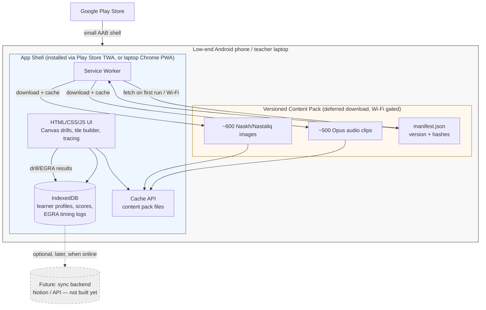

# 09 — Tech Stack: Offline Urdu Reading App

**Scope:** fully offline Urdu-literacy app for low-end Android phones in Pakistan, also usable on laptop/tablet by teachers. Content: ~500 audio clips, ~600 letter/word images or font-rendered Naskh+Nastaliq text, interactive drills (tap-what-you-hear, tile word-building, canvas tracing, dictation, quizzes), an EGRA-style timed reading test with per-learner reports, multiple learner profiles on one device, optional later sync.

Research date: 2026-09-18. Method: DuckDuckGo search via `ddg.py` (no live page fetches performed beyond search-snippet review — flag anything not independently opened as UNVERIFIED).

---

## 1. Device reality: Pakistan, 2025–26

| Metric | Value | Source |
|---|---|---|
| Android OS share (mobile) | 90.6% (iOS 9.3%, KaiOS 0.08%) | gs.statcounter.com/os-market-share/mobile/pakistan |
| Android version fragmentation | Android 13 ≈ 18.2%, Android 11 ≈ 15.0%, Android 15 ≈ next-largest; long tail down to Android 8–9 still present | gs.statcounter.com/android-version-market-share/mobile-tablet/pakistan |
| Budget phone RAM/storage (entry tier, ~PKR 10–15k / <$60) | 2–3 GB RAM, 16–32 GB storage, expandable via SD card | itel-pk.com budget phone listings 2025 |
| Local assembly | >93% of phones sold sold are now locally assembled in Pakistan (mostly budget Android) | LinkedIn/ProPakistani commentary — **UNVERIFIED** (single secondary source, no primary industry report opened) |
| Component cost pressure | Budget-segment ($<200) device cost up 20–30% since early 2025 due to global RAM/NAND shortage — likely to push RAM/storage specs down further in 2026, not up | ProPakistani (Facebook post) — **UNVERIFIED**, directionally consistent with IDC's global memory-shortage coverage |

**Implication:** design for 2 GB RAM, 16–32 GB storage (much of it already consumed by OS, WhatsApp, camera roll), Android 8–13 (API 26–33), Chrome/WebView present and auto-updated via Play Store (Chrome on Android is evergreen independent of OS version back to Android 5+). Do not assume >100 MB of free storage is comfortably available — budget for a lean footprint and let content be optional/removable per grade.

---

## 2. Framework comparison

| | PWA (installable, SW + IndexedDB/OPFS) | Capacitor/Cordova (HTML wrapped) | Flutter | React Native/Expo | Kotlin native |
|---|---|---|---|---|---|
| **Nastaliq rendering** | Uses the OS/Chrome text-shaping stack (HarfBuzz + Skia via Chrome/WebView) — the same engine Android itself uses. Complex-script (Nastaliq ligature/diagonal-stacking) shaping works but is CPU-heavier per glyph run; multiple field reports of Nastaliq being *slow or visually broken in some renderers* (Figma, Unity/TextMeshPro), not Chrome specifically. No confirmed Chrome-specific Nastaliq shaping bug found in this pass. | Same as PWA — it *is* a WebView, so identical text engine and identical risk profile. | Historically weak: Flutter has its own text-layout/shaping stack (not the OS one), and Nastaliq's cascading, context-dependent letterforms have been a recurring pain point for Urdu apps built with Flutter — multiple Pakistan-market dev shops (Kinetixsoft, Workflox) call out "Nastaliq rendering" as a named challenge requiring workarounds. **UNVERIFIED** whether this is fixed in current stable Flutter; no dedicated Flutter-engine bug ticket was opened and read this pass — treat as an open risk, not a hard blocker. | Same underlying JS engine/text stack concerns as web when using JS-based text (Hermes doesn't do its own font shaping, relies on platform text views) — better positioned than Flutter here since it defers to native Android text rendering, but no direct evidence gathered this pass — **UNVERIFIED**. | Full native control (HarfBuzz/ICU directly, or platform TextView) — best possible fidelity, most engineering effort to get there. |
| **Mitigation used by this project** | We already plan ~600 pre-rendered letter/word images for the trickiest content — this sidesteps live Nastaliq shaping almost entirely for the highest-value content. Live text is only needed for lower-risk UI chrome (labels, buttons, quiz prompts), which can default to Naskh (simpler, linear, well-supported everywhere) and reserve Nastaliq specifically for the pre-rendered assets. | Same mitigation applies. | Same mitigation applies, but doesn't remove the framework-choice risk for any live Nastaliq text (e.g. dynamic score feedback in Nastaliq). | Same. | N/A — native rendering is reliable regardless. |
| **Offline storage available** | Chrome: up to ~60% of total device disk per origin (up to hundreds of GB on paper); Firefox ~20% of quota; storage is "best-effort" and can be evicted under pressure unless `navigator.storage.persist()` is granted. Safari (not relevant — Android-first) is much stricter (~1 GB). Shared quota across Cache API + IndexedDB + OPFS. | Same web storage APIs available in the WebView, **plus** access to native plugins (e.g. `@capacitor-community/sqlite`) that bypass browser storage eviction entirely by writing to the app's private native filesystem — meaningfully more durable than pure PWA storage for a device an app owner doesn't control. | Native filesystem (`path_provider`) + `sqflite`/Isar/Hive — no browser-quota concerns at all; storage is bounded only by device free space. | Same as Flutter — native filesystem, `react-native-sqlite-storage` / WatermelonDB, no quota eviction concerns. | Same — full native filesystem control (Room + internal storage). |
| **Audio playback** | `<audio>`/Web Audio API; well supported, low-latency enough for drill/dictation use cases on modern Chrome; some jank reports on very old WebView versions (pre-Android 8) — mostly moot given target Android 8+. | Identical to PWA (same WebView engine) + can drop to native audio APIs via plugin if latency ever becomes an issue. | Native `AudioPlayer`/`just_audio` — best available latency control. | Native audio libs (`react-native-track-player`) — good latency control. | Best possible — direct `MediaPlayer`/`SoundPool`/`AAudio`. |
| **Installability on low-end devices** | Add-to-Home-Screen / WebAPK works Android-wide via Chrome; **no Play Store presence by default** (a real deployment gap for parent/teacher discoverability and trust in Pakistan's market, where Play Store is the default discovery/install channel) unless wrapped. | Produces a real installable APK/AAB — full Play Store presence out of the box, no extra wrapping step. | Same — real APK/AAB, full Play Store presence. | Same. | Same. |
| **Play Store distribution route** | **TWA via Bubblewrap** (Google's own CLI/tooling, `googlechromelabs/bubblewrap`) — wraps the PWA in a thin native shell that hosts the same Chrome engine full-screen, keeps the PWA's service-worker offline behavior, and publishes as a normal AAB to Play Store. Multiple independent how-tos (Rangle, Vaadin, Medium 2025, official Google docs) confirm this is a standard, low-effort, actively-maintained path. | N/A — already a native package. | N/A | N/A | N/A |
| **APK/app size discipline** | TWA shell itself is tiny (a few MB); content is fetched at runtime by the service worker, so the *initial Play Store download* can be kept very small (just app shell), deferring the ~100 MB+ content pack to a post-install, Wi-Fi-gated download — directly addresses Google's own guidance ("Build for Billions"/Android Go doc: minimize install size for markets with limited connectivity, defer non-critical content). | Bundles HTML/JS/assets into the APK unless explicitly using Capacitor's own deferred-asset patterns — more manual work to replicate the PWA's "small shell, big deferred pack" story. | Flutter APKs run bigger by default (engine + Dart AOT baseline ~15–25 MB before any app code/assets — multiple 2025 "why is my Flutter app so big" guides confirm this as a known pain point, with 50–60% size-reduction techniques documented as a recurring need, implying it's not solved by default). | Similar baseline-size tax from the RN/Hermes engine, smaller than Flutter's typically, but still bigger than a TWA shell. | Smallest possible baseline — no cross-platform runtime tax — but no code reuse for a later iOS/desktop port and slower to build the richness of drills (canvas tracing, tile-based word building) that HTML5/Canvas already does well. |
| **Dev speed for the drill types listed** (tap-what-you-hear, tile word-building, canvas tracing, dictation, quizzes) | High — these are all well-trodden HTML5 Canvas/DOM + Web Audio patterns; huge existing prior art (web-based literacy/EGRA tools). | High — same HTML/JS codebase as PWA, reused as-is. | Medium — Flutter's `CustomPainter` handles canvas tracing fine, drag-drop tile building is standard Flutter, but every drill is bespoke Dart, no reuse of any existing HTML prototypes. | Medium — similar to Flutter, JS-familiar team velocity is a plus if the team already knows React. | Low — most drill types (tracing, tile drag-drop) require hand-built Canvas/View code with no cross-platform reuse. |
| **Offline-first prior art in this exact domain** | **Tangerine** (tangerinecentral.org, RTI International) is an open-source, offline-first EGMA/EGRA data-collection platform explicitly built for "low-cost Android tablets," with assessments authored online and conducted fully offline on-device — i.e. an existing, field-proven reference architecture for exactly the EGRA-timed-reading-test half of this project's requirements. Worth reading Tangerine's own architecture before finalizing ours. | — | — | — | — |

### Verdict

**Recommend: PWA-first, shipped to Play Store via a TWA (Bubblewrap) wrapper**, not a from-scratch native or Flutter/RN app. Reasoning:

1. **Content-asset dominance, not UI-logic dominance.** The hardest part of this product (Nastaliq fidelity) is already being solved by pre-rendering ~600 images rather than live text shaping — this removes the single biggest argument for going native/Flutter (better text engines), because the framework's text engine barely matters once the highest-risk content is images.
2. **Storage/eviction risk is real but manageable.** Chrome's per-origin quota (up to 60% of disk) is generous enough for a ~100–150 MB content pack (see §4) on a 16–32 GB budget device, and `navigator.storage.persist()` plus a "content downloaded" completion signal removes most eviction risk. This is the PWA path's one genuine weakness relative to native filesystem storage — mitigate by requesting persistent storage immediately after the content pack completes downloading, and testing real eviction behavior on a real budget device before launch (do not trust desktop Chrome devtools numbers).
3. **Deferred content pack solves the "install size on limited connectivity" concern that Flutter/RN structurally don't solve as cleanly** — ship a small app-shell APK (few MB) through Play, download the real content pack over Wi-Fi post-install with resumable, versioned fetches. This directly matches Android's own "Build for Billions" guidance for this exact market.
4. **Drill types listed are exactly what HTML5 Canvas + Web Audio already does well**, with far more reusable prior art (open-source literacy/EGRA tooling, most of it web-based) than Flutter-specific Urdu-literacy prior art, which is thin.
5. **Play Store presence is not sacrificed** — TWA/Bubblewrap is a standard, actively-maintained (2025–26 how-tos exist), low-effort path that keeps the "installable, trusted, in the Play Store" experience parents/teachers expect in Pakistan while keeping a single HTML/JS/CSS codebase for phone, tablet, and teacher laptop.
6. **Single codebase covers the explicit laptop/tablet requirement for teachers** for free — a PWA installs and runs identically on a Windows/Linux laptop Chrome install, with zero extra engineering, which Flutter/RN/Kotlin-native would each require a second target (desktop Flutter/Electron, RN-desktop, or a totally separate app) to match.

**When this verdict would flip:** if live (not pre-rendered) Nastaliq text turns out to be needed pervasively (not just for the ~600 pre-rendered assets) — e.g. dynamic teacher-authored content in Nastaliq — re-test Chrome/WebView Nastaliq shaping quality and performance on 2–3 real budget devices before committing; if it's poor, native (Kotlin, using Android's own text engine directly) becomes the safer choice for that specific surface, and could be added later as a thin native shell around the same content pack rather than a full rewrite.

**Capacitor as a fallback, not primary:** if TWA testing reveals a real gap (e.g. a native API not exposed to WebView — microphone permission edge cases for dictation, or reliable local push notifications for streak reminders), Capacitor wraps the *same* HTML/CSS/JS codebase with near-zero rewrite and adds native plugin access. Treat this as a contingency, not a day-one decision — don't pay Capacitor's extra build/tooling complexity unless a concrete capability gap shows up in testing.

---

## 3. Supporting technical decisions

### 3.1 Local database
**wa-sqlite (SQLite compiled to WASM, persisted via OPFS) over IndexedDB directly**, or plain IndexedDB if the schema stays simple (learner profiles, drill results, EGRA timing logs — all small, relational-shaped data).

- IndexedDB alone is a NoSQL key-value store; workable for this app's data (profiles, scores, attempt logs) but awkward for relational queries (e.g. "all EGRA attempts for learner X across the last 4 assessments, joined with drill item metadata").
- wa-sqlite + OPFS has matured significantly by 2025 — PowerSync and LogRocket's 2025 write-ups both describe it as now capable of handling real relational workloads in-browser, and note Notion's own production migration from IndexedDB to SQLite-WASM+OPFS cut per-operation latency from hundreds of ms to near-zero.
- **Recommendation for this app's actual scale (a handful of learner profiles per device, hundreds not millions of rows):** plain IndexedDB (via a thin wrapper like `idb`) is almost certainly sufficient and simpler to ship; reach for wa-sqlite only if reporting/query complexity (e.g. building the EGRA per-learner report) turns out to need real SQL joins that IndexedDB makes painful. Don't default to the heavier option without a concrete need — this is the one place in the stack where "boring and simple" beats "impressive and complex."

### 3.2 Audio format for ~500 clips
**Opus (in a WebM or Ogg container) as primary, with an AAC/MP3 fallback bundled only if a specific target WebView version needs it.**

- Multiple independent sources (Wikipedia, Transloadit, How-To Geek, MDN's own codec guide) converge on the same finding: Opus is consistently smaller than MP3 at equivalent perceived quality — a 128 kbps Opus file is reported to sound comparable to or better than a 320 kbps MP3, and one Reddit anecdote cites Opus files taking <25% of the equivalent FLAC size.
- Opus is natively supported by Chrome/Android's `<audio>`/`MediaCodec` stack since Android 5+ (well within this project's floor of Android 8+ traffic seen in Pakistan's version-share data above) — no fallback transcoding pipeline should be needed for the target OS range, but **verify on 2–3 real low-end devices before finalizing**, since WebView vendor customizations occasionally lag behind stock Chromium's codec support — flag as UNVERIFIED until device-tested.

### 3.3 On-device TTS (only if dynamic speech is ever needed — not required for the pre-recorded 500 clips)
Two real options if a future feature needs speech Kamal hasn't pre-recorded (e.g. teacher-typed custom words):

| Option | Size | Notes |
|---|---|---|
| Android system TTS | 0 MB extra (already on-device) | **Urdu voice availability is a real gap** — a 2017 StackOverflow thread found no Urdu voice in Android's built-in Google TTS at the time; the accessibleandroid.com language/engine table should be checked directly for current (2025–26) Urdu coverage before relying on this — **UNVERIFIED, treat as likely still absent or low-quality** given Urdu's smaller commercial TTS market relative to Hindi. |
| sherpa-onnx + Piper voice | ~30 MB per voice (Piper model) + sherpa-onnx runtime | sherpa-onnx's own docs list dedicated Urdu TTS model samples (k2-fsa.github.io/sherpa/onnx/tts/all/Urdu/), confirming a real, currently-available on-device Urdu neural TTS option; CPU-light enough for "midrange hardware" per a 2026 write-up, though performance on a 2 GB-RAM budget Android device specifically is **UNVERIFIED** — test on-device before depending on it for any real-time interaction (e.g. a "type a word and hear it read back" drill). |

Given the pre-recorded 500-clip asset library already covers the app's core needs, **do not build TTS into the MVP** — revisit only if a specific later feature (teacher-authored custom content, adaptive remediation) genuinely requires dynamic speech, and default to sherpa-onnx+Piper's Urdu voice over Android system TTS given the documented Urdu-voice gap in the latter.

### 3.4 Content-update strategy
**Versioned content pack, separate from app shell — service-worker-managed.**

- App shell (HTML/CSS/JS/drill logic) ships in the small Play Store download and updates via normal Play/service-worker app updates.
- Content pack (500 audio + 600 images, a manifest with a version number and per-file hashes) is fetched post-install over Wi-Fi, cached via the Cache API, and re-validated against the manifest on each app open when connectivity is available — download only the diff (new/changed files) on content updates, not the full pack again.
- Call `navigator.storage.persist()` immediately after a successful full content-pack download to reduce (not eliminate) eviction risk under storage pressure — Chrome grants "persistent storage" heuristically (engagement-based), so this should be tested for real on a genuinely storage-constrained budget device, not assumed to always succeed.
- Multiple learner profiles share one content pack (audio/images aren't per-learner) — only progress/score data is per-profile, which keeps the marginal storage cost of additional profiles on the same device near zero.

---

## 4. Storage budget estimate

| Asset | Count | Per-item estimate | Total |
|---|---|---|---|
| Audio clips (Opus, ~2–15s each, short words/letters/instructions) | 500 | ~15–40 KB (short clips at ~32–48 kbps Opus) | **~10–20 MB** |
| Longer audio (dictation passages, EGRA test passages, if included in the 500 or additional) | (subset of above / add if separate) | ~150–300 KB for a 30–60s passage at 48 kbps Opus | budget an extra **~10–20 MB** if 50–100 of the 500 are longer passages |
| Letter/word images (PNG, small sprite-sized assets, Nastaliq/Naskh pre-rendered) | 600 | ~15–40 KB (small transparent PNGs, not photos) | **~10–25 MB** |
| App shell (HTML/CSS/JS/drill logic, fonts for live UI text) | 1 | — | **~5–10 MB** (incl. Noto Nastaliq Urdu + Noto Naskh Arabic variable fonts, which run a few MB each) |
| **Total estimated footprint** | | | **~35–75 MB**, comfortably under 150 MB even with generous per-clip padding |

This is well within Chrome's per-origin quota headroom (up to 60% of disk on a 16 GB device is ~9.6 GB) and comfortably under Google Play's install-size guidance thresholds for limited-connectivity markets, especially since the content pack is a post-install deferred download rather than baked into the APK/AAB itself. **Actual per-clip/per-image sizes should be measured against Kamal's real recorded/rendered asset set once produced — this is a planning estimate, not a measurement.**

---

## 5. Proposed offline architecture

---

## 6. Risks

1. **Nastaliq live-text shaping quality on real budget WebView versions is UNVERIFIED** for this app's specific fonts/strings — mitigated structurally by pre-rendering the 600 highest-value assets as images, but any future live-Nastaliq feature needs on-device testing before commitment.
2. **Storage eviction under pressure is real, not theoretical**, on a 2–3 GB RAM / 16–32 GB storage device already carrying WhatsApp/camera media — `navigator.storage.persist()` reduces but doesn't eliminate this; test on an actually-full real device, not an emulator.
3. **Global RAM/NAND price shock (2025–26) may push Pakistan's already-thin budget-device specs down further**, not up — don't assume next year's baseline device improves; design for today's floor, not tomorrow's expected floor.
4. **Opus/WebView codec support on real low-end devices is asserted from spec docs, not device-tested this pass** — flag as the top item to verify before finalizing audio pipeline.
5. **Urdu system TTS availability is likely still poor/absent** based on a 2017 report — this only matters if a future dynamic-speech feature is added; the sherpa-onnx+Piper Urdu model is a confirmed, currently-available fallback but its CPU load on 2 GB-RAM devices is untested.
6. **TWA/Bubblewrap Play Store review and Digital Asset Links setup is a real one-time integration task** (domain verification, `assetlinks.json`) — not zero-effort, budget a day for first-time setup even though the path itself is well-documented and standard.
7. **Tangerine (existing offline-first EGRA/EGMA platform) was found but not deeply studied this pass** — worth a follow-up research note specifically reading Tangerine's architecture before finalizing the EGRA-timing-test implementation, since it's directly prior art for that exact sub-feature, not just a generally-adjacent tool.

---

## 7. Sources (opened via search snippets; URLs listed below were surfaced by DuckDuckGo search this session — full-page fetches were NOT performed for most, only titles/snippets reviewed; treat any claim above marked UNVERIFIED as needing a direct read before being load-bearing for a real engineering decision)

- https://developer.mozilla.org/en-US/docs/Web/API/Storage_API/Storage_quotas_and_eviction_criteria
- https://rxdb.info/articles/indexeddb-max-storage-limit.html
- https://dev.to/tianyaschool/pwa-offline-storage-strategies-indexeddb-and-cache-api-3570
- https://web.dev/learn/pwa/offline-data/
- https://instantpwa.com/answers/pwa-storage-limits
- https://instantpwa.com/blog/pwa-storage-quota-limits
- https://stackoverflow.com/questions/77866890/storing-data-in-indexdb-when-application-is-in-offline-pwa-service-worker
- https://notofonts.github.io/noto-docs/website/use/
- https://developer.mozilla.org/en-US/docs/Web/SVG/Reference/Attribute/font-size
- https://stackoverflow.com/questions/78297961/how-to-properly-deal-with-urdu-and-arabic-characters-in-a-unity-project
- https://kinetixsoft.com/blog/best-flutterflow-app-development-company-pakistan
- https://www.workflox.net/locations/ai-app-development-pakistan
- https://gs.statcounter.com/android-version-market-share/mobile-tablet/pakistan
- https://gs.statcounter.com/os-market-share/mobile/pakistan
- https://itel-pk.com/blogs/seo-blogs/android-mobile-price-in-pakistan-2025-best-phones-under-10-000-to-15-000-itel-picks
- https://www.idc.com/resource-center/blog/global-memory-shortage-crisis-market-analysis-and-the-potential-impact-on-the-smartphone-and-pc-markets-in-2026/
- https://rangle.io/blog/publishing-a-web-app-to-the-play-store-using-trusted-web-activities-twa
- https://medium.com/@abusomwansantos/from-pwa-to-play-store-a-technical-guide-to-bubblewrap-and-twa-b244d1a626e6
- https://vaadin.com/blog/submitting-a-pwa-to-google-play-store-using-bubblewrap
- https://github.com/googlechromelabs/bubblewrap
- https://en.wikipedia.org/wiki/Opus_(audio_format)
- https://transloadit.com/blog/2024/03/understanding-different-audio-formats/
- https://www.howtogeek.com/stop-saving-music-mp3-these-formats-sound-better/
- https://developer.mozilla.org/en-US/docs/Web/Media/Guides/Formats/Audio_codecs
- https://k2-fsa.github.io/sherpa/onnx/tts/all/Urdu/index.html
- https://k2-fsa.github.io/sherpa/onnx/tts/piper.html
- https://medium.com/@patare.vivek/running-neural-text-to-speech-on-device-with-piper-and-sherpa-onnx-58f4eed29247
- https://github.com/k2-fsa/sherpa-onnx
- https://stackoverflow.com/questions/41845733/is-there-text-to-speech-engine-available-for-urdu-for-and-android
- https://accessibleandroid.com/list-of-languages-with-available-tts-engines-on-android/
- https://powersync.com/blog/sqlite-persistence-on-the-web
- https://blog.logrocket.com/offline-first-frontend-apps-2025-indexeddb-sqlite/
- https://capacitorjs.com/docs/guides/storage
- https://code2native.com/blog/capacitor-vs-native-app-2026
- https://docs.flutter.dev/perf/app-size
- https://devalflutterdev.in/blog/reduce-flutter-app-size-guide-2025/
- https://www.javathinking.com/blog/flutter-apps-are-too-big-in-size/
- https://support.google.com/googleplay/android-developer/answer/9859372
- https://developer.android.com/guide/topics/androidgo/optimize-size
- https://developer.android.com/topic/performance/reduce-apk-size
- https://www.tangerinecentral.org/
- https://www.rti.org/impact/tangerine-mobile-reading-mathematics-assessments

**Not opened, snippet-only, and explicitly called out as UNVERIFIED in-text:** the ProPakistani/LinkedIn commentary on local-assembly share and component cost pressure; the 2017 StackOverflow Urdu-TTS-availability report (may be outdated by 2026); any Chrome-specific Nastaliq shaping benchmark (none found — the Nastaliq rendering-difficulty reports found were about Unity/TextMeshPro, Figma, and Flutter, not Chrome/WebView directly, which is actually a point in favor of the PWA recommendation but should be device-tested rather than assumed).
